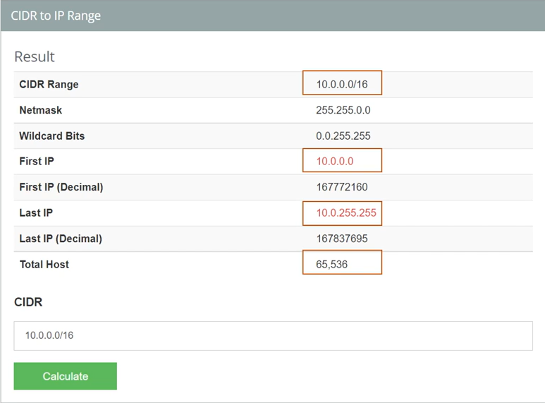
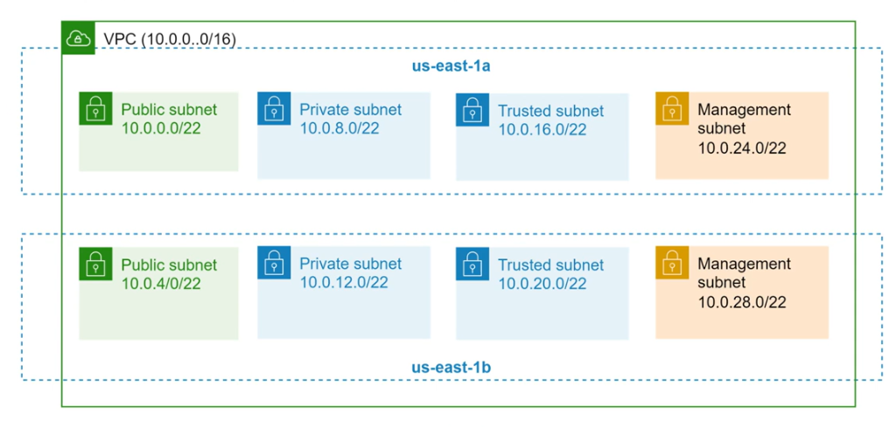

# 9. Sử dụng công cụ chia VPC và Subnet (CIDR Calculator Tool)

Khi lập kế hoạch phân hoạch dải IP cho VPC và các Subnet, việc tính toán thủ công các dải IP có thể gặp khó khăn hoặc nhầm lẫn. Bạn nên sử dụng các công cụ tính toán CIDR trực tuyến để dễ dàng lập kế hoạch mạng.

---

## I. Giới thiệu công cụ tính toán CIDR

Một trong những công cụ phổ biến và dễ sử dụng nhất là: [IP Address Guide - CIDR Utility](https://www.ipaddressguide.com/cidr)

Công cụ này giúp bạn:
*   Đổi từ dải CIDR sang dải IP (CIDR to IP Range).
*   Xem Netmask và Wildcard Bits tương ứng.
*   Xác định IP đầu tiên (First IP) và IP cuối cùng (Last IP) của dải mạng.
*   Biết được tổng số lượng IP chứa trong dải đó (Total Hosts).

---

## II. Ví dụ thực tế tính toán CIDR

Dưới đây là hình ảnh minh họa kết quả tính toán trên công cụ khi nhập dải **`10.0.0.0/16`**:

### Phân tích kết quả:
*   **CIDR Range:** `10.0.0.0/16`
*   **Netmask:** `255.255.0.0`
*   **First IP:** `10.0.0.0`
*   **Last IP:** `10.0.255.255`
*   **Total Hosts:** **65,536** địa chỉ IP.
    *   *Công thức tính toán:*
        $$\text{Tổng số IP} = 2^{32 - 16} = 2^{16} = 65,536$$

---

## III. Tính toán chia Subnet từ dải IP VPC

Khi đã có dải IP của VPC (ví dụ: `10.0.0.0/16` chứa 65,536 IPs), bạn có thể tiếp tục chia nhỏ dải IP này thành các Subnet có kích thước phù hợp.

Dưới đây là hình ảnh minh họa kết quả tính toán trên công cụ khi chọn dải IP cho mỗi Subnet là **`10.0.0.0/22`**:

### Phân tích kết quả:
*   **CIDR Range:** `10.0.0.0/22`
*   **Total Hosts:** **1,024** địa chỉ IP cho mỗi Subnet.
    *   *Công thức tính toán:*
        $$\text{Số IP của mỗi Subnet} = 2^{32 - 22} = 2^{10} = 1,024$$

### Số lượng Subnet tối đa có thể tạo:
Nếu toàn bộ các Subnet trong VPC có kích thước dải IP bằng nhau (đều là `/22`), số lượng Subnet tối đa bạn có thể chia ra từ VPC `/16` là:
$$\text{Số lượng Subnet} = \frac{\text{Tổng IP của VPC}}{\text{Số IP của mỗi Subnet}} = \frac{65,536}{1,024} = 64 \text{ Subnet}$$

> [!NOTE]
> **Lưu ý quan trọng:** Các Subnet trong cùng một VPC **không nhất thiết** phải có kích thước dải IP hoặc số lượng IP giống nhau. Bạn hoàn toàn có thể chia VPC thành các Subnet lớn nhỏ khác nhau (ví dụ: `/24`, `/22`, `/20`...) tùy thuộc vào nhu cầu thực tế của từng phân khu tài nguyên.

---

## IV. Sơ đồ thực tế phân chia VPC và Subnet

Giả sử chúng ta thiết kế một VPC sử dụng dải CIDR **`10.0.0.0/16`** và phân hoạch các Subnet sử dụng CIDR **`/22`** trên 2 Availability Zones (`us-east-1a` và `us-east-1b`), chúng ta sẽ có sơ đồ kiến trúc phân chia mạng như sau:

### Các nguyên tắc thiết kế thực tế rút ra từ sơ đồ:

*   **Tùy biến theo nhu cầu dịch vụ:** Việc quyết định phân chia bao nhiêu loại Subnet (như Public, Private, Trusted, Management...) hoàn toàn phụ thuộc vào yêu cầu độc lập và cô lập về mặt mạng (network isolation) cho các thành phần (component) khác nhau của hệ thống.
*   **Dự phòng khả năng mở rộng (Scalability):** Tổng số IP của các subnet được khởi tạo (8 subnet $\times$ 1024 IPs = 8192 IPs) **không sử dụng hết** toàn bộ không gian IP của VPC chính (65536 IPs). Do đó, bạn vẫn hoàn toàn có khả năng mở rộng và tạo thêm subnet mới trong tương lai khi có nhu cầu phát sinh.

---

*   **Bài trước:** [8. Chi tiết thành phần của VPC (VPC Definition & Subnet)](8.%20VPC%20Components%20%28VPC%20Definition,%20Subnet%29.md)
*   **Bài tiếp theo:** [9. EKS (Elastic Kubernetes Service)](../9. EKS.md)
