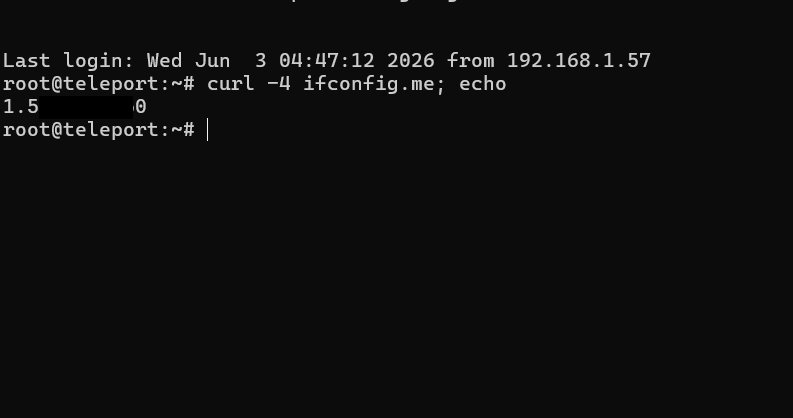

# Cấu hình DNS Management trên Cloudflare

Tài liệu này hướng dẫn cách trỏ tên miền (domain) về địa chỉ IP Public của máy chủ sử dụng dịch vụ DNS của Cloudflare.

---

### I. Chuẩn bị
1. Một tên miền (ví dụ: `h1eudayne.work`) đã được chuyển quyền quản lý Nameservers về Cloudflare.
2. Địa chỉ IP Public của máy chủ cần trỏ tên miền đến.
   * Để kiểm tra IP Public của máy chủ chạy Linux:
     ```bash
     curl -4 ifconfig.me
     ```
     *(Trong ví dụ này, IP Public là `1.5.xxx.0`)*

     

---

### II. Các bước thực hiện cấu hình DNS trên Cloudflare

1. Đăng nhập vào tài khoản Cloudflare của bạn và chọn tên miền cần cấu hình (ví dụ: `h1eudayne.work`).
2. Chọn menu **DNS** -> **Records** từ thanh điều hướng bên trái.
3. Nhấn vào nút **Add record** để thêm bản ghi mới.
4. Điền các thông tin cấu hình cho bản ghi A:
   * **Type (Loại bản ghi):** Chọn `A` (sử dụng để ánh xạ tên miền trực tiếp tới địa chỉ IPv4).
   * **Name (Tên miền phụ):** Nhập tên sub-domain mong muốn, ví dụ `teleport-onpre` (tên miền đầy đủ sẽ là `teleport-onpre.h1eudayne.work`).
   * **IPv4 address (Địa chỉ IP):** Nhập địa chỉ IP Public của server đã kiểm tra ở Bước I.
   * **Proxy status:** Bật/Tắt nút gạt Proxy (nếu bật, Cloudflare sẽ đóng vai trò reverse proxy ẩn IP gốc của bạn và tự động cung cấp SSL/TLS).
   * **TTL:** Để `Auto`.
5. Nhấn **Save** để lưu cấu hình bản ghi.


---

### III. Kiểm tra và xác nhận bản ghi
Sau khi lưu, bản ghi sẽ hiển thị trong danh sách DNS Records. Bạn có thể kiểm tra xem tên miền đã trỏ đúng về IP chưa bằng lệnh `ping` hoặc `nslookup` trên máy tính cá nhân:
```bash
nslookup teleport-onpre.h1eudayne.work
```
*(Nếu bật Proxy, IP trả về sẽ là IP của Cloudflare. Nếu tắt Proxy, IP trả về sẽ là IP Public gốc của máy chủ).*
