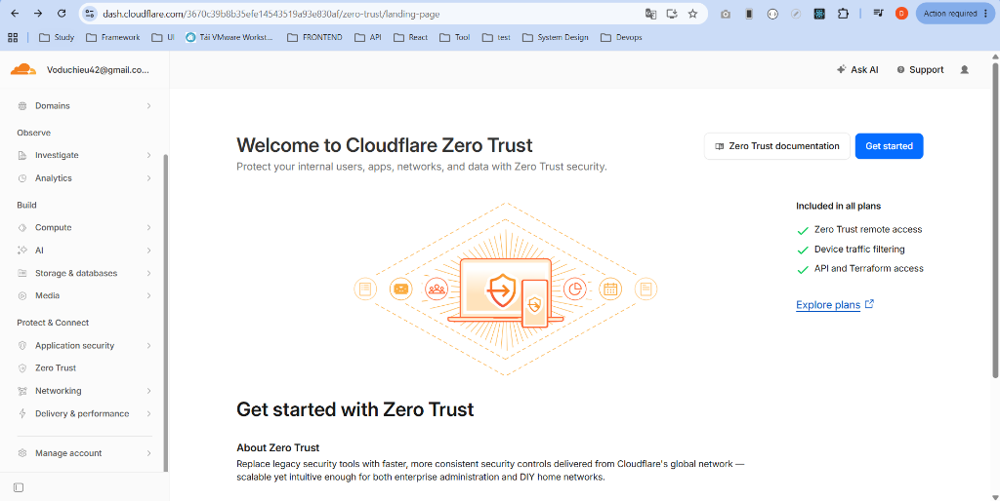
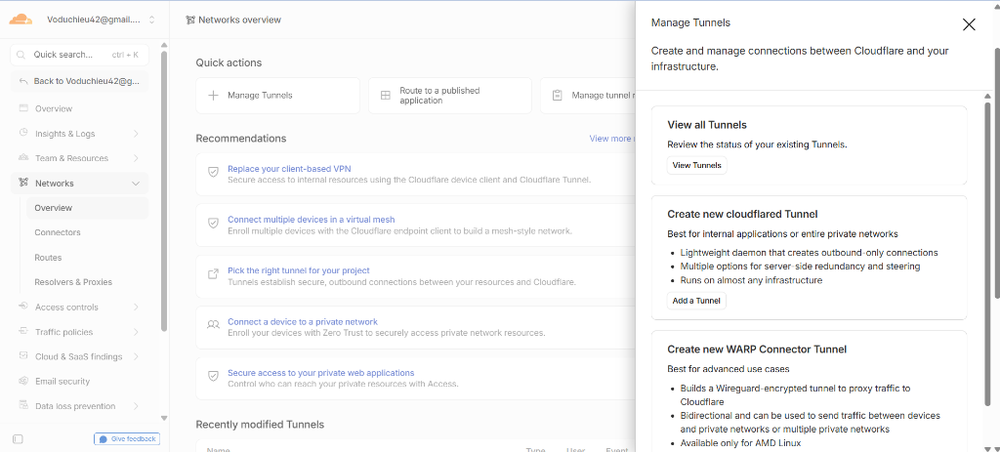
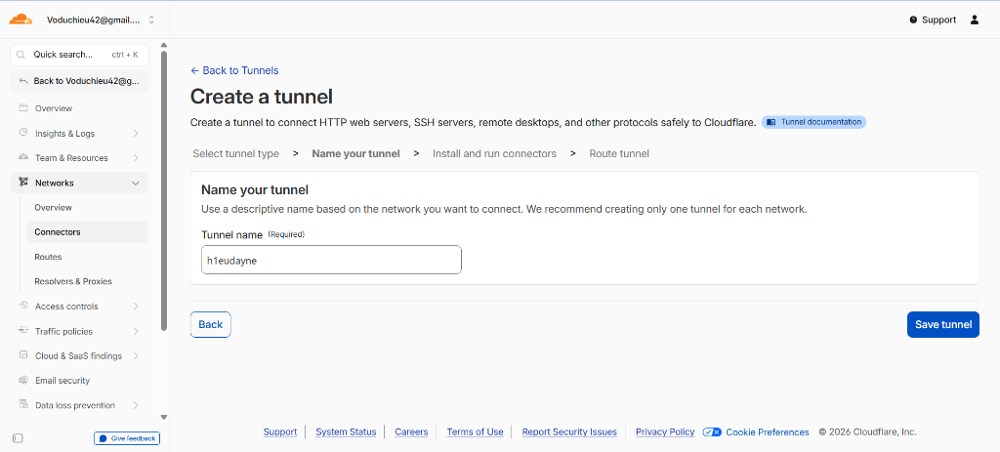
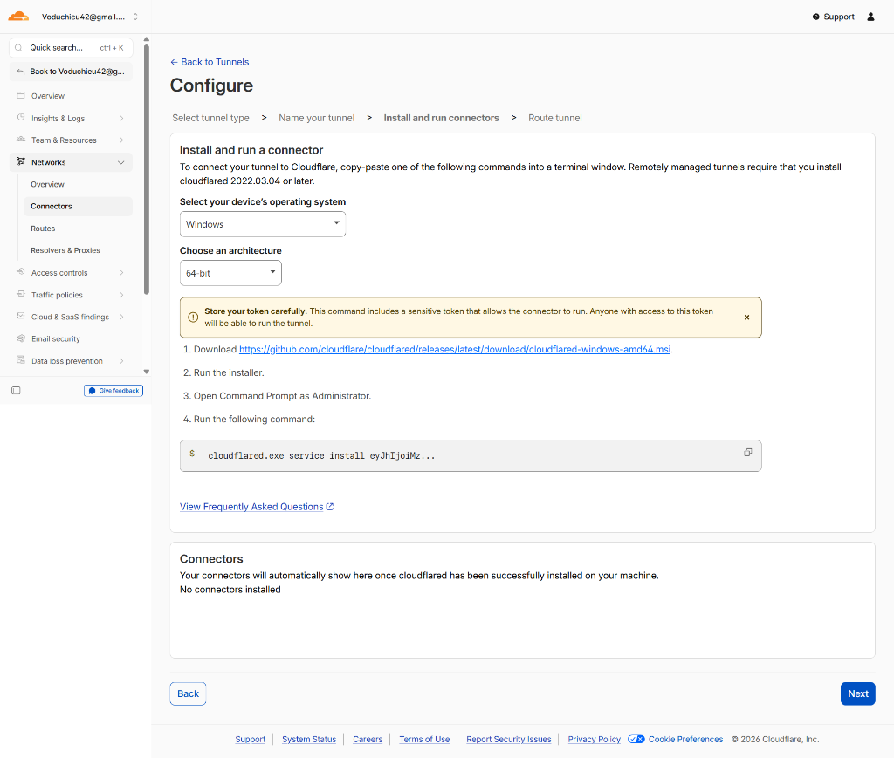

# Cấu hình Cloudflare Zero Trust Tunnel (Secure Outbound Port Forwarding)

Tài liệu này hướng dẫn cách cấu hình Cloudflare Tunnel (Zero Trust) để kết nối an toàn các dịch vụ nội bộ (On-Premise) ra ngoài Internet mà không cần mở port trên Modem (NAT/Port Forwarding).

---

### I. Giới thiệu Cloudflare Tunnel
Cloudflare Tunnel cung cấp một kết nối outbound an toàn giữa máy chủ cục bộ của bạn với mạng lưới Cloudflare. Connector `cloudflared` sẽ kết nối trực tiếp với Cloudflare mà không yêu cầu mở cổng inbound nào trên modem/router của bạn.

---

### II. Các bước thiết lập Cloudflare Tunnel

#### Bước 1: Truy cập Cloudflare Zero Trust
1. Đăng nhập vào trang quản trị Cloudflare.
2. Từ menu bên trái, chọn **Protect & Connect** -> **Zero Trust**.
3. Nếu đây là lần đầu truy cập, nhấn **Get started** và đăng ký gói cước dịch vụ (chọn gói Free).

#### Bước 2: Tạo Tunnel mới
1. Chọn **Networks** -> **Tunnels** (hoặc **Overview** -> **Manage Tunnels**).
2. Nhấn chọn **Add a Tunnel** (hoặc **Create a tunnel**).

3. Nhập tên gợi nhớ đại diện cho hạ tầng của bạn (ví dụ: `h1eudayne`).
4. Nhấn **Save tunnel**.

#### Bước 3: Cài đặt Connector trên Server nội bộ
1. Tại tab **Install and run connectors**, chọn hệ điều hành phù hợp với máy chủ của bạn (ví dụ: `Windows`, `Debian`, `Ubuntu`).
2. Sao chép lệnh cài đặt được sinh ra có chứa mã thông báo (token) xác thực.
3. Chạy lệnh đó dưới quyền Administrator hoặc Root trên máy chủ để cài đặt dịch vụ `cloudflared`.
   * *Mẹo khắc phục lỗi:* Nếu hệ thống báo lỗi không nhận dạng lệnh `cloudflared`, hãy chỉ định rõ đường dẫn tuyệt đối đến tệp thực thi `cloudflared.exe` (ví dụ: `C:\tools\cloudflared.exe service install ...`).

4. Sau khi connector khởi động thành công, danh sách Connector của Tunnel sẽ hiển thị trạng thái `Connected` màu xanh.

#### Bước 4: Cấu hình Route Traffic (Định tuyến dịch vụ)
*   > [!IMPORTANT]
    > **Lưu ý cực kỳ quan trọng:** Trước khi tiếp tục cấu hình định tuyến, bạn **phải xóa bản ghi DNS A** đã tạo thủ công cho sub-domain này trước đó (để tránh xung đột). Cloudflare Tunnel sẽ tự động sinh ra bản ghi DNS loại CNAME để trỏ domain phụ về tunnel.
1. Tại tab **Route tunnel** (Setup Traffic), cấu hình định tuyến:
   * **Subdomain:** Nhập tên miền phụ mong muốn (ví dụ: `teleport-onpre`).
   * **Domain:** Chọn tên miền chính của bạn (ví dụ: `h1eudayne.work`).
   * **Path:** Để trống (định tuyến toàn bộ URL).
   * **Service:**
     * **Type:** Chọn `HTTP` (hoặc loại giao thức tương ứng của dịch vụ).
     * **URL:** Điền địa chỉ IP nội bộ của Nginx Load Balancer kèm port (ví dụ: `192.168.209.101:80`).
2. Nhấn **Complete setup** để hoàn tất.

