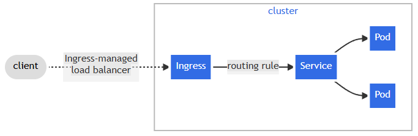

# Kubernetes Ingress Templates (On-Premise)

Huong dan thiet lap Ingress day du cho cum Kubernetes on-premise su dung
Nginx Ingress Controller + Nginx Load Balancer.

## Tong quan kien truc

### Luong hoat dong chuan cua Kubernetes Ingress



> Nguon: Kubernetes Official Documentation

Ingress hoat dong nhu mot "reverse proxy" ben trong cluster, nhan request tu Load Balancer,
kiem tra **routing rule** (domain + path), roi chuyen tiep den **Service** tuong ung, Service
sau do phan phoi den cac **Pod**.

### Mo hinh trien khai On-Premise (day du)

```text
             [ Client ]
                  |
                  | HTTP :80
                  v
      [ Nginx Load Balancer Server ]     <-- Server rieng, chay Nginx
           (Ingress-managed LB)          <-- dong vai tro "load balancer" o ngoai cluster
                  |
       round-robin qua 3 node
                  |
      .-----------+-----------.
      |           |           |
      v           v           v
 [ Node 1 ]  [ Node 2 ]  [ Node 3 ]    <-- Kubernetes Nodes (ben trong cluster)
   :30080       :30080      :30080      <-- NodePort cua Ingress Controller
      |
      v
 [ Ingress Nginx Controller ]          <-- Xu ly routing rule (domain + path)
      |
      | -> khop host: car-serv-onpre.h1eudayne.tech
      v
 [ Service: car-serv1-service:80 ]     <-- ClusterIP Service
      |
      +--------+
      v        v
   [ Pod ]  [ Pod ]                    <-- Ung dung thuc su (car-serv)
```

## Thu tu thuc hien

| Buoc | Mo ta | Tai lieu tham khao |
| :---: | --- | --- |
| 1 | Cai dat **Helm** tren master node (user root) | [`shared/helm/install/ubuntu/`](../../shared/helm/install/ubuntu/README.md) |
| 2 | Cai dat **Ingress Nginx Controller** qua Helm (NodePort 30080/30443) | [`shared/ingress-nginx/install/ubuntu/`](../../shared/ingress-nginx/install/ubuntu/README.md) |
| 3 | Cai dat va cau hinh **Nginx Load Balancer** tren server rieng | [`load-balancer/nginx/k8s-loadbalancer.conf`](../load-balancer/nginx/k8s-loadbalancer.conf) |
| 4 | Tao **Namespace** cho ung dung | [`namespace.yml.example`](../namespace.yml.example) |
| 5 | Tao **Service** cho ung dung | [`service/service-nodeport.yml.example`](../service/service-nodeport.yml.example) |
| 6 | Tao **Ingress** cho ung dung (Rancher hoac kubectl) | [`ingress/ingress-car-serv.yml.example`](./ingress-car-serv.yml.example) |
| 7 | **Add host** tren may client de test domain | Xem phan duoi |

---

## Buoc 1 — Cai dat Helm

> **Chay bang user root** tren master node.

Xem huong dan chi tiet: [`shared/helm/install/ubuntu/README.md`](../../shared/helm/install/ubuntu/README.md)

```bash
# Tai va cai dat Helm v3.16.2
wget https://get.helm.sh/helm-v3.16.2-linux-amd64.tar.gz
tar xvf helm-v3.16.2-linux-amd64.tar.gz
sudo mv linux-amd64/helm /usr/bin/
helm version
```

---

## Buoc 2 — Cai dat Ingress Nginx Controller

> **Chay script 01 bang user root**, script 02 bang user devops.

Xem huong dan chi tiet va script: [`shared/ingress-nginx/install/ubuntu/README.md`](../../shared/ingress-nginx/install/ubuntu/README.md)

**Tom tat cau hinh:**

| Thong so | Gia tri |
| --- | --- |
| Service type | NodePort |
| HTTP nodePort | 30080 |
| HTTPS nodePort | 30443 |

```bash
# === USER ROOT ===
helm repo add ingress-nginx https://kubernetes.github.io/ingress-nginx
helm repo update
helm pull ingress-nginx/ingress-nginx
tar -xzf ingress-nginx-4.11.3.tgz

# Chinh sua values.yaml:
#   type: LoadBalancer  =>  type: NodePort
#   nodePort http:  ""  =>  http: "30080"
#   nodePort https: ""  =>  https: "30443"
vi ingress-nginx/values.yaml

cp -rf ingress-nginx /home/devops/

# === USER DEVOPS ===
su - devops
kubectl create ns ingress-nginx
helm -n ingress-nginx install ingress-nginx \
    -f ingress-nginx/values.yaml ingress-nginx
```

**Kiem tra sau khi cai:**

```bash
kubectl get pods -n ingress-nginx
kubectl get svc -n ingress-nginx
```

---

## Buoc 3 — Cau hinh Nginx Load Balancer

> Thuc hien tren **server rieng** (khong phai Kubernetes node).

Xem template: [`load-balancer/nginx/k8s-loadbalancer.conf`](../load-balancer/nginx/k8s-loadbalancer.conf)

```bash
# 1. Cai dat Nginx
apt install nginx -y

# 2. Doi port mac dinh de tranh xung dot port 80 voi config moi
#    Sua "listen 80" -> "listen 9999" (hoac port bat ky khac)
vi /etc/nginx/sites-available/default

# 3. Tao file config load balancer
#    Doi ten file theo domain cua ban (vd: h1eudayne.tech.conf)
vi /etc/nginx/conf.d/h1eudayne.tech.conf
```

**Noi dung file cau hinh** (xem template day du tai [`k8s-loadbalancer.conf`](../load-balancer/nginx/k8s-loadbalancer.conf)):

```nginx
upstream my_servers {
    server 192.168.1.111:30080;   # Node 1
    server 192.168.1.112:30080;   # Node 2
    server 192.168.1.113:30080;   # Node 3
}

server {
    listen 80;

    location / {
        proxy_pass http://my_servers;
        proxy_redirect off;
        proxy_set_header Host $host;
        proxy_set_header X-Real-IP $remote_addr;
        proxy_set_header X-Forwarded-For $proxy_add_x_forwarded_for;
        proxy_set_header X-Forwarded-Proto $scheme;
    }
}
```

```bash
# 4. Kiem tra va restart
nginx -t
systemctl restart nginx
```

---

## Buoc 4 & 5 — Namespace va Service

Xem template namespace: [`namespace.yml.example`](../namespace.yml.example)

Xem template service: [`service/service-nodeport.yml.example`](../service/service-nodeport.yml.example)

```bash
kubectl create ns car-serv
kubectl apply -f service-nodeport.yml
```

---

## Buoc 6 — Tao Ingress tren Rancher

Xem template Ingress day du: [`ingress-car-serv.yml.example`](./ingress-car-serv.yml.example)

**Tren Rancher UI:**
> Dashboard → **Service Discovery** → **Services** → **Create** → Import YAML

**Noi dung YAML** (doi domain cho phu hop du an):

```yaml
apiVersion: networking.k8s.io/v1
kind: Ingress
metadata:
  name: car-serv-ingress
  namespace: car-serv
spec:
  ingressClassName: nginx
  rules:
    - host: car-serv-onpre.h1eudayne.tech
      http:
        paths:
          - backend:
              service:
                name: car-serv1-service
                port:
                  number: 80
            path: /
            pathType: Prefix
```

> **Luu y:** `ingressClassName: nginx` la bat buoc, neu thieu Ingress se khong duoc xu ly.

---

## Buoc 7 — Add Host (test domain khong co DNS)

Them dong sau vao file hosts tren may client:

```text
<LOADBALANCER_SERVER_IP>  car-serv-onpre.h1eudayne.tech
```

> `<LOADBALANCER_SERVER_IP>` la IP cua server chay Nginx (Buoc 3),
> **KHONG phai** IP cua Kubernetes node.

- **Linux/Mac:** `sudo vi /etc/hosts`
- **Windows:** `notepad C:\Windows\System32\drivers\etc\hosts`

**Kiem tra:**

```bash
curl -v http://car-serv-onpre.h1eudayne.tech/
```

---

## Template hien co

| File | Mo ta |
| --- | --- |
| [`ingress-car-serv.yml.example`](./ingress-car-serv.yml.example) | Ingress Kubernetes cho du an car-serv voi Ingress Nginx Controller |

## Tai nguyen lien quan

| Tai nguyen | Duong dan |
| --- | --- |
| Script cai Helm | [`shared/helm/install/ubuntu/`](../../shared/helm/install/ubuntu/README.md) |
| Script cai Ingress Nginx Controller | [`shared/ingress-nginx/install/ubuntu/`](../../shared/ingress-nginx/install/ubuntu/README.md) |
| Config Nginx Load Balancer | [`load-balancer/nginx/k8s-loadbalancer.conf`](../load-balancer/nginx/k8s-loadbalancer.conf) |
| Template namespace | [`namespace.yml.example`](../namespace.yml.example) |
| Template service NodePort | [`service/service-nodeport.yml.example`](../service/service-nodeport.yml.example) |

## Luu y quan trong

- Script 01 cai Ingress Nginx **phai chay bang root** (can ghi vao `/home/devops/`).
- Script 02 deploy Helm **phai chay bang user devops** (can quyen `kubectl`).
- Nginx Load Balancer va Kubernetes **phai o cung mang noi bo** (co the ping den cac node qua port 30080).
- Xem lai `ingress-nginx/values.yaml` sau khi script 01 chinh sua de dam bao NodePort duoc set dung.
