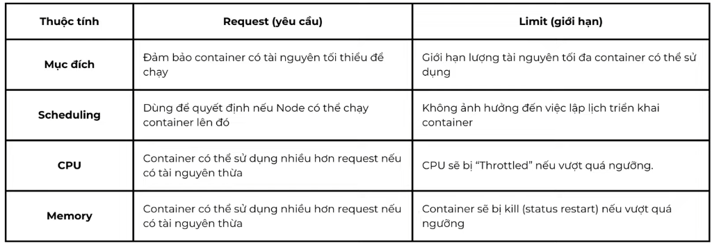

# Kubernetes Resource Requests & Limits – Hướng dẫn sử dụng

Hướng dẫn cấu hình **Requests** (yêu cầu tài nguyên tối thiểu) và **Limits** (giới hạn tài nguyên tối đa) cho container trong Kubernetes.

---

## So sánh Request và Limit



| Thuoc tinh | Request (yeu cau) | Limit (gioi han) |
|---|---|---|
| **Muc dich** | Dam bao container co tai nguyen toi thieu de chay | Gioi han luong tai nguyen toi da container co the su dung |
| **Scheduling** | Dung de quyet dinh neu Node co the chay container len do | Khong anh huong den viec lap lich trien khai container |
| **CPU** | Container co the su dung nhieu hon request neu co tai nguyen thua | CPU se bi "Throttled" neu vuot qua nguong |
| **Memory** | Container co the su dung nhieu hon request neu co tai nguyen thua | Container se bi kill (status restart) neu vuot qua nguong |

---

## Luu y quan trong

- **Request** la cam ket toi thieu — Kubernetes scheduler dua vao day de chon Node
- **Limit** la nguong toi da — vuot qua se bi throttle (CPU) hoac kill (Memory)
- Nen dat `requests` < `limits` de container co the burst khi can
- Neu khong dat `limits`, container co the chiem het tai nguyen cua Node

---

## Cach 1 – Cau hinh qua file YAML cua Deployment

Them truong `resources` vao ben trong moi container:

```yaml
spec:
  containers:
    - name: ecommerce-backend
      image: domain-harbor.com/devopseduvn/ecommerce-backend:v1
      resources:
        requests:
          memory: "64Mi"
          cpu: "250m"
        limits:
          memory: "128Mi"
          cpu: "500m"
```

Giai thich don vi:

| Don vi | Y nghia |
|---|---|
| `250m` (CPU) | 250 millicores = 0.25 Core CPU |
| `500m` (CPU) | 500 millicores = 0.5 Core CPU |
| `64Mi` (Memory) | 64 Mebibytes |
| `128Mi` (Memory) | 128 Mebibytes |

Apply len cluster:

```bash
kubectl apply -f deployment-with-resource-limit.yml.example
```

Kiem tra resource cua Pod:

```bash
kubectl describe pod <pod-name> -n ecommerce
```

---

## Cach 2 – Cau hinh qua giao dien Rancher

1. Vao **Rancher UI** → chon cluster → chon namespace `ecommerce`
2. Vao **Workloads** → **Deployments** → chon Deployment can chinh sua
3. Nhan **Edit Config**
4. Chuyen sang tab **Resources**
5. Dien vao cac o:
   - **CPU Reservation** → tuong duong `requests.cpu`
   - **CPU Limit** → tuong duong `limits.cpu`
   - **Memory Reservation** → tuong duong `requests.memory`
   - **Memory Limit** → tuong duong `limits.memory`
6. Nhan **Save** de ap dung

---

## Goi y gia tri cho tung loai ung dung

| Loai ung dung | CPU Request | CPU Limit | Memory Request | Memory Limit |
|---|---|---|---|---|
| Backend nhe (Node.js) | `100m` | `300m` | `64Mi` | `256Mi` |
| Backend vua (Spring Boot) | `250m` | `500m` | `256Mi` | `512Mi` |
| Backend nang (Spring Boot + JVM) | `500m` | `1000m` | `512Mi` | `1Gi` |
| Frontend (Nginx) | `50m` | `100m` | `32Mi` | `64Mi` |

---

## Cau truc file lien quan

```
templates/kubernetes/resource-limit/
├── README.md                                    <- Huong dan (file nay)
└── deployment-with-resource-limit.yml.example  <- Deployment mau
```
