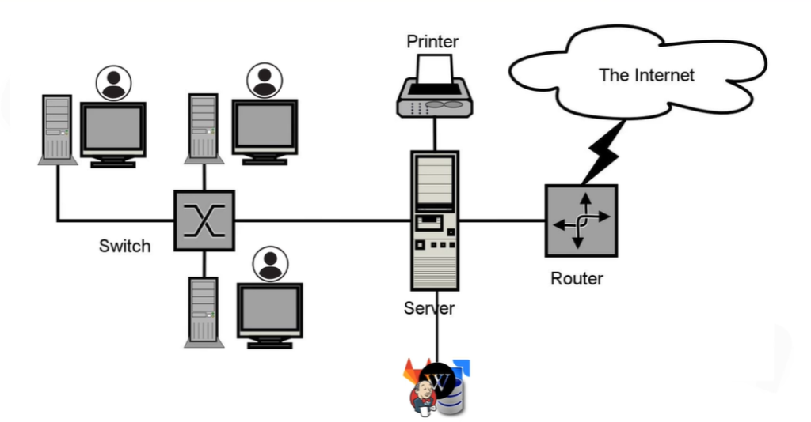

# Hướng Dẫn Cài Đặt Hạ Tầng Linux & Server Căn Bản (Linux & Server Basics)

Thư mục này chứa toàn bộ tài liệu hướng dẫn cài đặt hệ điều hành Linux, cấu hình mạng và các lệnh Linux cơ bản.

---

## Bài 1: Mô hình mạng nội bộ

### I. On-premise

Ở văn phòng sẽ có các máy chủ là tài nguyên để triển khai các hệ thống lên đó.

* **Thiết bị đầu cuối:** Laptop, PC
* **Kết nối qua:** Switch
* **Hệ thống trung tâm:** Server (Chứa các dịch vụ như Jenkins, Jira, GitLab,...) và Printer (Máy in)
* **Định tuyến ra ngoài:** Router

Văn phòng đang dùng chung 1 nguồn internet nên về mặc định đều có thể giao tiếp với nhau (bỏ qua các yếu tố firewall block).

Trong doanh nghiệp có thể chia thành rất nhiều dải mạng.
* *Ví dụ (Ex):* Chỉ có những phần mềm chỉ có kế toán vào được.

### II. Cloud (Public / Private Cloud)

Thay vì sử dụng trực tiếp các máy chủ đặt tại trụ sở và tự quản lý, thì các máy chủ được đặt ở 1 nơi khác do bên thứ 3 quản lý và quyền truy cập được mở cho IP tại văn phòng. Tức là bất cứ thiết bị nào ở trong văn phòng kết nối đến mạng thì đều được access vào trong hạ tầng private/public cloud.
