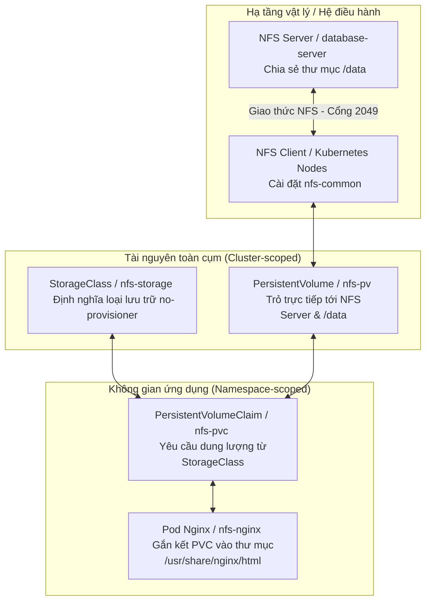

# Hướng dẫn Toàn diện về Kiến trúc và Triển khai NFS Storage trong cụm Kubernetes

Tài liệu này tổng hợp toàn bộ kiến thức, quy trình thiết lập và các mẫu cấu hình cần thiết để xây dựng hệ thống lưu trữ chia sẻ (Shared Storage) sử dụng **NFS (Network File System)** trong cụm Kubernetes (môi trường On-Premise).

---

## 1. Sơ đồ luồng hoạt động (Architecture Flow)

Dưới đây là mô hình hoạt động từ hạ tầng vật lý đến tài nguyên logic trong Kubernetes:



---

## 2. Các thành phần chính trong hệ thống

Quy trình thiết lập hệ thống tuân theo 6 bước logic dưới đây:

| Bước | Thành phần | Vai trò chính | Vị trí thực hiện | Tài liệu tham chiếu |
| :--- | :--- | :--- | :--- | :--- |
| **1** | **StorageClass** | Khai báo loại lưu trữ thủ công (`no-provisioner`) và cơ chế liên kết trì hoãn (`WaitForFirstConsumer`). | K8s Master Node | [storageclass.yml.example](../templates/kubernetes/storage/storageclass.yml.example) |
| **2** | **NFS Server** | Thiết lập máy chủ trung tâm (`database-server`) chia sẻ thư mục lưu trữ (`/data`) ra mạng. | Database Server | [NFS Server Guide](../templates/shared/nfs-server/install/ubuntu/README.md) |
| **3** | **NFS Client** | Cài đặt thư viện `nfs-common` để các node K8s có thể đọc/ghi dữ liệu từ NFS Server. | Tất cả K8s Nodes | [NFS Client Guide](../templates/shared/nfs-client/install/ubuntu/README.md) |
| **4** | **PersistentVolume (PV)**| Khai báo tài nguyên lưu trữ vật lý sẵn có trỏ về IP của NFS Server. | K8s Master Node | [pv.yml.example](../templates/kubernetes/storage/pv.yml.example) |
| **5** | **PersistentVolumeClaim (PVC)**| Yêu cầu cấp phát một phần dung lượng từ PV cho ứng dụng trong Namespace. | K8s Master Node | [pvc.yml.example](../templates/kubernetes/storage/pvc.yml.example) |
| **6** | **Pod / Deployment** | Gắn kết (Mount) PVC vào container để ứng dụng ghi/đọc dữ liệu thực tế. | K8s Master Node | [pod-nfs.yml.example](../templates/kubernetes/pod-nfs.yml.example) |

---

## 3. Quy trình Triển khai Chi tiết

### Bước 1: Khai báo lớp lưu trữ StorageClass
StorageClass đóng vai trò là "bản đồ" chỉ hướng cho Kubernetes biết cách quản lý volume này. Với môi trường tự vận hành (On-Premise), ta sử dụng `no-provisioner`:

- **Tệp tin mẫu:** [storageclass.yml.example](../templates/kubernetes/storage/storageclass.yml.example)
```yaml
apiVersion: storage.k8s.io/v1
kind: StorageClass
metadata:
  name: nfs-storage
provisioner: kubernetes.io/no-provisioner
volumeBindingMode: WaitForFirstConsumer
```

### Bước 2: Cài đặt và cấu hình NFS Server
Thực hiện trên máy chủ cơ sở dữ liệu (`database-server`) để chia sẻ tài nguyên:

- **Script mẫu:** [install-nfs-server.sh.example](../templates/shared/nfs-server/install/ubuntu/install-nfs-server.sh.example)
- **Các lệnh cốt lõi:**
  ```bash
  # 1. Cài đặt dịch vụ NFS Kernel
  sudo apt update && sudo apt install -y nfs-kernel-server

  # 2. Tạo và phân quyền thư mục chia sẻ
  sudo mkdir -p /data
  sudo chown -R nobody:nogroup /data
  sudo chmod -R 777 /data

  # 3. Cấu hình xuất bản thư mục chia sẻ trong /etc/exports
  # LƯU Ý: Nên thay '*' bằng dải IP nội bộ của cụm K8s để đảm bảo an toàn.
  echo "/data *(rw,sync,no_subtree_check,no_root_squash)" | sudo tee -a /etc/exports

  # 4. Áp dụng cấu hình và khởi động lại dịch vụ
  sudo exportfs -rav
  sudo systemctl restart nfs-kernel-server
  ```

### Bước 3: Cài đặt NFS Client trên các Node Kubernetes
> [!WARNING]
> **Bắt buộc:** Phải thực hiện trên **tất cả** các node muốn kết nối đến NFS Server (`k8s-master-1`, `k8s-master-2`, `k8s-master-3` và các node worker).

- **Script mẫu:** [install-nfs-client.sh.example](../templates/shared/nfs-client/install/ubuntu/install-nfs-client.sh.example)
- **Lệnh thực hiện:**
  ```bash
  sudo apt update && sudo apt install -y nfs-common
  ```

### Bước 4: Tạo PersistentVolume (PV) trên Kubernetes
Khai báo tài nguyên lưu trữ vật lý của NFS Server vào trong K8s. Đây là tài nguyên dùng chung toàn cụm:

- **Tệp tin mẫu:** [pv.yml.example](../templates/kubernetes/storage/pv.yml.example)
```yaml
apiVersion: v1
kind: PersistentVolume
metadata:
  name: nfs-pv
spec:
  capacity:
    storage: 10Gi
  volumeMode: Filesystem
  accessModes:
    - ReadWriteMany
  persistentVolumeReclaimPolicy: Retain
  storageClassName: nfs-storage
  nfs:
    path: /data
    server: 192.168.1.115 # LƯU Ý: Thay đổi IP tương ứng với NFS Server của bạn
```

### Bước 5: Tạo PersistentVolumeClaim (PVC)
Tài nguyên yêu cầu cấp phát dung lượng cho từng ứng dụng cụ thể trong một Namespace xác định:

- **Tệp tin mẫu:** [pvc.yml.example](../templates/kubernetes/storage/pvc.yml.example)
```yaml
apiVersion: v1
kind: PersistentVolumeClaim
metadata:
  name: nfs-pvc
  namespace: ecommerce # Khai báo đúng namespace chạy ứng dụng
spec:
  accessModes:
    - ReadWriteMany
  resources:
    requests:
      storage: 5Gi
  storageClassName: nfs-storage
```

### Bước 6: Gắn kết (Mount) PVC vào Pod Nginx
Ứng dụng sẽ sử dụng không gian lưu trữ đã yêu cầu từ PVC và ghi đè dữ liệu trực tiếp lên thư mục `/data` của NFS Server:

- **Tệp tin mẫu:** [pod-nfs.yml.example](../templates/kubernetes/pod-nfs.yml.example)
```yaml
apiVersion: v1
kind: Pod
metadata:
  name: nfs-nginx
  namespace: ecommerce
spec:
  containers:
    - image: nginx
      name: nginx
      ports:
        - containerPort: 80
      volumeMounts:
        - mountPath: /usr/share/nginx/html # Thư mục chứa mã nguồn/web tĩnh trong Pod
          name: nfs-storage
  volumes:
    - name: nfs-storage
      persistentVolumeClaim:
        claimName: nfs-pvc # Trỏ chính xác tới tên PVC đã tạo ở Bước 5
```

---

## 4. Tóm tắt các lưu ý vận hành và bảo mật

1. **Quyền Root của Container (`no_root_squash`):** Tùy chọn này rất quan trọng khi chia sẻ tài nguyên cho Kubernetes, vì nhiều container (ví dụ: Nginx, MySQL, Jenkins) khởi chạy bằng quyền `root` trong container. Nếu không bật `no_root_squash`, NFS Server sẽ giảm quyền ghi file của root xuống `nobody`, dẫn đến lỗi phân quyền (`Permission Denied`).
2. **Chính sách Thu hồi dữ liệu (`Retain`):** Việc đặt `persistentVolumeReclaimPolicy: Retain` giúp đảm bảo khi PVC bị xóa nhầm, dữ liệu vật lý trên NFS Server vẫn được giữ nguyên để DevOps có thể khôi phục lại thủ công.
3. **Chế độ đa truy cập (`ReadWriteMany`):** NFS hỗ trợ khả năng đọc/ghi đồng thời từ nhiều Pod chạy trên nhiều Node khác nhau, điều mà các ổ cứng dạng block thông thường (như AWS EBS) không làm được.
