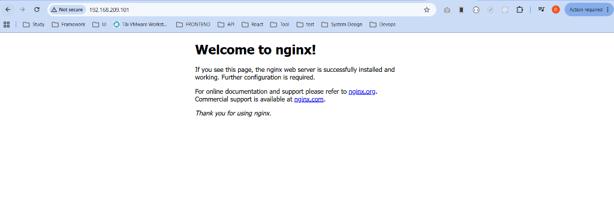
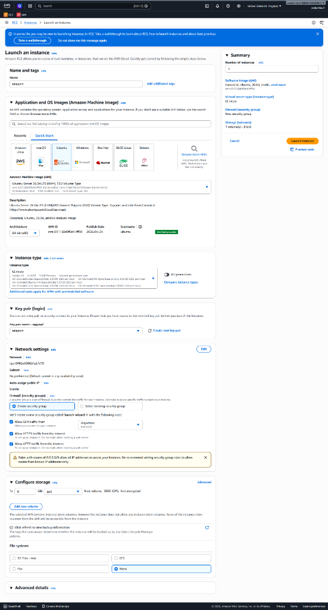
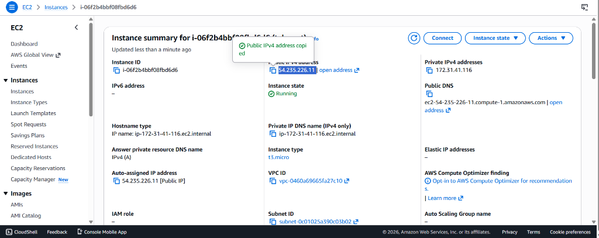
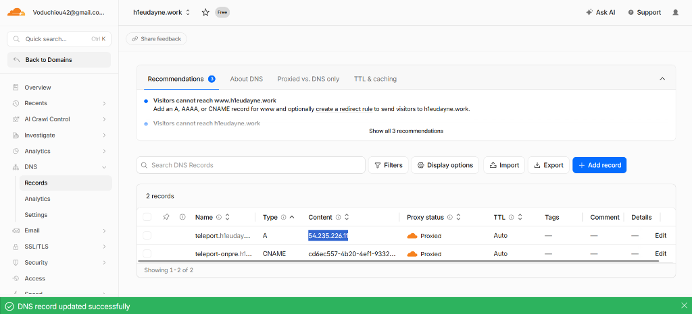
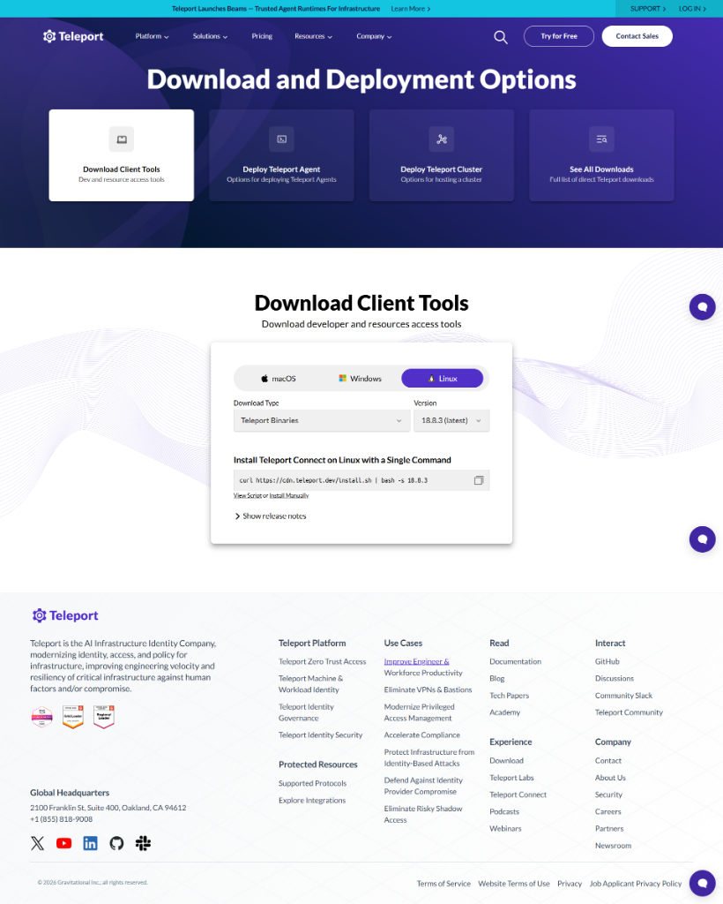

# Bài 5: Triển khai công cụ quản lý truy cập máy chủ (Teleport)

Tài liệu này hướng dẫn các bước triển khai công cụ quản lý truy cập máy chủ tập trung (Teleport) trên môi trường On-Premise, bao gồm chuẩn bị mô hình, cấu hình DNS, cài đặt Nginx Load Balancer, cài đặt và cấu hình Teleport, định tuyến bảo mật qua Cloudflare Tunnel (Zero Trust), và quy trình kiểm tra gỡ lỗi (troubleshooting).

---

### I. Đánh giá phương án cài đặt Teleport trên On-Premise
Khi quyết định cài đặt công cụ quản lý truy cập (ví dụ: Teleport) trực tiếp trên hạ tầng On-Premise, cần cân nhắc kỹ các ưu điểm và nhược điểm sau:

*   **Ưu điểm:**
    *   Tận dụng trực tiếp hạ tầng nội bộ của doanh nghiệp, giúp tăng tính bảo mật và kiểm soát dữ liệu.
    *   Tạo tính đồng nhất trong việc quản trị và giám sát các luồng truy cập ra/vào hệ thống.
*   **Nhược điểm:**
    *   Nếu hệ thống On-Premise gặp lỗi hàng loạt (ví dụ: mất điện, mất mạng diện rộng, lỗi phần cứng), server Teleport cũng sẽ bị sập theo.
    *   Khi hạ tầng phân bố ở nhiều nơi (bao gồm cả Cloud hay các cụm Kubernetes cluster bên ngoài), việc mất kết nối tới Teleport On-Premise sẽ làm mất quyền kiểm soát toàn bộ hệ thống phân tán.

---

## Phần I: Triển khai Teleport trên môi trường On-Premise

#### 1) Chuẩn bị mô hình
Thiết lập bao gồm máy chủ Load Balancer (chạy Nginx) đóng vai trò làm Gateway tiếp nhận yêu cầu, phân phối lưu lượng và chuyển hướng truy cập tới các node Teleport phía sau.

#### 2) Trỏ tên miền (Domain) về IP Public
Để truy cập dịch vụ từ ngoài Internet qua giao diện Web hoặc Terminal Client, chúng ta cần liên kết một tên miền hoặc phụ miền (sub-domain) với địa chỉ IP Public của máy chủ.

1.  **Kiểm tra IP Public hiện tại của server:**
    Chạy lệnh sau trên terminal của server Teleport:
    ```bash
    curl -4 ifconfig.me
    ```
    *(Kết quả hiển thị địa chỉ IP Public dạng IPv4 của đường truyền mạng)*
    
    

2.  **Cấu hình DNS Record (Ví dụ trên Cloudflare):**
    *   Truy cập bảng quản trị DNS của nhà đăng ký tên miền.
    *   Thêm một bản ghi mới (**Add Record**).
    *   Điền các thông tin:
        *   **Type (Loại bản ghi):** `A`
        *   **Name (Tên miền phụ):** `teleport-onpre` (tên miền đầy đủ sẽ là `teleport-onpre.h1eudayne.work`).
        *   **IPv4 address (Địa chỉ IP):** Nhập IP Public vừa lấy được ở bước trên.
        *   **Proxy status:** Bật/Tắt đám mây Cloudflare Proxy (tùy thuộc nhu cầu ẩn IP gốc và sử dụng SSL/TLS của Cloudflare).
    *   Nhấn **Save** để lưu bản ghi.

    

#### 3) Setup Nginx Load Balancer ban đầu
Cài đặt Nginx làm Proxy ngược (Reverse Proxy) / Load Balancer để chuẩn bị tiếp nhận kết nối.

1.  **Cài đặt Nginx trên Ubuntu/Debian:**
    Cập nhật danh sách gói và cài đặt gói `nginx`:
    ```bash
    sudo apt update
    sudo apt install nginx -y
    ```
    
2.  **Kiểm tra trạng thái hoạt động:**
    Truy cập trực tiếp địa chỉ IP Private của máy chủ Load Balancer qua trình duyệt web (`http://<IP_load_balancer>`). Nếu hiển thị trang chào mừng mặc định của Nginx thì việc cài đặt ban đầu đã thành công.

    

#### 4) Setup Port Forwarding (Thông qua Cloudflare Tunnel - Bước đầu)
Để người dùng từ ngoài Internet có thể truy cập vào Load Balancer nội bộ mà không cần phải mở port (port forwarding) thủ công trên modem mạng, chúng ta sử dụng giải pháp **Cloudflare Tunnel (Cloudflare Zero Trust)**.

Các bước thiết lập như sau:

1.  **Truy cập Cloudflare Zero Trust:**
    *   Đăng nhập vào Cloudflare Dashboard.
    *   Di chuyển tới menu **Protect & Connect** -> **Zero Trust**.
    *   Nếu chưa thiết lập gói cước Zero Trust, nhấn **Get started** và đăng ký gói Free.

    

2.  **Khởi tạo Tunnel:**
    *   Trong menu bên trái, chọn **Networks** -> **Tunnels** (hoặc chọn **Networks** -> **Overview** -> **Manage Tunnels**).
    *   Nhấn chọn **Add a Tunnel** (hoặc **Create a tunnel**).

    

3.  **Đặt tên cho Tunnel:**
    *   Nhập tên gợi nhớ đại diện cho hạ tầng của bạn (ví dụ: `h1eudayne`).
    *   Nhấn **Save tunnel**.

    

4.  **Cài đặt và chạy Cloudflare Connector (cloudflared):**
    *   Tại tab **Install and run connectors**, chọn hệ điều hành tương ứng với máy chủ chạy Nginx Load Balancer (Ví dụ: `Windows`, `Debian`, hoặc `Ubuntu` tùy môi trường).
    *   Sao chép lệnh cài đặt và chạy trên máy chủ dưới quyền Administrator/Root.
    *   > [!TIP]
    *   > **Lưu ý xử lý lỗi:** Nếu hệ thống báo lỗi không nhận dạng lệnh `cloudflared`, hãy chỉ định rõ đường dẫn tuyệt đối đến tệp thực thi `cloudflared.exe` (ví dụ: `C:\path\to\cloudflared.exe service install ...` trên Windows).
    *   Sau khi chạy thành công, trạng thái kết nối ở phần **Connectors** phía dưới sẽ báo xanh (Active/Connected).

    
    

#### 5) Cài teleport trên teleport server
Tải và cài đặt các tệp thực thi (binary) của Teleport trên máy chủ đích (Teleport Server):

1.  **Tải về gói cài đặt Teleport:**
    Sử dụng công cụ `wget` để tải phiên bản Teleport `v13.2.0`:
    ```bash
    wget https://get.gravitational.com/teleport-v13.2.0-linux-amd64-bin.tar.gz
    ```

2.  **Giải nén gói cài đặt:**
    ```bash
    tar -xzf teleport-v13.2.0-linux-amd64-bin.tar.gz
    ```

3.  **Cài đặt các tệp tin thực thi vào hệ thống:**
    Di chuyển các tệp thực thi chính của Teleport vào `/usr/local/bin/`:
    ```bash
    sudo mv teleport/tctl /usr/local/bin/
    sudo mv teleport/tsh /usr/local/bin/
    sudo mv teleport/teleport /usr/local/bin/
    ```

4.  **Xác minh cài đặt thành công:**
    Kiểm tra phiên bản của cả 3 công cụ:
    ```bash
    teleport version && tctl version && tsh version
    ```

5.  **Khởi tạo thư mục cấu hình:**
    ```bash
    sudo mkdir -p /etc/teleport
    ```

#### 6) Tạo file teleport.yaml
> [!TIP]
> Bạn có thể sử dụng trực tiếp tệp cấu hình mẫu có sẵn: [teleport.yaml.template](./templates/teleport.yaml.template) và điền tên miền của bạn.

Tạo mới và chỉnh sửa tệp cấu hình cho Teleport Server tại đường dẫn `/etc/teleport/teleport.yaml`:
```bash
sudo vi /etc/teleport/teleport.yaml
```

Sao chép nội dung cấu hình dưới đây vào tệp tin:
```yaml
version: v3
teleport:
  nodename: teleport
  data_dir: /var/lib/teleport
  log:
    output: stderr
    severity: INFO
    format:
      output: text
  ca_pin: ""
  diag_addr: ""

auth_service:
  enabled: "yes"
  listen_addr: 0.0.0.0:3025
  cluster_name: teleport-onpre.h1eudayne.work
  proxy_listener_mode: multiplex

ssh_service:
  enabled: "yes"

proxy_service:
  enabled: "yes"
  web_listen_addr: 0.0.0.0:443
  public_addr: teleport-onpre.h1eudayne.work:443
  https_keypairs: []
  https_keypairs_reload_interval: 0s
```

#### 7) Tạo file teleport.service
> [!TIP]
> Bạn có thể sử dụng trực tiếp tệp dịch vụ mẫu có sẵn: [teleport.service.template](./templates/teleport.service.template).

Khởi tạo tệp tin dịch vụ tại `/etc/systemd/system/teleport.service`:
```bash
sudo vi /etc/systemd/system/teleport.service
```

Sao chép nội dung cấu hình Service:
```ini
[Unit]
Description=Teleport Service
Documentation=https://gravitational.com/teleport/docs
After=network.target

[Service]
User=root
ExecStart=/usr/local/bin/teleport start --config=/etc/teleport/teleport.yaml
Restart=on-failure
LimitNOFILE=65536

[Install]
WantedBy=multi-user.target
```

Xem lại nội dung tệp tin đã tạo để xác nhận:
```bash
cat /etc/systemd/system/teleport.service
```

Khởi chạy và kích hoạt dịch vụ tự khởi động cùng hệ thống:
```bash
sudo systemctl daemon-reload
sudo systemctl enable teleport --now
sudo systemctl status teleport
```

#### 8) KT: https://ip
Trước khi đưa ra Internet qua Load Balancer, hãy kiểm tra hoạt động nội bộ của Teleport:
*   Mở trình duyệt trên một máy tính thuộc cùng mạng nội bộ.
*   Truy cập thẳng địa chỉ IP nội bộ của Teleport Server bằng HTTPS: `https://<IP_Teleport_Server>` (ví dụ: `https://192.168.209.102` hoặc `https://192.168.209.102:443`).
*   Nếu hiển thị cảnh báo chứng chỉ tự ký hoặc trang Web của Teleport thì dịch vụ cơ bản đã chạy thành công trong mạng nội bộ.

#### 9) Cấu hình ở Load Balancer
Bây giờ quay lại máy chủ Load Balancer (chạy Nginx) để cấu hình SSL và Proxy ngược.

##### Stop nginx
Dừng dịch vụ Nginx để giải phóng cổng 80 chuẩn bị cho quá trình xin chứng chỉ SSL standalone:
```bash
sudo systemctl stop nginx
```

##### Setup certbot
Cài đặt Certbot và các gói hỗ trợ:
```bash
sudo apt install apache2-utils certbot python3-certbot-nginx -y
```
Chạy lệnh xin chứng chỉ SSL Let's Encrypt cho tên miền:
```bash
sudo certbot certonly --standalone -d teleport-onpre.h1eudayne.work --preferred-challenges http --agree-tos -m voduchieu42@gmail.com --keep-until-expiring
```
*(Để tìm hiểu chi tiết hơn về cách thức hoạt động và tự động gia hạn, vui lòng tham khảo [Hướng dẫn cấu hình Certbot](../../setup/certbot/README.md))*

##### Setup teleport.conf
> [!TIP]
> Bạn có thể sử dụng trực tiếp tệp tin mẫu có sẵn: [nginx-teleport-lb.conf.template](./templates/nginx-teleport-lb.conf.template) hoặc [teleport-lb.conf.template](../../nginx/teleport-lb.conf.template) và thay thế các biến cấu hình tương ứng.

Tạo mới hoặc sửa cấu hình Nginx Load Balancer tại `/etc/nginx/conf.d/lb.conf`:
```bash
sudo vi /etc/nginx/conf.d/lb.conf
```
Sao chép cấu hình proxy ngược trỏ về địa chỉ IP của Teleport Server nội bộ (`192.168.209.102:443`):
```nginx
server {
    listen 443 ssl;
    server_name teleport-onpre.h1eudayne.work;

    ssl_certificate /etc/letsencrypt/live/teleport-onpre.h1eudayne.work/fullchain.pem;
    ssl_certificate_key /etc/letsencrypt/live/teleport-onpre.h1eudayne.work/privkey.pem;

    include /etc/letsencrypt/options-ssl-nginx.conf;
    ssl_dhparam /etc/letsencrypt/ssl-dhparams.pem;

    location / {
        proxy_pass https://192.168.209.102:443;
        proxy_ssl_server_name on;
        proxy_ssl_verify off;
        proxy_http_version 1.1;
        proxy_set_header Host $host;
        proxy_set_header Upgrade $http_upgrade;
        proxy_set_header Connection "upgrade";
        proxy_set_header X-Real-IP $remote_addr;
        proxy_set_header X-Forwarded-For $proxy_add_x_forwarded_for;
        proxy_set_header X-Forwarded-Proto $scheme;
    }
}

server {
    listen 80;
    server_name teleport-onpre.h1eudayne.work;

    if ($host = teleport-onpre.h1eudayne.work) {
        return 301 https://$host$request_uri;
    }

    return 404;
}
```
Kiểm tra và khởi động lại Nginx:
```bash
sudo nginx -t
sudo systemctl start nginx
```

##### Các traffic từ domain vào địa chỉ
*   > [!IMPORTANT]
    *   > **Lưu ý quan trọng:** Trước khi định tuyến, **phải xóa bản ghi DNS A** của tên miền phụ `teleport-onpre` đã tạo thủ công ở **Bước 2** trước đó để Cloudflare Tunnel tự động tạo bản ghi DNS CNAME.
*   Quay lại trang quản trị Zero Trust Tunnel (`h1eudayne`).
*   Tại phần **Route tunnel** (Setup Traffic), cấu hình chuyển tiếp:
    *   **Subdomain:** `teleport-onpre`
    *   **Domain:** `h1eudayne.work`
    *   **Path:** Để trống.
    *   **Service:**
        *   **Type:** Chọn `HTTPS` (do Load Balancer đang chạy SSL với Nginx).
        *   **URL:** `192.168.209.101:443` (địa chỉ IP nội bộ và cổng HTTPS của máy chủ Load Balancer).
    *   **Mở rộng cấu hình TLS (TLS Settings):**
        *   **Origin Server Name:** Điền `teleport-onpre.h1eudayne.work` để thông tin tên miền trùng khớp trong quá trình bắt tay TLS (TLS Handshake).
        *   **No TLS Verify:** Bật **ON** (để Cloudflare chấp nhận chứng chỉ tự ký hoặc chưa xác thực từ Load Balancer).
        *   **HTTP Host Header (Dưới HTTP Settings):** Nhập `teleport-onpre.h1eudayne.work` để Nginx Load Balancer nhận đúng virtual host của bạn.
*   Nhấn **Save** (hoặc **Complete setup**) để lưu lại cấu hình.


#### 10) Nếu không vào được th teleport thì KT và fix bug
Nếu sau khi cấu hình xong, truy cập domain gặp lỗi hoặc không hiển thị giao diện Teleport, tiến hành các bước kiểm tra và gỡ lỗi (Troubleshooting) như sau:

##### curl đến domain xem có báo lỗi không
1.  **Kiểm tra kết nối HTTPS ngoài Internet qua domain:**
    Chạy lệnh sau trên terminal ngoài hoặc từ máy tính cá nhân của bạn:
    ```bash
    curl -I https://teleport-onpre.h1eudayne.work/web
    ```
2.  **Kiểm tra kết nối nội bộ từ Load Balancer đến Teleport Server:**
    Chạy lệnh sau trên máy chủ Load Balancer để kiểm tra xem Nginx có thể giao tiếp với Teleport Server qua HTTPS 443 hay không:
    ```bash
    curl -I -k -H "Host: teleport-onpre.h1eudayne.work" https://192.168.209.102:443/web
    ```
    *(Tùy chọn `-k` giúp bỏ qua cảnh báo chứng chỉ TLS tự ký của Teleport Server nội bộ)*
    *   Nếu lệnh `curl` nội bộ trả về HTTP code `200` (hoặc `302 redirect`) nhưng lệnh `curl` qua domain bên ngoài báo lỗi, vấn đề nằm ở cấu hình Cloudflare Tunnel hoặc DNS.

##### Lên cloudflare sửa thành https và set up tls và http
*   Truy cập lại trang quản trị Cloudflare Zero Trust -> **Tunnels** -> Chỉnh sửa Tunnel của bạn.
*   Tại phần cấu hình Route Traffic cho subdomain `teleport-onpre`:
    *   **Service Type:** Đảm bảo được chọn là **HTTPS** và port là **443** (ví dụ: `192.168.209.101:443`).
    *   **TLS Settings:**
        *   Bật **No TLS Verify** thành **ON** (cực kỳ quan trọng để bỏ qua lỗi chứng chỉ trên Load Balancer).
        *   Điền **Origin Server Name** là `teleport-onpre.h1eudayne.work`.
    *   **HTTP Settings:**
        *   Đảm bảo điền **HTTP Host Header** là `teleport-onpre.h1eudayne.work`.

##### Kiểm tra lại
*   Khởi chạy lại dịch vụ Nginx trên Load Balancer và Teleport trên Teleport Server:
    ```bash
    # Trên Load Balancer
    sudo systemctl restart nginx
    
    # Trên Teleport Server
    sudo systemctl restart teleport
    ```
*   Truy cập lại trang web `https://teleport-onpre.h1eudayne.work` trên trình duyệt để kiểm tra kết quả. Giao diện đăng nhập của Teleport Web UI sẽ hiển thị bình thường.

#### 11) Tạo user (teleport)
Sau khi cài đặt và cấu hình Teleport thành công, bạn cần khởi tạo tài khoản quản trị viên (user admin) để đăng nhập vào Web UI hoặc sử dụng CLI.

1.  **Chạy lệnh tạo user quản trị trên Teleport Server:**
    Chạy lệnh dưới đây với quyền `root` hoặc `sudo` trên Teleport Server để tạo user `admin` có quyền cấu hình (`editor`, `access`) và cho phép login vào OS dưới dạng user `root`:
    ```bash
    sudo tctl users add admin --roles=editor,access --logins=root
    ```

2.  **Hoàn tất thiết lập tài khoản:**
    *   Lệnh trên sẽ sinh ra một đường dẫn kích hoạt tài khoản có dạng:
        `https://teleport-onpre.h1eudayne.work:443/web/newuser/<token>`
    *   Sao chép đường dẫn này và truy cập bằng trình duyệt web.
    *   Thiết lập mật khẩu và quét mã QR để cấu hình xác thực 2 lớp (MFA/2FA - như Google Authenticator, Authy) để hoàn tất kích hoạt tài khoản và đăng nhập vào giao diện Web quản trị của Teleport.

---

## Phần II: Triển khai Teleport trên Cloud (AWS - EC2)

Triển khai Teleport trên môi trường Cloud (AWS EC2) giúp bạn quản lý truy cập từ xa một cách an toàn mà không cần dựng Load Balancer riêng biệt, bằng cách tận dụng tính năng tự động xin chứng chỉ Let's Encrypt (ACME) được tích hợp sẵn trong Teleport.

---

### Quy trình các bước triển khai chi tiết trên Cloud

#### 1) Tạo EC2 Instance
Để khởi tạo máy chủ chạy Teleport trên AWS, thực hiện các bước sau:
1. Đăng nhập vào **AWS Console**, di chuyển tới dịch vụ **EC2** và chọn **Launch Instance**.
2. Thiết lập thông số máy chủ:
   * **Name and tags:** Nhập `teleport`.
   * **Application and OS Images (AMI):** Chọn **Ubuntu Server 24.04 LTS (HVM)**.
   * **Instance type:** Chọn `t3.micro` hoặc `t2.micro` (đủ đáp ứng cho lab/môi trường nhỏ).
   * **Key pair:** Chọn hoặc tạo mới key pair tên là `teleport` để SSH.
3. **Cấu hình Network Settings (Security Group) - Cực kỳ quan trọng:**
   * Bạn phải mở các cổng sau để đảm bảo kết nối ngoài Internet hoạt động và xin được chứng chỉ Let's Encrypt:
     * **Port 22 (SSH):** Cho phép kết nối quản trị từ địa chỉ IP của bạn hoặc Anywhere (`0.0.0.0/0`).
     * **Port 80 (HTTP):** Cho phép từ Anywhere (`0.0.0.0/0`) phục vụ cho quá trình xác thực ACME HTTP-01 challenge của Let's Encrypt.
     * **Port 443 (HTTPS):** Cho phép từ Anywhere (`0.0.0.0/0`) để truy cập Web UI và API của Teleport.
4. Nhấn **Launch instance** để khởi chạy.




*(Ghi lại địa chỉ **Public IPv4 address** của instance vừa tạo. Ví dụ: `54.235.226.11`)*

#### 2) Cấu hình DNS trên Cloudflare trỏ về EC2
Để Teleport tự động xin chứng chỉ SSL/TLS thông qua cơ chế ACME, bạn cần cấu hình bản ghi DNS tên miền trỏ về IP Public của EC2.

1. Truy cập vào dashboard quản trị của **Cloudflare**.
2. Chọn tên miền của bạn (ví dụ: `h1eudayne.work`) và chuyển đến mục **DNS** -> **Records**.
3. Thêm một bản ghi mới (**Add record**):
   * **Type:** `A`
   * **Name:** `teleport` (domain đầy đủ là `teleport.h1eudayne.work`).
   * **IPv4 address:** Điền IP Public của EC2 (`54.235.226.11`).
   * **Proxy status:** 
     > [!IMPORTANT]
     > **Lưu ý xử lý lỗi ACME:** Khi bắt đầu triển khai và xin chứng chỉ lần đầu, hãy chuyển Proxy status về **DNS Only** (đám mây màu xám). Nếu để **Proxied** (đám mây màu cam), hệ thống Let's Encrypt sẽ không thể kết nối trực tiếp đến cổng 80/443 của EC2 để xác minh thử thách ACME, dẫn đến lỗi khởi tạo Teleport. Sau khi Teleport khởi chạy thành công và nhận được chứng chỉ, bạn có thể bật lại Proxy của Cloudflare (lưu ý chỉnh SSL/TLS mode thành **Full (strict)**).
4. Nhấn **Save** để lưu lại bản ghi.



#### 3) SSH vào EC2 Server
Kết nối vào máy chủ EC2 vừa tạo bằng key pair và tài khoản mặc định `ubuntu`:
```bash
ssh -i "teleport.pem" ubuntu@54.235.226.11
```
*(Nếu sử dụng Windows Terminal, hãy đảm bảo phân quyền cho file key pair chỉ đọc - `chmod 400` trên Linux/macOS hoặc cấu hình Security Properties tương ứng trên Windows)*

#### 4) Cài đặt Teleport (Teleport Binaries)
Để cài đặt phiên bản Teleport chính thức trên Linux EC2, bạn chạy lệnh cài đặt nhanh từ Teleport:

```bash
curl https://cdn.teleport.dev/install.sh | bash -s 18.0.3
```
*(Lệnh trên sẽ tự động phát hiện kiến trúc hệ điều hành, tải về gói cài đặt Teleport phiên bản `18.0.3` và cài đặt các tệp tin thực thi vào hệ thống)*



#### 5) Xử lý đường dẫn lệnh và Cấu hình Teleport
Khi cài đặt Teleport từ gói binary thủ công hoặc qua script tùy biến, đôi khi các tệp thực thi nằm trong thư mục `/opt/teleport/...` và chưa được liên kết đến biến môi trường `$PATH`. Chúng ta cần tạo liên kết mềm (Symlink) để gọi lệnh từ bất kỳ đâu.

1. **Tạo liên kết mềm (Symlink) cho các lệnh của Teleport:**
   > [!WARNING]
   > **Xử lý lỗi quyền truy cập:** Thư mục `/usr/local/bin/` thuộc sở hữu của hệ thống, do đó bạn phải sử dụng quyền `sudo` khi chạy lệnh tạo liên kết mềm. Nếu các file liên kết đã tồn tại hoặc bị lỗi ghi đè, hãy xóa file cũ trước bằng `sudo rm -f /usr/local/bin/<tên_lệnh>` trước khi chạy.
   
   Chạy các lệnh sau:
   ```bash
   # Xóa liên kết cũ nếu có để tránh lỗi "File exists"
   sudo rm -f /usr/local/bin/teleport /usr/local/bin/tctl /usr/local/bin/tsh

   # Tạo liên kết mềm mới
   sudo ln -s /opt/teleport/system/bin/teleport /usr/local/bin/teleport
   sudo ln -s /opt/teleport/system/bin/tctl /usr/local/bin/tctl
   sudo ln -s /opt/teleport/system/bin/tsh /usr/local/bin/tsh
   ```

2. **Chạy lệnh sinh file cấu hình tự động tích hợp ACME:**
   Để Teleport tự quản lý chứng chỉ SSL của Let's Encrypt, sử dụng lệnh sinh cấu hình sau:
   ```bash
   sudo teleport configure -o file --acme --acme-email=voduchieu42@gmail.com --cluster-name=teleport.h1eudayne.work
   ```
   > [!TIP]
   > **Giải thích tham số và xử lý lỗi:**
   > * `-o file`: Ghi cấu hình ra tệp tin `/etc/teleport.yaml` mặc định (cần chạy bằng `sudo` do thư mục `/etc` chỉ root mới được ghi).
   > * `--acme`: Kích hoạt giao thức ACME để tự động đăng ký và gia hạn chứng chỉ Let's Encrypt.
   > * `--acme-email`: Email dùng để đăng ký tài khoản Let's Encrypt nhận cảnh báo gia hạn chứng chỉ.
   > * `--cluster-name`: Tên miền đã trỏ DNS A record ở Bước 2 (`teleport.h1eudayne.work`).

#### 6) Tạo và Khởi động Teleport Service
Sử dụng systemd để quản lý vòng đời chạy ngầm của Teleport trên EC2.

1. **Tự động sinh file service cho systemd:**
   Để tránh việc tự viết file unit systemd, bạn có thể ra lệnh cho Teleport tự tạo file service chuẩn:
   ```bash
   sudo teleport install systemd -o /etc/systemd/system/teleport.service
   ```
   *(Cần dùng `sudo` để ghi tệp tin vào thư mục dịch vụ của hệ thống `/etc/systemd/system/`)*

2. **Nạp lại cấu hình dịch vụ và khởi động:**
   ```bash
   # Yêu cầu hệ thống nạp lại danh sách cấu hình service mới
   sudo systemctl daemon-reload

   # Kích hoạt Teleport tự khởi động cùng OS và chạy dịch vụ ngay lập tức
   sudo systemctl enable teleport --now
   ```

3. **Kiểm tra trạng thái hoạt động:**
   ```bash
   sudo systemctl status teleport
   ```
   *Đảm bảo trạng thái dịch vụ hiển thị `active (running)`. Lúc này Teleport đang tự thực hiện quá trình bắt tay ACME với Let's Encrypt qua cổng 80 để lấy chứng chỉ SSL.*

#### 7) Tạo user Admin
Sau khi dịch vụ khởi chạy thành công, tạo tài khoản quản trị để đăng nhập giao diện Web.

1. **Khởi tạo tài khoản admin:**
   Chạy lệnh tctl trên EC2 Server để thêm tài khoản quản trị:
   ```bash
   sudo tctl users add admin --roles=editor,access --logins=root,ubuntu
   ```
   > [!IMPORTANT]
   > **Giải thích tham số logins:** 
   > Trên AWS EC2 Ubuntu, tài khoản đăng nhập mặc định của hệ thống là `ubuntu`. Do đó khi tạo tài khoản Teleport, bạn phải khai báo quyền đăng nhập đại diện là `root` và `ubuntu` trong tham số `--logins` để Teleport cho phép bạn SSH trực tiếp vào máy chủ bằng tài khoản mặc định này thông qua Web UI hoặc CLI.

2. **Thiết lập tài khoản:**
   * Mở liên kết kích hoạt được in ra màn hình trên trình duyệt: `https://teleport.h1eudayne.work:443/web/newuser/<token>`
   * Thiết lập mật khẩu và quét mã QR để cấu hình xác thực 2 lớp (MFA/2FA - như Google Authenticator, Authy) để hoàn tất kích hoạt tài khoản và đăng nhập vào giao diện Web quản trị của Teleport.


