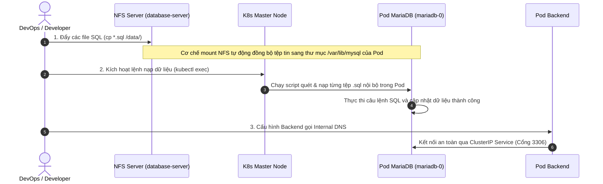

# Quy trình Nạp dữ liệu SQL qua NFS & Kết nối Backend qua ClusterIP trên Kubernetes

Quy trình này hướng dẫn cách nạp dữ liệu cơ sở dữ liệu (`.sql`) nội bộ trực tiếp thông qua hạ tầng chia sẻ **NFS** và cấu hình ứng dụng **Backend** kết nối an toàn tới **MariaDB** bằng DNS nội bộ trong cụm Kubernetes. Đây là giải pháp tối ưu giúp tăng cường bảo mật (không cần expose cơ sở dữ liệu ra ngoài Internet) và tăng tốc độ triển khai dữ liệu ban đầu.

---

## 1. Sơ đồ Luồng hoạt động (Sequence Diagram)

Dưới đây là trình tự các bước thực hiện từ khâu đẩy dữ liệu vật lý đến khi Backend kết nối thành công:



---

## 2. Các bước triển khai chi tiết

### BƯỚC 1: Khởi tạo MariaDB StatefulSet & Service ClusterIP

Đảm bảo cơ sở dữ liệu được cấu hình chạy nội bộ và có vùng mount NFS vững chắc.

1. **StatefulSet MariaDB (`mariadb-statefulset.yml`):**
   Được cấu hình mount volume từ PVC (`nfs-pvc`) vào thư mục dữ liệu `/var/lib/mysql`.
   ```yaml
   apiVersion: apps/v1
   kind: StatefulSet
   metadata:
     name: mariadb
     namespace: ecommerce
   spec:
     serviceName: mariadb-service
     replicas: 1
     selector:
       matchLabels:
         app: mariadb
     template:
       metadata:
         labels:
           app: mariadb
       spec:
         securityContext:
           fsGroup: 65534 # Tránh lỗi ghi quyền NFS
         initContainers:
           - name: init-permissions
             image: busybox:latest
             command: ["sh", "-c", "chown -R 999:999 /var/lib/mysql && chmod 775 /var/lib/mysql"]
             volumeMounts:
               - name: mariadb-storage
                 mountPath: /var/lib/mysql
         containers:
           - name: mariadb
             image: mariadb:latest
             env:
               - name: MYSQL_ROOT_PASSWORD
                 value: "devopseduvn"
             ports:
               - containerPort: 3306
                 name: mysql
             volumeMounts:
               - name: mariadb-storage
                 mountPath: /var/lib/mysql
         volumes:
           - name: mariadb-storage
             persistentVolumeClaim:
               claimName: nfs-pvc
   ```

2. **Service ClusterIP (`mariadb-service.yml`):**
   Expose cổng `3306` nội bộ bên trong cluster để đảm bảo an toàn tối đa.
   ```yaml
   apiVersion: v1
   kind: Service
   metadata:
     name: mariadb-service
     namespace: ecommerce
   spec:
     clusterIP: None # Thiết lập headless service để quản lý định danh mạng Pod
     selector:
       app: mariadb
     type: ClusterIP # Chỉ truy cập nội bộ
     ports:
       - port: 3306
         targetPort: 3306
   ```

---

### BƯỚC 2: Nạp dữ liệu qua NFS (Không cần mở cổng hay cài Client bên ngoài VM)

Quy trình này tận dụng cơ chế chia sẻ tệp của NFS giúp truyền tải dữ liệu trực tiếp vào môi trường làm việc của Pod mà không cần đi qua cổng mạng của Database.

1. **Trên máy chủ chứa file SQL (NFS Server):**
   Sao chép trực tiếp các tệp tin `.sql` chứa cấu trúc và dữ liệu của bạn vào thư mục đang được chia sẻ bởi NFS Server (`/data`):
   ```bash
   # Chép tất cả các file dữ liệu SQL vào thư mục chia sẻ
   cp *.sql /data/
   
   # Xác nhận file đã nằm trong thư mục
   ls -la /data/*.sql
   ```

2. **Trên máy K8s Master Node:**
   Do Pod `mariadb-0` mount thư mục `/var/lib/mysql` trực tiếp tới `/data` của NFS Server, các tệp tin `.sql` sẽ xuất hiện ngay lập tức bên trong Pod. Ta chạy lệnh sau để Pod tự động quét toàn bộ tệp `.sql` và nạp vào database:
   ```bash
   kubectl exec -i mariadb-0 -n ecommerce -- bash -c 'cd /var/lib/mysql && for f in *.sql; do echo "Đang nạp dữ liệu từ: $f"; mariadb -uroot -pdevopseduvn < "$f"; done'
   ```

---

### BƯỚC 3: Cấu hình Backend kết nối qua K8s Internal DNS

Sau khi nạp dữ liệu xong, cấu hình ứng dụng Backend để kết nối với cơ sở dữ liệu MariaDB thông qua định danh mạng nội bộ (DNS).

1. **Mở file cấu hình ConfigMap của Backend (ví dụ `application.properties`):**
   Tìm tới dòng cấu hình kết nối database `spring.datasource.url`.

2. **Cập nhật URL kết nối:**
   Thay thế IP vật lý trước đây bằng DNS nội bộ được phân giải tự động bởi Kube-DNS:
   ```properties
   # Định dạng chuẩn: jdbc:mysql://<TÊN_SERVICE>.<NAMESPACE>.svc.cluster.local:<CỔNG>/<TÊN_DATABASE>
   spring.datasource.url=jdbc:mysql://mariadb-service.ecommerce.svc.cluster.local:3306/full-stack-ecommerce
   spring.datasource.username=ecommerceapp
   spring.datasource.password=StrongPa55WorD
   ```

---

## 3. Lợi ích vượt trội của Quy trình

* **Bảo mật tuyệt đối (Zero External Attack Vector):** Cổng Database `3306` hoàn toàn được đóng kín đối với thế giới bên ngoài. Không thể bị tấn công Brute-force hay Scan cổng từ bên ngoài internet.
* **Tốc độ vượt trội (Local-speed Transfer):** Việc truyền tải file `.sql` diễn ra cực nhanh qua NFS ở tầng hạ tầng, sau đó được import trực tiếp ngay bên trong container (không đi qua mạng HTTP/TCP bên ngoài).
* **Đơn giản hóa hạ tầng (Lightweight Ops):** Bạn không cần cài đặt các client trung gian như `mysql-client` trên các máy khách hay khởi chạy các Pod test tạm thời để nạp dump SQL.
