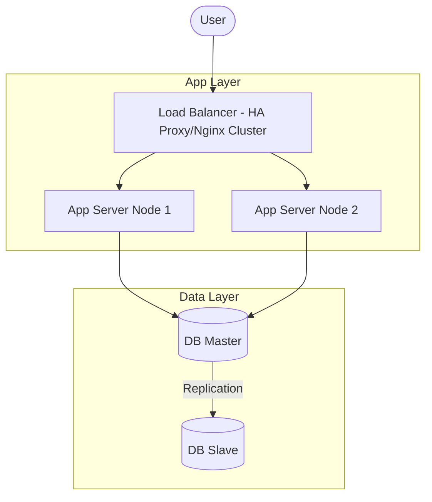

# Thiet Ke He Thong Tinh San Sang Cao (High Availability Design)

Tinh san sang cao (High Availability - HA) la mot trong nhieu muc tieu toi quan trong cua System Architect, dam bao he thong van hoat dong on dinh ngay ca khi co su co phan cung, mang hoac phan mem xay ra.

---

## Cac Nguyen Tac Thiet Ke HA

1. **Khu diem loi don nhat (Eliminate Single Point of Failure - SPOF)**:
   * Moy thanh phan trong he thong deu phai co ban du phong (Redundancy). Neu mot server chet, server khac phai lap tuc tiep quan tai.
2. **Co che phat hien su co tu dong (Automatic Failover)**:
   * Khi su co xay ra, he thong phai tu phat hien thong qua Health Checks va tu dong chuyen doi luu luong sang node du phong ma khong can can thiep thu cong.
3. **Thiet ke khong trang thai (Stateless Services)**:
   * Tach biet tang logic ung dung khoi tang du lieu. Cac ung dung Backend (Java, Node.js, Go) nen duoc thiet ke duoi dang Stateless de co the nhan ban va phan tai de dang.

---

## Mo Hinh Kien Truc HA Don Gian

---

## Lien Ket Thuc Hanh DevOps
De thuc thi thiet ke HA nay tren moi truong thuc te, ban hay tham khao cac tai lieu cau hinh mau sau:

*   **Load Balancing**: [Nginx Load Balancer Configuration](../../on-premise/kubernetes/load-balancer/nginx/k8s-loadbalancer.conf)
*   **Kubernetes HA Pod Replica**: [Kubernetes Deployment Template](../../on-premise/kubernetes/deployment/deployment-rolling.yml.example) (Su dung replicas: 3 ket hop voi Rolling Update de dat Zero-Downtime deployment).
*   **Database HA**: [MariaDB StatefulSet](../../on-premise/kubernetes/statefulset/) (Mo hinh cluster luu tru trang thai) va [Redis Sentinel Cluster](../../on-premise/kubernetes/redis/).
