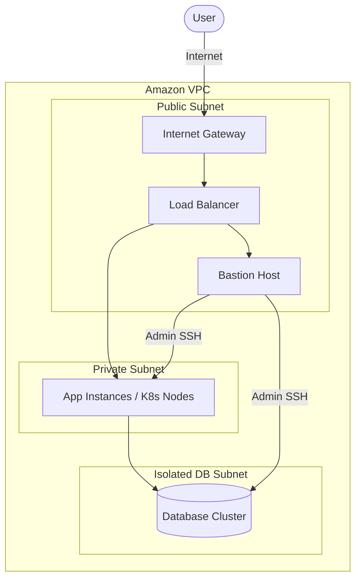

# Kien Truc Bao Mat (Security Architecture Design)

Bao mat la mot yeu to nen tang khong the tach roi trong vai tro System Architect. Thiet ke kien truc bao mat tot se ngan chan cac nguy co tan cong mang, ro ri du lieu va dam bao tinh tuan thu.

---

## Cac Nguyen Tac Thiet Ke Bao Mat

1. **Nguyen tac Dac Quyen Toi Thieu (Least Privilege)**:
   * Chi cap quyen han vua du de thuc hien mot tac vu cu the. Khong dung tai khoan Root cho cac tac vu hang ngay.
2. **Phong thu theo chieu sau (Defense in Depth)**:
   * Su dung nhieu lop bao mat o cac tang khac nhau: tu Firewall mang (VPC/Security Group), phan quyen danh tinh (IAM), ma hoa du lieu (KMS) den giam sat phat hien bat thuong (CloudTrail, GuardDuty).
3. **Phan vung mang (Network Segmentation)**:
   * Dat cac may chu co so du lieu (Database) va xu ly noi bo vao vung mang rieng tu (Private Subnet). Chi mo vung mang cong cong (Public Subnet) cho Load Balancer hoac Bastion Host.

---

## Mo Hinh Phan Vung Mang (Network Segmentation)

---

## Lien Ket Thuc Hanh DevOps
Tham khao cau hinh bao mat thuc te cho ha tang cua ban:

*   **AWS IAM (Identity and Access Management)**:
    * [Tim hieu ve tai khoan IAM, Group va Role](../../cloud/aws/services/2.%20IAM/2.%20Amazon%20IAM%20Concept.md)
    * [So sanh IAM Policy va Resource-based Policy](../../cloud/aws/services/2.%20IAM/7.%20Amazon%20IAM%20Policy%20vs%20Resource%20Policy.md)
    * [Thuc hanh phan quyen va chan thao tac bang Policy](../../cloud/aws/deploy/2.%20IAM/1.%20Amazon%20IAM%20Hands-on%20Lab%28User%2C%20Group%20and%20Policy%29.md)
*   **Kubernetes Secret Management**: [Thu muc cau hinh Secret mau](../../on-premise/kubernetes/secret/)
