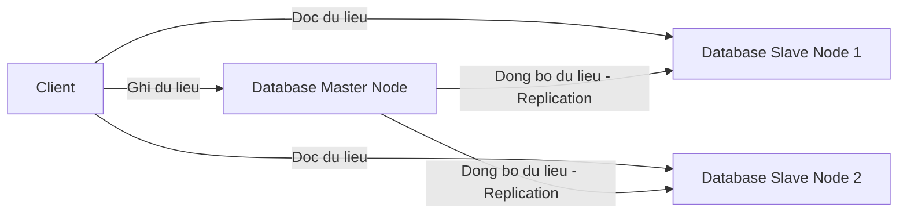

# Kien Truc Co So Du Lieu (Database Architecture Design)

Co so du lieu (Database) la trai tim cua he thong phan mem va thuong la diem nghen co chai (Bottleneck) lon nhat cua toan he thong. System Architect can hieu cach thiet ke luu tru de he thong dat hieu nang va do on dinh toi uu.

---

## Phan Nhom He Quan Tri CSDL

1. **CSDL Quan He (Relational Database - SQL)**:
   * *Dai dien*: MariaDB, MySQL, PostgreSQL.
   * *Uu diem*: Dam bao tinh nhat quan du lieu cao (ACID), ho tro cac truy van phuc tap (JOIN).
   * *Phu hop*: He thong thanh toan, E-commerce, Quan ly tai khoan.

2. **CSDL Phi Quan He (Non-relational Database - NoSQL)**:
   * *Dai dien*: MongoDB, Redis, Cassandra.
   * *Uu diem*: Ghi du lieu toc do cuc nhanh, luu tru du lieu dang Key-Value, Document hoac Graph linh hoat, de dang Scale ngang.
   * *Phu hop*: He thong cache, log collector, chat thoi gian thuc.

---

## Mo Hinh Dong Bo Du Lieu (Master-Slave Replication)

---

## Lien Ket Thuc Hanh DevOps
Tham khao cach trien khai luu tru du lieu ben vung va thiet lap Database Cluster trong cum Kubernetes cua ban:

*   **Database StatefulSet**: [MariaDB Statefulset Manifest](../../on-premise/kubernetes/statefulset/) (Trien khai ung dung Stateful co gan Volume luu tru).
*   **Storage and PV/PVC**: [Persistent Volume (PV) va Persistent Volume Claim (PVC)](../../on-premise/kubernetes/storage/) (Giai phap gan vung luu tru NFS dung chung cho Pod).
*   **NoSQL / Caching**: [Redis Sentinel Deployment](../../on-premise/kubernetes/redis/) (Su dung Redis lam tang dem luu tru du lieu truy xuat nhanh).
