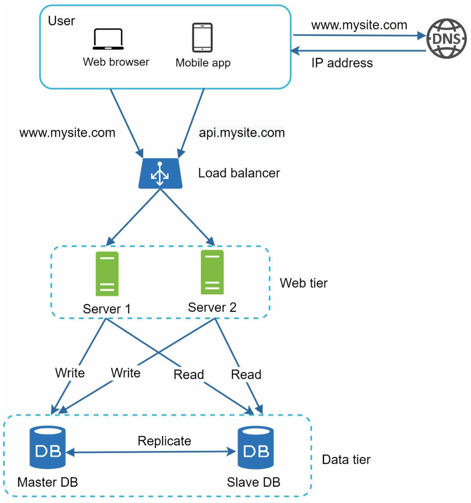
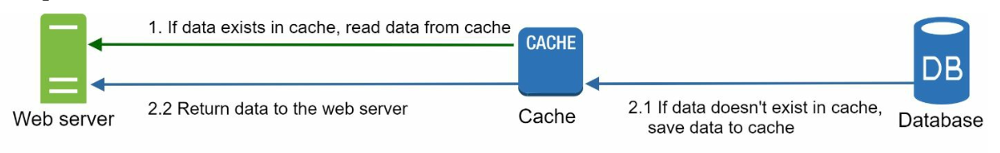
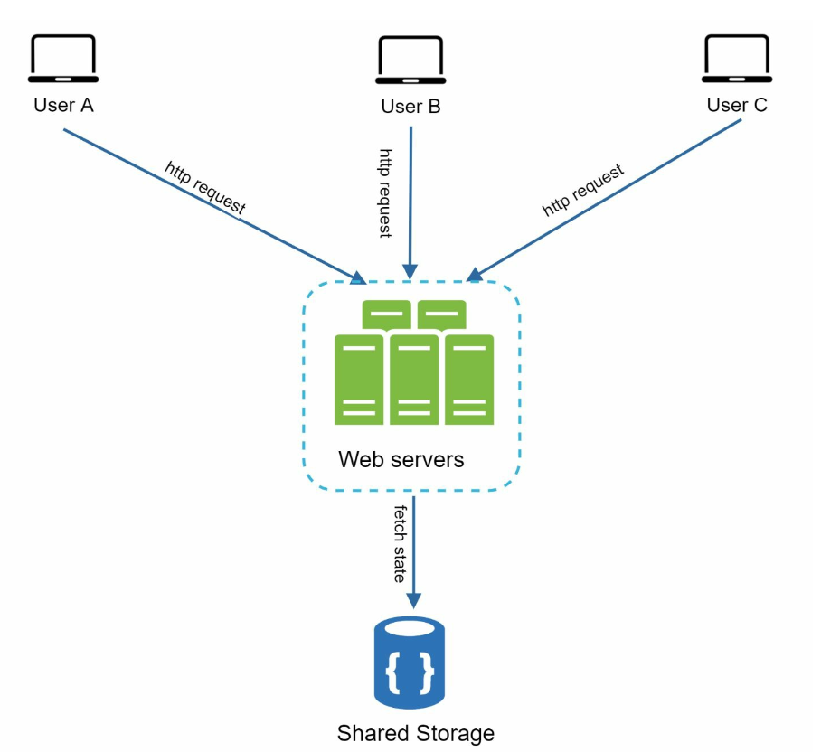
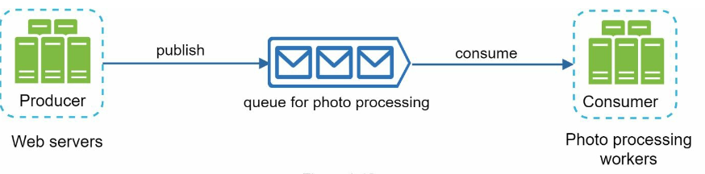

Chương 1: Quy mô từ 0 đến hàng triệu người dùng
====================================================

Giới thiệu
------------

Scaling, một hệ thống hỗ trợ hàng triệu người dùng là một hành trình phức tạp, lặp đi lặp lại đòi hỏi phải sàng lọc và tối ưu hóa. Chương này phác thảo cách bắt đầu với single server setup và scaling kiến ​​trúc từng bước để xử lý hàng triệu người dùng.

---

Phần 1: Single Server Setup
------------------------------

Ban đầu, tất cả các thành phần (ứng dụng web, database, cache) đều chạy trên single server.

### Luồng yêu cầu

1. Người dùng truy cập ứng dụng thông qua tên miền (ví dụ: `api.mysite.com`), được phân giải thành địa chỉ IP bằng DNS.
2. IP address của web-server được trả về trình duyệt hoặc ứng dụng di động.
3. Yêu cầu HTTP được gửi tới web server, trả về phản hồi HTML hoặc JSON.

### Nguồn lưu lượng truy cập

1. **Ứng dụng web:** Sử dụng các ngôn ngữ bên server (ví dụ: Python, Java) cho logic nghiệp vụ và các ngôn ngữ bên client (ví dụ: JavaScript, HTML) để trình bày.
2. **Ứng dụng di động:** Giao tiếp với web server bằng HTTP và JSON để trao đổi dữ liệu nhẹ.

---

Phần 2: Tách Database
------------------------------

Khi người dùng base phát triển, database được chuyển sang server chuyên dụng để cho phép scaling độc lập với web và database tiers.

### Lựa chọn Database

1. **Databases quan hệ (SQL):** Dữ liệu có cấu trúc được lưu trữ trong bảng. Ví dụ: MySQL, PostgreSQL.
2. **Databases không quan hệ (NoSQL):** Thích hợp cho dữ liệu phi cấu trúc hoặc yêu cầu latency thấp. Các danh mục bao gồm:
   * Key-Value Stores
   * Graph Databases
   * Column Stores
   * Document Stores

* databases không quan hệ có thể là lựa chọn phù hợp nếu:
  + ứng dụng yêu cầu latency siêu thấp.
  + Dữ liệu không có cấu trúc hoặc không có dữ liệu quan hệ.
  + chỉ cần serialize, deserialize dữ liệu (JSON, XML, YAML,..).
  + Cần lưu trữ một lượng lớn dữ liệu.

---

Phần 3: Vertical và Horizontal Scaling
-----------------------------------------

### Vertical Scaling

* Thêm nhiều tài nguyên hơn (CPU, RAM) vào servers hiện có.
* Bị giới hạn bởi những hạn chế về phần cứng và thiếu redundancy.

### Horizontal Scaling

* Bổ sung thêm servers vào nhóm, giúp nó phù hợp hơn với các hệ thống quy mô lớn.
* load balancer được sử dụng để xử lý việc routing yêu cầu giữa servers.

---

Phần 4: Load Balancer
---------------

**load balancer** phân phối lưu lượng truy cập giữa multiple servers. Lợi ích bao gồm:

1. Redundancy: Nếu server ngoại tuyến, lưu lượng truy cập sẽ được routing lại.
   * Nếu server 1 ngoại tuyến, tất cả lưu lượng truy cập sẽ được chuyển đến server 2.
2. Scalability: Dễ dàng thêm servers để xử lý lưu lượng truy cập tăng đột biến.
   * Nếu lưu lượng truy cập trang web tăng nhanh, servers tiếp theo có thể được thêm vào để xử lý lưu lượng bổ sung.

---

Phần 5: Database Replication
-------------------------------

### Mẫu Master-Slave

* **Master Database:** Xử lý các thao tác ghi.
  + Tất cả các lệnh sửa đổi dữ liệu như chèn, xóa, cập nhật phải được gửi đến master database.
* **Slave Databases:** Xử lý các thao tác đọc, cải thiện hiệu suất và độ tin cậy.
  + Vì tỷ lệ đọc và ghi cao hơn ở hầu hết các ứng dụng; do đó, số lượng slave
    databases trong một hệ thống thường lớn hơn số lượng master databases.

### Lợi ích

1. Cải thiện hiệu suất thông qua hoạt động đọc song song.
2. availability cao và độ tin cậy dữ liệu thông qua redundancy.

### Xử lý lỗi

* Nếu chỉ có một slave database và nó ngoại tuyến, các thao tác đọc sẽ được hướng dẫn
  tạm thời sang master database.
* Trong trường hợp có sẵn nhiều slave databases, các thao tác đọc sẽ được thực hiện
  được chuyển hướng đến slave databases lành mạnh khác và server mới sẽ thay thế server cũ.
* Nếu master database ngoại tuyến, slave database sẽ được thăng hạng thành phiên bản mới
  master.
* Trong hệ thống sản xuất, slave database đã chọn có thể không cập nhật, do đó dữ liệu cần được cập nhật bằng cách chạy dữ liệu
  tập lệnh khôi phục (các phương thức như multi-masters và circular replication có thể trợ giúp).

---

Phần 6: Caching
------------------

**cache** lưu trữ dữ liệu được truy cập thường xuyên trong bộ nhớ để giảm tải database. cache tier là lớp lưu trữ dữ liệu tạm thời, nhanh hơn nhiều so với database.

### Những cân nhắc về Caching

1. **Trường hợp sử dụng**: Cân nhắc sử dụng cache khi dữ liệu được đọc thường xuyên nhưng ít được sửa đổi.
2. **Chính sách hết hạn:** Sau khi dữ liệu được lưu trong cache hết hạn, dữ liệu đó sẽ bị xóa khỏi cache. Khi không có chính sách hết hạn, cached
   dữ liệu sẽ được lưu trữ vĩnh viễn trong bộ nhớ.
3. **Consistency:** Điều này có nghĩa là luôn đồng bộ hóa kho dữ liệu và cache. Sự không nhất quán
   có thể xảy ra do các hoạt động sửa đổi dữ liệu trên kho dữ liệu và cache không nằm trong một giao dịch.
4. **Giảm thiểu lỗi**: Một cache server đại diện cho một single point of failure tiềm năng, nhiều
   Nên sử dụng cache servers trên các data centers khác nhau để tránh SPOF.
5. **Chính sách trục xuất:**: Sau khi cache đầy, các mục cần phải được trục xuất để giải phóng bộ nhớ. LRU là chính sách trục xuất cache phổ biến nhất.

---

Phần 7: CDN (CDN)
-----------------------------------------

**CDN** cải thiện thời gian tải bằng nội dung tĩnh caching (hình ảnh, CSS, JavaScript) trên servers được phân phối theo địa lý.

### Quy trình làm việc

1. Người dùng yêu cầu nội dung từ CDN server gần nhất.
2. Nếu không có sẵn, nội dung sẽ được tìm nạp từ origin server và cached.

### Những cân nhắc về CDN

1. **Chi phí:** CDNs được điều hành bởi các nhà cung cấp bên thứ ba, tính phí truyền dữ liệu vào và ra khỏi CDN.
2. **Hết hạn Cache:** Thời gian hết hạn của cache không được quá dài cũng không quá ngắn.
3. **Dự phòng CDN:** Nếu CDN ngừng hoạt động tạm thời, clients sẽ có thể phát hiện sự cố
   và yêu cầu tài nguyên từ nguồn.
4. **Tập tin không hợp lệ:** Nếu các tập tin được cập nhật thì cache sẽ bị vô hiệu hóa để trỏ đến các tập tin đã cập nhật.

---

Phần 8: Stateless Web Tier
-----------------------------

Bằng cách di chuyển dữ liệu phiên sang kho dữ liệu dùng chung, web servers trở thành stateless. Điều này cho phép:

1. horizontal scaling dễ dàng hơn.
2. Auto-scaling dựa trên lưu lượng truy cập.

---

Phần 9: Thiết lập Multi-Data Center
----------------------------------

Triển khai trên nhiều data centers sẽ cải thiện availability và giảm latency. Các chiến lược bao gồm:

1. **routing GeoDNS:** Hướng người dùng đến data center gần nhất.
2. **Data Replication:** Đồng bộ hóa dữ liệu giữa các trung tâm để tránh tình trạng thiếu nhất quán.

### Những cân nhắc chính

* **Traffic redirection:** Cần có các công cụ hiệu quả để hướng lưu lượng truy cập đến đúng data center.
* **Data synchronization:** Chiến lược phổ biến là sao chép dữ liệu trên nhiều data centers.
* **Thử nghiệm và triển khai:** Các công cụ Automated deployment rất quan trọng để giữ cho các dịch vụ nhất quán trong tất cả data centers.

---

Phần 10: Message Queue
-------------------------

**message queue** là một thành phần bền bỉ, được lưu trữ trong bộ nhớ, hỗ trợ tính năng không đồng bộ
giao tiếp. Nó phục vụ như một bộ đệm và phân phối các yêu cầu không đồng bộ.

* Dịch vụ đầu vào, được gọi là nhà sản xuất/publishers, tạo tin nhắn và xuất bản chúng lên message queue.
* Các dịch vụ khác được gọi là người tiêu dùng/subscribers, kết nối với hàng đợi và thực hiện các hành động được xác định bởi tin nhắn.

---

Phần 11: Ghi nhật ký, Số liệu và Tự động hóa
--------------------------------------------

### Tầm quan trọng

1. **Ghi nhật ký:** Theo dõi lỗi và tình trạng hệ thống.
2. **Số liệu:** Cung cấp thông tin chi tiết về hiệu suất và hoạt động của người dùng.
3. **Tự động hóa:** Hợp lý hóa việc thử nghiệm, triển khai và scaling.

---

Mục 12: Database Scaling
----------------------------

### Vertical Scaling

* Thêm tài nguyên phần cứng nhưng có những hạn chế về vật lý và chi phí.
* Có nhiều nhược điểm:
  + Nguy cơ single point of failures lớn hơn.
  + Tổng giá thành của vertical scaling cao

### Horizontal Scaling (Sharding)

* Chia dữ liệu trên nhiều shards bằng các khóa (ví dụ: `user_id`).
  + Sharding tách databases lớn thành các phần nhỏ hơn, dễ quản lý hơn gọi là shards.
  + Mỗi shard chia sẻ cùng một lược đồ, mặc dù dữ liệu thực tế trên mỗi shard là duy nhất cho shard.
* Sharding key rất quan trọng khi triển khai chiến lược sharding. Khi chọn sharding key, điều quan trọng là chọn khóa có thể phân phối dữ liệu đồng đều.

#### Thử thách

1. **Phân chia lại dữ liệu:** Cần phân chia lại dữ liệu khi:

* shard đơn lẻ không còn có thể chứa nhiều dữ liệu hơn do tốc độ tăng trưởng nhanh chóng.
   * Một số shards nhất định có thể bị cạn kiệt shard nhanh hơn các shard khác do phân phối dữ liệu không đồng đều.
   * Consistent Hashing được sử dụng để khắc phục những vấn đề này
2. **Vấn đề về người nổi tiếng:** Việc truy cập quá mức vào một shard cụ thể có thể gây ra tình trạng quá tải server.

   * Để giải quyết vấn đề này, chúng tôi có thể cần phân bổ shard cho mỗi người nổi tiếng.
3. **Tham gia và khử chuẩn hóa:** Khi database đã được phân chia trên multiple servers, thật khó để thực hiện các thao tác nối trên database shards.

   * Một cách giải quyết phổ biến là khử chuẩn hóa database để có thể thực hiện các truy vấn trong một bảng duy nhất.

---

Kết luận
----------

### Bài học chính

1. Giữ web tier stateless.
2. Xây dựng redundancy ở mọi cấp độ.
3. Sử dụng caching và CDNs để tối ưu hóa hiệu suất.
4. Chia tỷ lệ data tier bằng sharding.
5. Tách rời các thành phần để linh hoạt.

Chương này cung cấp nền tảng vững chắc để xây dựng các hệ thống có scalability có thể xử lý hàng triệu người dùng.