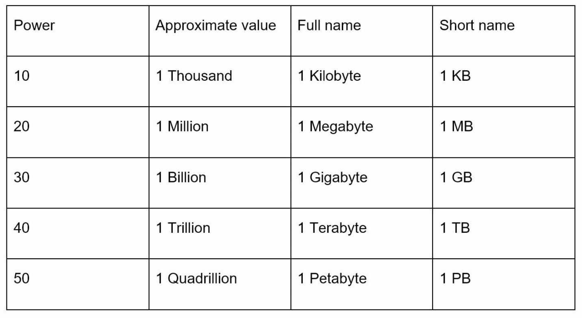

Chương 2: Ước tính tổng thể
==============================================

Giới thiệu
------------

Ước tính sơ bộ là một kỹ năng quan trọng trong các cuộc phỏng vấn thiết kế hệ thống. Nó liên quan đến việc thực hiện các phép tính sơ bộ, nhanh chóng để đánh giá năng lực hoặc hiệu suất của hệ thống. Theo Jeff Dean, Thành viên cấp cao của Google, những ước tính này giúp đánh giá xem liệu thiết kế có đáp ứng yêu cầu thông qua các thử nghiệm suy nghĩ và tiêu chuẩn hiệu suất chung hay không.

Chương này bao gồm các khái niệm, phương pháp và ví dụ chính để xây dựng trình độ thành thạo scalability và ước tính.

---

Phần 1: Các khái niệm chính
--------------

### Sức mạnh của hai

Hiểu khối lượng dữ liệu theo lũy thừa của hai là cơ bản:

Kiến thức này giúp thực hiện tính toán lưu trữ và bandwidth chính xác.

---

### Những con số Latency Mọi lập trình viên nên biết

Số Latency biểu thị thời gian thực hiện các hoạt động khác nhau trong hệ thống máy tính. Những điều này cung cấp cái nhìn sâu sắc về hiệu suất tương đối:

| Hoạt động | Latency (2020) |
| --- | --- |
| Truy cập L1 Cache | 0,5 ns |
| Truy cập L2 Cache | 7 giây |
| Truy cập bộ nhớ chính | 100 ns |
| Đọc ngẫu nhiên SSD | 150 giây |
| Tìm kiếm ngẫu nhiên ổ cứng | 10 mili giây |
| Chuyến đi khứ hồi trong Data Center | 500 giây |
| Liên Region Data Center | 150 mili giây |

**Thông tin chi tiết chính:**

* Bộ nhớ nhanh, đĩa chậm.
* Tránh tìm kiếm đĩa bất cứ khi nào có thể.
* Nén dữ liệu trước khi truyền qua internet để tiết kiệm bandwidth.

---

### Số Availability

availability (HA) cao đảm bảo thời gian ngừng hoạt động ở mức tối thiểu. Availability được biểu thị bằng **nines**:

* **99% (Hai số 9):** ~3,65 ngày/năm ngừng hoạt động
* **99,9% (Three Nines):** ~8,8 giờ/năm ngừng hoạt động
* **99,99% (Four Nines):** ~52 phút/năm ngừng hoạt động
* **99,999% (Five Nines):** ~5,3 phút/năm ngừng hoạt động
* **99,9999% (Six Nines):** ~31,56 giây/năm ngừng hoạt động

Các nhà cung cấp đám mây như Amazon, Google và Microsoft nhắm tới SLAs (Thỏa thuận cấp độ dịch vụ) **99,9% trở lên**.

---

Phần 2: Ước tính ví dụ - QPS của Twitter và yêu cầu lưu trữ
----------------------------------------------------------------------

### Giả định

* **300 triệu người dùng active hàng tháng (MAU).**
* **50% người dùng active hàng ngày (DAU).**
* **Số lượt tweet trung bình/người dùng/ngày:** 2.
* **10% số tweet có chứa nội dung đa phương tiện.**
* **Lưu giữ dữ liệu:** 5 năm.

### Ước tính

1. **Truy vấn mỗi giây (QPS):**

   * DAU = ( 300M x 50% = 150M )
   * Tweet QPS = ( 150M x 2 tweet / 24 giờ / 3600 giây = ~3500 )
   * QPS đỉnh = ( 2 x 3500 = ~7000 )
2. **Bộ nhớ phương tiện:**

   * **Thành phần kích thước Tweet:**
     + `tweet_id`: 64 byte
     + `text`: 140 byte
     + `media`: 1 MB
   * **Bộ nhớ đa phương tiện hàng ngày:** ( 150M x 2 x 10% x 1MB = 30TB mỗi ngày )
   * **Lưu trữ 5 năm:** ( 30TB x 365 x 5 = ~55PB )

---

Phần 3: Lời khuyên để ước tính hiệu quả
----------------------------------------

### 1. Làm tròn và xấp xỉ

Độ chính xác không quan trọng; tập trung vào quá trình. Đơn giản hóa các phép tính phức tạp bằng cách sử dụng số tròn. Ví dụ:

* ( 99987 / 9.1 ) có thể xấp xỉ là ( 100.000 / 10 = 10.000 ).

### 2. Viết ra các giả định

Ghi lại các giả định rõ ràng để tham khảo trong tương lai.

### 3. Đơn vị nhãn

Tránh sự mơ hồ bằng cách dán nhãn đơn vị (ví dụ: `5 MB` thay vì `5`).

### 4. Các kịch bản ước tính phổ biến

* **QPS (Truy vấn mỗi giây):** Đo cường độ lưu lượng truy cập.
* **QPS cao điểm:** Do lưu lượng truy cập tăng đột biến.
* **Yêu cầu về bộ nhớ:** Ước tính tổng nhu cầu dữ liệu.
* **Yêu cầu Cache:** Đánh giá yêu cầu bộ nhớ cho caching.
* **Số lượng Servers:** Tính toán nhu cầu phần cứng dựa trên khối lượng công việc.