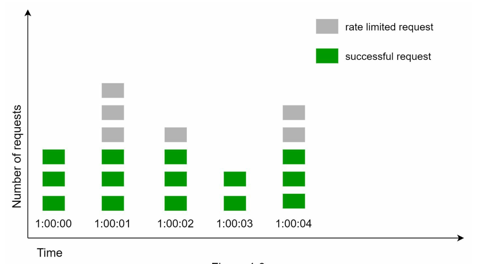

Chương 4: Thiết kế Rate Limiter
====================================

Giới thiệu
------------

Chương này tìm hiểu cách thiết kế và triển khai rate limiter—một thành phần hệ thống được sử dụng để kiểm soát tốc độ lưu lượng được gửi bởi clients hoặc các dịch vụ. Rate limiters rất quan trọng trong việc ngăn chặn lạm dụng, giảm chi phí và đảm bảo tính ổn định của tài nguyên server. Ví dụ về việc sử dụng chúng bao gồm hạn chế bài đăng, tạo tài khoản và yêu cầu khen thưởng.

Lợi ích của Rate Limiting
-------------------------

* **Ngăn chặn các cuộc tấn công DoS:** Chặn các cuộc gọi vượt mức để tránh thiếu tài nguyên.
* **Giảm chi phí:** Hạn chế các yêu cầu không cần thiết để giảm chi phí server.
* **Ngăn chặn quá tải:** Lọc ra các yêu cầu quá mức để ổn định hiệu suất server.

Bước 1: Tìm hiểu vấn đề
----------------------------------

### Các tính năng chính

* Server bên API rate limiter.
* Hỗ trợ nhiều quy tắc điều tiết.
* Xử lý các hệ thống quy mô lớn trong môi trường phân tán.
* Tùy chọn cho một dịch vụ độc lập hoặc mã cấp ứng dụng.
* Thông báo cho người dùng khi điều tiết.

### Yêu cầu

* Điều chỉnh yêu cầu chính xác.
* latency tối thiểu.
* Sử dụng bộ nhớ thấp.
* Khả năng phân tán.
* Xóa xử lý ngoại lệ.
* fault tolerance cao.

Bước 2: Thiết kế cấp cao
-------------------------

### Tùy chọn vị trí

1. **Triển khai bên Client:** Không đáng tin cậy do có thể bị sử dụng sai mục đích.
2. **Triển khai bên Server:** Ưu tiên khả năng kiểm soát và độ tin cậy.
3. **Phần mềm trung gian (API Gateway):** Một tùy chọn linh hoạt cho rate limiting tích hợp.

### Hướng dẫn về Vị trí

* Đánh giá nhóm công nghệ hiện tại và chọn các phương án hiệu quả.
* Lựa chọn thuật toán phù hợp dựa trên nhu cầu nghiệp vụ.
* Sử dụng API gateway nếu microservices được sử dụng.
* Lựa chọn giải pháp thương mại nếu nguồn lực hạn chế.

Bước 3: Thuật toán Rate Limiting
--------------------------------

### 1. Token Bucket

* **Mô tả:** Mã thông báo được thêm vào nhóm theo tỷ lệ cố định; mỗi yêu cầu tiêu thụ một mã thông báo.
* **Thông số:** Kích thước thùng và tốc độ nạp lại.
* **Ưu điểm:** Dễ triển khai, tiết kiệm bộ nhớ, hỗ trợ tăng đột biến lưu lượng.
* **Nhược điểm:** Yêu cầu điều chỉnh thông số cẩn thận.

### 2. Leaking Bucket

* **Mô tả:** Xử lý các yêu cầu ở tốc độ cố định bằng hàng đợi FIFO.
* **Ưu điểm:** Tiết kiệm bộ nhớ, tốc độ dòng ra ổn định.
* **Nhược điểm:** Sự bùng nổ lưu lượng truy cập có thể làm trì hoãn các yêu cầu gần đây.

  Ví dụ: <https://github.com/uber-go/ratelimit>

### 3. Fixed Window Counter

* **Mô tả:** Chia thời gian thành các khoảng thời gian cố định và sử dụng bộ đếm để giới hạn yêu cầu.
* **Ưu điểm:** Đơn giản, hiệu quả cho các trường hợp sử dụng cụ thể.
* **Nhược điểm:** Lưu lượng truy cập tăng đột biến ở rìa cửa sổ có thể vượt quá giới hạn.
* Sự bùng nổ giao thông đột ngột ở rìa cửa sổ thời gian
  có thể gây ra nhiều yêu cầu hơn hạn mức cho phép.

### 4. Sliding Window Log

* **Mô tả:** Theo dõi dấu thời gian để cho phép khoảng thời gian luân phiên.
* **Ưu điểm:** rate limiting chính xác.
* **Nhược điểm:** Tiêu thụ bộ nhớ cao.

### 5. Sliding Window Counter

* **Mô tả:** Kết hợp các phương pháp cửa sổ cố định và nhật ký trượt để làm mịn các gai.
* **Ưu điểm:** Tiết kiệm bộ nhớ, xử lý các đợt bùng phát lưu lượng truy cập.
* **Nhược điểm:** Việc xấp xỉ có thể không hoàn toàn nghiêm ngặt.

Kiến trúc cấp cao
--------------

* **Lưu trữ dữ liệu:** Sử dụng caching trong bộ nhớ (ví dụ: Redis) để thực hiện các thao tác đếm nhanh.
* **Các bước:**
  1. Client gửi yêu cầu đến phần mềm trung gian.
  2. Bộ đếm kiểm tra phần mềm trung gian trong Redis.
  3. Yêu cầu được xử lý hoặc từ chối dựa trên giới hạn.

Cân nhắc nâng cao
--------------

### Môi trường phân tán

* **Thử thách:** Điều kiện cuộc đua, vấn đề đồng bộ hóa.
* **Giải pháp:** Sử dụng khóa, tập lệnh Lua hoặc sorted sets trong Redis. Sử dụng các kho dữ liệu tập trung để đồng bộ hóa.

### Tối ưu hóa hiệu suất

* Thiết lập Multi-data center để giảm latency.
* Các mẫu Eventual consistency để đồng bộ hóa.

### Giám sát

* Phân tích thường xuyên để đảm bảo tính hiệu quả của thuật toán và điều chỉnh các quy tắc khi cần thiết.