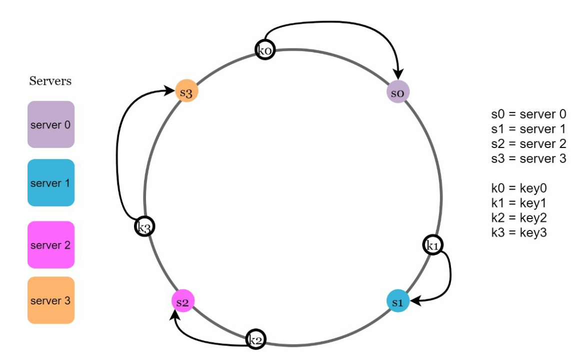

Chương 5: Thiết kế Consistent Hashing
=======================================

Giới thiệu
------------

Chương này khám phá consistent hashing, một kỹ thuật cần thiết để đạt được horizontal scaling bằng cách phân phối hiệu quả các yêu cầu và dữ liệu trên servers. Nó giảm thiểu việc phân phối lại dữ liệu khi servers được thêm hoặc xóa và đảm bảo phân phối dữ liệu đồng đều để giảm thiểu các vấn đề như server hotspots.

Vấn đề luyện tập lại
---------------------

### Giải thích

Trong các phương pháp băm truyền thống, chẳng hạn như `serverIndex = hash(key) % N`, việc phân phối lại dữ liệu trở nên khó khăn khi số lượng servers thay đổi. Ví dụ:

* Việc xóa server khiến hầu hết các khóa được gán lại, dẫn đến việc thiếu cache.
* Việc thêm server sẽ dẫn đến việc phân phối lại khóa không cần thiết.

* Cách tiếp cận này hoạt động tốt khi kích thước của nhóm server được cố định. Tuy nhiên, vấn đề phát sinh khi servers mới được thêm vào hoặc servers hiện có bị xóa.

### Vấn đề chính

Việc phân phối lại hầu hết các khóa khi số lượng server thay đổi gây ra tình trạng kém hiệu quả và quá tải.

Consistent Hashing
------------------

### Định nghĩa

Consistent hashing đảm bảo rằng chỉ một phần khóa được ánh xạ lại khi servers được thêm hoặc xóa. Điều này giảm thiểu sự gián đoạn và tăng cường scalability.

### Các khái niệm chính

1. **Không gian băm và vòng:** Không gian băm tạo thành một vòng liên tục, với các giá trị băm được phân phối từ `0` đến `2^160-1` (ví dụ: sử dụng hàm băm như SHA-1). Bằng cách kết nối cả hai đầu, chúng ta sẽ có được một chiếc nhẫn.
   

* Sử dụng cùng hàm băm f, chúng tôi ánh xạ servers dựa trên server IP hoặc tên vào vòng.

  

2. **Tra cứu Server**

* server của khóa được xác định bằng cách di chuyển ngang theo chiều kim đồng hồ trên vòng cho đến khi tìm thấy server.

  

3. **Thêm và xóa Servers**

* Việc thêm server chỉ phân phối lại các khóa lân cận. Chỉ một phần khóa được phân phối lại cho server mới.

  
* Việc xóa server chỉ ảnh hưởng đến các phím trong phạm vi của nó. Chỉ các khóa từ server đã xóa mới được gán lại cho server tiếp theo theo chiều kim đồng hồ.

  

Những thách thức và giải pháp
---------------

### Hai vấn đề trong cách tiếp cận cơ bản

1. **Kích thước Partition không đồng đều:** Servers có thể có dữ liệu partitions không đồng đều.
2. **Phân phối khóa không đồng nhất:** Một số servers có thể nhận được nhiều khóa hơn đáng kể so với các khóa khác.

### Giải pháp: Virtual Nodes

* Mỗi server được biểu thị bằng nhiều virtual nodes trên vòng được phân bố đồng đều trên vòng.
* Virtual nodes cải thiện khả năng phân phối khóa và load balancing. Khi số lượng virtual nodes tăng lên, việc phân phối khóa trở nên cân bằng hơn. Điều này là do độ lệch chuẩn sẽ nhỏ hơn khi có nhiều virtual nodes hơn, dẫn đến phân phối dữ liệu cân bằng.

  

Khóa bị ảnh hưởng
-------------

Khi servers được thêm hoặc xóa:

* **Đã thêm Server:** Các khóa bị ảnh hưởng là các khóa giữa server mới và phiên bản tiền nhiệm của nó.
  Trong ví dụ sau server 4 được thêm vào vòng. Phạm vi bị ảnh hưởng bắt đầu từ s4 (mới
  đã thêm node) và di chuyển ngược chiều kim đồng hồ quanh vòng cho đến khi tìm thấy server (s3). Như vậy, phím
  nằm giữa s3 và s4 cần được phân phối lại cho s4.

* **Server đã bị xóa:** Các khóa bị ảnh hưởng là các khóa giữa server đã bị xóa và phiên bản tiền nhiệm của nó. Trong ví dụ sau khi server (s1) bị xóa, phạm vi bị ảnh hưởng bắt đầu từ s1
  (đã loại bỏ node) và di chuyển ngược chiều kim đồng hồ quanh vòng cho đến khi tìm thấy server (s0). Do đó, các khóa nằm giữa s0 và s1 phải được phân phối lại cho s2.

  

Lợi ích của Consistent Hashing
------------------------------

* **Tối thiểu hóa việc phân phối lại:** Chỉ một phần nhỏ khóa được gán lại.
* **Scalability:** Bật horizontal scaling.
* **Giảm thiểu Hotspots:** Cân bằng phân phối dữ liệu để tránh tình trạng quá tải server.

Ứng dụng trong thế giới thực
--------------

* Amazon Dynamo DB
* Apache Cassandra
* Bất hòa
* Akamai CDN
* Maglev Load Balancer