Chương 6: Thiết kế Key-Value Store
======================================

Giới thiệu
------------

**key-value store** là một loại database không quan hệ trong đó dữ liệu được lưu trữ dưới dạng cặp key-value. Mỗi khóa là duy nhất và các giá trị được truy cập bằng các khóa này. Chương này trình bày chi tiết cách thiết kế key-value store được phân phối availability có scalability cao, hỗ trợ các hoạt động như:

* `put(key, value)` để chèn dữ liệu.
* `get(key)` để truy xuất dữ liệu.

### Đặc điểm của thiết kế

* Cặp key-value nhỏ (<10 KB).
* Hỗ trợ dữ liệu lớn với availability và scalability cao.
* scaling tự động và consistency có thể điều chỉnh.
* latency thấp.

---

Single Server Key-Value Store
-----------------------------

### Triển khai

* Sử dụng **bảng băm** để lưu trữ các cặp key-value trong bộ nhớ.
* Tối ưu hóa:
  + Nén dữ liệu.
  + Lưu trữ dữ liệu ít được truy cập trên đĩa.

### Hạn chế

Bộ nhớ của single server bị hạn chế, đòi hỏi **cách tiếp cận phân tán** cho scalability.

---

Key-Value Store được phân phối
--------------------------

**Dữ liệu key-value store** partitions được phân phối trên multiple servers và phải giải quyết các vấn đề cân bằng do **CAP theorem** nêu ra.

### CAP Theorem

1. **Consistency:** Tất cả clients đều xem cùng một dữ liệu.
2. **Availability:** Hệ thống đáp ứng mọi yêu cầu, ngay cả khi một số nodes không hoạt động.
3. **Dung sai Partition:** Hệ thống vẫn tiếp tục hoạt động bất chấp network partitions.

**Đánh đổi:** Theo CAP theorem, chỉ có thể đạt được hai trong số ba đảm bảo.

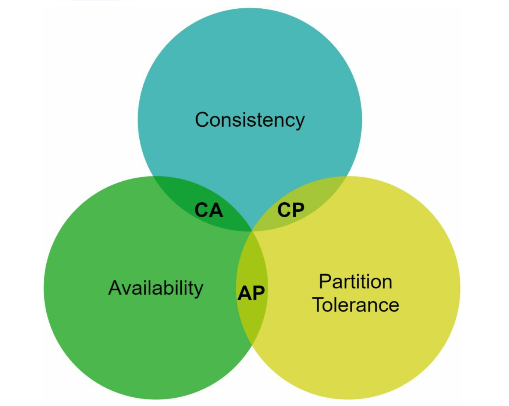

#### Loại hệ thống:

* **Hệ thống CP:** Dung sai Consistency và partition trong khi hy sinh availability (ví dụ: hệ thống ngân hàng).
* **Hệ thống AP:** Dung sai Availability và partition trong khi hy sinh consistency (ví dụ: eventual consistency).
* **Hệ thống CA:** Consistency và Availability đồng thời hy sinh dung sai partition.

  **Vì lỗi mạng là không thể tránh khỏi nên hệ thống phân tán phải chấp nhận network partition. Do đó, hệ thống CA không thể tồn tại trong các ứng dụng trong thế giới thực.**

Trong một hệ thống phân tán, partitions là điều không thể tránh khỏi. Khi xảy ra partition, chúng ta phải chọn giữa consistency và availability. Ví dụ: nếu node n3 ngừng hoạt động,
  mọi dữ liệu được ghi vào nodes n1 hoặc n2 đều không thể được truyền sang n3. Ngược lại, nếu dữ liệu được ghi vào n3 nhưng chưa được truyền sang n1 và n2 thì nodes n1 và n2 sẽ có dữ liệu cũ.

  
* Nếu chọn hệ thống CP, chúng ta phải chặn mọi thao tác ghi vào n1 và n2 để tránh dữ liệu không nhất quán.
* Nếu chúng ta chọn hệ thống AP, hệ thống sẽ tiếp tục chấp nhận các lần đọc, mặc dù nó có thể trả về dữ liệu cũ.
  Đối với việc ghi, n1 và n2 tiếp tục chấp nhận ghi,
  và dữ liệu sẽ được đồng bộ hóa với n3 khi network partition được giải quyết.

---

Thành phần hệ thống
------------------

### 1. Phân vùng dữ liệu

* **Kỹ thuật:** Consistent Hashing được sử dụng để phân phối dữ liệu trên multiple servers một cách đồng đều.
* **Ưu điểm:**
  + scaling tự động thêm/xóa server.
  + Tính không đồng nhất qua virtual nodes. Số lượng virtual nodes cho server tỷ lệ thuận với dung lượng server.

### 2. Data Replication

* Sao chép dữ liệu trên `N` servers cho availability cao.
* N servers được chọn bằng cách đi theo chiều kim đồng hồ từ vị trí server và chọn N servers đầu tiên trên vòng để lưu trữ replicas dữ liệu. Đặt replicas trong data centers riêng biệt để cải thiện độ tin cậy trong trường hợp virtual nodes.

  

### 3. Consistency

Vì dữ liệu được sao chép ở nhiều nodes nên nó phải được đồng bộ hóa giữa replicas.

* **Quorum Consensus:**

  + `N`: Tổng số replica.
  + `W`: Kích thước Write quorum. Để một lần ghi được coi là thành công, việc ghi phải được xác nhận từ replica W.
  + `R`: Kích thước Read quorum. Để một lần đọc được coi là thành công, việc đọc phải đợi phản hồi từ ít nhất R replica.
  + **Quy tắc:** `W + R > N` đảm bảo strong consistency.
  + Cấu hình W, R và N là sự đánh đổi điển hình giữa latency và consistency.

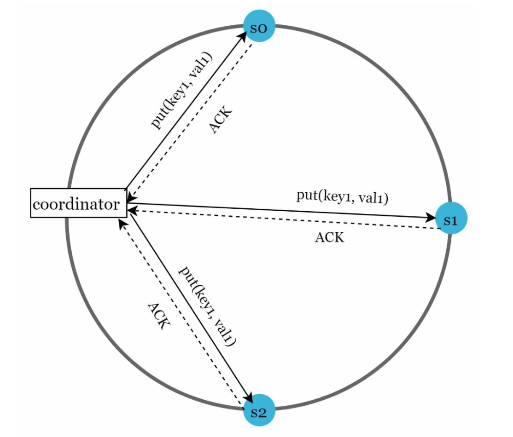
    - Nếu R = 1 và W = N thì hệ thống được tối ưu hóa để đọc nhanh.
    - Nếu W = 1 và R = N thì hệ thống được tối ưu hóa để ghi nhanh.
    - Nếu W + R > N thì strong consistency được đảm bảo (Thường N = 3, W = R = 2).
    - Nếu W + R <= N thì strong consistency không được đảm bảo.
* **Mô hình**:

  + **Strong Consistency:** Thao tác đọc trả về giá trị tương ứng với kết quả của mục dữ liệu ghi được cập nhật nhiều nhất.
  + **Weak Consistency:** Các thao tác đọc tiếp theo có thể không thấy giá trị cập nhật nhất.
  + **Eventual Consistency:** Nếu có đủ thời gian, tất cả các bản cập nhật sẽ được phổ biến và tất cả replicas đều nhất quán

### 4. Giải quyết vấn đề không nhất quán

Replication cho availability cao nhưng gây ra sự không nhất quán giữa replicas. Phiên bản và
Khóa vector được sử dụng để giải quyết các vấn đề không nhất quán.

* **Phiên bản:**

+ Sử dụng **vector clocks** để theo dõi các phiên bản dữ liệu và giải quyết xung đột.
  + Lập phiên bản có nghĩa là xử lý mỗi sửa đổi dữ liệu như một phiên bản dữ liệu mới bất biến.
    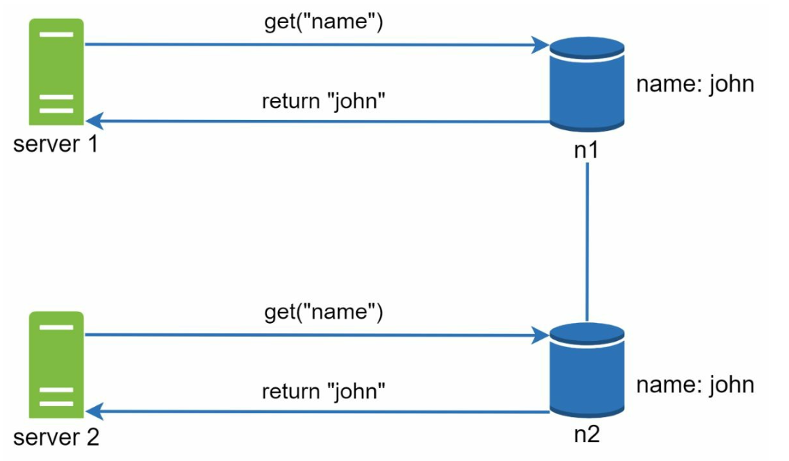
    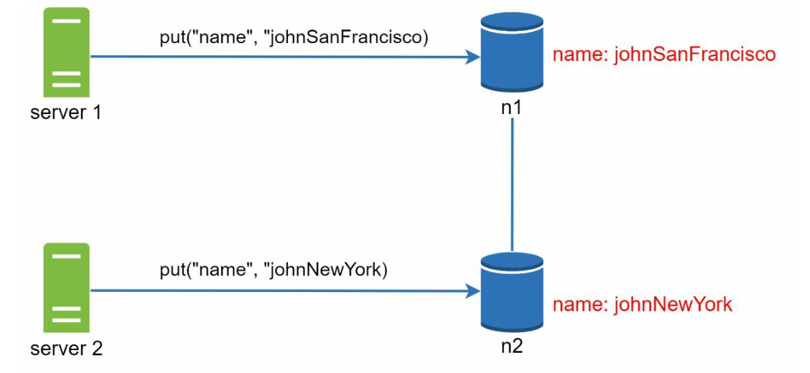
  + Server 1 đổi tên, server 2 cũng đổi tên. Hai thay đổi này được thực hiện đồng thời. Bây giờ, chúng ta có các giá trị xung đột nhau, được gọi là phiên bản v1 và v2.
* **Vector Clock**

  1. **Thiết lập**: vector clock là cặp [server, version] được liên kết với một mục dữ liệu. Nó có thể được sử dụng để kiểm tra
     nếu một phiên bản đi trước, thành công hoặc xung đột với các phiên bản khác.

     + Giả sử vector clock biểu thị bằng D([S1, v1], [S2, v2], …, [Sn, vn]), Nếu mục dữ liệu D được ghi vào server
       Vì vậy, hệ thống phải thực hiện một trong các nhiệm vụ sau.
     + Trong đó: `D` là mục dữ liệu.`Si` là mã định danh server.`vi` là bộ đếm phiên bản cho dữ liệu tại server `Si`.
  2. **Cập nhật Vector Clock:** Khi một mục dữ liệu được sửa đổi tại server:

+ Nếu server tồn tại trong vector clock, bộ đếm phiên bản của nó sẽ tăng lên.
     + Ngược lại, một mục mới sẽ được thêm vào vector clock.
  3. **Phát hiện xung đột:**

     + **Không xung đột:** Phiên bản X là phiên bản trước của phiên bản Y nếu tất cả các bộ đếm trong X nhỏ hơn hoặc bằng các bộ đếm trong Y.
     + **Tồn tại xung đột:** Hai phiên bản là anh em nếu có ít nhất một bộ đếm trong Y nhỏ hơn bộ đếm trong X.
  4. **Giải quyết xung đột:** Khi phát hiện xung đột (phiên bản anh chị em), hệ thống sẽ dựa vào logic dành riêng cho ứng dụng hoặc can thiệp client để điều chỉnh dữ liệu.

     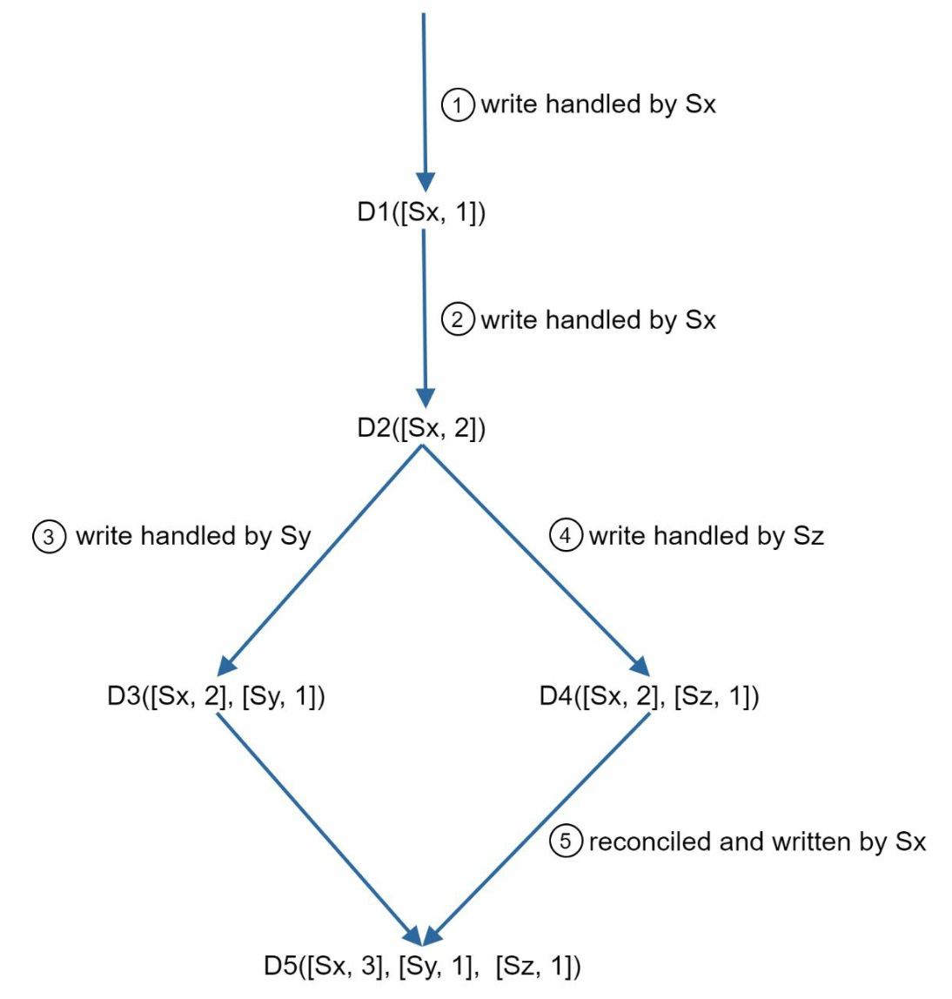
* **Thử thách:**

  + Tăng độ phức tạp cho clients.
  + Kích thước Vector clock có thể tăng lên theo nhiều bản cập nhật, đòi hỏi các chiến lược cắt bớt để hạn chế kích thước của nó.

### 5. Xử lý lỗi

#### a. Phát hiện lỗi

Không đủ để tin rằng server không hoạt động vì một server khác nói như vậy. Thông thường, cần ít nhất hai nguồn thông tin độc lập để đánh dấu server không hoạt động.

* **Gossip Protocol:**
  

+ Mỗi node duy trì ID thành viên và bộ đếm heartbeat.
  + Mỗi node tăng bộ đếm heartbeat theo định kỳ.
  + Mỗi node định kỳ gửi heartbeats tới một tập hợp nodes ngẫu nhiên.
  + Nếu heartbeat không tăng quá khoảng thời gian xác định trước thì thành viên đó là
    được coi là ngoại tuyến

#### b. Thất bại tạm thời

* **Sloppy Quorum:** Sử dụng nodes lành mạnh để duy trì hoạt động tạm thời.
  

  + Sau khi phát hiện lỗi, hệ thống cần triển khai một số cơ chế nhất định để đảm bảo availability
  + Thay vì thực thi yêu cầu đại biểu, hệ thống chọn W khỏe mạnh servers đầu tiên để ghi và R đầu tiên
    servers lành mạnh để đọc trên hash ring.
  + servers ngoại tuyến bị bỏ qua. Nếu server không có sẵn, server khác sẽ tạm thời xử lý các yêu cầu
* **Hinted Handoff:** servers ngoại tuyến bắt kịp các thay đổi khi khôi phục.

  + Khi server xuống thì các thay đổi sẽ bị đẩy lùi để đạt được dữ liệu consistency

#### c. Thất bại vĩnh viễn

* Sử dụng **Merkle Trees** để đồng bộ hóa hiệu quả giữa replicas.
  **Merkle Tree** (hoặc cây băm) là cấu trúc dữ liệu giúp phát hiện và giải quyết hiệu quả sự không nhất quán giữa replicas khi xảy ra lỗi vĩnh viễn.
* Đang làm việc

  1. **Cấu trúc:**

     + **Lá Nodes** lưu trữ hàm băm của các khối dữ liệu riêng lẻ.
     + **Nodes không có lá** lưu trữ hàm băm của nodes con của họ.
     + **băm gốc** biểu thị trạng thái kết hợp của tất cả dữ liệu trong cây.
  2. **Xây dựng Merkle Tree:**

     + **Bước 1:** Chia không gian khóa thành các nhóm.

       
     + **Bước 2:** Băm từng khóa trong một nhóm bằng cách sử dụng hàm băm thống nhất.

       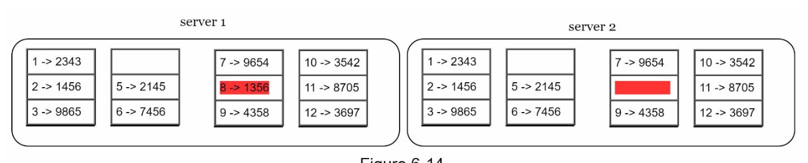
     + **Bước 3:** Tạo một hàm băm duy nhất cho mỗi nhóm.

       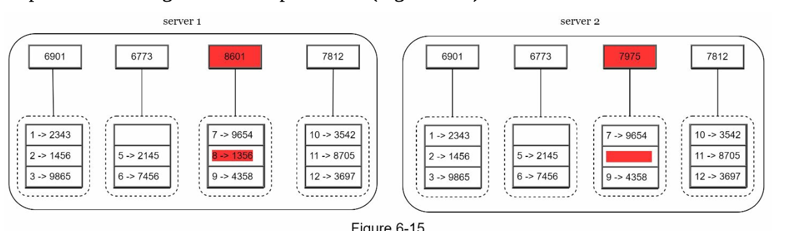
     + **Bước 4:** Kết hợp các giá trị băm của các nhóm để tính toán các giá trị băm cấp cao hơn, đạt đến đỉnh điểm là giá trị băm gốc.

       
  3. **Đồng bộ hóa:**

+ Để đồng bộ hai replica:
       - So sánh giá trị băm gốc của chúng.
       - Nếu các giá trị băm gốc khớp nhau thì replicas nhất quán.
       - Nếu các giá trị băm gốc khác nhau, hãy so sánh đệ quy các giá trị băm con để xác định các nhóm không nhất quán.
     + Chỉ những dữ liệu không nhất quán mới được đồng bộ.
* Ưu điểm

  + **Hiệu quả:** Chỉ những dữ liệu không nhất quán mới được đồng bộ hóa, làm giảm khả năng truyền dữ liệu.
  + **Scalability:** Hiệu quả đối với các tập dữ liệu lớn với chi phí đồng bộ hóa tối thiểu.
  + **Độ tin cậy:** Đảm bảo dữ liệu consistency trên replicas.

### 6. Xử lý sự cố ngừng hoạt động của Data Center

* Sao chép dữ liệu trên nhiều data centers để đảm bảo availability trong thời gian ngừng hoạt động.

---

Viết và Read Paths
--------------------

### 1. Write Path (Dựa trên kiến trúc Cassandra)

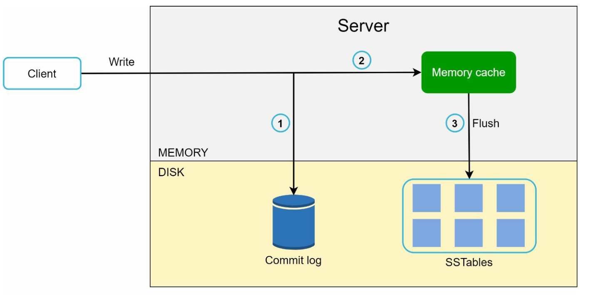

* Tiếp tục viết trong **commit log**.
* Lưu dữ liệu vào **bộ nhớ cache**.
* Xoá dữ liệu vào **SSTable** (Bảng chuỗi được sắp xếp) trên đĩa khi cache đầy.

### 2. Read Path

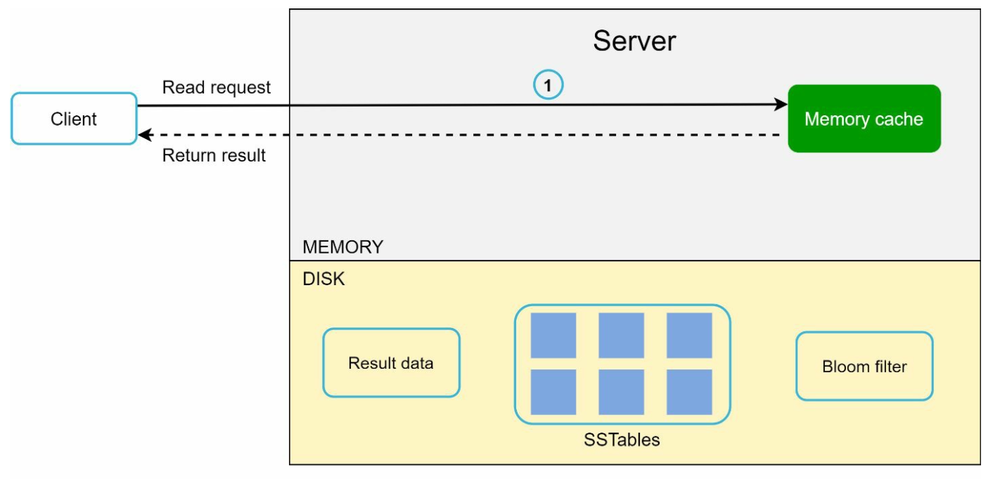
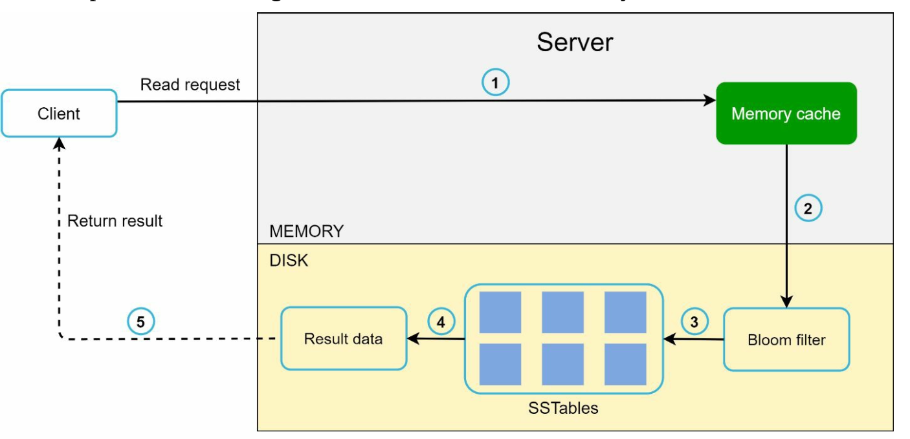

* Kiểm tra **bộ nhớ cache** để tìm dữ liệu.
* Nếu không có, hãy sử dụng **Bloom Filter** để định vị dữ liệu trong SSTables.
* Truy xuất và trả lại dữ liệu.

---

Kiến trúc cuối cùng
------------------

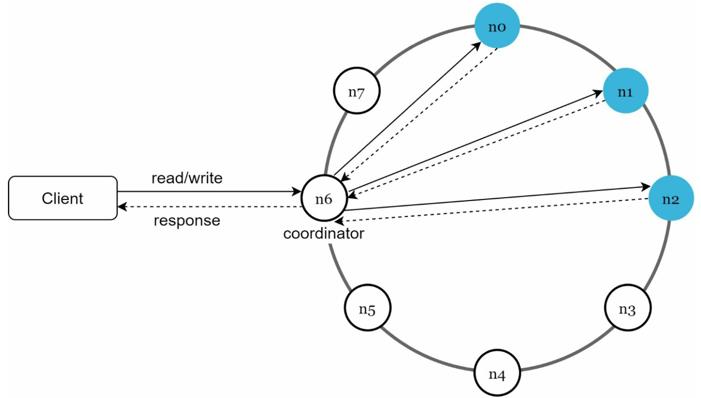

* Clients giao tiếp với key-value store thông qua APIs đơn giản: get(key) và put(key,
  giá trị).
* Điều phối viên là node hoạt động như một proxy giữa client và key-value store.
* Nodes được phân phối trên vòng bằng consistent hashing.
* Hệ thống hoàn toàn phi tập trung nên việc thêm và di chuyển nodes có thể tự động.
* Dữ liệu được sao chép tại nhiều nodes.
* Không có single point of failure vì mọi node đều có cùng một bộ trách nhiệm.