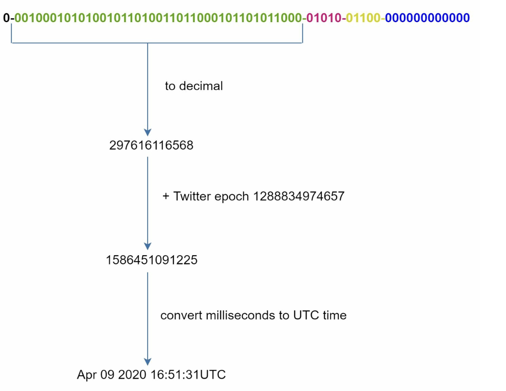

Chương 7: Thiết kế trình tạo ID duy nhất trong hệ thống phân tán
===================================================================

Giới thiệu
------------

Chương này đề cập đến thách thức trong việc thiết kế **trình tạo ID duy nhất** cho các hệ thống phân tán. Các khóa tăng tự động truyền thống không phù hợp trong môi trường phân tán do các thách thức về scalability và đồng bộ hóa. Trọng tâm là tạo các ID số 64 bit duy nhất, có thể sắp xếp, đáp ứng các yêu cầu sau:

* ID phải **duy nhất** và **được sắp xếp theo ngày**.
* ID phải nằm trong phạm vi **64 bit**.
* Hệ thống sẽ tạo **hơn 10.000 ID mỗi giây**.

---

Bước 1: Tìm hiểu vấn đề
----------------------------------

### Yêu cầu cơ bản

* ID phải là duy nhất và phải là số và phải vừa với 64 bit.
* ID tăng dần theo thời gian nhưng không hoàn toàn bằng `+1`.
* ID phải được sắp xếp theo ngày.
* Hệ thống phải xử lý throughput cao (10.000 ID/giây).

---

Bước 2: Tùy chọn thiết kế cấp cao
----------------------------------

### 1. Multi-Master Replication

* **Cách tiếp cận:** Sử dụng database `auto_increment` với bước tăng dần (ví dụ: `+k` cho k servers).

  
* **Nhược điểm:**

+ Khó scaling trên data centers.
  + ID không phải lúc nào cũng tăng theo thời gian.
  + Scaling gặp sự cố khi thêm/xóa servers.

### 2. UUID (Mã định danh duy nhất toàn cầu)

* **Cách tiếp cận:**

  + Tạo mã định danh duy nhất 128 bit độc lập trên mỗi server bằng UUID.
  + UUID có thể được tạo độc lập mà không cần sự phối hợp giữa servers

    
* **Ưu điểm:**

  + Không cần phối hợp giữa servers.
  + Cân dễ dàng với web servers.
* **Nhược điểm:**

  + Vượt quá yêu cầu 64-bit.
  + ID không thể sắp xếp theo thời gian và có thể không phải là số.

### 3. Vé Server

* **Phương pháp tiếp cận:** Sử dụng database server tập trung để tăng và gán ID.

  
* **Ưu điểm:**

  + Dễ dàng triển khai đối với các hệ thống có quy mô nhỏ.
  + Tạo ID số.
* **Nhược điểm:**

  + Single point of failure.
  + Thử thách đồng bộ hóa trong multi-server setups.

### 4. Phương pháp tiếp cận bông tuyết Twitter

* **Cách tiếp cận:**

  
  + Chia ID thành các phần để đảm bảo tính duy nhất và scalability.
  + **Bit dấu (1 bit):** Luôn là `0`, có khả năng phân biệt số có dấu và không dấu.
  + **Dấu thời gian (41 bit):** Mili giây kể từ một kỷ nguyên tùy chỉnh (Mặc định của Twitter là `1288834974657`, tương đương với ngày 04 tháng 11 năm 2010, 01:42:54 UTC). Đảm bảo ID được sắp xếp theo thời gian.
  + **ID trung tâm dữ liệu (5 bit):** Xác định tối đa trung tâm dữ liệu `2^5 = 32`.
  + **ID máy (5 bit):** Xác định tối đa máy `2^5 = 32` trong mỗi trung tâm dữ liệu.
  + **Số thứ tự (12 bit):** Theo dõi các ID được tạo trên máy trong cùng một mili giây, hỗ trợ tối đa `2^12 = 4096` ID mỗi mili giây. Trình tự đặt lại về `0` mỗi mili giây.
* **Ưu điểm:**

  + **Scalability:** Xử lý hơn 10.000 ID mỗi giây trên multiple servers.
  + **Thứ tự thời gian:** Đảm bảo ID có thể sắp xếp theo thời gian.
  + **Phân cấp:** Không có single point of failure.

Bước 3: Cân nhắc bổ sung
----------------------------------

### 1. Đồng bộ hóa đồng hồ

* **Thử thách:** Việc tạo ID giả sử đồng hồ được đồng bộ hóa trên servers.
* **Giải pháp:** Sử dụng **Giao thức thời gian mạng (NTP)** để giảm thiểu độ lệch.

### 2. Điều chỉnh độ dài phần

* Điều chỉnh kích thước phần (ví dụ: ít bit chuỗi hơn, nhiều bit dấu thời gian hơn) dựa trên trường hợp sử dụng.

### 3. Availability cao

* Trình tạo ID có vai trò quan trọng và phải có khả năng chịu lỗi.
* Xem xét cơ chế redundancy và failover.