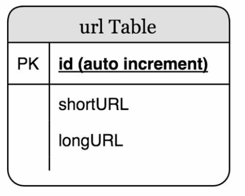
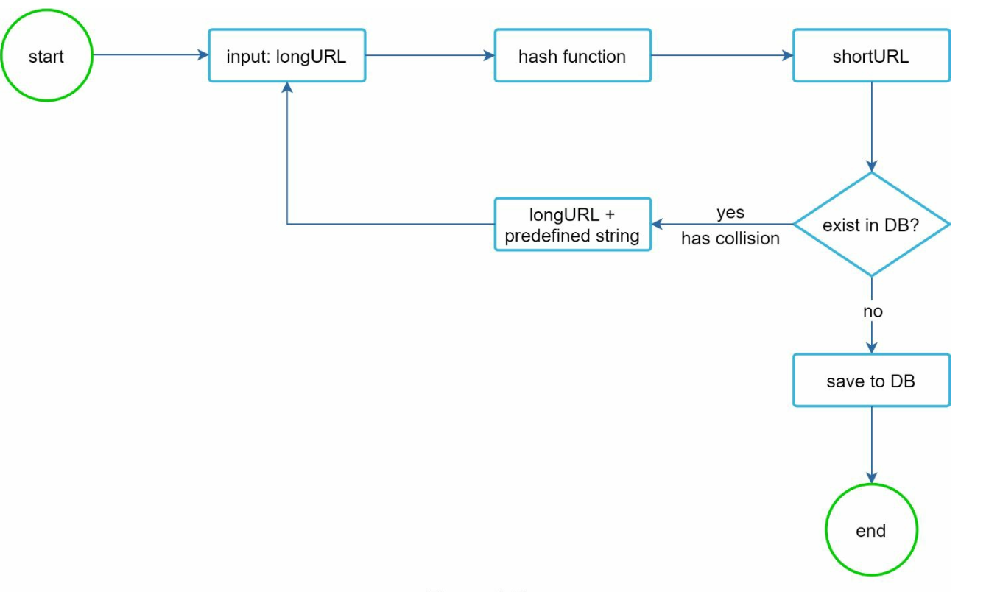

Chương 8: Thiết kế trình rút ngắn URL
====================================

Giới thiệu
------------

Chương này thảo luận về thiết kế của dịch vụ rút ngắn URL như TinyURL. Mục tiêu chính của hệ thống bao gồm **rút ngắn URL**, **chuyển hướng** và **scalability cao** để xử lý lưu lượng truy cập lớn.

### Yêu cầu

* URL rút ngắn phải **duy nhất** và **ngắn nhất có thể**.
* Xử lý **100 triệu lượt tạo URL mỗi ngày** với khả năng hỗ trợ trong 10 năm.
* Hỗ trợ **hoạt động đọc hiệu quả** với tỷ lệ đọc-ghi 10:1.
* Lưu trữ 365 tỷ bản ghi, cần khoảng **365 TB** dung lượng lưu trữ trong 10 năm.

---

Bước 1: Thiết kế cấp cao
-------------------------

### Điểm cuối API

1. **Rút ngắn URL:**

   * Điểm cuối: `POST api/v1/data/shorten`
   * Thông số: `{longUrl: longURLString}`
   * Trả về: `shortURL`
2. **Chuyển hướng URL:**

   * Điểm cuối: `GET api/v1/shortUrl`
   * Trả về: `longURL` cho chuyển hướng.

### Chuyển hướng URL

* **Chuyển hướng 301:** Chuyển hướng 301 cho thấy URL được yêu cầu được chuyển “vĩnh viễn” sang URL dài. Trình duyệt caches phản hồi và
  các yêu cầu tiếp theo cho cùng một URL sẽ không được gửi đến dịch vụ rút ngắn URL.
* **Chuyển hướng 302:** Tạm thời; hữu ích cho việc phân tích như theo dõi số lần nhấp chuột.

### Rút ngắn URL

* Sử dụng **hàm băm** để tạo URL ngắn, ánh xạ các URL dài thành các phiên bản rút gọn duy nhất.
* Hàm băm phải thỏa mãn các yêu cầu sau:
  + Mỗi longURL phải được băm thành một hashValue.
  + Mỗi hashValue có thể được ánh xạ trở lại longURL.

---

Bước 2: Đi sâu vào thiết kế
-----------------------------

### Mô hình dữ liệu

Lưu trữ ánh xạ `<shortURL, longURL>` trong database quan hệ để tối ưu hóa việc sử dụng bộ nhớ. Lược đồ bảng bao gồm:

* `id` (khóa chính),
* `shortURL`,
* `longURL`.

### Hàm băm

#### 1. Chuyển đổi Base 62:

* Mã hóa số bằng ký tự `[0-9, a-z, A-Z]`, cung cấp **62 ký tự có thể**.
* Chuyển đổi Base là một phương pháp khác thường được sử dụng cho các công cụ rút ngắn URL.
* Một id duy nhất có thể được gán cho url ngắn và ID có thể được chuyển đổi base 62 để lấy URL ngắn.
* Hàm băm gồm 7 ký tự hỗ trợ tới **3,5 nghìn tỷ URL duy nhất**, đủ cho 365 tỷ URL.

**Ví dụ:**  
Chuyển đổi ID `2009215674938` sang Base 62:

* `2009215674938` → `zn9edcu`.

#### 2. Độ phân giải băm + va chạm:

* Sử dụng các hàm băm như CRC32, MD5 hoặc SHA-1.

* Một cách tiếp cận là thu thập 7 ký tự đầu tiên của giá trị băm; tuy nhiên, phương pháp này có thể dẫn đến xung đột băm.
* Để giải quyết xung đột, hãy nối thêm một chuỗi mới được xác định trước một cách đệ quy cho đến khi không còn xung đột nữa nhưng việc này có thể tốn kém.
* Giải quyết xung đột bằng **Bloom Filters** để tra cứu hiệu quả.

  

### So sánh

* **Băm + Độ phân giải va chạm:**

  + Đã sửa lỗi độ dài URL ngắn
  + Không cần trình tạo ID duy nhất
  + Va chạm là có thể xảy ra và cần được giải quyết
  + Không thể tìm được URL rút gọn có sẵn tiếp theo vì nó không phụ thuộc vào ID
* **Chuyển đổi Base 62**

+ Độ dài không cố định và tăng dần theo ID
  + Nó cần một trình tạo ID duy nhất
  + Không thể xảy ra va chạm
  + Dễ dàng tìm thấy URL ngắn tiếp theo nếu ID tăng thêm 1 (Có thể là vấn đề bảo mật)

---

### Luồng rút ngắn URL

1. Kiểm tra xem `longURL` có tồn tại trong database hay không.
2. Nếu tìm thấy, hãy trả lại `shortURL` hiện có.
3. Ngược lại:
   * Tạo một ID duy nhất bằng cách sử dụng **trình tạo ID được phân phối**.
   * Chuyển đổi ID thành `shortURL` bằng Base 62.
   * Lưu trữ ánh xạ `<id, shortURL, longURL>` trong database.

---

### Luồng chuyển hướng URL

1. Người dùng nhấp vào `shortURL`.
2. Truy vấn ánh xạ `<shortURL, longURL>`:
   * Trước tiên hãy kiểm tra **cache** để truy cập nhanh hơn.
   * Nếu không có trong cache, hãy truy vấn database.
3. Chuyển hướng người dùng đến `longURL`.

---

Cân nhắc bổ sung
-------------------------

### Rate Limiter

* Ngăn chặn lạm dụng bằng cách đặt giới hạn cho các yêu cầu trên mỗi IP.

### Scalability

1. **Web Tier:** Stateless, có thể scaling bằng cách thêm/xóa web servers.
2. **Database Tier:** Sử dụng replication và sharding.

### Phân tích

* Thu thập dữ liệu như tỷ lệ nhấp chuột, nguồn và dấu thời gian để hiểu rõ hơn về doanh nghiệp.

### Availability cao và độ tin cậy

* Đảm bảo các dịch vụ nhất quán và đáng tin cậy bằng cách sử dụng database replication và thiết kế có khả năng chịu lỗi.