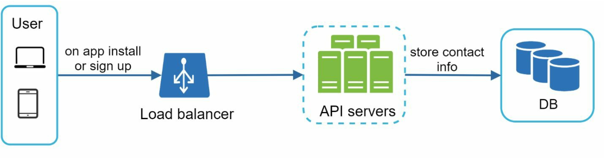
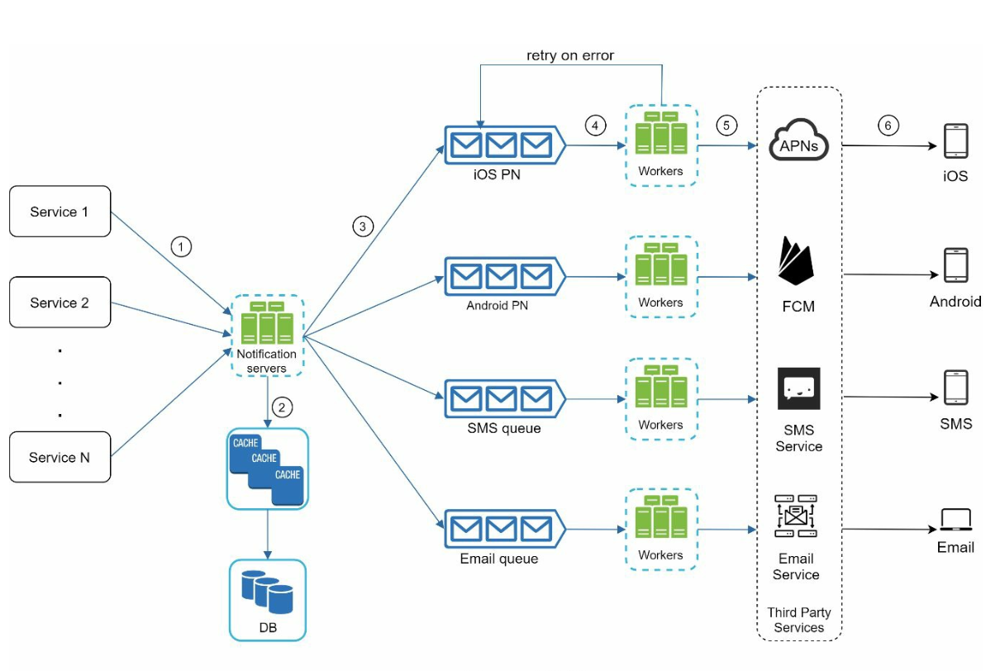

Chương 10: Thiết kế hệ thống thông báo
============================================

Giới thiệu
------------

**Hệ thống thông báo** rất cần thiết cho các ứng dụng hiện đại, cung cấp các cập nhật kịp thời như thông báo sản phẩm, sự kiện, ưu đãi và cảnh báo. Thông báo có thể được gửi qua:

1. **Thông báo đẩy** (di động hoặc máy tính để bàn),
2. **tin nhắn SMS** và
3. **Email**.

Chương này tập trung vào việc thiết kế một hệ thống có thể scaling, có khả năng gửi hàng triệu thông báo hàng ngày.

---

Bước 1: Tìm hiểu vấn đề
----------------------------------

### Yêu cầu

* **Loại thông báo:** Thông báo đẩy, SMS và Email.
* **Giao hàng:** Hệ thống thời gian thực mềm với latency tối thiểu.
* **Nền tảng:** iOS, Android và máy tính để bàn.
* **Trình kích hoạt:** Thông báo có thể được kích hoạt bởi các ứng dụng client hoặc được lên lịch trên servers.
* **Tỷ lệ:**
  + **Thông báo đẩy:** 10 triệu/ngày,
  + **SMS:** 1 triệu/ngày,
  + **Email:** 5 triệu/ngày.
* **Hỗ trợ từ chối:** Người dùng có thể tắt các loại thông báo cụ thể.

---

Bước 2: Thiết kế cấp cao
-------------------------

### Thành phần

1. **Các loại thông báo:**

* **Thông báo đẩy iOS:** Sử dụng **Dịch vụ thông báo đẩy của Apple (APNS)**.
   * **Thông báo đẩy của Android:** Sử dụng **Nhắn tin qua đám mây Firebase (FCM)**.
   * **Tin nhắn SMS:** Các dịch vụ của bên thứ ba như Twilio hoặc Nexmo.
   * **Email:** Các dịch vụ email thương mại như SendGrid hoặc Mailchimp.
2. **Thu thập thông tin liên hệ:**
   

   * Thu thập mã thông báo thiết bị, số điện thoại hoặc địa chỉ email trong quá trình cài đặt hoặc đăng ký ứng dụng.
   * Lưu trữ thông tin liên hệ trong database:
     + **Bảng mã thông báo thiết bị:** Dành cho thông báo đẩy.
     + **Bảng người dùng:** Dành cho email và số điện thoại.
3. **Luồng gửi thông báo:**

   * **Dịch vụ kích hoạt:**
     + Tạo sự kiện để bắt đầu thông báo (ví dụ: lời nhắc thanh toán, cập nhật giao hàng).
     + Dịch vụ có thể là dịch vụ vi mô, công việc định kỳ hoặc hệ thống phân tán kích hoạt các sự kiện gửi thông báo.
   * **Thông báo Server:**
     + Cung cấp APIs cho dịch vụ gửi thông báo.
     + Thực hiện các xác thực cơ bản để xác minh email, số điện thoại.
     + Truy vấn database hoặc cache để lấy dữ liệu cần thiết để hiển thị thông báo.
   * **Dịch vụ của bên thứ ba:** Gửi thông báo cho người dùng.

### Những thách thức trong thiết kế ban đầu

* **Single Point of Failure (SPOF):** Một thông báo server có thể làm hỏng toàn bộ hệ thống.
* **Vấn đề về Scalability:** Khó scaling databases, caches và xử lý các thành phần một cách độc lập.
* **Hiệu suất Bottlenecks:** Nhu cầu tài nguyên cao để gửi thông báo.

### Thiết kế cải tiến

* Di chuyển databases và caches ra khỏi thông báo server.
* Giới thiệu **horizontal scaling** với nhiều thông báo servers.
* Sử dụng **message queues** để tách các thành phần hệ thống.
  + Message queues đóng vai trò là bộ đệm khi lượng lớn thông báo được gửi đi.
* Thêm nhân viên lấy các sự kiện thông báo từ message queues và gửi chúng đến các dịch vụ bên thứ ba tương ứng.

---

Bước 3: Thiết kế Deep Dive
---------------

### Độ tin cậy

1. **Ngăn ngừa mất dữ liệu:**
   

   * Duy trì dữ liệu thông báo trong database và triển khai cơ chế thử lại.
   * Nhật ký thông báo database được bao gồm để duy trì dữ liệu.
2. **Loại bỏ trùng lặp:**

   * Kiểm tra ID sự kiện để tránh gửi thông báo trùng lặp.
   * Khi sự kiện thông báo xuất hiện lần đầu tiên, hãy kiểm tra xem nó có được nhìn thấy trước đó hay không bằng cách kiểm tra ID sự kiện.
     Nếu nhìn thấy trước khi loại bỏ nó, nếu không hãy gửi thông báo.

### Thành phần bổ sung

1. **Mẫu thông báo:** Các mẫu được định dạng sẵn để có thông báo nhất quán và hiệu quả.
2. **Cài đặt thông báo:**
   * Người dùng có thể chọn tham gia hoặc không tham gia các kênh cụ thể (đẩy, SMS hoặc email).
   * Được lưu trữ trong bảng cài đặt thông báo chuyên dụng.
3. **Rate Limiting:** rate limiting thông báo được gửi tới người dùng.
4. **Cơ chế thử lại:** Thử gửi lại thông báo nếu dịch vụ của bên thứ ba không thành công.
5. **Theo dõi hàng đợi:** Theo dõi các thông báo được xếp hàng đợi để scaling nhân viên một cách linh hoạt.
6. **Theo dõi sự kiện:** Thu thập các số liệu như tỷ lệ mở, tỷ lệ nhấp và mức độ tương tác.

### Bảo mật

* Sử dụng **AppKey** và **AppSecret** để xác thực và bảo mật APIs cho thông báo đẩy.

### Luồng thông báo

1. Dịch vụ kích hoạt gọi APIs để gửi thông báo.
2. Thông báo servers xác thực các yêu cầu và tìm nạp siêu dữ liệu từ caches hoặc databases.
3. Các sự kiện thông báo được gửi tới message queues.
4. Người lao động xử lý các sự kiện và tương tác với các dịch vụ của bên thứ ba.
5. Các dịch vụ của bên thứ ba gửi thông báo cho người dùng.

---

Tối ưu hóa chính
------------------

1. **Horizontal Scaling:** Thêm thông báo servers để phân phối tải.
2. **Message Queues:** Xử lý tách rời để xử lý khối lượng lớn.
3. **Caching:** Giảm latency xuống caching dữ liệu được truy cập thường xuyên.
4. **Thu thập thông tin phân tán:** Tối ưu hóa việc gửi tin nhắn về mặt địa lý để có hiệu suất tốt hơn.