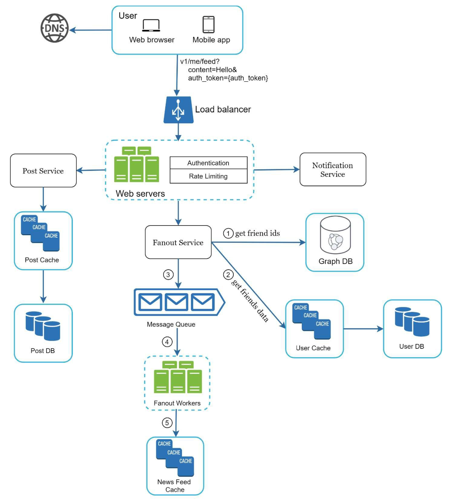

Chương 11: Thiết kế hệ thống News Feed
========================================

Giới thiệu
------------

**hệ thống nguồn cấp tin tức** hiển thị danh sách các bài đăng được cập nhật liên tục (cập nhật trạng thái, ảnh, video và liên kết) từ các kết nối của người dùng. Ví dụ bao gồm nguồn cấp tin tức của Facebook, nguồn cấp dữ liệu của Instagram và dòng thời gian của Twitter. Chương này tìm hiểu thiết kế của một hệ thống cung cấp tin tức có thể scaling.

---

Bước 1: Tìm hiểu vấn đề
----------------------------------

### Yêu cầu

1. **Nền tảng:** Hệ thống hỗ trợ cả ứng dụng web và di động.
2. **Tính năng:**
   * Người dùng có thể xuất bản bài viết.
   * Người dùng có thể xem bài đăng của bạn bè trong nguồn cấp tin tức của họ.
3. **Sắp xếp:** Nguồn cấp dữ liệu được sắp xếp theo **thứ tự thời gian đảo ngược** để đơn giản.
4. **Tỷ lệ:**
   * Người dùng có thể có tới 5.000 bạn bè.
   * 10 triệu người dùng active hàng ngày (DAU).
   * Nguồn cấp dữ liệu có thể bao gồm văn bản, hình ảnh và video.

---

Bước 2: Thiết kế cấp cao
-------------------------

### Tổng quan

Thiết kế bao gồm hai luồng chính:

1. **Xuất bản nguồn cấp dữ liệu:** Người dùng xuất bản một bài đăng được viết trên database và được phổ biến tới nguồn cấp dữ liệu của bạn bè họ.
2. **Xây dựng nguồn cấp tin tức:** Người dùng truy xuất nguồn cấp tin tức của họ bằng cách tổng hợp các bài đăng từ bạn bè theo trình tự thời gian đảo ngược.

---

### Nguồn cấp tin tức APIs

1. **Xuất bản nguồn cấp dữ liệu API:**

   * **Điểm cuối:** `POST /v1/me/feed`
   * **Thông số:** `content` (văn bản bài đăng) và `auth_token` (xác thực).
2. **Truy xuất nguồn cấp tin tức API:**

   * **Điểm cuối:** `GET /v1/me/feed`
   * **Thông số:** `auth_token` (xác thực).

---

### Xuất bản nguồn cấp dữ liệu

1. **Tương tác người dùng:** Người dùng xuất bản một bài đăng thông qua nguồn cấp dữ liệu xuất bản API.
2. **Load Balancer:** Phân phối lưu lượng truy cập vào web servers.
3. **Web Servers:** Xác thực yêu cầu và chuyển hướng đến các dịch vụ.
4. **Dịch vụ đăng bài:** Lưu trữ bài đăng trong database và cache.
5. **Dịch vụ Fanout:** Quảng bá bài đăng tới nguồn cấp tin tức của bạn bè trong cache.
6. **Dịch vụ thông báo:** Gửi thông báo cho bạn bè.

---

### Xây dựng nguồn cấp tin tức

1. **Tương tác người dùng:** Người dùng yêu cầu nguồn cấp tin tức của họ thông qua truy xuất API.
2. **Load Balancer:** Phân phối lưu lượng truy cập vào web servers.
3. **Web Servers:** Chuyển tiếp yêu cầu tới dịch vụ nguồn cấp tin tức.
4. **Dịch vụ nguồn cấp tin tức:** Tìm nạp ID bài đăng từ nguồn cấp tin tức cache và truy xuất chi tiết bài đăng đầy đủ từ database hoặc cache.

---

Bước 3: Thiết kế Deep Dive
---------------

### Xuất bản nguồn cấp dữ liệu Tìm hiểu sâu

1. **Web Servers:**

   * Xác thực người dùng bằng `auth_token`.
   * Thực thi rate limiting để ngăn chặn thư rác.
2. **Dịch vụ hâm mộ:**

   * **Fanout on Write:** Đẩy bài đăng lên nguồn cấp dữ liệu của bạn bè tại thời điểm viết.

     + **Ưu điểm:** Cập nhật theo thời gian thực, truy xuất nguồn cấp dữ liệu nhanh.
     + **Nhược điểm:** Tốn nhiều tài nguyên đối với người dùng có nhiều bạn bè.
   * **Fanout on Read:** Kéo bài viết vào thời điểm đọc.

     + **Ưu điểm:** Hiệu quả đối với người dùng không hoạt động.
     + **Nhược điểm:** Truy xuất nguồn cấp dữ liệu chậm hơn.
   * **Phương pháp tiếp cận kết hợp:** Sử dụng mô hình đẩy cho hầu hết người dùng và mô hình kéo cho người dùng có khả năng kết nối cao (ví dụ: người nổi tiếng).

     

   **Dịch vụ fanout** hoạt động như sau:

1. **Tìm nạp ID bạn bè:** Truy xuất danh sách bạn bè từ graph database.
   2. **Lọc Bạn bè từ Cache:** Truy cập cài đặt người dùng trong cache để loại trừ một số người bạn nhất định (ví dụ: bạn bè bị tắt tiếng hoặc tùy chọn chia sẻ có chọn lọc).
   3. **Gửi tới Message Queue:** Gửi danh sách bạn bè đã lọc cùng với ID bài đăng mới tới message queue để xử lý.
   4. **Fanout Workers:** Workers truy xuất dữ liệu từ message queue và cập nhật nguồn cấp tin tức cache. cache lưu trữ ánh xạ `<post_id, user_id>` thay vì đối tượng đầy đủ của người dùng và bài đăng để tiết kiệm bộ nhớ.
   5. **Lưu trữ trong Nguồn cấp tin tức Cache:** Thêm ID bài đăng mới vào nguồn cấp tin tức cache của bạn bè. Giới hạn có thể định cấu hình đảm bảo rằng chỉ các bài đăng gần đây mới được lưu trữ, vì hầu hết người dùng tập trung vào nội dung mới nhất, giúp quản lý mức tiêu thụ bộ nhớ cache.

      

Truy xuất nguồn cấp tin tức Tìm hiểu sâu
-----------------------------

### Kiến trúc Cache

cache được chia thành năm lớp:

1. **News Feed Cache:** Lưu trữ ID bài đăng để truy xuất nhanh chóng.
2. **Nội dung Cache:** Lưu trữ chi tiết bài đăng (bài đăng phổ biến trong cache hot).
3. **Social Graph Cache:** Lưu trữ dữ liệu về mối quan hệ của người dùng.
4. **Action Cache:** Theo dõi hành động của người dùng (thích, trả lời, chia sẻ).
5. **Bộ đếm Cache:** Duy trì số lượt thích, trả lời, người theo dõi, v.v.

   

---

Tối ưu hóa chính
------------------

### Scaling

1. **Database Scaling:**
   * Horizontal scaling và sharding.
   * Sử dụng replica đã đọc cho các truy vấn có lưu lượng truy cập cao.
2. **Stateless Web Tier:** Giữ web servers stateless để bật horizontal scaling.

### Caching

1. Lưu trữ dữ liệu thường xuyên truy cập vào bộ nhớ.
2. Sử dụng các lớp cache để giảm tải latency và database.

### Độ tin cậy

1. **Consistent Hashing:** Phân phối đồng đều các yêu cầu trên servers.
2. **Message Queues:** Tách rời các thành phần hệ thống và lưu lượng bộ đệm.

### Giám sát

1. Theo dõi các số liệu chính như QPS (truy vấn mỗi giây) và latency.
2. Theo dõi tỷ lệ trúng cache và điều chỉnh cấu hình cho phù hợp.