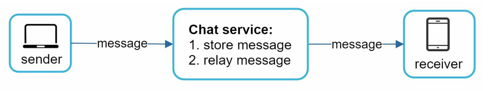
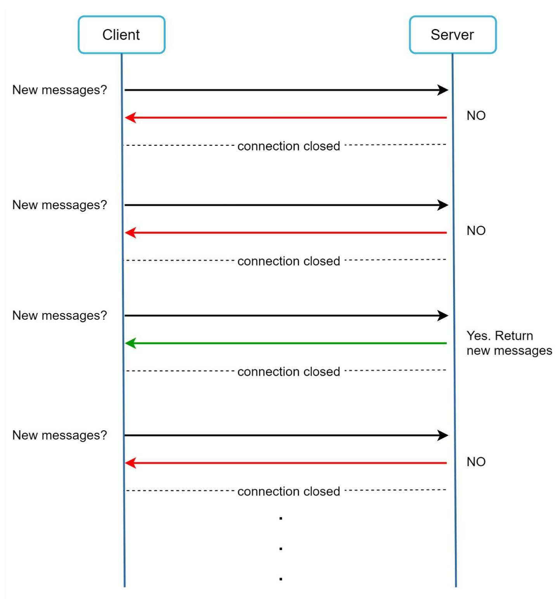
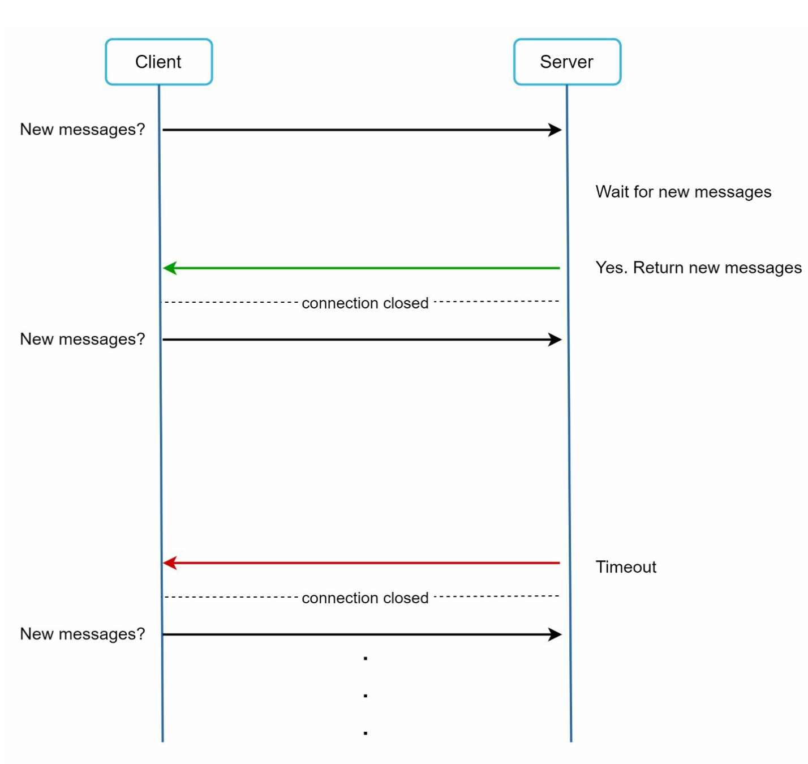
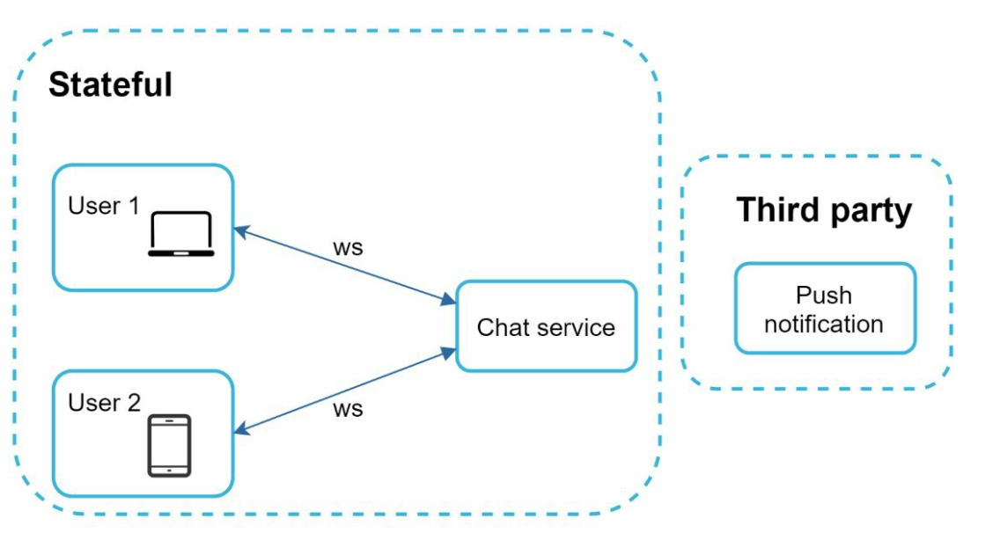
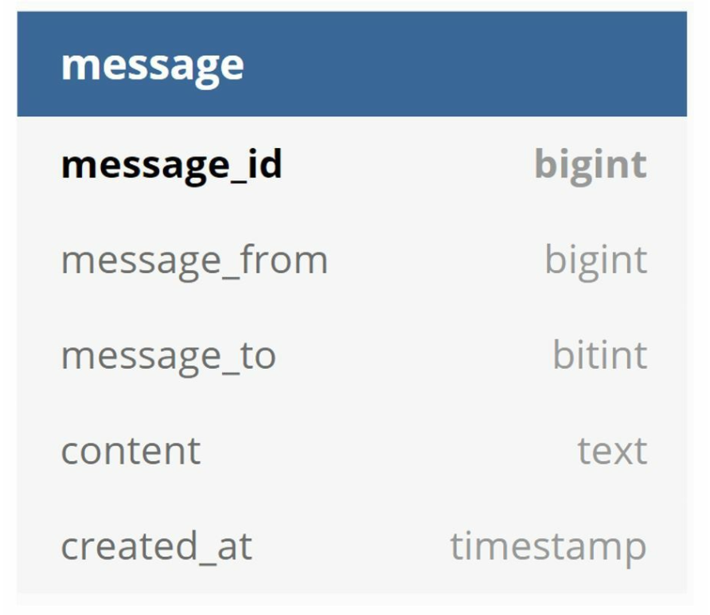
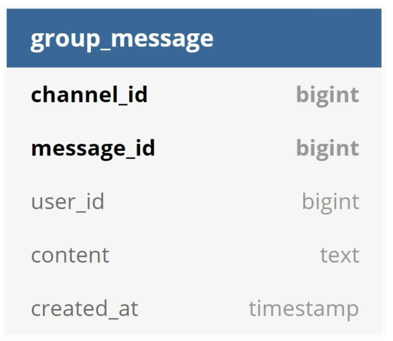
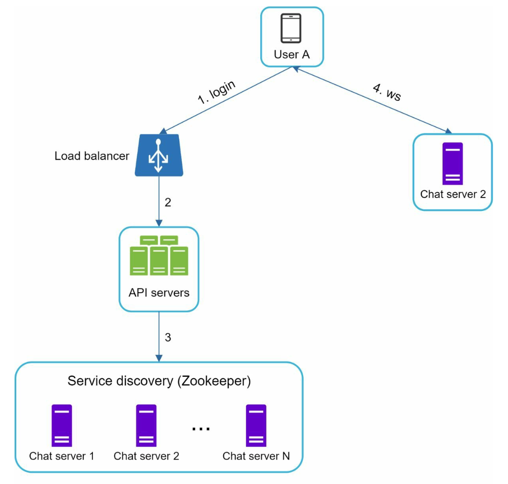
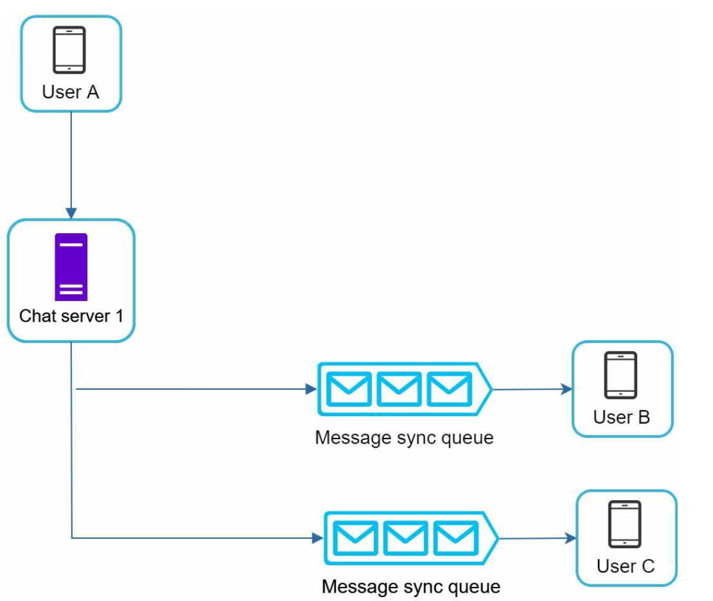
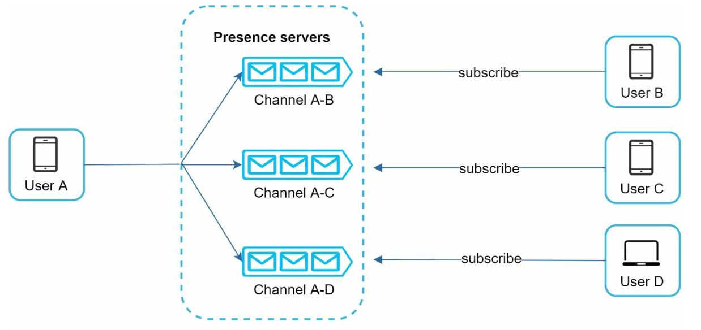

Chương 12: Thiết kế hệ thống Chat
====================================

Giới thiệu
------------

**Hệ thống trò chuyện** hỗ trợ nhắn tin theo thời gian thực giữa những người dùng. Chương này tập trung vào việc thiết kế một ứng dụng trò chuyện bao gồm:

* **Trò chuyện trực tiếp**
* **Trò chuyện nhóm (tối đa 100 người dùng)**
* **Chỉ số hiện diện trực tuyến**
* **Hỗ trợ nhiều thiết bị**
* **Thông báo đẩy**

Hệ thống nhắm mục tiêu **50 triệu người dùng active (DAU) hàng ngày** và lưu trữ lịch sử trò chuyện vĩnh viễn.

---

Bước 1: Tìm hiểu vấn đề
----------------------------------

### Yêu cầu

1. **Tính năng:**
   * Trò chuyện trực tiếp và nhóm (tối đa 100 thành viên).
   * Tin nhắn dựa trên văn bản (tối đa 100.000 ký tự).
   * Các chỉ số trực tuyến / ngoại tuyến.
   * Hỗ trợ cho nhiều thiết bị.
   * Thông báo đẩy.
2. **Quy mô:** Thiết kế cho 50 triệu DAU.
3. **Lưu trữ:** Lịch sử trò chuyện vĩnh viễn.

---

Bước 2: Thiết kế cấp cao
-------------------------

### Giao thức truyền thông

1. **Phía người gửi:** HTTP để gửi tin nhắn, tận dụng các kết nối liên tục để đạt hiệu quả.

   
2. **Bên nhận:**

   * **Bỏ phiếu:**

+ Client định kỳ hỏi server xem có tin nhắn nào không.
     + Không hiệu quả do yêu cầu thường xuyên, dư thừa.

       
   * **Bỏ phiếu dài:**

     + Giữ kết nối mở cho đến khi có tin nhắn đến.
     + Không hiệu quả đối với người dùng không hoạt động.

       
   * **WebSocket:**

     + Kết nối hai chiều, liên tục để liên lạc theo thời gian thực, được chọn cho cả gửi và nhận tin nhắn.
     + Sử dụng giao thức WebSockets(ws) để gửi và nhận tin nhắn.

       

---

### Thành phần

1. **Dịch vụ Stateless:**
   * Xử lý đăng ký, đăng nhập và quản lý hồ sơ người dùng.
   * Tích hợp với khám phá dịch vụ để đề xuất server trò chuyện tốt nhất.
2. **Dịch vụ Stateful:**
   * Trò chuyện servers duy trì kết nối WebSocket liên tục.
   * Chịu trách nhiệm gửi và đồng bộ hóa tin nhắn.
3. **Tích hợp bên thứ ba:**
   * Dịch vụ thông báo đẩy thông báo cho người dùng về tin nhắn mới.
   * Tham khảo chương Hệ thống thông báo để biết cách triển khai thông báo.

---

### Thiết kế

client duy trì kết nối WebSocket liên tục với trò chuyện server để nhắn tin theo thời gian thực.

* Trò chuyện servers tạo điều kiện thuận lợi cho việc gửi/nhận tin nhắn.
* Hiện diện servers quản lý trạng thái trực tuyến/ngoại tuyến.
* API servers xử lý mọi thứ bao gồm đăng nhập, đăng ký, thay đổi hồ sơ của người dùng, v.v.
* Thông báo servers gửi thông báo đẩy.
* Cuối cùng, key-value store được sử dụng để lưu trữ lịch sử trò chuyện.Key-value stores cho database của dữ liệu lịch sử trò chuyện vì những lý do sau:
  + Nó cho phép horizontal scaling dễ dàng.
  + Cửa hàng KV cung cấp latency rất thấp để truy cập dữ liệu.
  + databases quan hệ không xử lý tốt dữ liệu đuôi dài. Khi các chỉ số tăng trưởng
    truy cập ngẫu nhiên lớn và tốn kém.
  + Cửa hàng KV được áp dụng bởi các ứng dụng trò chuyện đáng tin cậy đã được chứng minh khác. Ví dụ,
    cả Facebook Messenger và Discord.

Sau đây là các mô hình dữ liệu cho trò chuyện một-một và trò chuyện nhóm.

* Khóa chính là id tin nhắn, giúp quyết định trình tự tin nhắn.
* Đối với cuộc trò chuyện nhóm, khóa chính tổng hợp là (channel\_id, message\_id).

+ ID có thể được tạo bằng trình tạo số thứ tự 64 bit toàn cầu như Snowflake.
  + Một cách tiếp cận tốt hơn là sử dụng trình tạo số thứ tự cục bộ. Địa phương có nghĩa là ID chỉ là duy nhất trong một nhóm.
  + Lý do tại sao ID cục bộ hoạt động là vì việc duy trì chuỗi tin nhắn trong kênh một đối một hoặc kênh nhóm là đủ.
  

Bước 3: Thiết kế Deep Dive
---------------

### Khám phá dịch vụ

* Vai trò chính của khám phá dịch vụ là đề xuất trò chuyện server tốt nhất cho client dựa trên
  trên các tiêu chí như vị trí địa lý, dung lượng server.
* Sử dụng **Apache Zookeeper** để phân bổ trò chuyện servers dựa trên các tiêu chí như vị trí địa lý và dung lượng server.
* Đảm bảo phân phối tải hiệu quả và giảm thiểu latency.

### Luồng tin nhắn

#### Trò chuyện trực tiếp

1. Người dùng A gửi tin nhắn đến Chat Server 1.
2. Trò chuyện Server 1 chỉ định một ID tin nhắn duy nhất và lưu trữ tin nhắn trong key-value store.
3. Nếu Người dùng B trực tuyến, tin nhắn sẽ được chuyển tiếp đến Chat Server 2, duy trì kết nối WebSocket liên tục.
4. Nếu Người dùng B ngoại tuyến, một thông báo đẩy sẽ được gửi.

#### Trò chuyện nhóm

* Tin nhắn được sao chép vào hộp thư đến riêng cho từng người nhận trong nhóm.
* Đơn giản hóa việc đồng bộ hóa nhưng trở nên đắt đỏ đối với các nhóm lớn hơn.
* Về phía người nhận, người nhận có thể nhận tin nhắn từ nhiều người dùng. Mỗi người nhận
  có một hộp thư đến (hàng đợi đồng bộ tin nhắn) chứa tin nhắn từ những người gửi khác nhau.

---

#### Đồng bộ hóa tin nhắn

Nhiều người dùng có nhiều thiết bị. Chúng ta cần đồng bộ tin nhắn trên các thiết bị.
Mỗi thiết bị duy trì một biến gọi là cur\_max\_message\_id, biến này theo dõi thông tin mới nhất
ID tin nhắn trên thiết bị. Tin nhắn thỏa mãn hai điều kiện sau đây được coi là
dưới dạng tin nhắn:

* ID người nhận bằng ID người dùng hiện đang đăng nhập.
* ID tin nhắn trong key-value store lớn hơn cur\_max\_message\_id

---

### Hiện diện trực tuyến

1. **Cơ chế Heartbeat:**
   

   * Clients gửi heartbeats định kỳ tới servers để cho biết họ đang trực tuyến.
   * Nếu không nhận được heartbeat trong một ngưỡng (ví dụ: x = 30), người dùng sẽ được đánh dấu ngoại tuyến.
2. **Mô hình fanout:**

   
   * Cập nhật hiện diện được gửi tới bạn bè bằng mô hình đăng ký xuất bản trong đó mỗi cặp bạn bè duy trì một kênh.
   * Khi trạng thái trực tuyến của Người dùng A thay đổi, nó sẽ xuất bản sự kiện lên ba kênh, kênh A-B, A-C và A-D.
   * Ba kênh đó được Người dùng B, C và D đăng ký tương ứng để nhận các cập nhật trạng thái trực tuyến.
   * Thiết kế trên có hiệu quả đối với một nhóm người dùng nhỏ.

---

Cân nhắc bổ sung
-------------------------

### Scalability

* **Horizontal Scaling:** Thêm servers khi số lượng người dùng tăng lên.
* **Load Balancing:** Phân phối lưu lượng truy cập đồng đều trên servers.
* **Caching:** Giảm tải database và cải thiện latency.

### Xử lý lỗi

* **Cơ chế thử lại:** Xử lý lỗi gửi tin nhắn bằng cách thử lại và xếp hàng.
* **Lỗi Server:** Sử dụng tính năng khám phá dịch vụ để phân bổ servers mới trong trường hợp xảy ra lỗi.

### Tiện ích scaling trong tương lai

1. **Hỗ trợ phương tiện:** Thêm khả năng xử lý ảnh và video, bao gồm nén và lưu trữ đám mây.
2. **Mã hóa đầu cuối:** Đảm bảo quyền riêng tư của tin nhắn.
3. **Client-Side Caching:** Giảm truyền dữ liệu để có hiệu suất tốt hơn.
4. **Thời gian tải được cải thiện:** Sử dụng mạng caching được phân bổ theo địa lý.