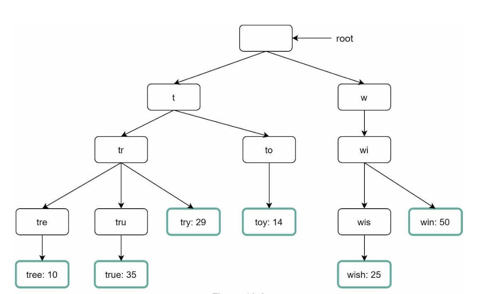
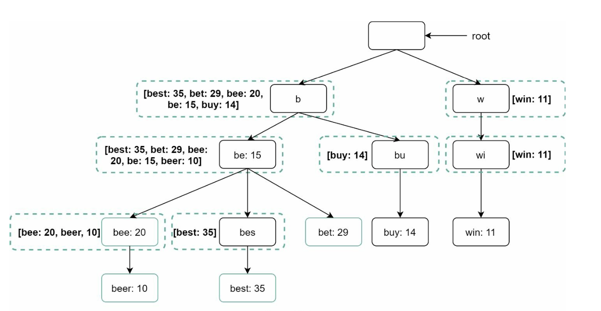
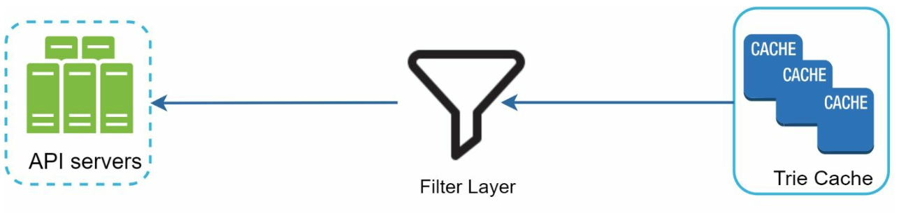
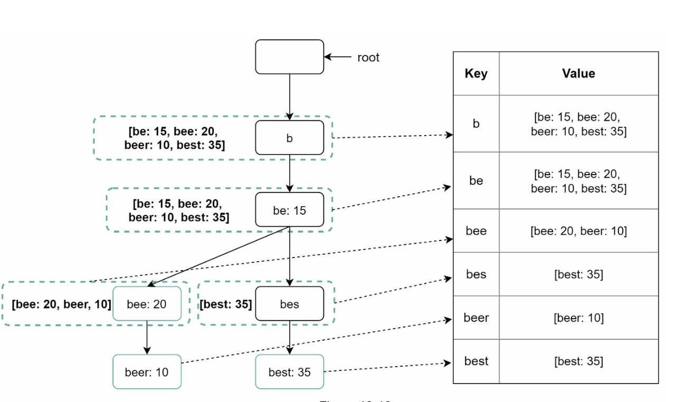

Chương 13: Thiết kế hệ thống tự động hoàn thành tìm kiếm
====================================================

Giới thiệu
------------

Tự động hoàn thành, còn được gọi là tìm kiếm trước kiểu chữ hoặc tìm kiếm gia tăng, cung cấp đề xuất theo thời gian thực cho người dùng khi họ nhập vào hộp tìm kiếm. Hệ thống phải cung cấp một cách hiệu quả các đề xuất phổ biến và có liên quan hàng đầu dựa trên dữ liệu truy vấn lịch sử.

### Các tính năng chính

* Đề xuất tối đa **5 kết quả tự động hoàn thành**.
* Dựa trên **mức độ phổ biến của truy vấn** (tần suất).
* Chỉ hỗ trợ **ký tự tiếng Anh viết thường**.
* response time nhanh (<100 ms) và có thể scaling.

---

Bước 1: Tìm hiểu vấn đề
----------------------------------

### Yêu cầu

1. **Đề xuất theo thời gian thực:** Hiển thị các kết quả phù hợp có liên quan theo kiểu người dùng.
2. **Kết quả hàng đầu:** Trả về tối đa 5 kết quả được sắp xếp theo mức độ phổ biến.
3. **Scalability:** Xử lý **10 triệu DAU** với QPS cao nhất là **48.000**.
4. **Availability cao:** Xử lý lỗi mà không khiến hệ thống ngừng hoạt động.
5. **Tăng trưởng dữ liệu:** Hỗ trợ tăng trưởng bộ nhớ hàng ngày **0,4 GB** cho dữ liệu truy vấn mới.

---

Bước 2: Thiết kế cấp cao
-------------------------

Ở cấp độ cao, hệ thống được chia thành hai dịch vụ:

1. **Dịch vụ thu thập dữ liệu:**

* Thu thập các truy vấn của người dùng và tổng hợp chúng để phân tích tần suất trong thời gian thực.
   * Xử lý thời gian thực không thực tế đối với các tập dữ liệu lớn; tuy nhiên, đó là một điểm khởi đầu tốt
2. **Dịch vụ truy vấn:** Cung cấp các đề xuất hàng đầu dựa trên thông tin đầu vào của người dùng.

---

### Dịch vụ thu thập dữ liệu

* Tổng hợp dữ liệu truy vấn từ nhật ký phân tích và cập nhật bảng tần số.
* Xử lý dữ liệu lịch sử hàng tuần để xây dựng **trie** (cây tiền tố).

### Dịch vụ truy vấn

* Sử dụng bảng tần số từ dịch vụ thu thập dữ liệu.
* Xử lý đầu vào của người dùng và truy xuất các đề xuất top-k từ bảng tần số bằng Trie.
* Được tối ưu hóa để tra cứu nhanh bằng caching và cấu trúc dữ liệu hiệu quả.
* Ví dụ: khi người dùng nhập “tw” vào hộp tìm kiếm, 5 truy vấn tìm kiếm hàng đầu sau đây sẽ được hiển thị.

---

Bước 3: Thiết kế Deep Dive
---------------

### Cấu trúc dữ liệu Trie

**trie** là cấu trúc dữ liệu dạng cây được sử dụng để lưu trữ và truy xuất các chuỗi truy vấn một cách hiệu quả.

#### Các tính năng chính

1. **Bộ nhớ nhỏ gọn:** Trình bày các tiền tố theo thứ bậc để giảm thiểu redundancy.
2. **Thông tin tần suất:** Lưu trữ mức độ phổ biến của các truy vấn tại mỗi node.
3. **Các bước để có được k truy vấn được tìm kiếm nhiều nhất**
   

   * Tìm tiền tố
   * Duyệt cây con từ tiền tố node để lấy tất cả cây con hợp lệ
   * Sắp xếp trẻ em và đạt top k
4. **Tối ưu hóa:**

   * Truy vấn top-k Cache tại mỗi node để tăng tốc độ truy xuất và tránh duyệt qua toàn bộ trie.

     
   * Giới hạn độ dài tiền tố để giảm không gian tìm kiếm vì người dùng hiếm khi nhập truy vấn tìm kiếm dài (giả sử là 50).

#### Hoạt động Trie

1. **Tạo:**

   * Được xây dựng hàng tuần bằng cách sử dụng dữ liệu truy vấn tổng hợp.
   * Nguồn dữ liệu là từ Nhật ký phân tích/DB.
2. **Cập nhật:** Hiếm khi được cập nhật theo thời gian thực; cập nhật hàng tuần thay thế dữ liệu cũ.
3. **Xóa:**
   

   * Bộ lọc loại bỏ các đề xuất không mong muốn hoặc có hại (ví dụ: lời nói căm thù).
   * Việc có lớp bộ lọc giúp chúng ta linh hoạt loại bỏ kết quả dựa trên các quy tắc lọc khác nhau.
   * Các đề xuất không mong muốn sẽ bị xóa vật lý khỏi database một cách không đồng bộ.

---

### Luồng xử lý truy vấn

1. **Tìm kiếm tiền tố:**
   * Xác định tiền tố node tương ứng với thông tin đầu vào của người dùng.
   * Duyệt cây con để thu thập các gợi ý hợp lệ.
2. **Sắp xếp top-k:**
   * Đề xuất top-k Cache tại mỗi node để giảm thiểu chi phí sắp xếp.
3. **Cấu trúc phản hồi:**
   * Xây dựng kết quả bằng cách sử dụng dữ liệu được lưu trong bộ nhớ cache để có response times nhanh.

---

### Tối ưu hóa

1. **Cache tại mỗi Node:**
   * Lưu trữ các truy vấn top-k để tránh việc truyền tải dư thừa.
2. **Giới hạn độ dài tiền tố:**
   * Giới hạn độ dài tiền tố ở một giá trị nhỏ (ví dụ: 50 ký tự) để tra cứu nhanh hơn.
3. **Yêu cầu AJAX:**
   * Sử dụng các yêu cầu không đồng bộ nhẹ để phản hồi theo thời gian thực.
4. **Trình duyệt Caching:**
   * Lưu kết quả tự động hoàn thành trong trình duyệt cache cho các cluster từ được tìm kiếm thường xuyên.

---

### Đường ống thu thập dữ liệu

Trong thiết kế cấp cao, bất cứ khi nào người dùng nhập truy vấn tìm kiếm, dữ liệu sẽ được cập nhật theo thời gian thực. Cách tiếp cận này không thực tế.

* Người dùng có thể nhập hàng tỷ truy vấn mỗi ngày. Việc cập nhật trie trên mọi truy vấn là không khả thi.
* Các đề xuất hàng đầu có thể không thay đổi nhiều sau khi trie được xây dựng.

#### Cập nhật thiết kế

1. **Nhật ký phân tích:**
   * Lưu trữ dữ liệu truy vấn thô dưới dạng nhật ký để tổng hợp hàng tuần.
   * Nhật ký chỉ được thêm vào và không được lập chỉ mục
2. **Trình tổng hợp:**
   * Xử lý nhật ký thành bảng tần số, phù hợp với việc xây dựng trie.
   * Đối với các ứng dụng thời gian thực như Twitter, tổng hợp dữ liệu trong khoảng thời gian ngắn hơn.
   * Đối với các trường hợp khác, việc tổng hợp dữ liệu ít thường xuyên hơn, chẳng hạn một lần mỗi tuần là đủ.
3. **Công nhân:**
   * servers không đồng bộ xây dựng lại trie và lưu trữ nó trong bộ lưu trữ liên tục.
4. **Tùy chọn lưu trữ:**
   * **Trie Cache**: Trie Cache là hệ thống cache được phân phối giúp giữ trie trong bộ nhớ để đọc nhanh.
   * **Trie DB**
     1. **Document Store (ví dụ: MongoDB)**: Vì trie mới được tạo hàng tuần nên chúng tôi có thể chụp ảnh nhanh nó, tuần tự hóa nó và lưu trữ dữ liệu được tuần tự hóa trong database như MongoDB theo định kỳ
     2. **Key-Value Store:**
        + Ánh xạ tiền tố vào dữ liệu node để truy cập nhanh.
        + Mỗi tiền tố trong trie được ánh xạ tới một khóa trong bảng băm.
        + Dữ liệu trên mỗi trie node được ánh xạ tới một giá trị trong bảng băm.

          

---

### Scalability

1. **Sharding:**

* Phân phối trie nodes trên servers dựa trên phạm vi tiền tố (ví dụ: `a-m`, `n-z`).
   * Thêm shard trong các tiền tố để cân bằng sự phân bố không đồng đều (ví dụ: `aa-ag`, `ah-an`).
2. **Load Balancing:**
   

   * Sử dụng trình quản lý bản đồ shard để routing các yêu cầu đến server thích hợp.

---

Bước 4: Tính năng nâng cao
-------------------------

### Hỗ trợ đa ngôn ngữ

1. **Ký tự Unicode:** Sử dụng Unicode để hỗ trợ các ngôn ngữ không phải tiếng Anh.
2. **Tries dành riêng cho quốc gia:** Xây dựng tries riêng biệt cho các quốc gia khác nhau hoặc regions.

### Truy vấn thịnh hành

* Xử lý các sự kiện thời gian thực bằng cách cập nhật động trie nodes hoặc đánh giá cao hơn các truy vấn gần đây.