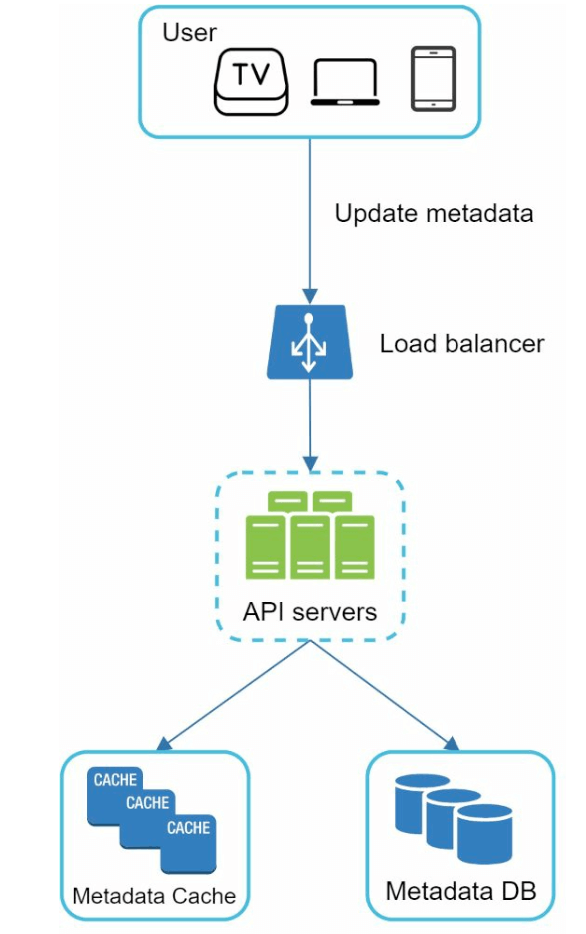
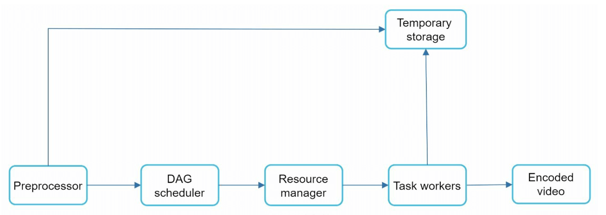
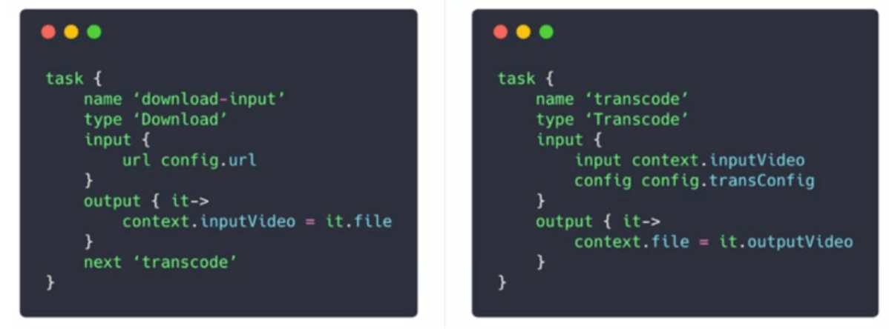
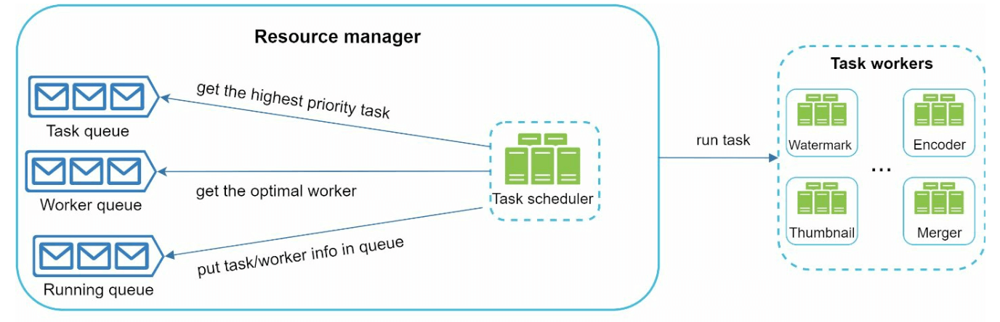
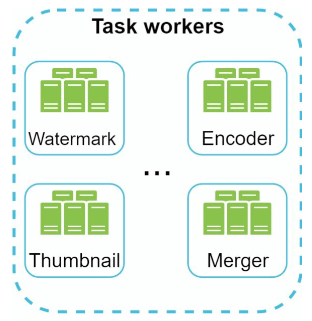
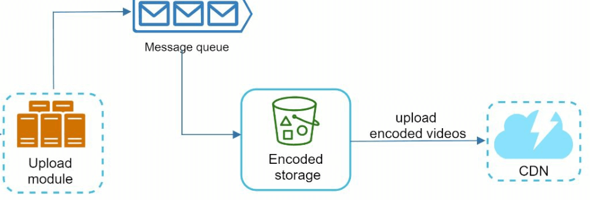

Chương 14: Thiết kế YouTube
=============================

Giới thiệu
------------

YouTube là nền tảng video streaming khổng lồ hỗ trợ tải lên, phát lại video và nhiều tương tác khác nhau. Chương này tập trung vào việc thiết kế hệ thống video streaming có thể scaling với các tính năng cốt lõi sau:

* **Tải lên video nhanh**
* **video streaming mượt mà**
* **Khả năng thay đổi chất lượng video**
* **Chi phí cơ sở hạ tầng thấp**
* **availability cao và độ tin cậy**

### Thống kê chính (2020)

* **2 tỷ người dùng active hàng tháng**
* **5 tỷ video được xem mỗi ngày**
* **37% lưu lượng truy cập Internet trên thiết bị di động đến từ YouTube**
* Có sẵn bằng **80 ngôn ngữ**
* **Doanh thu quảng cáo 15,1 tỷ USD** vào năm 2019

---

Bước 1: Tìm hiểu vấn đề và phạm vi
----------------------------------------

### Chức năng cốt lõi

1. Tải video lên
2. Xem video

### Nền tảng được hỗ trợ

* Ứng dụng di động, trình duyệt web và TV thông minh

### Giả định

* **Người dùng Active hàng ngày (DAU):** 5 triệu
* **Kích thước video trung bình:** 300 MB
* **Giới hạn tải lên:** Tối đa 1 GB mỗi video
* **Nhu cầu lưu trữ hàng ngày:** 150 TB
* **Chi phí CDN:** 5 triệu \* 5 video \* 0,3 GB \* 0,02 USD = 150.000 USD/ngày (sử dụng Amazon CloudFront)

---

Bước 2: Thiết kế cấp cao
-------------------------

### Thành phần

1. **Client:** Các thiết bị như điện thoại thông minh, máy tính và TV.
2. **CDN (CDN):** Lưu trữ và truyền phát video.
3. **API Servers:** Xử lý tất cả các tương tác của người dùng ngoại trừ video streaming (ví dụ: tải lên, cập nhật siêu dữ liệu).
4. **Siêu dữ liệu Database:** Lưu trữ siêu dữ liệu video (ví dụ: tiêu đề, mô tả, kích thước).
5. **Bộ nhớ gốc:** Blob storage dành cho các video đã tải lên.
6. **Chuyển mã Servers:** Chuyển đổi video thành nhiều độ phân giải và định dạng.
7. **Bộ nhớ được chuyển mã:** Blob storage dành cho video được chuyển mã.

---

### Quy trình làm việc cốt lõi

#### 1. Luồng tải lên video

* **Quy trình song song:**

  1. Tải video lên bộ nhớ gốc.
  2. Cập nhật siêu dữ liệu video trong database.
* **Tải lên video (Các bước):**

  + [1] Video được upload lên blob storage.
  + [2] Chuyển mã servers chuyển đổi video sang nhiều định dạng.
  + [3] Sau khi chuyển mã xong, hai bước sau được thực hiện song song.
    - [3a] Video đã chuyển mã sẽ được gửi đến bộ lưu trữ đã chuyển mã.
    - [3b] Các sự kiện hoàn thành chuyển mã được xếp vào hàng đợi hoàn thành.
  + [3a.1] Video được phân phối tới CDN.
  + [3b.1] Trình xử lý hoàn thành cập nhật siêu dữ liệu và thông báo cho người dùng.
* **Tải lên siêu dữ liệu (Các bước):**

  
  + client song song gửi yêu cầu cập nhật siêu dữ liệu video
  + Yêu cầu chứa siêu dữ liệu video, bao gồm tên tệp, kích thước, định dạng, v.v.

#### 2. Luồng Video Streaming

* Video được phát trực tiếp từ CDN bằng cách sử dụng edge servers để giảm thiểu latency.
* Một số giao thức phát trực tuyến phổ biến là MPEG\_DASH, Apple HLS, Adobe HDS.
* *Các giao thức phát trực tuyến khác nhau hỗ trợ các trình phát lại và mã hóa video khác nhau.*

---

Bước 3: Thiết kế Deep Dive
---------------

### Chuyển mã video

#### Tầm quan trọng

1. Video thô tiêu tốn nhiều dung lượng lưu trữ. Nó làm giảm không gian lưu trữ.
2. Đảm bảo khả năng tương thích giữa các thiết bị và trình duyệt.
3. Điều chỉnh chất lượng video phù hợp với điều kiện mạng.

#### Thành phần

* **Vùng chứa:** Đóng gói video, âm thanh và siêu dữ liệu (ví dụ: MP4, AVI).
* **Codec:** Thuật toán nén và giải nén (ví dụ: H.264, VP9).

#### Mô hình đồ thị chu kỳ có hướng (DAG)

* Việc chuyển mã một video tốn kém về mặt tính toán và tốn thời gian.
* Mô hình DAG xác định các tác vụ như mã hóa, tạo hình thu nhỏ và hình mờ.
* Cho phép tính song song cao trong xử lý video.
* Video gốc được chia thành video, âm thanh và siêu dữ liệu.

  + Mã hóa video: Video được chuyển đổi để hỗ trợ các độ phân giải, codec, bitrate khác nhau.
  + Hình thu nhỏ: Có thể do người dùng tải lên hoặc do hệ thống tự động tạo.
  + Hình mờ: Lớp phủ hình ảnh phía trên video của bạn chứa thông tin nhận dạng về video.

---

### Kiến trúc chuyển mã video

1. **Bộ tiền xử lý:** Chia video thành các phần nhỏ hơn (căn chỉnh GOP). Nó có 4 trách nhiệm.

   
   * Chia tách video: Luồng video được chia nhỏ hoặc chia nhỏ hơn thành căn chỉnh Nhóm Hình ảnh (GOP) nhỏ hơn.
   * Nó chia video theo căn chỉnh GOP cho clients cũ.
   * Nó tạo DAG dựa trên các tệp cấu hình mà các lập trình viên client viết.
   * Nó lưu trữ GOP và siêu dữ liệu trong bộ lưu trữ tạm thời trong trường hợp mã hóa không thành công, hệ thống có thể sử dụng dữ liệu cố định cho các hoạt động thử lại.
2. **Trình lập lịch DAG:** Sắp xếp các nhiệm vụ thành các giai đoạn tuần tự hoặc song song.
   

   * Nó chia biểu đồ DAG thành các giai đoạn nhiệm vụ và đặt chúng vào hàng đợi nhiệm vụ trong trình quản lý tài nguyên.
   * Giai đoạn 1: video, âm thanh và siêu dữ liệu.
   * Tệp video còn được chia thành hai nhiệm vụ trong giai đoạn 2: mã hóa video và hình thu nhỏ.
3. **Người quản lý nguồn lực:** Chịu trách nhiệm quản lý hiệu quả phân bổ nguồn lực. Nó
   chứa 3 hàng đợi và một bộ lập lịch tác vụ.
   

* Hàng đợi nhiệm vụ: hàng đợi ưu tiên chứa các nhiệm vụ cần thực hiện.
   * Hàng đợi công nhân: hàng ưu tiên chứa thông tin sử dụng công nhân.
   * Hàng đợi đang chạy: chứa các tác vụ hiện đang chạy và các công nhân đang chạy tác vụ.
   * Lập lịch tác vụ: chọn nhiệm vụ/người lao động tối ưu và hướng dẫn người thực hiện tác vụ đã chọn thực hiện công việc.
4. **Nhân viên tác vụ:** Thực hiện chuyển mã và các hoạt động khác.
   

   * Các nhân viên nhiệm vụ khác nhau có thể thực hiện các nhiệm vụ khác nhau
5. **Lưu trữ tạm thời:** Lưu trữ dữ liệu trung gian để thử lại.

   * Việc lựa chọn hệ thống lưu trữ phụ thuộc vào các yếu tố như loại dữ liệu, kích thước dữ liệu, tần suất truy cập, tuổi thọ dữ liệu, v.v.
6. **Đầu ra:** Các video được chuyển mã đã sẵn sàng để phân phối.

---

Tối ưu hóa hệ thống
--------------------

### Tối ưu hóa tốc độ

1. **Tải lên video song song:** Chia video thành nhiều phần nhỏ hơn để tải lên nhanh hơn và có thể tiếp tục.

   
2. **Trung tâm tải lên phân tán:** Sử dụng CDNs làm trung tâm tải lên gần gũi với người dùng.
3. **Xử lý song song:** Tách mô-đun bằng message queues để có tính song song cao.

   

### Tối ưu hóa an toàn

1. **URL được ký trước:** Hạn chế tải video lên đối với người dùng được ủy quyền.

   
2. **Bảo vệ video:**

   * **Hệ thống DRM** (ví dụ: Apple FairPlay, Google Widevine).
   * **Mã hóa AES.**
   * **Hình mờ.**

### Tối ưu hóa tiết kiệm chi phí

1. Chỉ phục vụ các video phổ biến qua CDN; những cái ít phổ biến hơn từ servers dung lượng cao.
2. Mã hóa theo yêu cầu cho những video hiếm khi được truy cập.
3. Khu vực hóa việc phân phối video dựa trên mức độ phổ biến.
4. Xây dựng CDNs tùy chỉnh và hợp tác với các ISP để giảm chi phí bandwidth.

---

Xử lý lỗi
--------------

### Lỗi có thể phục hồi

* Thử lại các tác vụ tải lên, chuyển mã hoặc phân bổ tài nguyên không thành công.

### Lỗi không thể phục hồi được

* Dừng xử lý video không đúng định dạng và trả lại mã lỗi.