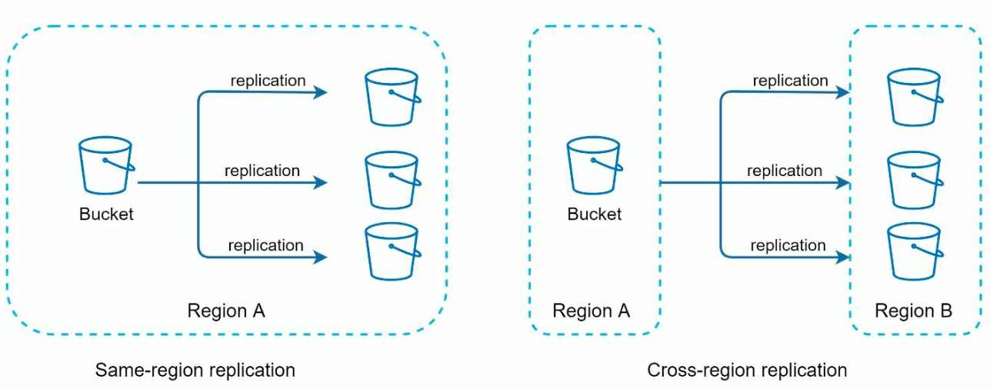
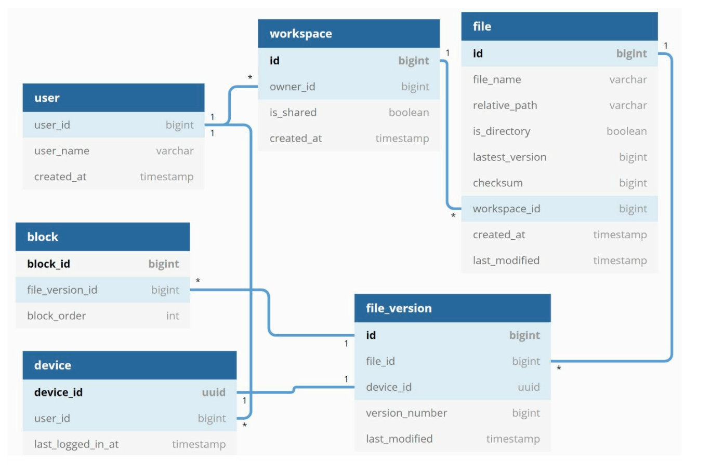
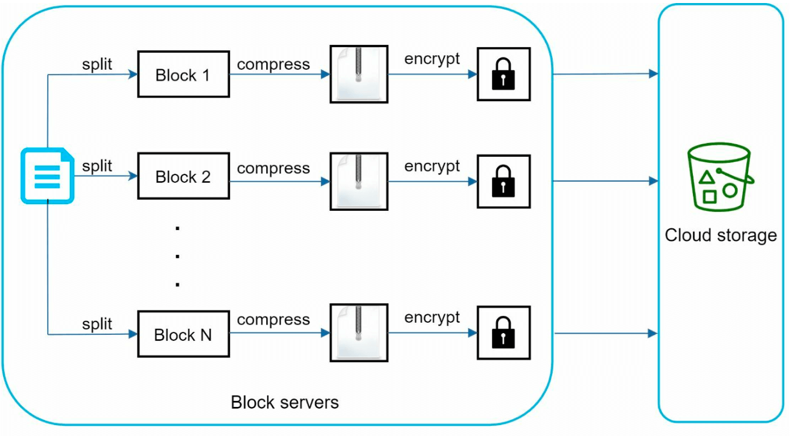

Chương 15: Thiết kế Google Drive
==================================

Giới thiệu
------------

Google Drive là dịch vụ lưu trữ và đồng bộ hóa tệp dựa trên đám mây cho phép người dùng lưu trữ, truy cập và chia sẻ tệp từ nhiều thiết bị khác nhau. Chương này thảo luận về việc thiết kế một hệ thống có thể scaling với các tính năng sau:

* **Tải lên và tải xuống tệp**
* **Đồng bộ hóa tệp trên các thiết bị**
* **Chia sẻ tệp**
* **Lịch sử sửa đổi tệp**
* **Thông báo về chỉnh sửa, xóa và chia sẻ**

---

Bước 1: Tìm hiểu vấn đề
----------------------------------

### Yêu cầu chính

#### Yêu cầu chức năng:

* Tải lên và tải xuống các tập tin.
* Đồng bộ tập tin trên nhiều thiết bị.
* Duy trì các bản sửa đổi tập tin.
* Cho phép chia sẻ tập tin với quyền.
* Gửi thông báo về chỉnh sửa, xóa và chia sẻ tệp.

#### Yêu cầu phi chức năng:

* **Độ tin cậy:** Việc mất dữ liệu là không thể chấp nhận được.
* **Tốc độ đồng bộ hóa nhanh:** Tránh sự thiếu kiên nhẫn của người dùng với việc đồng bộ hóa bị trì hoãn.
* **Hiệu quả bandwidth:** Giảm thiểu việc sử dụng dữ liệu không cần thiết.
* **Scalability:** Xử lý 10 triệu người dùng active (DAU) hàng ngày.
* **Availability cao:** Hoạt động liền mạch khi server bị lỗi hoặc sự cố mạng.

### Ràng buộc và giả định

* Người dùng nhận được **10 GB dung lượng trống**.
* Kích thước tệp tối đa: **10 GB**.
* Kích thước tải lên tệp trung bình: **500 KB**.
* Tần suất tải lên: **2 tệp mỗi ngày cho mỗi người dùng**.
* Tổng dung lượng cần thiết: **500 PB**.

---

Bước 2: Thiết kế cấp cao
-------------------------

### single server setup

Một thiết lập cơ bản bao gồm:

1. **Web Server:** Xử lý việc tải lên và tải xuống.
2. **Siêu dữ liệu Database:** để theo dõi siêu dữ liệu như dữ liệu người dùng, thông tin đăng nhập, thông tin tệp/
3. **Thư mục lưu trữ:** Chứa các tệp được sắp xếp theo không gian tên.

* Một trang web server và một thư mục có tên drive/ được thiết lập làm thư mục gốc để lưu trữ các tệp đã tải lên.
* Trong thư mục drive/ có danh sách các thư mục tên là namespaces.
* Mỗi không gian tên chứa tất cả các tệp được tải lên cho người dùng đó.
* Mỗi tệp hoặc thư mục có thể được xác định duy nhất bằng cách nối không gian tên và đường dẫn tương đối.

Thiết kế này đóng vai trò là điểm khởi đầu nhưng không phù hợp với scaling.

#### APIs

1. **Tải tệp lên Google Drive:** Hỗ trợ hai loại tải lên
   * Tải lên đơn giản: Được sử dụng khi kích thước tệp nhỏ.
   * Tiếp tục tải lên:
     + Điểm cuối: <https://api.example.com/files/upload?uploadType=resumable>
     + Gửi yêu cầu ban đầu để lấy lại URL có thể tiếp tục.
     + Upload dữ liệu và theo dõi trạng thái upload
     + Nếu quá trình tải lên bị xáo trộn, hãy tiếp tục tải lên.
2. **Tải xuống tệp từ Google Drive:** Để tải xuống tệp
   * Điểm cuối: <https://api.example.com/files/download>
3. **Nhận bản sửa đổi tệp:**
   * Điểm cuối: <https://api.example.com/files/list_revisions>

### Chuyển sang hệ thống phân tán

#### Cải tiến:

1. **Sharding:** Chia bộ nhớ trên servers dựa trên `user_id`.
2. **Amazon S3:** Sử dụng S3 để lưu trữ tệp dự phòng và có thể scaling với region replication chéo.

   
3. **Load Balancer:** Phân phối lưu lượng truy cập trên nhiều trang web servers.
4. **Siêu dữ liệu Database Replication:** Đảm bảo availability đến database sharding và replication.

#### Sync Conflicts:

Đối với một hệ thống lưu trữ lớn như Google Drive, sync conflicts thỉnh thoảng xảy ra.
Khi hai người dùng sửa đổi cùng một tệp hoặc thư mục cùng một lúc, xung đột sẽ xảy ra.

* Trong ví dụ người dùng 1 và người dùng 2 tries cập nhật cùng một tệp cùng lúc, nhưng tệp của người dùng 1 được hệ thống của chúng tôi xử lý trước.
* Hoạt động cập nhật của Người dùng 1 đã thành công nhưng người dùng 2 nhận được sync conflict.
* Hệ thống hiển thị cả hai replica của cùng một tệp: replica cục bộ của người dùng 2 và phiên bản mới nhất từ ​​server.
* Người dùng 2 có tùy chọn hợp nhất cả hai tệp hoặc ghi đè phiên bản này bằng phiên bản kia.

### Thiết kế cải tiến

1. **Tương tác người dùng:**: Người dùng truy cập ứng dụng thông qua trình duyệt hoặc ứng dụng di động.
2. **Block Servers:**

* Các tệp được chia thành **khối 4 MB** (kích thước tối đa) và được gán các giá trị băm duy nhất.
   * Các khối được lưu trữ độc lập trong bộ lưu trữ đám mây (ví dụ: Amazon S3).
   * Việc xây dựng lại tập tin liên quan đến việc nối các khối theo một thứ tự cụ thể.
3. **Lưu trữ đám mây:** Các khối được lưu trữ trong bộ lưu trữ đám mây dành cho scalability và redundancy.
4. **Kho lưu trữ lạnh:** Các tệp không hoạt động được chuyển sang kho lưu trữ lạnh để giảm chi phí.
5. **Load Balancer:** Phân phối đồng đều các yêu cầu giữa API servers để đảm bảo hoạt động hiệu quả.
6. **API Servers:**

   * Xử lý xác thực người dùng, quản lý hồ sơ và cập nhật siêu dữ liệu tệp.
   * Quản lý tất cả các quy trình công việc không tải lên.
7. **Siêu dữ liệu Database và Cache:**

   * Lưu trữ siêu dữ liệu cho người dùng, tệp, khối và phiên bản.
   * Siêu dữ liệu được truy cập thường xuyên cached để truy xuất nhanh hơn.
8. **Dịch vụ thông báo:**

   * **Hệ thống publisher/subscriber** thông báo cho clients về các thay đổi của tệp (thêm, chỉnh sửa, xóa).
   * Đảm bảo clients có thể lấy các bản cập nhật mới nhất.
9. **Hàng đợi sao lưu ngoại tuyến:** Lưu trữ tạm thời thông tin thay đổi tệp để clients ngoại tuyến để đồng bộ hóa khi trực tuyến trở lại.

---

Bước 3: Thiết kế Deep Dive
---------------

### Siêu dữ liệu Database

Một phiên bản được đơn giản hóa cao được hiển thị bên dưới vì nó chỉ bao gồm các bảng và trường quan trọng nhất.

#### Thiết kế lược đồ:

* **Bảng người dùng:** Lưu trữ hồ sơ và tùy chọn của người dùng.
* **Bảng tệp:** Duy trì siêu dữ liệu của tệp (ví dụ: kích thước, tên, đường dẫn).
* **Bảng khối:** Theo dõi các khối tệp để xây dựng lại tệp.
* **Bảng phiên bản tệp:** Lưu trữ lịch sử sửa đổi tệp.

---

### Luồng tải lên tệp

1. **Tải lên tệp:**
   * Tệp được chia thành các khối, được nén và mã hóa bởi block server.
   * Các khối được tải lên block servers và được lưu trữ trong S3.
2. **Tải lên siêu dữ liệu:**
   * Client gửi siêu dữ liệu đến API server.
   * Siêu dữ liệu được lưu trữ trong database với trạng thái `pending`.
3. **Hoàn thành:**
   * S3 kích hoạt lệnh gọi lại để cập nhật trạng thái tệp lên `uploaded`.
   * Dịch vụ thông báo thông báo cho người dùng có liên quan.

---

### Đồng bộ hóa tệp

1. **Đồng bộ hóa Delta:** Chỉ chuyển các khối đã sửa đổi thay vì toàn bộ tệp.

   
2. **Nén:** Các khối được nén bằng thuật toán nén tùy thuộc vào loại tệp.
3. **Giải quyết xung đột:**

* Phiên bản được xử lý đầu tiên sẽ thắng.
   * Các phiên bản xung đột được lưu riêng để người dùng giải quyết.

---

### Luồng tải xuống tệp

Luồng tải xuống được kích hoạt khi tệp được thêm hoặc chỉnh sửa ở nơi khác. Có hai cách mà client có thể biết:

* Nếu client A trực tuyến trong khi client khác thay đổi tệp, dịch vụ thông báo sẽ thông báo cho client A.
* Nếu client A ngoại tuyến trong khi client khác thay đổi tệp, dữ liệu sẽ được lưu vào cache. Khi client ngoại tuyến trực tuyến trở lại, nó sẽ lấy những thay đổi mới nhất.

Khi client biết tệp bị thay đổi, trước tiên, client sẽ yêu cầu siêu dữ liệu qua API servers, sau đó
tải xuống các khối để xây dựng tập tin.

1. **Kích hoạt:** Dịch vụ thông báo thông báo cho client về các bản cập nhật tệp.
2. **Tìm nạp siêu dữ liệu:** Client truy xuất siêu dữ liệu đã cập nhật qua API.
3. **Tải xuống khối:** Client tải xuống các khối được cập nhật từ block servers và xây dựng lại tệp.

---

### Dịch vụ thông báo

1. **Mục đích:** Cập nhật clients về các thay đổi của tệp.
2. **Cơ chế:** Triển khai **bỏ phiếu dài** cho các thông báo không đồng bộ.
3. **Ví dụ:** Khi một tệp được thêm, chỉnh sửa hoặc xóa, thông báo sẽ được đẩy tới tất cả clients có liên quan.

---

### Tối ưu hóa lưu trữ

1. **Khử trùng lặp:** Loại bỏ các khối trùng lặp ở cấp tài khoản bằng cách sử dụng so sánh dựa trên hàm băm.
2. **Chiến lược tạo phiên bản:**
   * Giới hạn số lượng bản sửa đổi được lưu.
   * Ưu tiên các phiên bản gần đây cho các tập tin được chỉnh sửa thường xuyên.
3. **Lưu trữ lạnh:** Di chuyển các tệp hiếm khi được truy cập sang giải pháp lưu trữ rẻ hơn (ví dụ: Amazon S3 Glacier).

---

### Xử lý lỗi

1. **Lỗi Load Balancer:** load balancer phụ trở thành active.
2. **Lỗi Block Server:** Các tác vụ đang chờ xử lý sẽ được gán lại cho servers khác.
3. **Lỗi siêu dữ liệu Database:**
   * Quảng cáo slave node lên master.
   * Chuyển hướng lưu lượng truy cập đến các replica còn lại.
4. **Lỗi lưu trữ đám mây:** Sử dụng region replication chéo để tìm nạp các tệp không có sẵn.
5. **Lỗi dịch vụ thông báo:** Clients kết nối lại với servers thay thế.