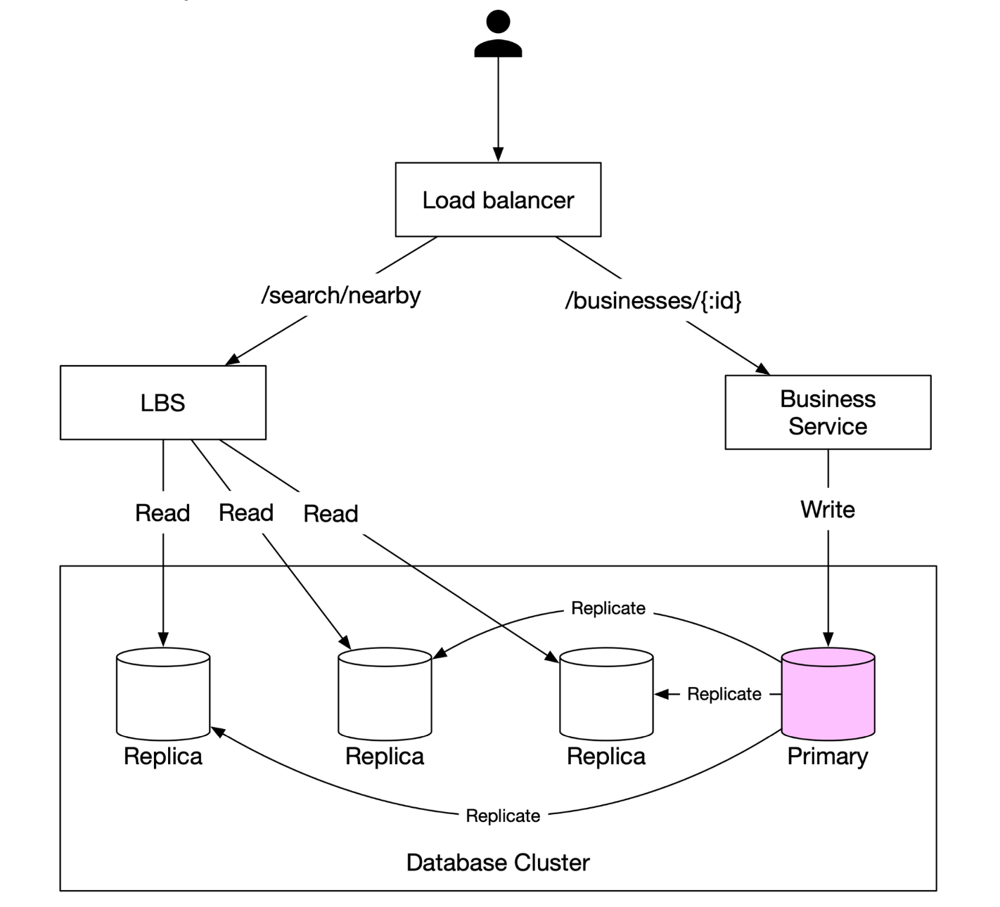
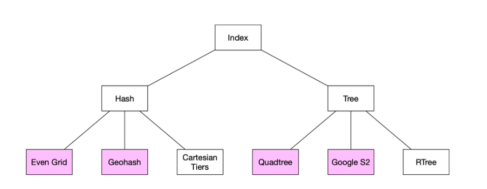
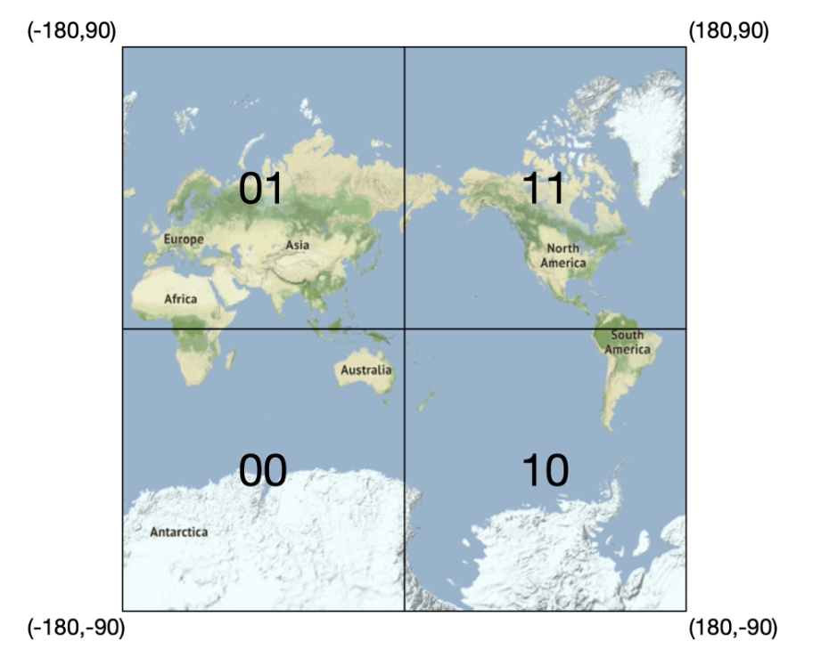
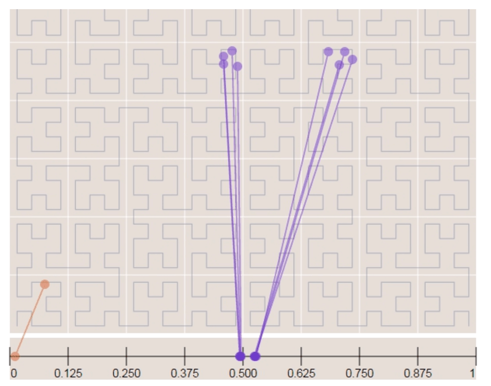
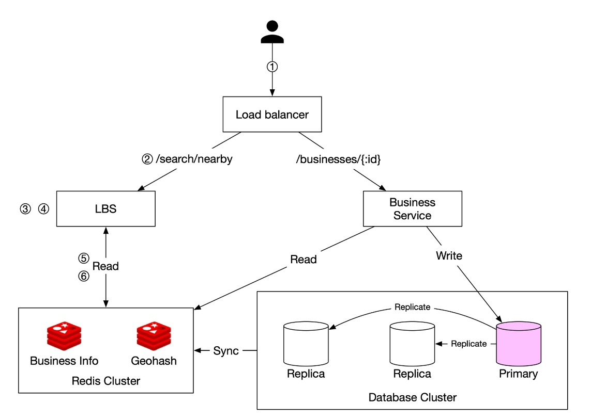

Chương 16: Thiết kế một dịch vụ lân cận
=========================================

Giới thiệu
------------

**Dịch vụ lân cận** được thiết kế để tìm các địa điểm lân cận, chẳng hạn như nhà hàng, khách sạn, trạm xăng và các cơ sở kinh doanh khác. Chức năng này được sử dụng trong các ứng dụng như **Google Maps** và **Yelp** để giúp người dùng khám phá các địa điểm trong bán kính xác định.

Bước 1: Tìm hiểu vấn đề và thiết lập phạm vi
--------------------------------------------------------

### **Yêu cầu chức năng**

1. **Tìm kiếm doanh nghiệp** dựa trên vị trí của người dùng (vĩ độ, kinh độ) và bán kính tìm kiếm.
2. **Cho phép chủ sở hữu doanh nghiệp** thêm, cập nhật hoặc xóa doanh nghiệp (không phải theo thời gian thực).
3. **Cung cấp thông tin chi tiết về doanh nghiệp** khi được yêu cầu.

### **Yêu cầu phi chức năng**

* **latency thấp**: Người dùng sẽ nhận được phản hồi nhanh chóng.
* **Quyền riêng tư dữ liệu**: Tuân thủ các quy định GDPR và CCPA.
* **availability cao**: Xử lý mức tăng đột biến vào giờ cao điểm ở những địa điểm đông đúc.

### **Ước tính mặt sau phong bì**

* **100 triệu người dùng active hàng ngày**.
* **200 triệu doanh nghiệp** trong hệ thống.
* **Tìm kiếm tính toán QPS**:
  + Người dùng thực hiện **5 lượt tìm kiếm mỗi ngày**.
  + **Tìm kiếm QPS** = (100M × 5) / 86.400 ≈ **5.000 QPS**.

---

Bước 2: Thiết kế cấp cao
-------------------------

### **Thiết kế API**

#### **Tìm kiếm các doanh nghiệp lân cận**

NHẬN /v1/tìm kiếm/gần đó

* **Thông số yêu cầu**:
  + `latitude`: Vĩ độ vị trí của người dùng.
  + `longitude`: Kinh độ vị trí của người dùng.
  + `radius`: Bán kính tìm kiếm (mặc định: 5000m).

#### **Kinh doanh APIs**

| Điểm cuối API | Mô tả |
| --- | --- |
| `GET /v1/businesses/{id}` | Lấy thông tin doanh nghiệp chi tiết |
| `POST /v1/businesses` | Thêm một doanh nghiệp mới |
| `PUT /v1/businesses/{id}` | Cập nhật thông tin doanh nghiệp |
| `DELETE /v1/businesses/{id}` | Xóa doanh nghiệp khỏi hệ thống |

### **Mô hình dữ liệu**

* Vì khối lượng đọc cao vì hai tính năng được sử dụng rất phổ biến nên database quan hệ như MySQL là phù hợp.
  + Tìm kiếm doanh nghiệp lân cận
  + Xem thông tin chi tiết của một doanh nghiệp

### **Lược đồ dữ liệu**

* Các bảng Database chính là bảng nghiệp vụ và bảng index không gian địa lý
* Bảng doanh nghiệp chứa thông tin chi tiết về doanh nghiệp.

### **Kiến trúc hệ thống cấp cao**

Hệ thống bao gồm hai phần: Dịch vụ dựa trên vị trí (LBS) và dịch vụ liên quan đến kinh doanh.



* **Dịch vụ dựa trên vị trí (LBS)**:
  + Xử lý các truy vấn tìm kiếm dựa trên vị trí.
  + Dịch vụ đọc nặng không có yêu cầu ghi.
  + QPS cao đặc biệt vào giờ cao điểm ở khu vực đông đúc và hệ thống là stateless.
* **Dịch vụ kinh doanh**: Giải quyết hai loại yêu cầu.
  + Chủ doanh nghiệp tạo, cập nhật hoặc xóa doanh nghiệp.
  + Khách hàng xem thông tin chi tiết về một doanh nghiệp.
* **Load Balancer**: routing lưu lượng truy cập đến dịch vụ LBS và Doanh nghiệp.
* **Database Cluster**:
  + Sử dụng **kiến trúc replica chính** cho khối lượng công việc đọc nhiều.
  + Có thể có sự khác biệt giữa dữ liệu được đọc bởi LBS và dữ liệu được ghi bởi database chính.
  + Sự mâu thuẫn này không phải là vấn đề vì thông tin doanh nghiệp không được cập nhật theo thời gian thực.

---

Bước 3: Thuật toán tìm nạp các doanh nghiệp lân cận
--------------------------------------------------

### **Tùy chọn 1: Tìm kiếm hai chiều (Phương pháp tiếp cận ngây thơ)**


Cách trực quan nhất là vẽ một vòng tròn có bán kính xác định trước và tìm tất cả các doanh nghiệp trong vòng tròn đó.

**Truy vấn SQL:**

```
SELECT business_id, latitude, longitude
FROM business
WHERE (latitude BETWEEN :lat - radius AND :lat + radius)
AND (longitude BETWEEN :long - radius AND :long + radius);
```

**Vấn đề:**

* **Không hiệu quả**: Yêu cầu quét toàn bộ database.
* **Giới hạn bởi chỉ số một chiều** (vĩ độ/kinh độ).

Một cải tiến tiềm năng là xây dựng index trên các cột kinh độ và vĩ độ, mặc dù điều này tốt hơn một chút nhưng vẫn rất chậm.

### Cách tiếp cận tốt hơn

* Vấn đề với cách tiếp cận cuối cùng là database index chỉ có thể tăng tốc độ tìm kiếm theo một chiều.
* Cách tiếp cận tối ưu là biểu diễn dữ liệu hai chiều thành một chiều bằng cách sử dụng chỉ mục không gian địa lý.

  + Hash: Lưới chẵn, Geo Hash
  + Cây: Quadtree, Google S2, RTree

### **Phương án 2: Lưới chia đều**


* **Chia thế giới thành các lưới có kích thước cố định**.
* **Vấn đề**: Phân bố kinh doanh không đồng đều (mật độ cao ở thành phố, thưa thớt ở nông thôn).

### **Tùy chọn 3: Geohash**

* Chia hành tinh thành bốn góc phần tư cùng với kinh tuyến gốc và đường xích đạo. Và sau đó chia mỗi lưới thành bốn lưới nhỏ hơn.
* Mỗi lưới có thể được biểu diễn bằng cách thay đổi bit kinh độ và vĩ độ b/w.
* Lặp lại phân mục này

  
  
* **Mã hóa vĩ độ và kinh độ thành một chuỗi chữ và số**. Nó có 12 độ chính xác (cấp độ)
* **Cấu trúc lưới phân cấp** cho phép tìm kiếm hiệu quả.
* Độ chính xác phù hợp được chọn bằng cách sử dụng độ dài geohash tối thiểu theo bảng.
  
* Geohash đảm bảo rằng tiền tố được chia sẻ giữa hai geohash càng dài thì chúng càng gần nhau.
* **Thử thách**:
  

+ **Vấn đề về ranh giới** (các doanh nghiệp gần rìa lưới có thể bị loại trừ).
    - Hai vị trí có thể rất gần nhau nhưng không có chung tiền tố (có thể ở phía bên kia đường xích đạo)
    - Hai vị trí có thể có tiền tố chung dài nhưng thuộc về các geohash khác nhau.
  + Giải pháp: Cần tìm kiếm các lưới lân cận.

### **Phương án 4: Cây tứ giác**

Cây tứ giác là cấu trúc dữ liệu cây phân chia đệ quy không gian hai chiều thành bốn góc phần tư, với mỗi node bên trong có chính xác bốn phần tử con, đại diện cho bốn regions phụ của không gian.

* Cây tứ giác là cấu trúc dữ liệu trong bộ nhớ và nó chạy trên mỗi LBS server và được xây dựng dựa trên thời gian khởi động server.


* node gốc được chia đệ quy thành 4 góc phần tư cho đến khi không còn nodes nào có nhiều hơn x số doanh nghiệp (trong trường hợp này là 100).


* Quadtree index không chiếm quá nhiều bộ nhớ (thường tính bằng GB) và có thể dễ dàng nhét vừa một server.
* Vì độ phức tạp về thời gian để xây dựng cây là nlogn nên có thể mất vài phút để xây dựng cây.
* **Hiệu quả cho k truy vấn tìm kiếm gần nhất** (ví dụ: tìm trạm xăng gần nhất).


#### Cân nhắc về hoạt động

* Đối với khoảng 200 triệu doanh nghiệp, có thể mất vài phút để xây dựng một phần tư tại thời điểm bắt đầu server.
* Mặc dù cây tứ giác được xây dựng nhưng nó không thể phục vụ lưu lượng truy cập, do đó, bản phát hành mới sẽ được triển khai dần dần cho tập hợp con của servers.
* Khi cập nhật một doanh nghiệp hoặc thêm một doanh nghiệp mới, cách tiếp cận dễ dàng nhất là xây dựng lại dần dần tứ giác. (Dẫn đến rất nhiều sự vô hiệu hóa cache)
* Cũng có thể cập nhật cây phần tư một cách nhanh chóng nhưng việc thực hiện phức tạp hơn. (Cần cơ chế khóa)

### **Tùy chọn 5: Google S2**

Nó ánh xạ một hình cầu tới 1D index dựa trên đường cong Hilbert. Hai điểm gần nhau trên đường cong Hilbert nằm gần nhau trong không gian 1D.




* **Chia trái đất thành các ô nhỏ bằng đường cong Hilbert**.
* Tuyệt vời cho việc định vị địa lý vì nó có thể bao phủ các khu vực tùy ý với các cấp độ khác nhau.
* Định vị địa lý cũng cho phép xác định các tham số xung quanh khu vực quan tâm.
* Một ưu điểm khác là thay vì có mức độ chính xác cố định, chúng ta có thể chỉ định các ô tối thiểu, mức tối đa và tối đa trong S2.

So sánh đánh đổi
-------------------

#### Geohash

* Dễ dàng sử dụng và thực hiện. Không cần xây dựng/xây dựng lại cây
* Hỗ trợ kết quả bán kính cố định
* Cập nhật index thật dễ dàng.
* Không thể tự động điều chỉnh kích thước lưới dựa trên mật độ dân số.

#### Tứ giác

* Khó thực hiện hơn một chút.
* Hỗ trợ tìm nạp các doanh nghiệp gần nhất.
* Có thể tự động điều chỉnh kích thước lưới dựa trên mật độ dân số.
* Việc cập nhật index phức tạp hơn vì có thể cần phải xây dựng lại toàn bộ cây.

---

Bước 4: Scaling Chiến lược Database và Caching
--------------------------------------------------

### **Scaling Bảng doanh nghiệp**

* **Sharding theo ID doanh nghiệp** đảm bảo phân phối dữ liệu đồng đều.
* Chúng tôi có các hàng riêng biệt cho từng doanh nghiệp trong bảng.

| Geohash | ID doanh nghiệp |
| --- | --- |
| 9q9hvu | 343 |
| 9q9hvu | 347 |
| 9q9hvu | 112 |

### **Scaling Index không gian địa lý**

* Có thể không phù hợp với bảng geohash. Trong trường hợp này, mọi thứ đều có thể vừa với single server nên không có lý do kỹ thuật nào cho sharding.
* Cách tiếp cận tốt hơn là có read-replicas để hỗ trợ tải đọc.

---

### **Chiến lược Cache**

Lựa chọn khóa cache rõ ràng nhất là tọa độ vị trí, tuy nhiên nó có một số vấn đề:

* Tọa độ vị trí từ gps không chính xác.
* Người dùng có thể di chuyển khiến tọa độ vị trí thay đổi.
* Một chìa khóa tốt hơn là geohash.

| Khóa Cache | Giá trị Cache |
| --- | --- |
| `geohash` | Danh sách ID doanh nghiệp trong lưới đó |
| `business_id` | Thông tin chi tiết về doanh nghiệp (tên, địa chỉ, đánh giá, v.v.) |

---

Bước 5: Chiến lược triển khai và kiến trúc cuối cùng
--------------------------------------------------

### **Vùng Region và Availability**

* Triển khai LBS và Dịch vụ kinh doanh **trên nhiều regions**.

### **Xử lý cập nhật theo thời gian thực**

* **Thông tin cập nhật về doanh nghiệp được xử lý hàng loạt hàng ngày**.

### **Kiến trúc hệ thống cuối cùng**



Thuật toán cuối cùng này trông như thế này:

Các bước để truy xuất các doanh nghiệp lân cận
-----------------------------------

1. **Yêu cầu của người dùng:**

   * Người dùng tìm kiếm nhà hàng trong phạm vi **500 mét**.
   * client gửi **vĩ độ (37,776720), kinh độ (-122,416730) và bán kính (500m)** tới **load balancer**.
2. **Chuyển tiếp yêu cầu:**

* **load balancer (LB)** chuyển tiếp yêu cầu tới **Dịch vụ dựa trên vị trí (LBS)**.
3. **Tính toán Geohash:**

   * LBS xác định **độ dài geohash** phù hợp với bán kính.
   * Sử dụng bảng tham chiếu **500m tương ứng với chiều dài geohash = 6**.
4. **Tìm nạp Geohash lân cận:**

   * LBS tính toán **geohashe lân cận** để bao gồm các khu vực lân cận.
   * Kết quả là một danh sách:

     ```
     [my_geohash, neighbor1_geohash, neighbor2_geohash, ..., neighbor8_geohash]
     ```
5. **Tìm nạp ID doanh nghiệp từ Redis:**

   * Đối với mỗi geohash trong danh sách, LBS truy vấn **Geohash Redis server** để tìm nạp **ID doanh nghiệp**.
   * Truy vấn song song được sử dụng để giảm thiểu latency.
6. **Truy xuất & Xếp hạng Doanh nghiệp:**

   * LBS tìm nạp **chi tiết đầy đủ về doanh nghiệp** từ **Thông tin doanh nghiệp Redis server**.
   * Các doanh nghiệp được **sắp xếp theo khoảng cách** tính từ vị trí của người dùng.
   * **Kết quả được xếp hạng** được gửi trở lại client.

Tối ưu hóa chính
------------------

* **Cuộc gọi song song Redis**: Giảm response time.
* **Lập chỉ mục Geohash**: Đảm bảo các truy vấn không gian hiệu quả.
* **Caching**: Tăng tốc độ tra cứu và truy xuất dữ liệu doanh nghiệp.

Phương pháp này đảm bảo truy xuất **latency thấp, có thể scaling** các doanh nghiệp gần vị trí của người dùng.

---

### **Chọn phương pháp lập chỉ mục tốt nhất**

| Phương pháp lập chỉ mục | Ưu điểm | Nhược điểm |
| --- | --- | --- |
| **Geohash** | Dễ thực hiện, hiệu quả cho việc tìm kiếm vùng lân cận | Các vấn đề về ranh giới, kích thước lưới cố định |
| **Cây tứ giác** | Tự động điều chỉnh theo mật độ, hỗ trợ truy vấn k gần nhất | Phức tạp hơn, yêu cầu cân bằng lại cây |
| **Google S2** | Tính năng định vị địa lý nâng cao, được sử dụng trong Google Maps | Khó thực hiện hơn |

---

Tài liệu tham khảo
----------

1. [Thuật toán Geohash](https://www.movable-type.co.uk/scripts/geohash.html)
2. [Lập chỉ mục bốn cây] (https://en.wikipedia.org/wiki/Quadtree)
3. [Hình học Google S2](https://s2geometry.io/)