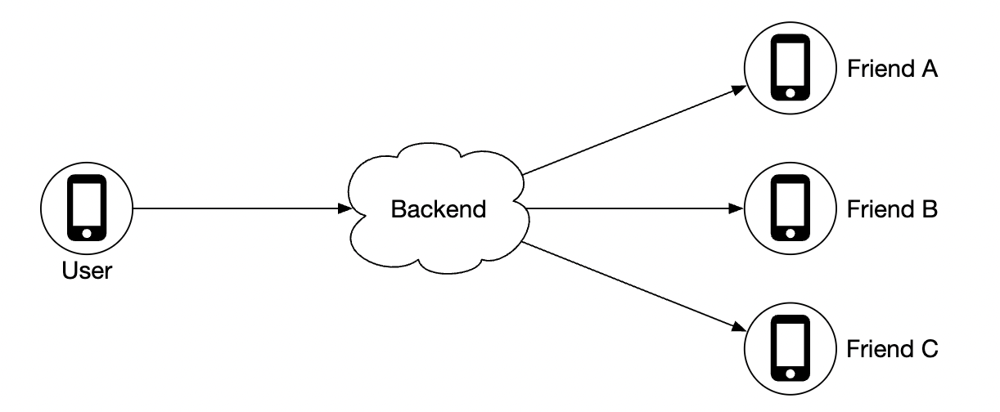
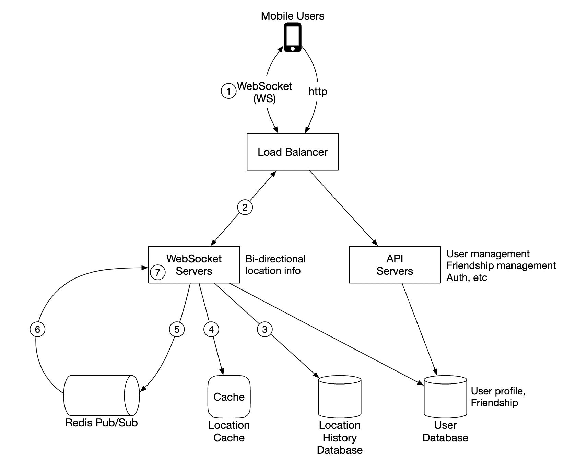
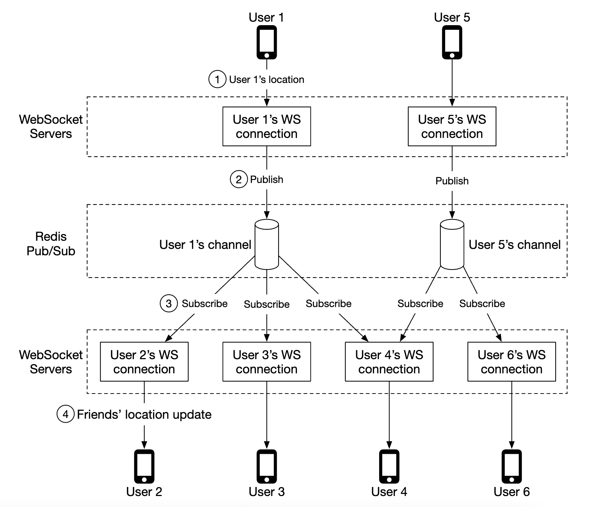
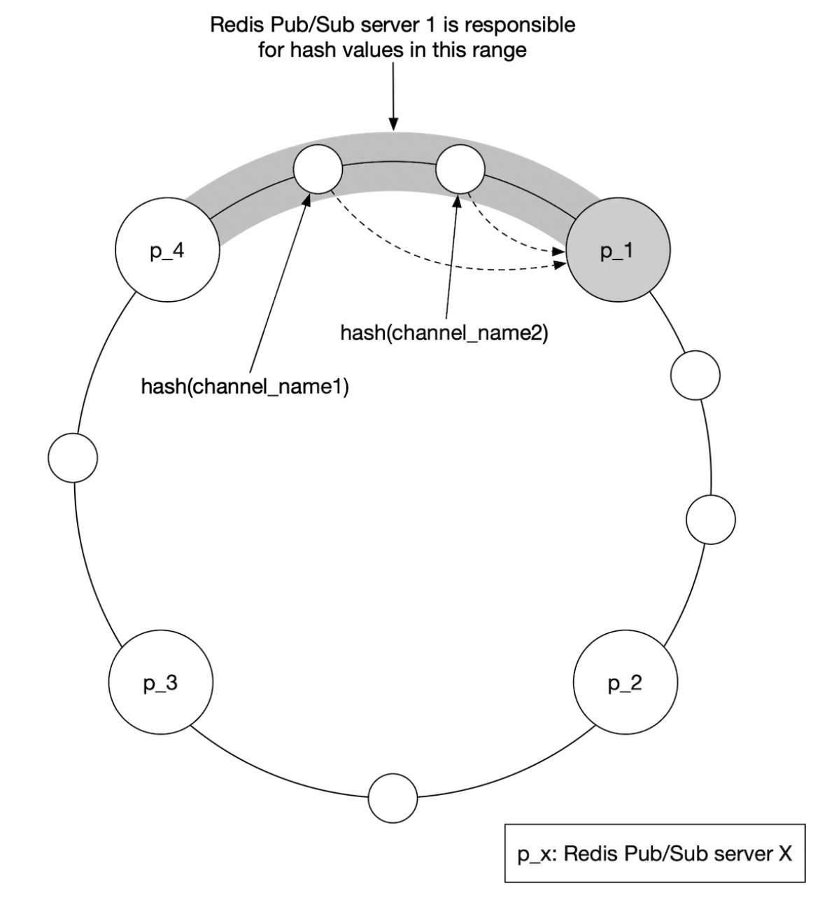
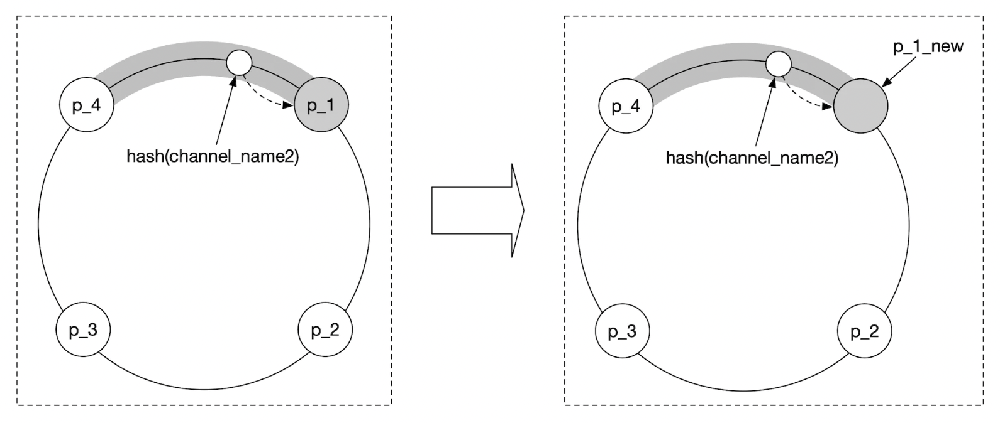

Chương 17: Bạn bè xung quanh
=============================

Giới thiệu
------------

Chương này tập trung vào việc thiết kế phần phụ trợ có thể scaling cho một ứng dụng cho phép người dùng chia sẻ vị trí của họ và khám phá những người bạn **ở gần**.

Sự khác biệt chính với chương vùng lân cận là trong vấn đề này, **địa điểm liên tục thay đổi**, trong khi ở vấn đề đó, địa chỉ doanh nghiệp ít nhiều vẫn giữ nguyên.

---

Bước 1: Hiểu vấn đề và thiết lập phạm vi thiết kế
---------------------------------------------------------

Một số câu hỏi thúc đẩy cuộc phỏng vấn:

* C: Khoảng cách địa lý gần được coi là "gần" như thế nào?
* I: 5 dặm, con số này phải được cấu hình
* C: Khoảng cách được tính bằng khoảng cách đường thẳng so với việc tính đến ví dụ như con sông ở giữa bạn bè
* Tôi: Vâng, đó là một giả định hợp lý
* C: Ứng dụng có bao nhiêu người dùng?
* Tôi: 1 tỷ người dùng và 10% trong số họ sử dụng tính năng kết bạn ở gần
* C: Chúng ta có cần lưu trữ lịch sử vị trí không?
* Tôi: Có, nó có thể có giá trị, ví dụ như học máy
* C: Chúng ta có thể cho rằng những người bạn không hoạt động sẽ biến mất khỏi tính năng này sau 10 phút không?
* Tôi: Vâng
* C: Chúng ta có cần lo lắng về GDPR, v.v. không?
* Tôi: Không, vì sự đơn giản

### **Yêu cầu về chức năng**

* Người dùng có thể nhìn thấy bạn bè ở gần trên ứng dụng di động của họ. Mỗi người bạn có khoảng cách và dấu thời gian, cho biết thời điểm vị trí được cập nhật
* Danh sách bạn bè lân cận sẽ được cập nhật vài giây một lần

### **Yêu cầu phi chức năng**

* **latency thấp**: điều quan trọng là nhận được cập nhật vị trí mà không bị chậm trễ quá nhiều
* **Độ tin cậy**: Việc mất điểm dữ liệu đôi khi có thể chấp nhận được nhưng hệ thống thường có sẵn
* **Eventual consistency**: Kho dữ liệu vị trí không cần strong consistency. Có thể chấp nhận được latency vài giây trong việc nhận dữ liệu vị trí ở các replica khác nhau

### **Mặt sau phong bì**

Một số ước tính để xác định quy mô tiềm năng:

* Bạn bè ở gần là bạn bè trong bán kính 5 dặm
* Khoảng thời gian làm mới vị trí là 30 giây. Tốc độ đi bộ của con người chậm nên không cần cập nhật vị trí quá thường xuyên.
* Trung bình có 100 triệu người dùng sử dụng tính năng này mỗi ngày \w 10% người dùng đồng thời, tức là 10 triệu
* Trung bình một người dùng có 400 người bạn, tất cả đều sử dụng tính năng kết bạn ở gần
* Ứng dụng hiển thị 20 người bạn ở gần trên mỗi trang
* **Cập nhật vị trí QPS** = 10 triệu / 30 == ~334k cập nhật mỗi giây

---

Bước 2: Đề xuất thiết kế cấp cao và nhận được sự đồng ý
------------------------------------------------

Trước khi khám phá API và thiết kế mô hình dữ liệu, chúng ta sẽ nghiên cứu giao thức truyền thông mà chúng ta sẽ sử dụng vì nó ít phổ biến hơn mô hình truyền thông phản hồi yêu cầu truyền thống.

### **Thiết kế cao cấp**

Ở cấp độ cao, chúng tôi muốn thiết lập việc truyền thông điệp hiệu quả giữa các đồng nghiệp. Điều này có thể được thực hiện thông qua giao thức ngang hàng, nhưng điều đó không thực tế đối với một ứng dụng di động có kết nối không ổn định và hạn chế tiêu thụ điện năng chặt chẽ.

Một cách tiếp cận thực tế hơn là sử dụng phần phụ trợ được chia sẻ làm cơ chế gửi đi cho những người bạn mà bạn muốn tiếp cận:

Phần phụ trợ làm gì?

* Nhận thông tin cập nhật vị trí từ tất cả người dùng active
* Đối với mỗi lần cập nhật vị trí, hãy tìm tất cả người dùng active sẽ nhận được và chuyển tiếp cho họ
* Không chuyển tiếp dữ liệu vị trí nếu khoảng cách giữa bạn bè vượt quá ngưỡng được định cấu hình

Điều này nghe có vẻ đơn giản nhưng thách thức đặt ra là thiết kế hệ thống cho quy mô mà chúng tôi đang vận hành.

Lúc đầu, chúng ta sẽ bắt đầu với một thiết kế đơn giản hơn và thảo luận về cách tiếp cận nâng cao hơn trong phần tìm hiểu sâu:

* **Load balancer**: phân bổ lưu lượng truy cập trên rest API servers cũng như ổ cắm web hai chiều servers
* **Rest API servers**: xử lý các tác vụ phụ như quản lý bạn bè, cập nhật hồ sơ, v.v.
* **Websocket servers**: stateful servers, chuyển tiếp yêu cầu cập nhật vị trí tới clients tương ứng. Nó cũng quản lý việc gieo mầm client di động với các vị trí bạn bè gần đó khi khởi tạo (sẽ thảo luận chi tiết sau).
* **Vị trí Redis cache**: được sử dụng để lưu trữ dữ liệu vị trí gần đây nhất cho mỗi người dùng active. Có một bộ TTL trên mỗi mục trong cache. Khi TTL hết hạn, người dùng không còn là active nữa và dữ liệu của họ sẽ bị xóa khỏi cache.
* **Người dùng database**: lưu trữ dữ liệu người dùng và tình bạn. Có thể sử dụng NoSQL hoặc database quan hệ cho mục đích này.
* **Lịch sử vị trí database**: lưu trữ lịch sử dữ liệu vị trí của người dùng, không nhất thiết phải được sử dụng trực tiếp trong tính năng bạn bè ở gần mà thay vào đó được sử dụng để theo dõi dữ liệu lịch sử cho mục đích phân tích
* **Redis pubsub**: được sử dụng như một bus tin nhắn nhẹ cho phép topics khác nhau cho mỗi kênh người dùng để cập nhật vị trí.

Trong ví dụ trên, websocket servers đăng ký các kênh cho người dùng được kết nối với họ và chuyển tiếp cập nhật vị trí bất cứ khi nào họ nhận được chúng cho người dùng phù hợp.

### **Cập nhật vị trí định kỳ**

Dưới đây là cách hoạt động của luồng cập nhật vị trí định kỳ:

* client di động gửi bản cập nhật vị trí tới load balancer
* Load balancer chuyển tiếp cập nhật vị trí tới kết nối liên tục của websocket server cho client đó
* Websocket server lưu dữ liệu vị trí vào lịch sử vị trí database
* Dữ liệu vị trí được cập nhật tại vị trí cache. Websocket server cũng lưu dữ liệu vị trí vào bộ nhớ để tính toán khoảng cách tiếp theo cho người dùng đó
* Websocket server xuất bản dữ liệu vị trí trong kênh của người dùng thông qua redis pub sub
* Cập nhật vị trí Redis pubsub broadcasts cho tất cả subscribers cho kênh người dùng đó, tức là servers chịu trách nhiệm về bạn bè của người dùng đó
* Ổ cắm web đã đăng ký servers nhận cập nhật vị trí, tính toán xem bản cập nhật sẽ được gửi đến người dùng nào và gửi nó

Đây là phiên bản chi tiết hơn của cùng một quy trình:

Trung bình, sẽ có 40 thông tin cập nhật vị trí được chuyển tiếp vì một người dùng có trung bình 400 người bạn và 10% trong số họ trực tuyến cùng một lúc.

### **Thiết kế API**

Các quy trình Websocket chúng tôi sẽ cần hỗ trợ:

* cập nhật vị trí định kỳ - người dùng gửi dữ liệu vị trí tới websocket server
* client nhận cập nhật vị trí - server gửi dữ liệu vị trí và dấu thời gian của bạn bè
* khởi tạo websocket client - client gửi vị trí người dùng, server gửi lại dữ liệu vị trí bạn bè ở gần
* Đăng ký kết bạn mới - websocket server gửi ID bạn bè trên thiết bị di động client có nhiệm vụ theo dõi, ví dụ: khi người bạn xuất hiện trực tuyến lần đầu tiên
* Hủy đăng ký một người bạn - websocket server gửi ID bạn bè, client trên thiết bị di động được cho là sẽ hủy đăng ký do ví dụ: bạn bè ngoại tuyến

HTTP API - tải trọng yêu cầu/phản hồi truyền thống cho các trách nhiệm phụ trợ.

### **Mô hình dữ liệu**

* Vị trí cache sẽ lưu trữ ánh xạ giữa `user_id` và `lat,long,timestamp`. Redis là một lựa chọn tuyệt vời cho cache này vì chúng tôi chỉ quan tâm đến vị trí hiện tại và nó hỗ trợ loại bỏ TTL mà chúng tôi cần cho trường hợp sử dụng của mình.
* Bảng lịch sử vị trí lưu trữ cùng một dữ liệu nhưng trong bảng quan hệ \w bốn cột nêu trên. Cassandra có thể được sử dụng cho dữ liệu này vì nó được tối ưu hóa cho các tải nặng ghi.

---

Bước 3: Thiết kế Deep Dive
---------------

Hãy thảo luận về cách chúng tôi scaling thiết kế cấp cao để nó hoạt động ở quy mô mà chúng tôi đang nhắm mục tiêu.

### **Mỗi thành phần có quy mô như thế nào?**

* **API servers**: có thể dễ dàng scaling thông qua các nhóm tự động điều chỉnh quy mô và sao chép các phiên bản server
* **Websocket servers**: chúng tôi có thể dễ dàng scaling ws servers, nhưng chúng tôi cần đảm bảo rằng chúng tôi tắt các kết nối hiện có một cách nhẹ nhàng khi phá bỏ server. Ví dụ: chúng ta có thể đánh dấu server là "cạn kiệt" trong load balancer và ngừng gửi kết nối tới nó, trước khi cuối cùng bị xóa khỏi nhóm server
* **Khởi tạo Client**: khi client lần đầu kết nối với server, nó sẽ tìm nạp bạn bè của người dùng, đăng ký kênh của họ trên redis pubsub, tìm nạp vị trí của họ từ cache và cuối cùng chuyển tiếp tới client
* **Người dùng database**: Chúng tôi có thể shard database dựa trên user\_id. Cũng có thể hợp lý khi hiển thị dữ liệu người dùng/bạn bè thông qua một dịch vụ chuyên dụng và API, được quản lý bởi một nhóm chuyên trách
* **Vị trí cache**: Chúng ta có thể dễ dàng shard cache bằng cách quay vòng một số redis nodes. Ngoài ra, TTL đặt giới hạn về bộ nhớ tối đa mà chúng tôi có thể sử dụng tại một thời điểm. Nhưng chúng tôi vẫn muốn xử lý tải ghi lớn
* **Redis pub/sub server**: chúng tôi tận dụng thực tế là không tiêu tốn bộ nhớ nếu có các kênh được khởi tạo nhưng không được sử dụng. Do đó, chúng tôi có thể phân bổ trước các kênh cho tất cả người dùng sử dụng tính năng bạn bè ở gần để tránh phải xử lý các vấn đề, chẳng hạn như hiển thị kênh mới khi người dùng trực tuyến và thông báo cho websocket active servers

### **Tìm hiểu sâu về Scaling về thành phần phụ/pub redis**

Chúng tôi sẽ cần khoảng 200gb bộ nhớ để duy trì tất cả các kênh pub/sub. Điều này có thể đạt được bằng cách sử dụng 2 redis servers với dung lượng 100gb mỗi cái.

Vì chúng tôi cần đẩy ~14 triệu lượt cập nhật vị trí mỗi giây, tuy nhiên, chúng tôi sẽ cần ít nhất 140 redis servers để xử lý lượng tải đó, giả sử rằng single server có thể xử lý ~100 nghìn lần đẩy mỗi giây.

Do đó, chúng tôi sẽ cần redis server cluster được phân phối để xử lý tải CPU cường độ cao.

Để hỗ trợ redis cluster được phân phối, chúng tôi cần sử dụng thành phần khám phá dịch vụ, chẳng hạn như zookeeper hoặc etcd, để theo dõi servers nào đang hoạt động.

Những gì chúng ta cần mã hóa trong thành phần khám phá dịch vụ là dữ liệu này:

Ổ cắm web servers sử dụng dữ liệu được mã hóa đó, được tìm nạp từ zookeeper để xác định vị trí của một kênh cụ thể. Để đạt hiệu quả, dữ liệu hash ring có thể cached trên mỗi websocket server.

Xét về scaling, server cluster lên hoặc xuống, chúng tôi có thể thiết lập công việc hàng ngày để scaling cluster khi cần dựa trên dữ liệu lưu lượng truy cập lịch sử. Chúng tôi cũng có thể cung cấp quá mức cluster để xử lý tải tăng đột biến.

redis cluster có thể được coi là bộ lưu trữ stateful server vì có một số trạng thái được duy trì cho các kênh và cần phối hợp với subscribers để chúng chuyển sang nodes mới được cung cấp trong cluster.

Chúng tôi phải lưu ý một số vấn đề tiềm ẩn trong quá trình vận hành scaling:

* Sẽ có rất nhiều yêu cầu đăng ký lại từ ổ cắm web servers do các kênh được di chuyển xung quanh
* Một số cập nhật vị trí có thể bị bỏ sót trong clients trong quá trình hoạt động, điều này có thể chấp nhận được đối với sự cố này, nhưng chúng ta vẫn nên hạn chế tối đa để nó không xảy ra. Hãy cân nhắc thực hiện thao tác đó khi lưu lượng truy cập ở mức thấp nhất trong ngày.
* Chúng tôi có thể tận dụng consistent hashing để giảm thiểu số lượng kênh được di chuyển trong trường hợp thêm/xóa servers

### **Thêm/xóa bạn bè**

Bất cứ khi nào một người bạn được thêm/xóa, websocket server chịu trách nhiệm về người dùng bị ảnh hưởng cần đăng ký/hủy đăng ký kênh của người bạn đó.

Vì tính năng "bạn bè ở gần" là một phần của ứng dụng lớn hơn nên chúng tôi có thể giả định rằng cuộc gọi lại trên phía client di động có thể được đăng ký bất cứ khi nào có bất kỳ sự kiện nào xảy ra và client sẽ gửi tin nhắn tới websocket server để thực hiện hành động thích hợp.

### **Người dùng có nhiều bạn bè**

Chúng ta có thể đặt giới hạn về tổng số bạn bè mà một người có thể có, ví dụ: facebook có giới hạn tối đa là 5000 người bạn.

Websocket server xử lý người dùng "cá voi" có thể có tải cao hơn ở phía cuối, nhưng miễn là chúng ta có đủ web socket servers thì chúng ta sẽ ổn.

### **Người ngẫu nhiên ở gần**

Điều gì sẽ xảy ra nếu người phỏng vấn muốn cập nhật thiết kế để bao gồm một tính năng mà đôi khi chúng ta có thể thấy một người ngẫu nhiên xuất hiện trên bản đồ bạn bè ở gần chúng ta?

Một cách để xử lý vấn đề này là xác định nhóm kênh pubsub, dựa trên geohash:

Bất kỳ ai trong geohash đều đăng ký kênh thích hợp để nhận thông tin cập nhật về vị trí cho người dùng ngẫu nhiên:

Chúng tôi cũng có thể đăng ký một số geohash để xử lý các trường hợp ai đó ở gần nhưng ở trong một geohash giáp ranh:

### **Thay thế cho Redis pub/sub**

Một giải pháp thay thế cho việc sử dụng Redis cho pub/sub là tận dụng Erlang - ngôn ngữ lập trình chung, được tối ưu hóa cho các ứng dụng điện toán phân tán.

Với nó, chúng ta có thể tạo ra hàng triệu quy trình nhỏ, liên lạc với nhau. Chúng tôi có thể xử lý cả kết nối websocket và kênh pub/sub trong ứng dụng erlang được phân phối.

Tuy nhiên, một thách thức khi sử dụng Erlang là đây là ngôn ngữ lập trình thích hợp và khó có thể tìm được nhà phát triển erlang mạnh.

---

Bước 4: Kết thúc
---------------

Chúng tôi đã thiết kế thành công một hệ thống hỗ trợ các tính năng của bạn bè ở gần.

Thành phần cốt lõi:

* **Web socket servers**: giao tiếp thời gian thực giữa client và server
* **Redis**: đọc và ghi nhanh dữ liệu vị trí + kênh pub/sub

Chúng tôi cũng đã khám phá cách scaling api servers yên tĩnh, websocket servers, lớp dữ liệu, redis pub/sub servers và chúng tôi cũng đã khám phá một giải pháp thay thế cho việc sử dụng Redis Pub/Sub. Chúng tôi cũng đã khám phá tính năng "người ở gần ngẫu nhiên".