Chương 18: Google Maps
==========================

Giới thiệu
------------

Chúng tôi sẽ thiết kế một phiên bản đơn giản của **Google Maps**.

Một số sự thật về google maps:

* Bắt đầu vào năm 2005
* Cung cấp các dịch vụ khác nhau - hình ảnh vệ tinh, bản đồ đường phố, điều kiện giao thông thời gian thực, quy hoạch tuyến đường
* Đến năm 2021, có 1 tỷ người dùng active hàng ngày, phủ sóng 99% thế giới, 25 triệu lượt cập nhật thông tin vị trí theo thời gian thực hàng ngày

---

Bước 1: Hiểu vấn đề và thiết lập phạm vi thiết kế
---------------------------------------------------------

Mẫu hỏi đáp giữa ứng viên và người phỏng vấn:

* C: Chúng tôi đang xử lý bao nhiêu người dùng active hàng ngày?
* Tôi: 1 tỷ DAU
* C: Chúng ta nên tập trung vào những tính năng nào?
* I: Cập nhật vị trí, điều hướng, ETA, hiển thị bản đồ
* C: Dữ liệu đường lớn đến mức nào? Chúng ta có quyền truy cập vào nó không?
* I: Chúng tôi lấy dữ liệu đường bộ từ nhiều nguồn khác nhau, đó là TB dữ liệu thô
* C: Chúng ta có nên xem xét điều kiện giao thông không?
* Tôi: Có, chúng ta nên ước tính thời gian chính xác
* C: Còn các phương thức di chuyển khác nhau - đi bộ, đi xe đạp, lái xe thì sao?
* Tôi: Chúng ta nên ủng hộ những điều đó
* C: Còn chỉ đường nhiều điểm dừng thì sao?
* Tôi: Đừng tập trung vào vấn đề đó trong phạm vi cuộc phỏng vấn
* C: Địa điểm kinh doanh và hình ảnh?
* Tôi: Câu hỏi hay đấy, nhưng không cần phải cân nhắc đâu

Chúng tôi sẽ tập trung vào ba tính năng chính - cập nhật vị trí người dùng, dịch vụ điều hướng bao gồm ETA, hiển thị bản đồ.

### **Yêu cầu phi chức năng**

* **Độ chính xác**: người dùng không được nhận chỉ đường sai
* **Điều hướng mượt mà**: Người dùng sẽ trải nghiệm kết xuất bản đồ mượt mà
* **Sử dụng dữ liệu và pin**: Client nên sử dụng ít dữ liệu và pin nhất có thể. Quan trọng đối với thiết bị di động.
* Yêu cầu chung về availability và scalability

### **Bản đồ 101**

Trước khi bắt đầu thiết kế, có một số khái niệm liên quan đến bản đồ mà chúng ta nên hiểu.

#### Hệ thống định vị

Thế giới là một hình cầu, quay quanh trục của nó. Các vị trí được xác định theo vĩ độ (bạn ở bao xa về phía bắc/nam) và kinh độ (bạn ở bao xa về phía đông/tây):


#### Chuyển từ 3D sang 2D

Quá trình dịch các điểm từ mặt phẳng 3D sang 2D được gọi là "chiếu bản đồ".

Có nhiều cách khác nhau để làm điều đó và mỗi cách đều có ưu và nhược điểm. Hầu như tất cả đều bóp méo hình học thực tế.

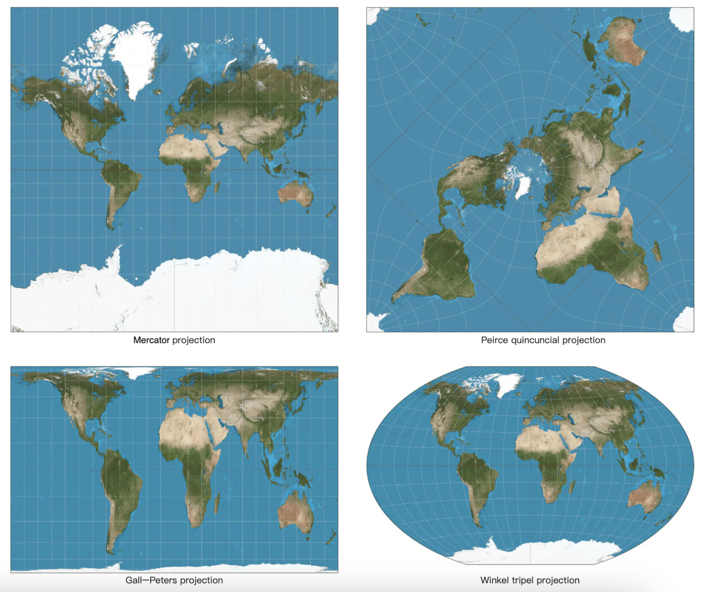

Bản đồ của Google đã chọn một phiên bản sửa đổi của phép chiếu Mercator có tên là "Web Mercator".

#### Mã hóa địa lý

Mã hóa địa lý là quá trình chuyển đổi địa chỉ thành tọa độ địa lý.

Quá trình ngược lại được gọi là "mã hóa địa lý ngược".

Một cách để đạt được điều này là sử dụng phép nội suy - tận dụng dữ liệu từ các nguồn khác nhau (ví dụ: GIS-es) nơi mạng lưới đường phố được ánh xạ tới không gian tọa độ địa lý.

#### Geohashing

Geohashing là một hệ thống mã hóa mã hóa một khu vực địa lý thành một chuỗi các chữ cái và chữ số.

Nó mô tả thế giới như một bề mặt phẳng và chia nó thành bốn góc phần tư một cách đệ quy:


#### Hiển thị bản đồ

Việc hiển thị bản đồ diễn ra thông qua việc xếp lớp. Thay vì hiển thị toàn bộ bản đồ dưới dạng một hình ảnh tùy chỉnh lớn, thế giới được chia thành các ô nhỏ hơn.

Client chỉ tải xuống các ô có liên quan và hiển thị chúng giống như ghép một bức tranh khảm lại với nhau.

Có các ô khác nhau cho các mức thu phóng khác nhau. Client chọn các ô thích hợp dựa trên mức thu phóng của client.

Ví dụ: thu nhỏ toàn bộ thế giới sẽ chỉ tải xuống một ô 256x256 duy nhất, đại diện cho cả thế giới.

#### Xử lý dữ liệu đường cho thuật toán điều hướng

Trong hầu hết các thuật toán routing, các giao lộ được biểu diễn dưới dạng nodes và các đường được biểu diễn dưới dạng các cạnh:


Hầu hết các thuật toán điều hướng đều sử dụng phiên bản sửa đổi của thuật toán Djikstra hoặc A\*.

Hiệu suất tìm đường rất nhạy cảm với kích thước của biểu đồ. Để làm việc ở quy mô lớn, chúng ta không thể biểu diễn toàn bộ thế giới dưới dạng biểu đồ và chạy thuật toán trên đó.

Thay vào đó, chúng tôi sử dụng một kỹ thuật tương tự như xếp gạch - chúng tôi chia thế giới thành các biểu đồ ngày càng nhỏ hơn.

Các ô routing chứa các tham chiếu đến các ô lân cận và thuật toán có thể ghép một biểu đồ đường lớn hơn lại với nhau khi nó đi qua các ô được kết nối với nhau:


Kỹ thuật này cho phép chúng tôi giảm đáng kể bandwidth bộ nhớ và chỉ tải các ô mà chúng tôi cần cho cặp nguồn/đích nhất định.

Tuy nhiên, đối với các tuyến đường lớn hơn, việc ghép các ô routing nhỏ, chi tiết lại với nhau vẫn sẽ tiêu tốn thời gian/bộ nhớ. Thay vào đó, có các ô routing với mức độ chi tiết khác nhau và thuật toán sử dụng các ô có độ chi tiết phù hợp, dựa trên đích đến mà chúng ta hướng tới:

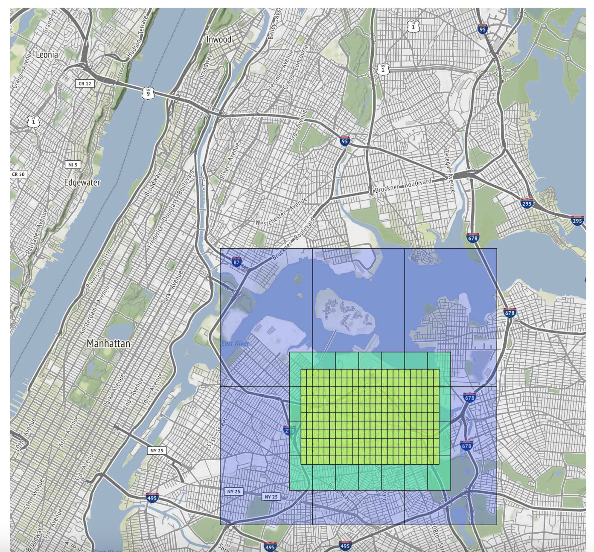

### **Ước tính mặt sau**

Để lưu trữ, chúng ta cần lưu trữ:

* bản đồ thế giới - ước tính khoảng ~70pb dựa trên tất cả các ô chúng ta cần lưu trữ, nhưng tính đến việc nén các ô rất giống nhau (ví dụ: sa mạc rộng lớn)
* siêu dữ liệu - kích thước không đáng kể, vì vậy chúng tôi có thể bỏ qua nó khỏi tính toán
* Thông tin đường - được lưu dưới dạng ô routing

QPS ước tính cho các yêu cầu điều hướng - 1 tỷ DAU với mức sử dụng 35 phút mỗi tuần -> 5 tỷ phút mỗi ngày.
Giả sử các yêu cầu cập nhật gps được chia theo đợt, chúng tôi đạt được 200 nghìn QPS và 1 triệu QPS khi tải cao điểm

---

Bước 2: Đề xuất thiết kế cấp cao và nhận được sự đồng ý
------------------------------------------------

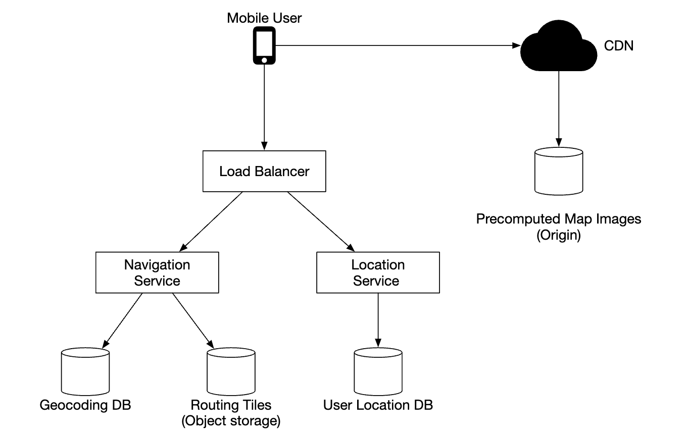

### **Dịch vụ định vị**


Nó chịu trách nhiệm ghi lại các cập nhật vị trí của người dùng:

* cập nhật vị trí được gửi sau mỗi `t` giây
* luồng dữ liệu vị trí có thể được sử dụng để cải thiện dịch vụ theo thời gian, ví dụ: cung cấp ETA chính xác hơn, giám sát dữ liệu giao thông, phát hiện đường bị đóng, phân tích hành vi của người dùng, v.v.

Thay vì gửi các bản cập nhật vị trí tới server mọi lúc, chúng tôi có thể gửi các bản cập nhật theo nhóm ở phía client và gửi các đợt thay thế:


Bất chấp sự tối ưu hóa này, đối với một hệ thống có quy mô Google Maps, tải vẫn sẽ rất đáng kể. Do đó, chúng ta có thể tận dụng database, được tối ưu hóa cho các tác vụ ghi nặng như Cassandra.

Chúng tôi cũng có thể tận dụng Kafka để xử lý luồng cập nhật vị trí một cách hiệu quả, nhằm mục đích phân tích thêm.

Ví dụ về tải trọng yêu cầu cập nhật vị trí:

```
POST /v1/locations
Parameters
  locs: JSON encoded array of (latitude, longitude, timestamp) tuples.
```

### **Dịch vụ điều hướng**

Thành phần này có nhiệm vụ tìm đường đi nhanh giữa A và B trong thời gian hợp lý (một chút latency là được). Lộ trình không cần phải nhanh nhất nhưng độ chính xác rất quan trọng.

Tải trọng yêu cầu ví dụ:

```
GET /v1/nav?origin=1355+market+street,SF&destination=Disneyland
```

Phản hồi ví dụ:

```
{
  "distance": {"text":"0.2 mi", "value": 259},
  "duration": {"text": "1 min", "value": 83},
  "end_location": {"lat": 37.4038943, "Ing": -121.9410454},
  "html_instructions": "Head <b>northeast</b> on <b>Brandon St</b> toward <b>Lumin Way</b><div style=\"font-size:0.9em\">Restricted usage road</div>",
  "polyline": {"points": "_fhcFjbhgVuAwDsCal"},
  "start_location": {"lat": 37.4027165, "lng": -121.9435809},
  "geocoded_waypoints": [
    {
       "geocoder_status" : "OK",
       "partial_match" : true,
       "place_id" : "ChIJwZNMti1fawwRO2aVVVX2yKg",
       "types" : [ "locality", "political" ]
    },
    {
       "geocoder_status" : "OK",
       "partial_match" : true,
       "place_id" : "ChIJ3aPgQGtXawwRLYeiBMUi7bM",
       "types" : [ "locality", "political" ]
    }
  ],
  "travel_mode": "DRIVING"
}
```

Những thay đổi về giao thông và routing lại vẫn chưa được xem xét mà sẽ được giải quyết trong phần lặn sâu.

### **Hiển thị bản đồ**

Việc giữ toàn bộ tập dữ liệu của các ô ánh xạ ở phía client là không khả thi vì nó có kích thước petabyte.

Chúng cần được tìm nạp theo yêu cầu từ server, dựa trên vị trí và mức thu phóng của client.

Khi nào nên tìm nạp các ô mới - trong khi người dùng đang phóng to/thu nhỏ và trong khi điều hướng, trong khi họ đang đi tới một ô mới.

Các ô bản đồ nên được cung cấp cho client như thế nào?

* Chúng có thể được xây dựng một cách linh hoạt, nhưng điều đó gây ra tải trọng lớn cho server và cũng khiến caching trở nên khó khăn
* Các ô bản đồ được cung cấp tĩnh, dựa trên geohash của chúng mà client có thể tính toán. Chúng có thể được lưu trữ và phục vụ tĩnh từ CDN


CDNs cho phép người dùng tìm nạp các ô bản đồ từ điểm hiện diện servers (POP) gần người dùng nhất để giảm thiểu latency:

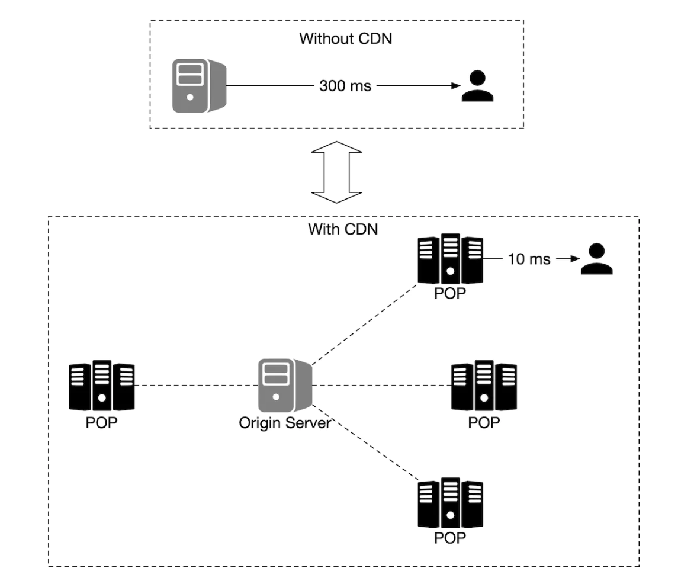

Các tùy chọn cần xem xét để xác định các ô bản đồ:

* geohash cho ô bản đồ có thể được tính toán ở phía client. Nếu đúng như vậy, chúng ta nên cẩn thận khi cam kết thực hiện kiểu tính toán ô bản đồ này trong thời gian dài vì việc buộc clients cập nhật là điều khó
* Ngoài ra, chúng ta có thể có API đơn giản để tính toán các URL ô bản đồ thay mặt cho clients với chi phí là lệnh gọi API bổ sung


---

Bước 3: Thiết kế Deep Dive
---------------

### **Mô hình dữ liệu**

Hãy thảo luận về cách chúng tôi lưu trữ các loại dữ liệu khác nhau mà chúng tôi đang xử lý.

#### Ô routing

Tập dữ liệu đường ban đầu được lấy từ nhiều nguồn khác nhau. Nó được cải thiện theo thời gian dựa trên dữ liệu cập nhật vị trí.

Dữ liệu đường không có cấu trúc. Chúng tôi có một quy trình xử lý ngoại tuyến định kỳ, quy trình này sẽ chuyển đổi dữ liệu thô này thành các ô routing dựa trên biểu đồ mà ứng dụng của chúng tôi cần.

Thay vì lưu trữ các ô này trong database vì chúng tôi không cần bất kỳ tính năng database nào. Chúng ta có thể lưu trữ chúng trong S3 object storage, trong khi caching chúng một cách mạnh mẽ.

Chúng ta cũng có thể tận dụng các thư viện để nén danh sách kề vào tệp nhị phân một cách hiệu quả.

#### Dữ liệu vị trí của người dùng

Dữ liệu vị trí của người dùng rất hữu ích để cập nhật tình trạng giao thông và thực hiện tất cả các loại phân tích khác.

Chúng ta có thể sử dụng Cassandra để lưu trữ loại dữ liệu này vì bản chất của nó là nặng về ghi.

Hàng ví dụ:

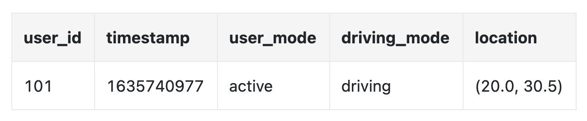

#### Mã hóa địa lý database

database này lưu trữ một cặp vị trí và cặp vĩ độ/kinh độ key-value.

Chúng tôi có thể sử dụng Redis để có tốc độ truy cập đọc nhanh vì chúng tôi đọc thường xuyên và ghi không thường xuyên.

#### Hình ảnh được tính toán trước của bản đồ thế giới

Như chúng ta đã thảo luận, chúng ta sẽ tính toán trước các hình ảnh xếp lát bản đồ và lưu trữ chúng trong CDN.

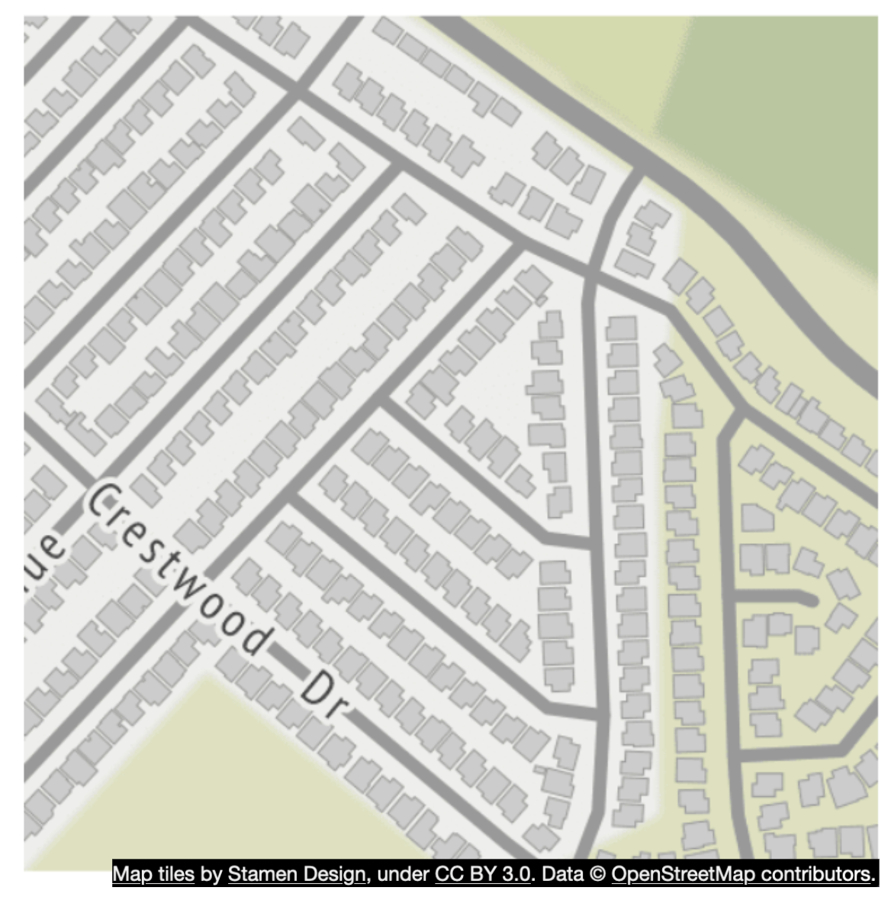

### **Dịch vụ**

#### Dịch vụ định vị

Hãy tập trung vào thiết kế database và cách lưu trữ chi tiết vị trí người dùng cho dịch vụ này.

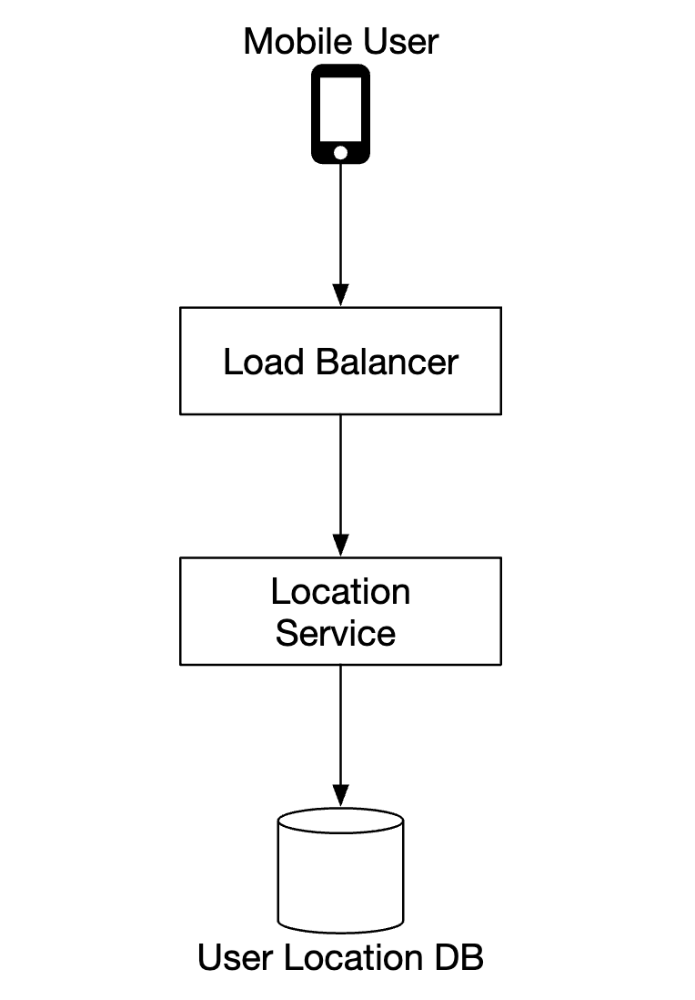

Chúng tôi có thể sử dụng NoSQL database để hỗ trợ tải trọng ghi lớn khi cập nhật vị trí. Chúng tôi ưu tiên availability hơn consistency vì dữ liệu vị trí của người dùng thường thay đổi và trở nên cũ khi có bản cập nhật mới.

Chúng tôi sẽ chọn Cassandra làm lựa chọn database vì nó phù hợp với mọi yêu cầu của chúng tôi.

Hàng ví dụ chúng tôi sẽ lưu trữ:

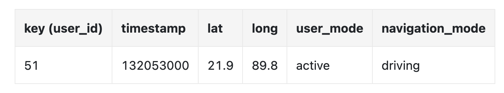

* `user_id` là khóa partition để truy cập nhanh tất cả các cập nhật vị trí cho một người dùng cụ thể
* `timestamp` là khóa phân cluster để lưu trữ dữ liệu được sắp xếp theo thời điểm nhận được cập nhật vị trí

Chúng tôi cũng tận dụng Kafka để truyền phát các cập nhật vị trí tới nhiều dịch vụ khác cần cập nhật vị trí cho nhiều mục đích khác nhau:

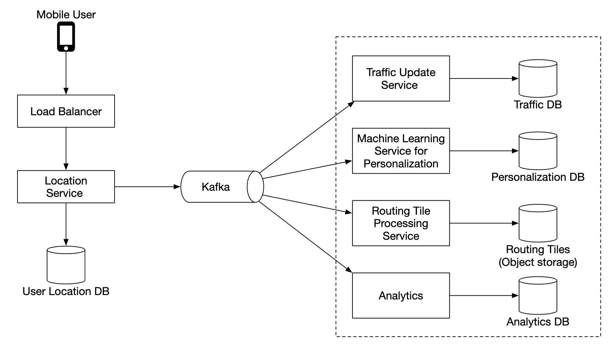

#### Hiển thị bản đồ

Các ô bản đồ được lưu trữ ở nhiều mức thu phóng khác nhau. Ở mức thu phóng thấp nhất, toàn bộ thế giới được thể hiện bằng một ô 256x256 duy nhất.

Khi mức thu phóng tăng lên, số ô bản đồ sẽ tăng gấp bốn lần:

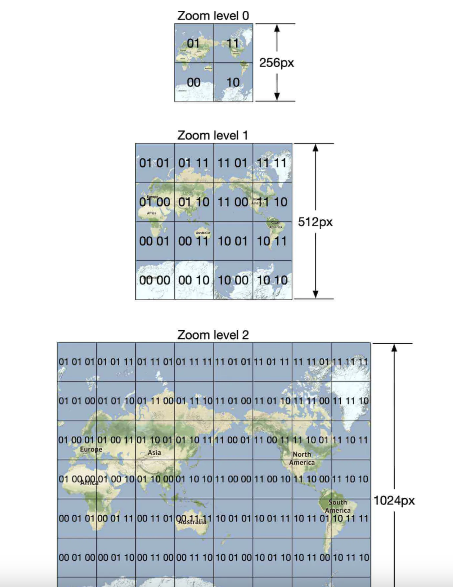

Một cách tối ưu hóa mà chúng tôi có thể sử dụng là không gửi toàn bộ thông tin hình ảnh qua mạng mà thay vào đó biểu thị các ô dưới dạng vectơ (đường dẫn & đa giác) và để client hiển thị các ô một cách linh hoạt.

Điều này sẽ tiết kiệm bandwidth đáng kể.

#### Dịch vụ dẫn đường

Dịch vụ này có nhiệm vụ tìm kiếm các tuyến đường nhanh nhất:


Chúng ta hãy đi qua từng thành phần trong hệ thống con này.

Đầu tiên, chúng tôi có dịch vụ mã hóa địa lý phân giải địa chỉ thành vị trí của cặp vĩ độ/kinh độ.

Yêu cầu ví dụ:

```
https://maps.googleapis.com/maps/api/geocode/json?address=1600+Amphitheatre+Parkway,+Mountain+View,+CA
```

Phản hồi ví dụ:

```
{
   "results" : [
      {
         "formatted_address" : "1600 Amphitheatre Parkway, Mountain View, CA 94043, USA",
         "geometry" : {
            "location" : {
               "lat" : 37.4224764,
               "lng" : -122.0842499
            },
            "location_type" : "ROOFTOP",
            "viewport" : {
               "northeast" : {
                  "lat" : 37.4238253802915,
                  "lng" : -122.0829009197085
               },
               "southwest" : {
                  "lat" : 37.4211274197085,
                  "lng" : -122.0855988802915
               }
            }
         },
         "place_id" : "ChIJ2eUgeAK6j4ARbn5u_wAGqWA",
         "plus_code": {
            "compound_code": "CWC8+W5 Mountain View, California, United States",
            "global_code": "849VCWC8+W5"
         },
         "types" : [ "street_address" ]
      }
   ],
   "status" : "OK"
}
```

Dịch vụ lập kế hoạch tuyến đường tính toán tuyến đường được đề xuất, tối ưu hóa thời gian di chuyển tùy theo điều kiện giao thông hiện tại.

Dịch vụ đường dẫn ngắn nhất chạy một biến thể của thuật toán A\* dựa trên các ô routing trong object storage để tính toán đường dẫn tối ưu:

* Nó nhận các cặp nguồn/đích, chuyển đổi chúng thành các cặp vĩ độ/kinh độ và lấy các geohash từ các cặp đó để lấy các ô routing
* Thuật toán bắt đầu từ ô routing ban đầu và bắt đầu duyệt qua nó cho đến khi tìm thấy đường dẫn đủ tốt tới ô đích


Dịch vụ ETA được người lập kế hoạch tuyến đường gọi để lấy thời gian ước tính dựa trên thuật toán học máy, dự đoán ETA dựa trên dữ liệu giao thông.

Dịch vụ xếp hạng có trách nhiệm xếp hạng các đường dẫn khác nhau có thể dựa trên các bộ lọc do người dùng vượt qua, tức là các cờ để tránh đường thu phí hoặc đường cao tốc.

Dịch vụ cập nhật cập nhật không đồng bộ một số databases quan trọng để cập nhật chúng.

#### Cải tiến - ETA thích ứng và routing lại

Một cải tiến mà chúng tôi có thể thực hiện là cập nhật thích ứng các tuyến đường trên chuyến bay dựa trên dữ liệu giao thông mới có sẵn.

Một cách để thực hiện điều này là lưu trữ những người dùng hiện đang điều hướng qua một tuyến đường trong database bằng cách lưu trữ tất cả các ô mà họ phải đi qua.

Dữ liệu có thể trông như thế này:

```
user_1: r_1, r_2, r_3, …, r_k
user_2: r_4, r_6, r_9, …, r_n
user_3: r_2, r_8, r_9, …, r_m
...
user_n: r_2, r_10, r21, ..., r_l
```

Nếu tai nạn giao thông xảy ra trên một ô nào đó, chúng tôi có thể xác định tất cả người dùng có đường đi qua ô đó và routing lại cho họ.

Để giảm số lượng ngăn xếp chúng tôi lưu trữ trong database, thay vào đó, chúng tôi có thể lưu trữ ngăn xếp routing gốc và một số ngăn xếp routing ở các mức độ phân giải khác nhau cho đến khi bao gồm cả ngăn xếp đích:

```
user_1, r_1, super(r_1), super(super(r_1)), ...
```


Khi sử dụng tính năng này, chúng tôi chỉ cần kiểm tra xem ô cuối cùng của người dùng có bao gồm ô tai nạn giao thông hay không để xem liệu người dùng có bị ảnh hưởng hay không.

Chúng tôi cũng có thể theo dõi tất cả các tuyến đường có thể có cho người dùng điều hướng và thông báo cho họ nếu có tuyến đường lại nhanh hơn.

#### Quy trình giao hàng

Chúng tôi có một số tùy chọn cho phép chúng tôi chủ động đẩy dữ liệu tới clients từ server:

* Thông báo đẩy trên thiết bị di động không hoạt động vì tải trọng bị giới hạn và không có sẵn cho ứng dụng web
* WebSocket nói chung là một lựa chọn tốt hơn so với bỏ phiếu dài vì nó có ít dấu chân điện toán hơn trên servers
* Chúng tôi cũng có thể sử dụng các sự kiện do server gửi (SSE) nhưng thiên về ổ cắm web vì chúng hỗ trợ giao tiếp hai chiều, có thể hữu ích, chẳng hạn như tính năng giao hàng chặng cuối

---

Bước 4: Kết thúc
---------------

Đây là thiết kế cuối cùng của chúng tôi:

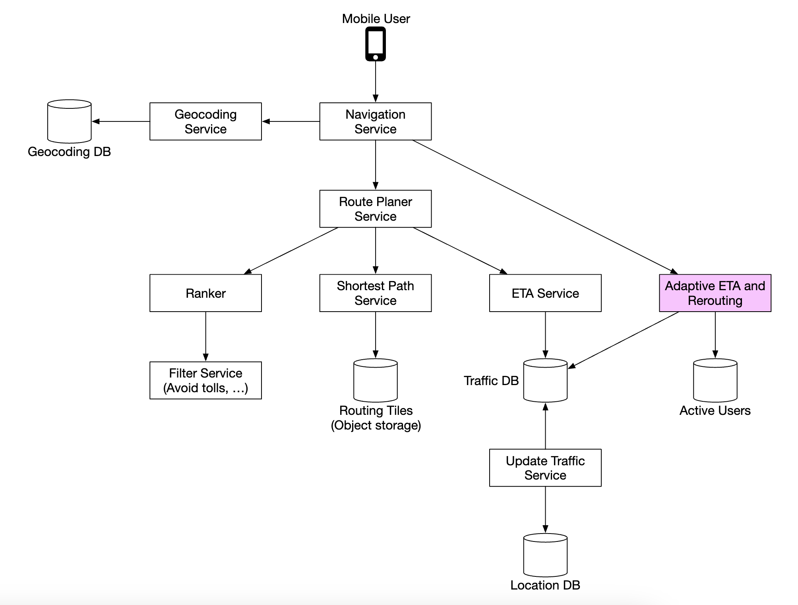

Một tính năng bổ sung mà chúng tôi có thể cung cấp là điều hướng nhiều điểm dừng có thể được bán cho các khách hàng doanh nghiệp như Uber hoặc Lyft để xác định đường đi tối ưu để ghé thăm một nhóm địa điểm.