Chương 19: Message Queue được phân phối
========================================

Giới thiệu
------------

Chúng tôi sẽ thiết kế **message queue được phân phối** trong chương này.

Lợi ích của message queues:

* **Tách rời**: Loại bỏ sự liên kết chặt chẽ giữa các thành phần. Hãy để họ cập nhật riêng.
* **scalability được cải tiến**: Nhà sản xuất và người tiêu dùng có thể được scaling độc lập dựa trên lưu lượng truy cập.
* **availability tăng**: Nếu một phần của hệ thống ngừng hoạt động, các phần khác sẽ tiếp tục tương tác với hàng đợi.
* **Hiệu suất tốt hơn**: Nhà sản xuất có thể tạo thông báo mà không cần chờ xác nhận của người tiêu dùng.

Một số triển khai message queue phổ biến - Kafka, RabbitMQ, RocketMQ, Apache Pulsar, ActiveMQ, ZeroMQ.

Nói đúng ra, Kafka và Pulsar không phải là message queues. Họ là những nền tảng phát trực tuyến sự kiện.
Tuy nhiên, có sự hội tụ các tính năng làm mờ đi sự khác biệt giữa message queues và các nền tảng phát trực tuyến sự kiện.

Trong chương này, chúng ta sẽ xây dựng message queue có hỗ trợ các tính năng nâng cao hơn như lưu giữ dữ liệu lâu, sử dụng tin nhắn lặp lại, v.v.

---

Bước 1: Hiểu vấn đề và thiết lập phạm vi thiết kế
---------------------------------------------------------

Message queues phải hỗ trợ một số tính năng cơ bản - nhà sản xuất tạo ra thông điệp và người tiêu dùng sử dụng chúng.
Tuy nhiên, có những cân nhắc khác nhau liên quan đến hiệu suất, gửi tin nhắn, lưu giữ dữ liệu, v.v.

Dưới đây là một bộ câu hỏi tiềm năng giữa Ứng viên và Người phỏng vấn:

* C: Định dạng và kích thước tin nhắn trung bình là gì? Có phải nó chỉ là văn bản?
* I: Tin nhắn chỉ ở dạng văn bản và thường có vài KB
* C: Tin nhắn có thể được sử dụng nhiều lần không?
* Tôi: Có, những người tiêu dùng khác nhau có thể sử dụng tin nhắn nhiều lần. Đây là một yêu cầu bổ sung mà message queues truyền thống không hỗ trợ.
* C: Các tin nhắn có được sử dụng theo đúng thứ tự được tạo ra không?
* Tôi: Có, đảm bảo đơn hàng phải được giữ nguyên. Đây là một yêu cầu bổ sung, message queues truyền thống không hỗ trợ điều này.
* C: Các yêu cầu lưu giữ dữ liệu là gì?
* I: Tin nhắn cần được lưu giữ trong hai tuần. Đây là một yêu cầu bổ sung.
* C: Chúng ta muốn hỗ trợ bao nhiêu nhà sản xuất và người tiêu dùng?
* Tôi: Càng nhiều càng tốt.
* C: Chúng tôi muốn hỗ trợ ngữ nghĩa phân phối dữ liệu nào? Nhiều nhất một lần, ít nhất một lần, chính xác một lần?
* Tôi: Chúng tôi chắc chắn muốn hỗ trợ ít nhất một lần. Lý tưởng nhất là chúng tôi có thể hỗ trợ tất cả và làm cho chúng có thể cấu hình được.
* C: throughput mục tiêu cho latency end-to-end là gì?
* I: Nó phải hỗ trợ throughput cao cho các trường hợp sử dụng như tổng hợp nhật ký và throughput thấp cho các trường hợp sử dụng truyền thống hơn.

### **Yêu cầu về chức năng**

* Nhà sản xuất gửi tin nhắn đến message queue
* Người tiêu dùng sử dụng tin nhắn từ hàng đợi
* Tin nhắn có thể được sử dụng một lần hoặc nhiều lần
* Dữ liệu lịch sử có thể được cắt ngắn
* Kích thước tin nhắn nằm trong phạm vi KB
* Thứ tự tin nhắn cần được giữ nguyên
* Ngữ nghĩa phân phối dữ liệu có thể được cấu hình - nhiều nhất một lần/ít nhất một lần/chính xác một lần.

### **Yêu cầu phi chức năng**

* **throughput cao hoặc latency thấp**: Có thể định cấu hình dựa trên trường hợp sử dụng
* **Có thể scaling**: hệ thống phải được phân phối và hỗ trợ khối lượng tin nhắn tăng đột ngột
* **Liên tục và bền bỉ**: dữ liệu phải được lưu giữ trên đĩa và được sao chép giữa nodes

message queues truyền thống thường không hỗ trợ lưu giữ dữ liệu và không cung cấp đảm bảo đặt hàng. Điều này giúp đơn giản hóa rất nhiều việc thiết kế và chúng ta sẽ thảo luận về nó.

---

Bước 2: Đề xuất thiết kế cấp cao và nhận được sự đồng ý
------------------------------------------------

Các thành phần chính của message queue:

* Nhà sản xuất gửi tin nhắn đến hàng đợi
* Người tiêu dùng đăng ký hàng đợi và sử dụng các tin nhắn đã đăng ký
* Message queue là một dịch vụ ở giữa giúp tách nhà sản xuất khỏi người tiêu dùng, cho phép họ scaling một cách độc lập.
* Nhà sản xuất và người tiêu dùng đều là clients, trong khi message queue là server.

### **Mô hình nhắn tin**

Loại mô hình nhắn tin đầu tiên là điểm-điểm và thường thấy trong message queues truyền thống:

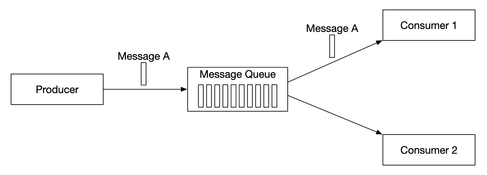

* Một tin nhắn được gửi đến hàng đợi và nó được sử dụng bởi chính xác một người tiêu dùng.
* Có thể có nhiều người tiêu dùng, nhưng một tin nhắn chỉ được sử dụng một lần.
* Sau khi tin nhắn được xác nhận là đã sử dụng, nó sẽ bị xóa khỏi hàng đợi.
* Không có tính năng lưu giữ dữ liệu trong mô hình điểm-điểm, nhưng có tính năng này trong thiết kế của chúng tôi.

Mặt khác, mô hình đăng ký xuất bản phổ biến hơn đối với các nền tảng phát trực tuyến sự kiện:

* Trong mô hình này, tin nhắn được liên kết với topic.
* Người tiêu dùng đã đăng ký topic và họ nhận được tất cả tin nhắn được gửi tới topic này.

### **Topics, partitions và brokers**

Điều gì sẽ xảy ra nếu khối lượng dữ liệu của topic quá lớn? Một cách để scaling là chia topic thành partitions (còn gọi là sharding):

* Tin nhắn được gửi tới topic được phân bổ đều trên partitions
* servers mà host partitions được gọi là brokers
* Mỗi topic hoạt động giống như một hàng đợi sử dụng FIFO để xử lý tin nhắn. Thứ tự tin nhắn được giữ nguyên trong partition.
* Vị trí của tin nhắn trong partition được gọi là **offset**.
* Mỗi tin nhắn được tạo sẽ được gửi đến một partition cụ thể. Khóa partition chỉ định tin nhắn partition nào sẽ được gửi đến.
  + Ví dụ: `user_id` có thể được sử dụng làm khóa partition để đảm bảo thứ tự các tin nhắn cho cùng một người dùng.
* Mỗi người tiêu dùng đăng ký một hoặc nhiều partitions. Khi có nhiều người tiêu dùng cho cùng một tin nhắn, họ sẽ tạo thành consumer group.

### **Consumer groups**

Consumer groups là một nhóm người tiêu dùng làm việc cùng nhau để tiếp nhận tin nhắn từ topic:

* Tin nhắn được sao chép trên mỗi consumer group (không phải trên mỗi người tiêu dùng).
* Mỗi consumer group duy trì mức bù riêng.
* Đọc tin nhắn song song bằng consumer group cải thiện throughput nhưng cản trở việc đảm bảo đặt hàng.
* Điều này có thể được giảm thiểu bằng cách chỉ cho phép một người tiêu dùng trong nhóm đăng ký partition.
* Điều này có nghĩa là chúng tôi không thể có nhiều người tiêu dùng trong một nhóm hơn partitions.

### **Kiến trúc cấp cao**

* **Clients**: nhà sản xuất và người tiêu dùng. Nhà sản xuất đẩy tin nhắn đến topic được chỉ định. Consumer group đăng ký tin nhắn từ topic.
* **Brokers**: giữ nhiều partitions. partition chứa một tập hợp con các tin nhắn cho topic.
* **Lưu trữ dữ liệu**: lưu trữ tin nhắn trong partitions.
* **Lưu trữ trạng thái**: lưu giữ trạng thái của người tiêu dùng.
* **Lưu trữ siêu dữ liệu**: lưu trữ cấu hình và thuộc tính topic
* **Dịch vụ điều phối**: chịu trách nhiệm khám phá dịch vụ (brokers còn hoạt động) và bầu chọn người lãnh đạo (mà broker là người lãnh đạo, chịu trách nhiệm chỉ định partitions).

---

Bước 3: Thiết kế Deep Dive
---------------

Để đạt được throughput cao và duy trì yêu cầu lưu giữ dữ liệu cao, chúng tôi đã đưa ra một số lựa chọn thiết kế quan trọng:

* Chúng tôi đã chọn cấu trúc dữ liệu trên đĩa tận dụng các thuộc tính của chiến lược ổ cứng và đĩa caching hiện đại của các hệ điều hành hiện đại.
* Cấu trúc dữ liệu tin nhắn là bất biến để tránh sao chép thêm, điều mà chúng tôi muốn tránh trong hệ thống có khối lượng lớn/lưu lượng truy cập cao.
* Chúng tôi thiết kế bài viết của mình xoay quanh việc phân khối vì I/O nhỏ là kẻ thù của throughput cao.

### **Lưu trữ dữ liệu**

Để tìm kho lưu trữ dữ liệu tốt nhất cho tin nhắn, chúng ta phải kiểm tra các thuộc tính của tin nhắn:

* Viết nhiều, đọc nhiều
* Không có thao tác cập nhật/xóa. Trong message queues truyền thống, có thao tác "xóa" vì tin nhắn không được giữ lại.
* Mẫu truy cập đọc/ghi chủ yếu theo tuần tự.

Lựa chọn của chúng tôi là gì:

* **Database**: không lý tưởng vì databases điển hình không hỗ trợ tốt cả ghi và đọc các hệ thống nặng.
* **Nhật ký viết trước (WAL)**: một tệp văn bản thuần túy chỉ hỗ trợ thêm vào và rất thân thiện với ổ cứng HDD.
  + Chúng tôi chia partitions thành các phân đoạn để tránh duy trì một tệp rất lớn.
  + Các phân đoạn cũ ở chế độ chỉ đọc. Bài viết chỉ được chấp nhận bởi phân đoạn mới nhất.

Các tệp WAL cực kỳ hiệu quả khi được sử dụng với ổ cứng truyền thống.

Có một quan niệm sai lầm rằng tốc độ truy cập của ổ cứng HDD chậm, nhưng điều đó phụ thuộc rất nhiều vào kiểu truy cập.
Khi kiểu truy cập là tuần tự (như trong trường hợp của chúng tôi), ổ cứng HDD có thể đạt tốc độ ghi/đọc vài MB/s, đủ cho nhu cầu của chúng tôi.
Chúng tôi cũng dựa trên thực tế là dữ liệu đĩa OS caches trong bộ nhớ đang hoạt động mạnh mẽ.

### **Cấu trúc dữ liệu tin nhắn**

Điều quan trọng là lược đồ thông báo phải tuân thủ giữa nhà sản xuất, hàng đợi và người tiêu dùng để tránh bị sao chép thêm. Điều này cho phép xử lý hiệu quả hơn nhiều.

Cấu trúc tin nhắn ví dụ:

Khóa của tin nhắn chỉ định tin nhắn thuộc về partition nào. Một ánh xạ ví dụ là `hash(key) % numPartitions`.
Để linh hoạt hơn, nhà sản xuất có thể ghi đè các khóa mặc định để kiểm soát thông báo partitions nào được phân phối tới.

Giá trị tin nhắn là tải trọng của tin nhắn. Nó có thể là bản rõ hoặc khối nhị phân nén.

**Lưu ý:** Khóa tin nhắn, không giống như các cửa hàng KV truyền thống, không cần phải là duy nhất. Việc có các khóa trùng lặp và thậm chí bị thiếu là điều có thể chấp nhận được.

Các tập tin tin nhắn khác:

* **Topic**: topic tin nhắn thuộc về
* **Partition**: ID của partition mà tin nhắn thuộc về
* **Offset**: Vị trí của tin nhắn trong partition. Một tin nhắn có thể được định vị qua `topic`, `partition`, `offset`.
* **Dấu thời gian**: Khi tin nhắn được lưu trữ
* **Kích thước**: kích thước của tin nhắn này
* **CRC**: tổng kiểm tra để đảm bảo tính toàn vẹn của tin nhắn

Các tính năng bổ sung như lọc có thể được hỗ trợ bằng cách thêm các trường bổ sung.

### **Chia hàng**

Việc phân đợt rất quan trọng đối với hiệu suất của hệ thống của chúng tôi. Chúng tôi áp dụng nó trong nhà sản xuất, người tiêu dùng và message queue.

Nó rất quan trọng bởi vì:

* Nó cho phép hệ điều hành nhóm các tin nhắn lại với nhau, giảm chi phí cho các chuyến đi khứ hồi mạng đắt tiền
* Các tin nhắn được ghi tuần tự vào WAL theo nhóm, điều này dẫn đến nhiều lần ghi tuần tự và đĩa caching.

Có sự cân bằng giữa latency và throughput:

* Phân mẻ cao dẫn đến throughput cao và latency cao hơn.
* Ít phân nhóm hơn dẫn đến throughput thấp hơn và latency thấp hơn.

Nếu chúng tôi cần hỗ trợ latency thấp hơn do hệ thống được triển khai dưới dạng message queue truyền thống thì hệ thống có thể được điều chỉnh để sử dụng kích thước lô nhỏ hơn.

Nếu được điều chỉnh cho throughput, chúng tôi có thể cần nhiều partitions hơn cho mỗi topic để bù đắp cho việc ghi throughput vào đĩa tuần tự chậm hơn.

### **Quy trình sản xuất**

Nếu nhà sản xuất muốn gửi tin nhắn đến partition thì nên kết nối với broker nào?

Một tùy chọn là giới thiệu lớp routing, routing các thông báo đến broker chính xác. Nếu replication được bật thì broker chính xác là replica dẫn đầu:

* Lớp routing đọc gói replication từ kho siêu dữ liệu và caches cục bộ.
* Nhà sản xuất gửi tin nhắn đến lớp routing.
* Tin nhắn được chuyển tiếp đến broker 1, người đứng đầu partition đã cho
* replica của người theo dõi lấy thông điệp mới từ người lãnh đạo. Sau khi nhận đủ số xác nhận, người đứng đầu sẽ cam kết dữ liệu và phản hồi cho nhà sản xuất.

Lý do có replica là để kích hoạt fault tolerance.

Cách tiếp cận này hoạt động nhưng có một số nhược điểm:

* Các bước nhảy mạng bổ sung do có thành phần bổ sung
* Thiết kế không cho phép gửi tin nhắn theo nhóm

Để giảm thiểu những vấn đề này, chúng tôi có thể nhúng lớp routing vào nhà sản xuất:

* Ít bước nhảy mạng hơn dẫn đến latency thấp hơn
* Nhà sản xuất có thể kiểm soát tin nhắn partition nào được chuyển đến
* Bộ đệm cho phép chúng tôi gửi hàng loạt tin nhắn trong bộ nhớ và gửi các lô lớn hơn trong một yêu cầu, điều này làm tăng throughput.

Lựa chọn kích thước lô là sự đánh đổi cổ điển giữa throughput và latency.

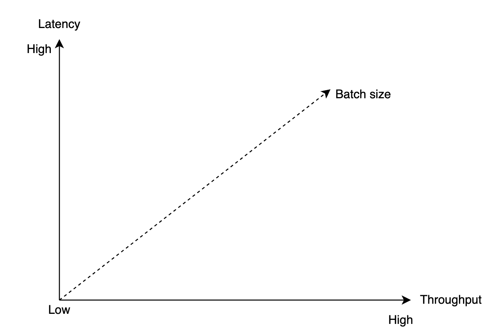

* Kích thước lô lớn hơn dẫn đến thời gian chờ đợi lâu hơn trước khi lô được cam kết.
* Kích thước lô nhỏ hơn dẫn đến yêu cầu được gửi sớm hơn và có latency thấp hơn nhưng throughput thấp hơn.

### **Luồng tiêu dùng**

Người tiêu dùng chỉ định phần bù của nó trong partition và nhận được một đoạn tin nhắn, bắt đầu từ phần bù đó:

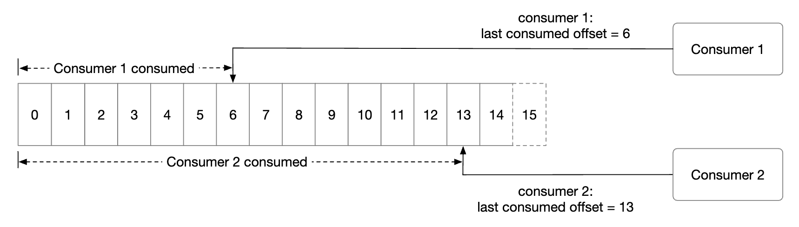

Một cân nhắc quan trọng khi thiết kế người tiêu dùng là nên sử dụng mô hình đẩy hay kéo:

* **Mô hình đẩy**: dẫn đến latency thấp hơn khi broker đẩy tin nhắn đến người tiêu dùng khi nhận được chúng.
  + Tuy nhiên, nếu tốc độ tiêu dùng thấp hơn tốc độ sản xuất thì người tiêu dùng có thể bị choáng ngợp.
  + Việc đối phó với người tiêu dùng có sức mạnh xử lý khác nhau là một thách thức vì broker kiểm soát tốc độ tiêu thụ.
* **Mô hình kéo**: dẫn đến việc người tiêu dùng kiểm soát mức tiêu dùng.
  + Nếu tốc độ tiêu thụ chậm, người tiêu dùng sẽ không bị choáng ngợp và chúng ta có thể scaling để bắt kịp.
  + Mô hình kéo phù hợp hơn cho việc xử lý hàng loạt vì với mô hình đẩy, broker không thể biết một người tiêu dùng có thể xử lý bao nhiêu tin nhắn.
  + Mặt khác, với mô hình kéo, người tiêu dùng có thể tích cực tìm nạp các lô tin nhắn lớn.
  + Nhược điểm là latency cao hơn và gọi thêm mạng khi không có tin nhắn mới. Vấn đề thứ hai có thể được giảm thiểu bằng cách sử dụng bỏ phiếu dài.

Do đó, hầu hết message queues (và chúng tôi) đều chọn mô hình kéo.

* Một người tiêu dùng mới đăng ký topic A và tham gia nhóm 1.
* broker node chính xác được tìm thấy bằng cách băm tên nhóm. Bằng cách này, tất cả người tiêu dùng trong một nhóm đều kết nối với cùng một broker.
* Lưu ý rằng điều phối viên consumer group này khác với dịch vụ điều phối (ZooKeeper).
* Điều phối viên xác nhận rằng người tiêu dùng đã tham gia nhóm và chỉ định partition 2 cho người tiêu dùng đó.
* Có các chiến lược phân công partition khác nhau - vòng tròn, phạm vi, v.v.
* Người tiêu dùng tìm nạp các tin nhắn mới nhất từ ​​phần bù cuối cùng. Bộ nhớ nhà nước giữ lại khoản bù đắp cho người tiêu dùng.
* Người tiêu dùng xử lý tin nhắn và cam kết bù đắp cho broker. Thứ tự của các hoạt động đó ảnh hưởng đến ngữ nghĩa gửi tin nhắn.

### **Tái cân bằng người tiêu dùng**

Tái cân bằng người tiêu dùng có trách nhiệm quyết định người tiêu dùng nào chịu trách nhiệm về partition nào.

Quá trình này xảy ra khi người tiêu dùng tham gia/rời khỏi hoặc partition được thêm/xóa.

broker, hoạt động như một điều phối viên, đóng một vai trò rất lớn trong việc điều phối quy trình tái cân bằng.

* Tất cả người tiêu dùng trong cùng một nhóm được kết nối với cùng một điều phối viên. Điều phối viên được tìm thấy bằng cách băm tên nhóm.
* Khi danh sách người tiêu dùng thay đổi, điều phối viên sẽ chọn một trưởng nhóm mới.
* Trưởng nhóm tính toán kế hoạch điều phối partition mới và báo cáo lại cho điều phối viên, broadcasts sẽ báo cáo lại cho những người tiêu dùng khác.

Khi điều phối viên ngừng nhận heartbeats từ người tiêu dùng trong nhóm, quá trình tái cân bằng sẽ được kích hoạt:

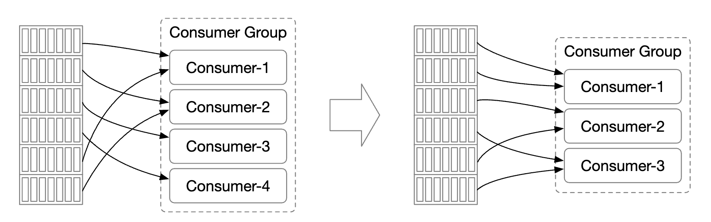

Hãy cùng khám phá điều gì sẽ xảy ra khi người tiêu dùng tham gia một nhóm:

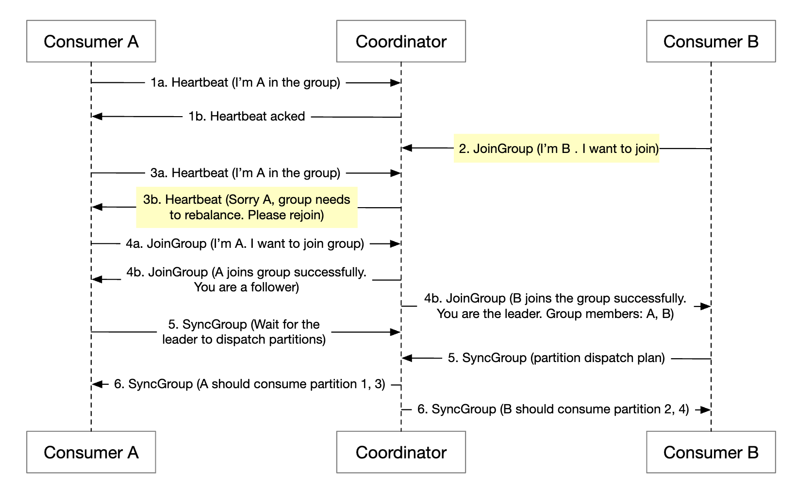

* Ban đầu, chỉ có người tiêu dùng A trong nhóm và nó tiêu thụ tất cả partitions.
* Người tiêu dùng B gửi yêu cầu tham gia nhóm.
* Điều phối viên thông báo cho tất cả các thành viên trong nhóm rằng đã đến lúc tái cân bằng một cách thụ động - như một phản hồi đối với heartbeat.
* Sau khi tất cả người tiêu dùng tham gia lại nhóm, điều phối viên sẽ chọn người lãnh đạo và thông báo cho rest về kết quả bầu cử.
* Người lãnh đạo tạo kế hoạch điều phối partition và gửi cho điều phối viên. Những người khác chờ kế hoạch điều động.
* Người tiêu dùng bắt đầu tiêu dùng từ partitions mới được chỉ định.

Đây là những gì xảy ra khi người tiêu dùng rời khỏi nhóm:

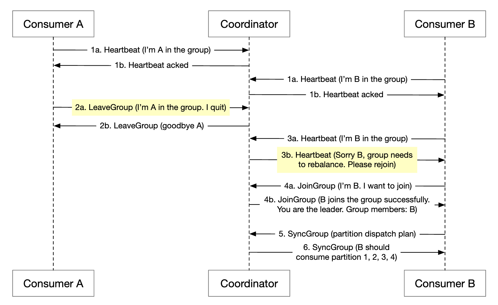

* Người tiêu dùng A và B cùng nhóm
* Người tiêu dùng B yêu cầu rời nhóm
* Khi điều phối viên nhận được heartbeat của A, nó sẽ thông báo cho họ rằng đã đến lúc tái cân bằng.
* rest của các bước đều giống nhau.

Quá trình này tương tự khi người tiêu dùng không gửi heartbeat trong một thời gian dài:

### **Bộ nhớ trạng thái**

Bộ lưu trữ trạng thái lưu trữ ánh xạ giữa partitions và người tiêu dùng, cũng như các giá trị bù đắp được tiêu thụ cuối cùng cho partition.

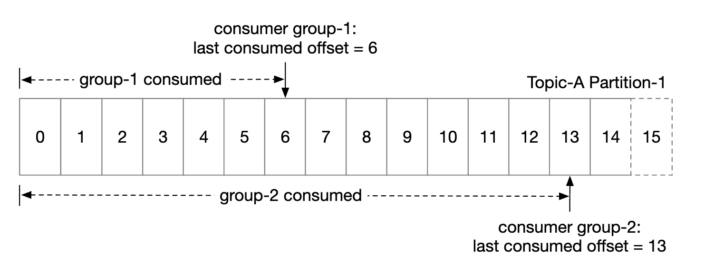

Độ lệch của nhóm 1 là 6, nghĩa là tất cả các tin nhắn trước đó đều được sử dụng. Nếu người tiêu dùng gặp sự cố, người tiêu dùng mới sẽ tiếp tục từ thông báo đó trên phường.

Các mẫu truy cập dữ liệu cho các trạng thái của người tiêu dùng:

* Thao tác đọc/ghi thường xuyên nhưng âm lượng thấp
* Dữ liệu được cập nhật thường xuyên nhưng hiếm khi bị xóa
* Đọc/ghi ngẫu nhiên
* Dữ liệu consistency rất quan trọng

Với những yêu cầu này, bộ lưu trữ KV nhanh như Zookeeper là lý tưởng.

### **Lưu trữ siêu dữ liệu**

Bộ lưu trữ siêu dữ liệu lưu trữ cấu hình và thuộc tính topic - số partition, thời gian lưu giữ, phân phối replica.

Siêu dữ liệu không thay đổi thường xuyên và dung lượng nhỏ nhưng có yêu cầu consistency cao.
Zookeeper là một lựa chọn tốt cho việc lưu trữ này.

### **ZooKeeper**

Zookeeper rất cần thiết để xây dựng message queues phân tán.

Nó là key-value store phân cấp, thường được sử dụng cho cấu hình phân tán, dịch vụ đồng bộ hóa và đăng ký đặt tên (tức là khám phá dịch vụ).

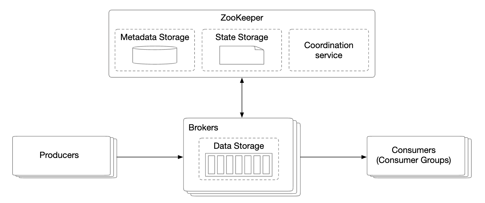

Với sự thay đổi này, broker chỉ cần duy trì dữ liệu cho các tin nhắn. Siêu dữ liệu và lưu trữ trạng thái nằm trong Zookeeper.

Zookeeper cũng giúp bầu chọn người lãnh đạo các replica broker.

### **Replication**

Trong các hệ thống phân tán, vấn đề phần cứng là không thể tránh khỏi. Chúng tôi có thể giải quyết vấn đề này thông qua replication để đạt được availability cao.

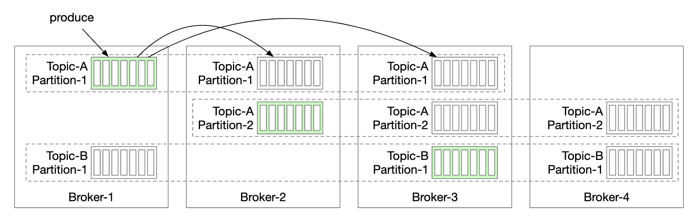

* Mỗi partition được sao chép trên nhiều brokers, nhưng chỉ có một replica dẫn đầu.
* Nhà sản xuất gửi tin nhắn đến replica của nhà lãnh đạo
* Người theo dõi lấy các thông điệp được sao chép từ người lãnh đạo
* Sau khi đồng bộ đủ số lượng replica, người lãnh đạo sẽ gửi lại xác nhận cho nhà sản xuất
* Phân phối replica cho mỗi partition được gọi là kế hoạch phân phối replica.
* Người lãnh đạo cho partition nhất định tạo kế hoạch phân phối replica và lưu nó trong Zookeeper

### **replica không đồng bộ**

Một vấn đề chúng ta cần giải quyết là giữ các thông điệp không đồng bộ giữa người lãnh đạo và người theo dõi đối với một partition nhất định.

replica không đồng bộ (ISR) là replica cho partition luôn đồng bộ hóa với người dẫn đầu.

`replica.lag.max.messages` xác định số lượng tin nhắn mà một replica có thể bị tụt lại phía sau bản dẫn đầu để được coi là không đồng bộ.

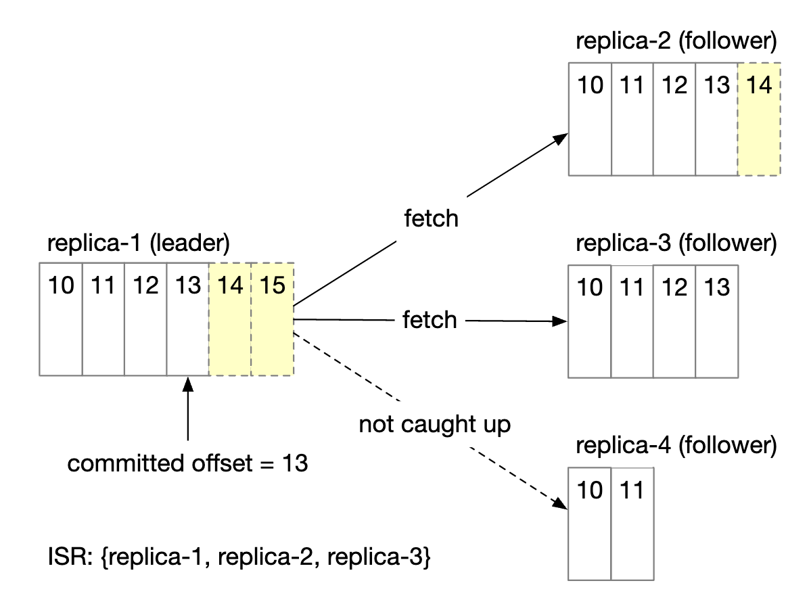

* Cam kết offset là 13
* Hai tin nhắn mới được viết cho lãnh đạo nhưng chưa được cam kết.
* Một thông báo được cam kết khi tất cả các replica trong ISR đã đồng bộ hóa thông báo đó
* replica 2 và 3 đã hoàn toàn bắt kịp người dẫn đầu, do đó, chúng nằm trong ISR
* replica 4 đã bị tụt lại phía sau, do đó hiện đã bị xóa khỏi ISR

ISR phản ánh sự cân bằng giữa hiệu suất và độ bền.

* Để nhà sản xuất không bị mất tin nhắn, tất cả các replica phải được đồng bộ hóa trước khi gửi xác nhận
* Nhưng replica chậm sẽ khiến toàn bộ partition không khả dụng

Xử lý xác nhận có thể được cấu hình.

`ACK=all` có nghĩa là tất cả các replica trong ISR phải đồng bộ hóa một tin nhắn. Tin nhắn gửi chậm nhưng độ bền tin nhắn là cao nhất.

`ACK=1` có nghĩa là nhà sản xuất nhận được xác nhận sau khi người lãnh đạo nhận được tin nhắn. Tin nhắn gửi nhanh nhưng độ bền tin nhắn thấp.

`ACK=0` có nghĩa là nhà sản xuất gửi tin nhắn mà không cần chờ bất kỳ xác nhận nào từ nhà lãnh đạo. Tin nhắn gửi nhanh nhất, độ bền tin nhắn thấp nhất.

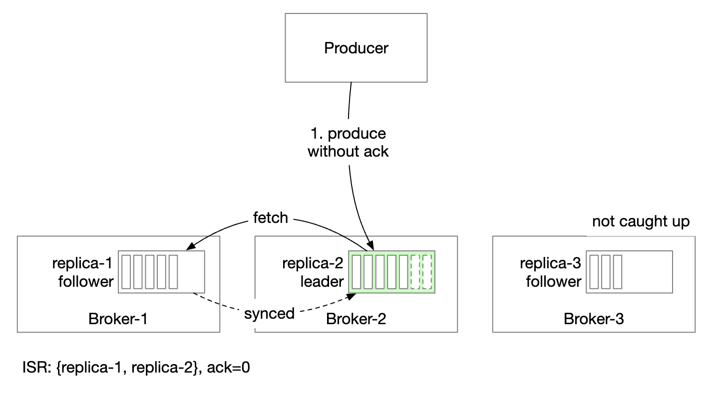

Về phía người tiêu dùng, chúng tôi có thể kết nối tất cả người tiêu dùng với người dẫn đầu cho partition và cho phép họ đọc tin nhắn từ đó:

* Điều này làm cho thiết kế đơn giản nhất và vận hành dễ dàng nhất
* Tin nhắn trong partition chỉ được gửi đến một người tiêu dùng trong nhóm, điều này giới hạn kết nối với replica người lãnh đạo
* Số lượng kết nối đến replica lãnh đạo thường không cao miễn là topic không quá hot
* Chúng tôi có thể scaling topic hấp dẫn bằng cách tăng số lượng partitions và người tiêu dùng
* Trong một số trường hợp nhất định, có thể hợp lý nếu để người tiêu dùng dẫn đầu từ ISR, ví dụ: nếu họ ở một DC riêng biệt

Danh sách ISR được duy trì bởi người lãnh đạo theo dõi latency giữa chính nó và từng replica.

### **Scalability**

Hãy đánh giá cách chúng ta có thể scaling các phần khác nhau của hệ thống.

#### Nhà sản xuất

Người sản xuất nhỏ hơn nhiều so với người tiêu dùng. scalability của nó có thể dễ dàng đạt được bằng cách thêm/xóa các phiên bản nhà sản xuất mới.

#### Người tiêu dùng

Consumer groups được cách ly với nhau. Thật dễ dàng để thêm/xóa consumer groups theo ý muốn.

Tái cân bằng giúp xử lý trường hợp người tiêu dùng được thêm/xóa khỏi nhóm một cách khéo léo.

Consumer groups đang tái cân bằng giúp chúng tôi đạt được scalability và fault tolerance.

#### Broker

brokers xử lý lỗi như thế nào?

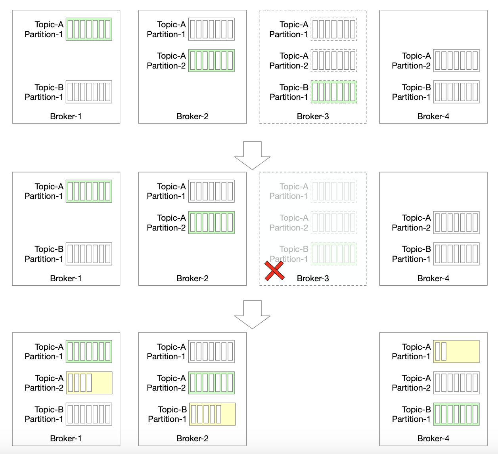

* Khi broker bị lỗi, vẫn còn đủ replica để tránh mất dữ liệu partition
* Một nhà lãnh đạo mới được bầu và điều phối viên broker phân phối lại partitions ở broker không thành công cho các replica hiện có
* Các replica hiện có chọn partitions mới và đóng vai trò là người theo dõi cho đến khi chúng bắt kịp người dẫn đầu và trở thành ISR

Những cân nhắc bổ sung để làm cho broker có khả năng chịu lỗi:

* Số lượng ISR tối thiểu cân bằng latency và an toàn. Bạn có thể tinh chỉnh nó để đáp ứng nhu cầu của bạn.
* Nếu tất cả các replica của partition đều nằm trong cùng một node thì thật lãng phí tài nguyên. Các replica phải ở các brokers khác nhau.
* Nếu tất cả các replica của partition gặp sự cố thì dữ liệu sẽ bị mất vĩnh viễn. Việc phổ biến các replica trên data centers có thể hữu ích nhưng nó sẽ bổ sung thêm rất nhiều latency. Một tùy chọn là sử dụng [phản chiếu dữ liệu](https://cwiki.apache.org/confluence/pages/viewpage.action?pageId=27846330) để giải quyết.

Làm cách nào để chúng tôi xử lý việc phân phối lại replica khi thêm broker mới?

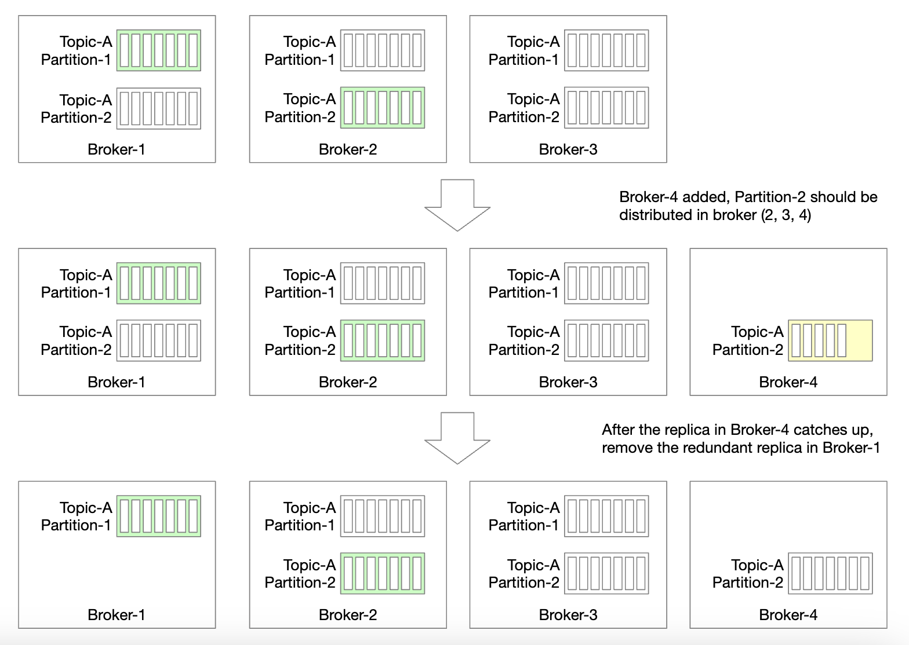

* Chúng tôi có thể tạm thời cho phép nhiều replica hơn mức được định cấu hình cho đến khi broker mới bắt kịp
* Sau khi thực hiện xong, chúng tôi có thể xóa replica partition không còn cần thiết nữa

#### Partition

Bất cứ khi nào partition mới được thêm vào, nhà sản xuất sẽ được thông báo và việc tái cân bằng người tiêu dùng được kích hoạt.

Về mặt lưu trữ dữ liệu, chúng tôi chỉ có thể lưu trữ tin nhắn mới vào partition mới thay vì cố gắng sao chép tất cả tin nhắn cũ:

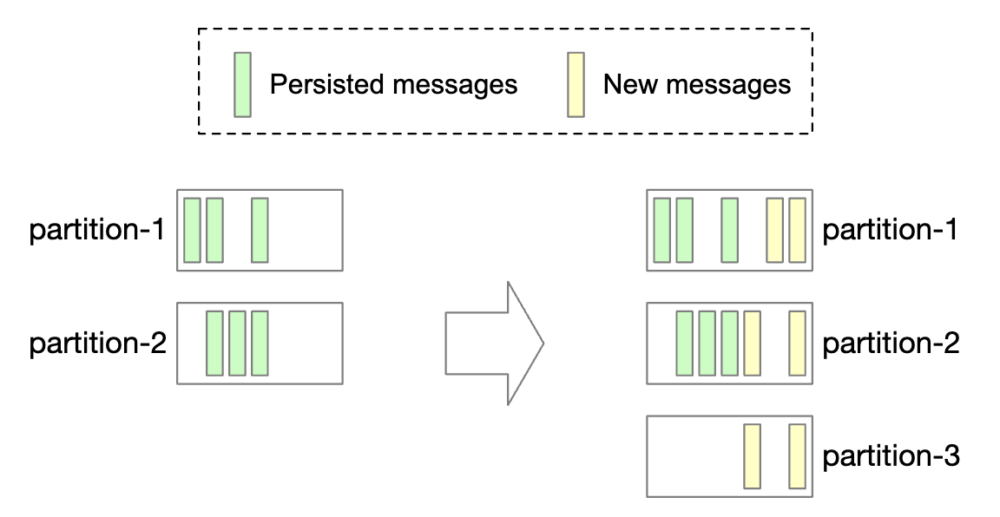

Việc giảm số lượng partitions có liên quan nhiều hơn:

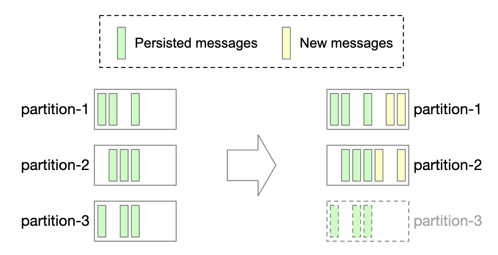

* Sau khi partition ngừng hoạt động, chỉ partitions còn lại mới nhận được tin nhắn mới
* partition đã ngừng hoạt động sẽ không bị xóa ngay lập tức vì vẫn có thể sử dụng tin nhắn từ nó
* Sau khi hết thời gian lưu giữ được định cấu hình trước, chúng tôi có cắt bớt dữ liệu và giải phóng dung lượng lưu trữ không
* Trong giai đoạn chuyển tiếp, nhà sản xuất chỉ gửi tin nhắn đến active partitions, nhưng người tiêu dùng đọc từ tất cả
* Sau khi hết thời gian lưu giữ, người tiêu dùng sẽ được cân bằng lại

### **Ngữ nghĩa phân phối dữ liệu**

Hãy thảo luận về ngữ nghĩa phân phối khác nhau.

#### Nhiều nhất một lần

Với sự đảm bảo này, tin nhắn sẽ được gửi không quá một lần và hoàn toàn không thể gửi được.

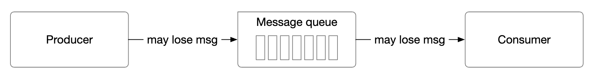

* Nhà sản xuất gửi tin nhắn không đồng bộ tới topic. Nếu việc gửi tin nhắn không thành công thì không cần thử lại.
* Người tiêu dùng tìm nạp tin nhắn và ngay lập tức cam kết bù đắp. Nếu người tiêu dùng gặp sự cố trước khi xử lý tin nhắn, tin nhắn sẽ không được xử lý.

#### Ít nhất một lần

Một tin nhắn có thể được gửi nhiều lần và không có tin nhắn nào được xử lý.

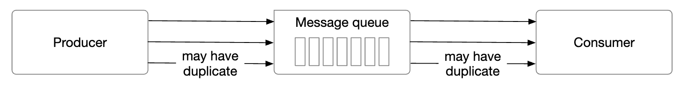

* Nhà sản xuất gửi tin nhắn với `ack=1` hoặc `ack=all`. Nếu có bất kỳ vấn đề gì, nó sẽ tiếp tục thử lại.
* Người tiêu dùng tìm nạp tin nhắn và chỉ sử dụng phần bù sau khi xử lý xong.
* Một tin nhắn có thể được gửi nhiều lần nếu ví dụ: người tiêu dùng gặp sự cố trước khi thực hiện bù trừ nhưng sau khi xử lý nó.
* Đây là lý do tại sao, điều này tốt cho các trường hợp sử dụng có thể chấp nhận được việc sao chép dữ liệu hoặc có thể loại bỏ trùng lặp.

#### Đúng một lần

Việc triển khai hệ thống cực kỳ tốn kém, mặc dù đó là sự đảm bảo thân thiện nhất với người dùng:

### **Tính năng nâng cao**

Hãy thảo luận về một số tính năng nâng cao, chúng ta có thể thảo luận trong cuộc phỏng vấn.

#### Lọc tin nhắn

Một số người tiêu dùng có thể chỉ muốn sử dụng các tin nhắn thuộc một loại nhất định trong partition.

Điều này có thể đạt được bằng cách xây dựng topics riêng biệt cho từng tập hợp con tin nhắn, nhưng điều này có thể tốn kém nếu hệ thống có quá nhiều trường hợp sử dụng khác nhau.

* Thật lãng phí tài nguyên khi lưu trữ cùng một tin nhắn trên các topics khác nhau
* Nhà sản xuất hiện được kết hợp chặt chẽ với người tiêu dùng khi nó thay đổi theo từng yêu cầu mới của người tiêu dùng

Chúng tôi có thể giải quyết vấn đề này bằng cách lọc tin nhắn.

* Một cách tiếp cận đơn giản là thực hiện lọc ở phía người tiêu dùng, nhưng điều đó sẽ tạo ra lưu lượng truy cập không cần thiết của người tiêu dùng
* Ngoài ra, tin nhắn có thể có thẻ đính kèm và người tiêu dùng có thể chỉ định thẻ nào họ đã đăng ký
* Việc lọc cũng có thể được thực hiện thông qua tải trọng tin nhắn nhưng việc đó có thể khó khăn và không an toàn đối với các tin nhắn được mã hóa/tuần tự hóa
* Đối với các công thức toán học phức tạp hơn, broker có thể triển khai trình phân tích cú pháp ngữ pháp hoặc trình thực thi tập lệnh, nhưng điều đó có thể nặng nề đối với message queue

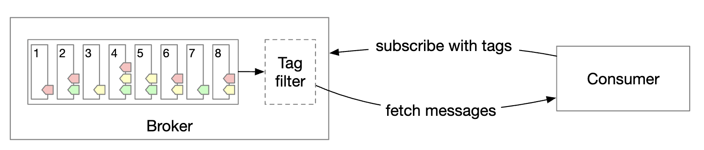

#### Tin nhắn bị trì hoãn và tin nhắn đã lên lịch

Đối với một số trường hợp sử dụng, chúng tôi có thể muốn trì hoãn hoặc lên lịch gửi tin nhắn.
Ví dụ: chúng tôi có thể gửi séc xác minh thanh toán trong 30 phút kể từ bây giờ, điều này sẽ kích hoạt người tiêu dùng xem liệu thanh toán có thành công hay không.

Điều này có thể đạt được bằng cách gửi tin nhắn đến bộ lưu trữ tạm thời trong broker và di chuyển tin nhắn đến partition vào đúng thời điểm:

* Bộ lưu trữ tạm thời có thể là một hoặc nhiều tin nhắn đặc biệt topics
* Chức năng định thời gian có thể đạt được bằng cách sử dụng hàng đợi trễ chuyên dụng hoặc [bánh xe thời gian phân cấp] (http://www.cs.columbia.edu/~nahum/w6998/papers/sosp87-timing-wheels.pdf)

---

Bước 4: Kết thúc
---------------

Điểm nói chuyện bổ sung:

* **Giao thức liên lạc**: Những cân nhắc quan trọng - hỗ trợ tất cả các trường hợp sử dụng và khối lượng dữ liệu lớn, cũng như xác minh tính toàn vẹn của tin nhắn. Các giao thức phổ biến - giao thức AMQP và Kafka.
* **Thử sử dụng lại**: nếu chúng tôi không thể xử lý tin nhắn ngay lập tức, chúng tôi có thể gửi tin nhắn đó đến topic thử lại chuyên dụng để thử lại sau.
* **Lưu trữ dữ liệu lịch sử**: tin nhắn cũ có thể được sao lưu trong các kho lưu trữ dung lượng cao như HDFS hoặc object storage (ví dụ S3).