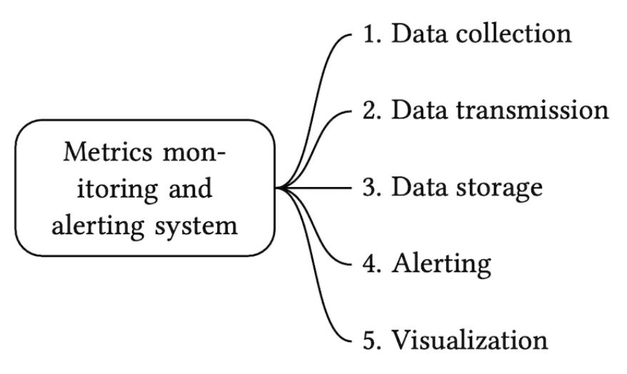
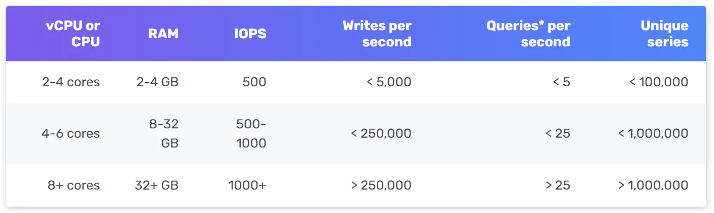
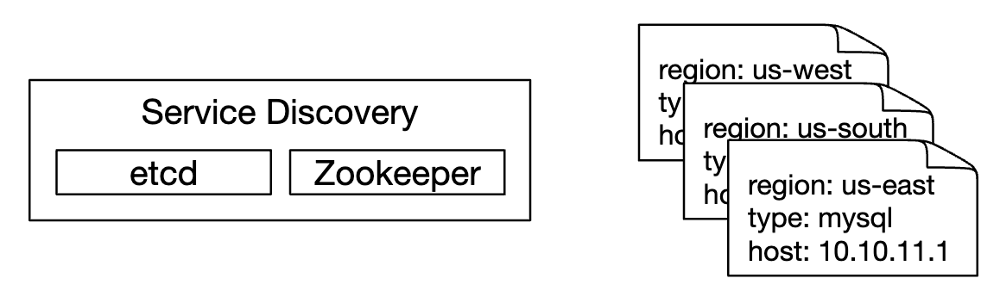
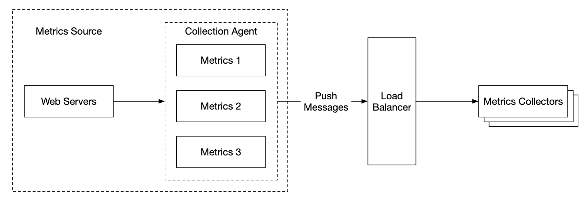
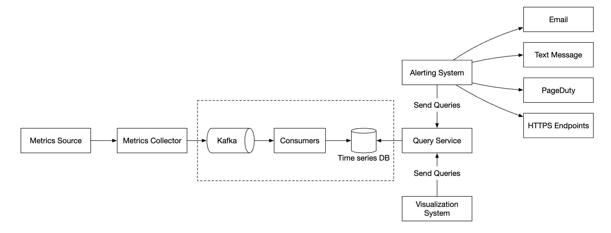
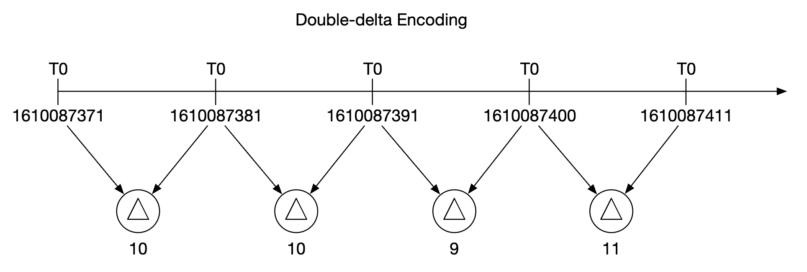
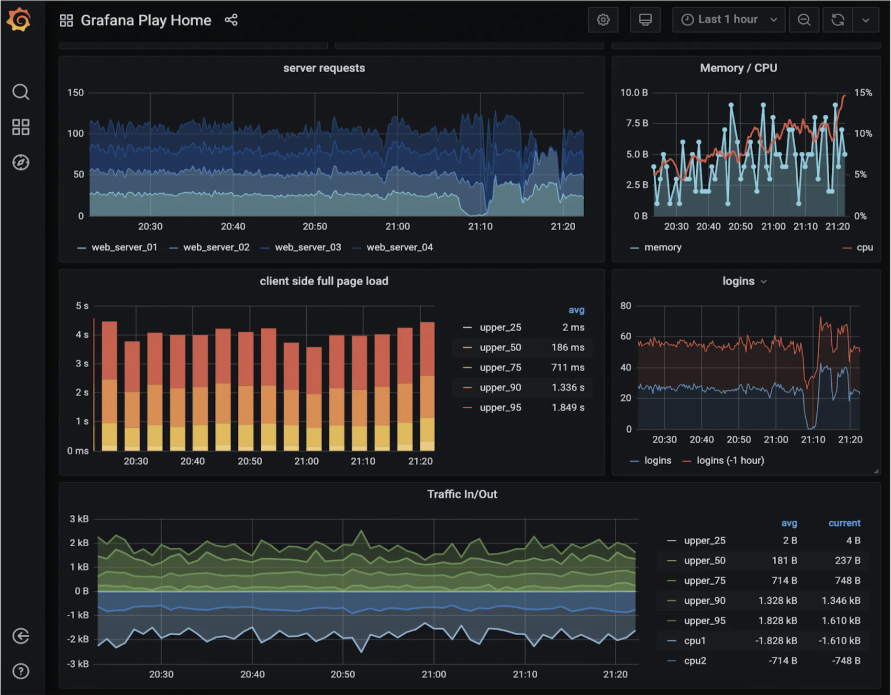
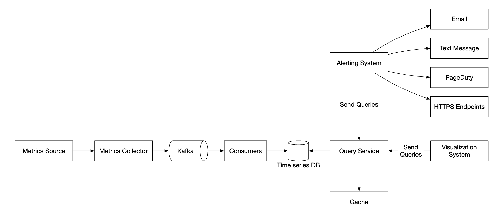

Chương 20: Hệ thống giám sát và cảnh báo số liệu
======================================================

Giới thiệu
------------

Chương này tập trung vào việc thiết kế một **hệ thống cảnh báo và giám sát số liệu** có scalability cao, hệ thống này rất quan trọng để đảm bảo độ tin cậy và availability cao.

---

Bước 1: Hiểu vấn đề và thiết lập phạm vi thiết kế
---------------------------------------------------------

Hệ thống giám sát số liệu có thể có nhiều ý nghĩa khác nhau - ví dụ: bạn không muốn thiết kế hệ thống tổng hợp nhật ký khi người phỏng vấn chỉ quan tâm đến các số liệu cơ sở hạ tầng.

Trước tiên chúng ta hãy cố gắng hiểu vấn đề:

* C: Chúng ta đang xây dựng hệ thống cho ai? Hệ thống giám sát nội bộ dành cho một công ty công nghệ lớn hay SaaS như DataDog?
* Tôi: Chúng tôi đang xây dựng chỉ để sử dụng nội bộ.
* C: Chúng tôi muốn thu thập số liệu nào?
* I: Số liệu hệ điều hành - Tải CPU, Bộ nhớ, Dung lượng ổ đĩa dữ liệu. Ngoài ra còn có các số liệu cấp cao như yêu cầu mỗi giây. Số liệu kinh doanh không nằm trong phạm vi.
* C: Quy mô cơ sở hạ tầng mà chúng tôi đang giám sát là gì?
* I: 100 triệu người dùng active hàng ngày, 1000 nhóm server, 100 máy mỗi nhóm
* C: Chúng ta nên lưu giữ dữ liệu trong bao lâu?
* I: Giả sử thời gian lưu giữ là 1y.
* C: Chúng tôi có thể giảm độ phân giải dữ liệu số liệu để lưu trữ lâu dài không?
* I: Giữ số liệu mới nhận được trong 7 ngày. Cuộn chúng có độ phân giải lên tới 1m trong 30 ngày tiếp theo. Tiếp tục cuộn chúng lên độ phân giải 1h sau 30 ngày.
* C: Các kênh cảnh báo được hỗ trợ là gì?
* Tôi: Email, điện thoại, PagerDuty hoặc webhooks.
* C: Chúng tôi có cần thu thập nhật ký như nhật ký lỗi hoặc nhật ký truy cập không?
* Tôi: Không
* C: Chúng ta có cần hỗ trợ việc theo dõi hệ thống phân tán không?
* Tôi: Không

### **Yêu cầu và giả định cấp cao**

Cơ sở hạ tầng đang được giám sát có quy mô lớn:

* 100 triệu DAU
* 1000 nhóm server \* 100 máy \* ~100 số liệu trên mỗi máy -> ~10 triệu số liệu
* Lưu giữ dữ liệu 1 năm
* Chính sách lưu giữ dữ liệu - thô cho 7d, độ phân giải 1 phút cho 30d, độ phân giải 1h cho 1y

Một loạt các số liệu có thể được theo dõi:

* Tải CPU
* Số lượng yêu cầu
* Sử dụng bộ nhớ
* Số tin nhắn trong message queues

### **Yêu cầu phi chức năng**

* **Scalability**: Hệ thống phải có scalability để đáp ứng nhiều số liệu và cảnh báo hơn
* **latency thấp**: Hệ thống cần có truy vấn latency thấp cho bảng điều khiển và cảnh báo
* **Độ tin cậy**: Hệ thống phải có độ tin cậy cao để tránh bỏ lỡ các cảnh báo quan trọng
* **Tính linh hoạt**: Hệ thống có thể dễ dàng tích hợp các công nghệ mới trong tương lai

Những yêu cầu nào nằm ngoài phạm vi?

* **Giám sát nhật ký**: ngăn xếp ELK rất phổ biến cho trường hợp sử dụng này
* **Theo dõi hệ thống phân tán**: điều này đề cập đến việc thu thập dữ liệu về vòng đời yêu cầu khi nó truyền qua nhiều dịch vụ trong hệ thống

---

Bước 2: Đề xuất thiết kế cấp cao và nhận được sự đồng ý
------------------------------------------------

### **Cơ bản**

Có năm thành phần cốt lõi liên quan đến hệ thống cảnh báo và giám sát số liệu:



* **Thu thập dữ liệu**: thu thập dữ liệu số liệu từ nhiều nguồn khác nhau
* **Truyền dữ liệu**: truyền dữ liệu từ nguồn tới hệ thống giám sát số liệu
* **Lưu trữ dữ liệu**: sắp xếp và lưu trữ dữ liệu đến
* **Cảnh báo**: Phân tích dữ liệu đến, phát hiện sự bất thường và tạo cảnh báo
* **Trực quan hóa**: Trình bày dữ liệu dưới dạng biểu đồ, biểu đồ, v.v.

### **Mô hình dữ liệu**

Dữ liệu số liệu thường được ghi lại dưới dạng chuỗi thời gian, chứa tập hợp các giá trị có dấu thời gian.
Chuỗi có thể được xác định bằng tên và một bộ thẻ tùy chọn.

Ví dụ 1 - Tải CPU trên phiên bản server i631 sản xuất lúc 20:00 là bao nhiêu?


Dữ liệu có thể được xác định theo bảng sau:


Chuỗi thời gian được xác định bằng tên chỉ số, nhãn và một điểm tại một thời điểm cụ thể.

Ví dụ 2 - Tải CPU trung bình trên tất cả web servers ở region phía tây Hoa Kỳ trong 10 phút qua là bao nhiêu?

```
CPU.load host=webserver01,region=us-west 1613707265 50

CPU.load host=webserver01,region=us-west 1613707265 62

CPU.load host=webserver02,region=us-west 1613707265 43

CPU.load host=webserver02,region=us-west 1613707265 53

...

CPU.load host=webserver01,region=us-west 1613707265 76

CPU.load host=webserver01,region=us-west 1613707265 83
```

Đây là dữ liệu mẫu mà chúng tôi có thể lấy từ bộ lưu trữ để trả lời câu hỏi đó.
Tải CPU trung bình có thể được tính bằng cách lấy trung bình các giá trị ở cột cuối cùng của hàng.

Định dạng hiển thị ở trên được gọi là giao thức network path và được sử dụng bởi nhiều phần mềm giám sát phổ biến trên thị trường - ví dụ Prometheus, OpenTSDB.

Mỗi chuỗi thời gian bao gồm những gì:


Một cách hay để hình dung dữ liệu trông như thế nào:


* Trục x là thời gian
* trục y là thứ nguyên bạn đang truy vấn - ví dụ: tên chỉ số, thẻ, v.v.

Mẫu truy cập dữ liệu có nhiều lượt ghi và số lần đọc tăng vọt khi chúng tôi thu thập nhiều số liệu, nhưng chúng không được truy cập thường xuyên, mặc dù theo từng đợt khi có sự cố đang diễn ra.

Hệ thống lưu trữ dữ liệu là trái tim của thiết kế này.

* Không nên sử dụng database có mục đích chung cho vấn đề này, mặc dù bạn có thể đạt được điều chỉnh ở cấp độ chuyên gia ở quy mô tốt \w.
* Về mặt lý thuyết, việc sử dụng NoSQL database có thể hiệu quả, nhưng thật khó để đưa ra một lược đồ có thể scaling để lưu trữ và truy vấn dữ liệu chuỗi thời gian một cách hiệu quả.

Có nhiều databases, được thiết kế đặc biệt để lưu trữ dữ liệu chuỗi thời gian. Nhiều trong số chúng hỗ trợ các giao diện truy vấn tùy chỉnh cho phép truy vấn dữ liệu chuỗi thời gian một cách hiệu quả.

* OpenTSDB là database chuỗi thời gian phân tán, nhưng nó dựa trên Hadoop và HBase. Nếu bạn không cung cấp cơ sở hạ tầng đó thì sẽ khó sử dụng công nghệ này.
* Twitter sử dụng MetricsDB, trong khi Amazon cung cấp Timestream.
* Hai chuỗi thời gian databases phổ biến nhất là InfluxDB và Prometheus.
* Chúng được thiết kế để lưu trữ khối lượng lớn dữ liệu chuỗi thời gian. Cả hai đều dựa trên bộ lưu trữ trên đĩa cache + trong bộ nhớ.

Quy mô ví dụ về InfluxDB - hơn 250k ghi mỗi giây khi được cung cấp 8 lõi và 32gb RAM:



Bạn không cần phải hiểu nội dung bên trong của số liệu database vì đây là kiến ​​thức chuyên sâu. Bạn chỉ có thể được hỏi nếu bạn đã đề cập đến nó trong sơ yếu lý lịch của mình.

Với mục đích của cuộc phỏng vấn, chỉ cần hiểu rằng số liệu là dữ liệu chuỗi thời gian và nhận thức được databases chuỗi thời gian phổ biến, như InfluxDB là đủ.

Một tính năng hay của databases chuỗi thời gian là tổng hợp và phân tích hiệu quả một lượng lớn dữ liệu chuỗi thời gian theo nhãn.
Ví dụ: InfluxDB xây dựng chỉ mục cho từng nhãn.

Tuy nhiên, điều quan trọng là phải giữ số lượng nhãn ở mức thấp - tức là không sử dụng quá nhiều nhãn duy nhất.

### **Thiết kế cao cấp**


* **Nguồn số liệu**: có thể là ứng dụng servers, SQL databases, message queues, v.v.
* **Trình thu thập số liệu**: Thu thập dữ liệu số liệu và ghi vào database chuỗi thời gian
* **Chuỗi thời gian database**: lưu trữ số liệu dưới dạng chuỗi thời gian. Cung cấp giao diện truy vấn tùy chỉnh để phân tích số lượng lớn số liệu.
* **Dịch vụ truy vấn**: Giúp dễ dàng truy vấn và truy xuất dữ liệu từ DB chuỗi thời gian. Có thể thay thế hoàn toàn bằng giao diện của DB nếu nó đủ mạnh.
* **Hệ thống cảnh báo**: Gửi thông báo cảnh báo đến nhiều điểm đến cảnh báo khác nhau.
* **Hệ thống trực quan**: Hiển thị số liệu dưới dạng đồ thị/biểu đồ.

---

Bước 3: Thiết kế Deep Dive
---------------

Hãy cùng đi sâu vào một số phần thú vị hơn của hệ thống.

### **Bộ sưu tập số liệu**

Đối với việc thu thập số liệu, việc mất dữ liệu thường xuyên không nghiêm trọng. Việc clients kích hoạt và quên là có thể chấp nhận được.


Có hai cách để triển khai thu thập số liệu - kéo hoặc đẩy.

Đây là mô hình kéo có thể trông như thế nào:


Đối với giải pháp này, trình thu thập số liệu cần duy trì danh sách cập nhật các dịch vụ và điểm cuối số liệu.
Chúng tôi có thể sử dụng Zookeeper hoặc etcd cho mục đích đó - khám phá dịch vụ.

Khám phá dịch vụ chứa các quy tắc cấu hình về thời điểm và vị trí thu thập số liệu từ:



Dưới đây là giải thích chi tiết về quy trình thu thập số liệu:


* Trình thu thập số liệu tìm nạp siêu dữ liệu cấu hình từ quá trình khám phá dịch vụ. Điều này bao gồm khoảng thời gian kéo, địa chỉ IP, thông số thời gian chờ và thử lại.
* Trình thu thập số liệu lấy dữ liệu số liệu thông qua điểm cuối http được xác định trước (ví dụ: `/metrics`). Điều này thường được thực hiện bởi thư viện client.
* Ngoài ra, trình thu thập số liệu có thể đăng ký thông báo sự kiện thay đổi với tính năng khám phá dịch vụ để được thông báo khi điểm cuối dịch vụ thay đổi.
* Một tùy chọn khác là bộ thu thập số liệu thăm dò định kỳ để biết các thay đổi về cấu hình điểm cuối số liệu.

Ở quy mô của chúng tôi, một bộ thu thập số liệu duy nhất là không đủ. Phải có nhiều trường hợp.
Tuy nhiên, cũng phải có sự đồng bộ nào đó giữa chúng để hai người thu thập không thu thập cùng một số liệu hai lần.

Một giải pháp cho vấn đề này là định vị các bộ thu thập và servers trên consistent hash ring và chỉ liên kết một bộ servers với một bộ thu duy nhất:


Mặt khác, với mô hình đẩy, các dịch vụ sẽ chủ động đẩy số liệu của họ đến bộ thu thập số liệu:


Theo phương pháp này, thông thường một tác nhân thu thập được cài đặt cùng với các phiên bản dịch vụ.
Tác nhân thu thập số liệu từ server và đẩy chúng đến bộ thu thập số liệu.



Với mô hình này, chúng tôi có thể tổng hợp các số liệu trước khi gửi chúng đến người thu thập, điều này làm giảm khối lượng dữ liệu được người thu thập xử lý.

Mặt khác, trình thu thập số liệu có thể từ chối các yêu cầu đẩy vì nó không thể xử lý tải.
Do đó, điều quan trọng là thêm bộ sưu tập vào nhóm auto-scaling đằng sau load balancer.

vậy cái nào tốt hơn? Có sự cân bằng giữa cả hai cách tiếp cận và các hệ thống khác nhau sử dụng các cách tiếp cận khác nhau:

* Prometheus sử dụng kiến trúc kéo
* Amazon Cloud Watch và Graphite sử dụng kiến trúc đẩy

Dưới đây là một số khác biệt chính giữa đẩy và kéo:

|  | Kéo | Đẩy |
| --- | --- | --- |
| Dễ dàng gỡ lỗi | Điểm cuối /metrics trên ứng dụng servers được sử dụng để lấy số liệu có thể được sử dụng để xem số liệu bất kỳ lúc nào. Bạn thậm chí có thể làm điều này trên máy tính xách tay của bạn. Kéo thắng. | Nếu trình thu thập số liệu không nhận được số liệu thì sự cố có thể do sự cố mạng gây ra. |
| Kiểm tra sức khỏe | Nếu ứng dụng server không phản hồi với thao tác kéo, bạn có thể nhanh chóng biết liệu ứng dụng server có bị hỏng hay không. Kéo thắng. | Nếu trình thu thập số liệu không nhận được số liệu thì sự cố có thể do sự cố mạng gây ra. |
| Công việc ngắn hạn |  | Một số công việc hàng loạt có thể tồn tại trong thời gian ngắn và không kéo dài đủ lâu để thực hiện. Đẩy thắng. Điều này có thể được khắc phục bằng cách giới thiệu các cổng đẩy cho mô hình kéo [22]. |
| Tường lửa hoặc thiết lập mạng phức tạp | Việc có số liệu kéo servers yêu cầu tất cả các điểm cuối số liệu đều có thể truy cập được. Điều này có thể có vấn đề trong nhiều thiết lập data center. Nó có thể yêu cầu một cơ sở hạ tầng mạng phức tạp hơn. | Nếu trình thu thập số liệu được thiết lập với nhóm load balancer và nhóm scaling tự động, thì có thể nhận dữ liệu từ mọi nơi. Đẩy thắng. |
| Hiệu suất | Phương pháp kéo thường sử dụng TCP. | Các phương thức đẩy thường sử dụng UDP. Điều này có nghĩa là phương pháp đẩy cung cấp khả năng vận chuyển số liệu latency thấp hơn. Lập luận phản biện ở đây là nỗ lực thiết lập kết nối TCP là nhỏ so với việc gửi tải trọng số liệu. |
| Tính xác thực của dữ liệu | Ứng dụng servers để thu thập số liệu được xác định trước trong tệp cấu hình. Các số liệu được thu thập từ servers đó được đảm bảo là xác thực. | Bất kỳ loại client nào cũng có thể đẩy số liệu đến bộ thu thập số liệu. Điều này có thể được khắc phục bằng cách đưa servers vào danh sách trắng để chấp nhận số liệu hoặc bằng cách yêu cầu xác thực. |

Không có người chiến thắng rõ ràng. Một tổ chức lớn có lẽ cần hỗ trợ cả hai. Có thể không có cách nào để cài đặt tác nhân đẩy ngay từ đầu.

### **Quy mô quy mô network path số liệu**


Trình thu thập số liệu được cung cấp trong nhóm auto-scaling, bất kể chúng tôi sử dụng mô hình đẩy hay kéo.

Tuy nhiên, có khả năng mất dữ liệu nếu DB chuỗi thời gian không hoạt động. Để giảm thiểu điều này, chúng tôi sẽ cung cấp cơ chế xếp hàng:



* Trình thu thập số liệu đẩy dữ liệu số liệu vào kafka
* Người tiêu dùng hoặc các dịch vụ xử lý luồng như Apache Storm, Flink hoặc Spark xử lý dữ liệu và đẩy dữ liệu đó sang DB theo chuỗi thời gian

Cách tiếp cận này có một số ưu điểm:

* Kafka được sử dụng như một nền tảng tin nhắn phân tán có độ tin cậy cao và có thể scaling
* Nó tách riêng việc thu thập dữ liệu và xử lý dữ liệu với nhau
* Nó có thể ngăn ngừa mất dữ liệu bằng cách giữ lại dữ liệu trong Kafka

Kafka có thể được định cấu hình bằng một partition cho mỗi tên chỉ số để người tiêu dùng có thể tổng hợp dữ liệu theo tên chỉ số.
Để scaling này, chúng tôi có thể bổ sung thêm partition theo thẻ/nhãn và phân loại/ưu tiên các số liệu cần thu thập trước.


Nhược điểm chính của việc sử dụng Kafka cho vấn đề này là chi phí bảo trì/vận hành.
Một cách khác là sử dụng hệ thống nhập quy mô lớn như [Gorilla](https://www.vldb.org/pvldb/vol8/p1816-teller.pdf).
Có thể lập luận rằng việc sử dụng nó sẽ có scalability tương đương với việc sử dụng Kafka để xếp hàng.

### **Nơi có thể xảy ra việc tổng hợp**

Số liệu có thể được tổng hợp ở một số nơi. Có sự đánh đổi giữa các lựa chọn khác nhau:

* **Tác nhân thu thập**: Tác nhân thu thập bên client chỉ hỗ trợ logic tổng hợp đơn giản. Ví dụ: thu thập bộ đếm trong 1m và gửi nó đến bộ thu thập số liệu.
* **Đường dẫn nhập**: Để tổng hợp dữ liệu trước khi ghi vào DB, chúng tôi cần một công cụ xử lý luồng như Flink. Điều này làm giảm khối lượng ghi nhưng chúng tôi làm mất độ chính xác của dữ liệu vì chúng tôi không lưu trữ dữ liệu thô.
* **Bên truy vấn**: Chúng tôi có thể tổng hợp dữ liệu khi chạy truy vấn thông qua hệ thống trực quan hóa của mình. Không bị mất dữ liệu nhưng các truy vấn có thể bị chậm do phải xử lý nhiều dữ liệu.

### **Dịch vụ truy vấn**

Việc có một dịch vụ truy vấn riêng biệt với DB theo chuỗi thời gian sẽ tách hệ thống cảnh báo và trực quan hóa khỏi database, cho phép chúng tôi tách DB khỏi clients và thay đổi nó theo ý muốn.

Chúng ta có thể thêm lớp Cache tại đây để giảm tải cho database chuỗi thời gian:


Chúng tôi cũng có thể tránh thêm hoàn toàn dịch vụ truy vấn vì hầu hết các hệ thống cảnh báo và trực quan hóa đều có plugin mạnh mẽ để tích hợp với hầu hết databases chuỗi thời gian.
Với chuỗi thời gian DB được lựa chọn tốt, chúng tôi có thể không cần phải giới thiệu lớp caching của riêng mình.

Hầu hết DBs chuỗi thời gian không hỗ trợ SQL đơn giản vì nó không hiệu quả khi truy vấn dữ liệu chuỗi thời gian. Dưới đây là một ví dụ về truy vấn SQL để tính toán đường trung bình động hàm mũ:

```
select id,
       temp,
       avg(temp) over (partition by group_nr order by time_read) as rolling_avg
from (
  select id,
         temp,
         time_read,
         interval_group,
         id - row_number() over (partition by interval_group order by time_read) as group_nr
  from (
    select id,
    time_read,
    "epoch"::timestamp + "900 seconds"::interval * (extract(epoch from time_read)::int4 / 900) as interval_group,
    temp
    from readings
  ) t1
) t2
order by time_read;
```

Đây là truy vấn tương tự trong Flux - ngôn ngữ truy vấn được sử dụng trong InfluxDB:

```
from(db:"telegraf")
  |> range(start:-1h)
  |> filter(fn: (r) => r._measurement == "foo")
  |> exponentialMovingAverage(size:-10s)
```

### **Lớp lưu trữ**

Điều quan trọng là phải chọn database chuỗi thời gian một cách cẩn thận.

Theo nghiên cứu do Facebook công bố, ~ 85% truy vấn đến cửa hàng đang vận hành là về dữ liệu trong 26 giờ qua.

Nếu chúng tôi chọn database khai thác thuộc tính này, nó có thể có tác động đáng kể đến hiệu suất hệ thống. InfluxDB là một trong những lựa chọn như vậy.

Bất kể database mà chúng tôi chọn, đều có một số tối ưu hóa mà chúng tôi có thể sử dụng.

Mã hóa và nén dữ liệu có thể làm giảm đáng kể kích thước của dữ liệu. Những tính năng đó thường được tích hợp vào database theo chuỗi thời gian tốt.



Trong ví dụ trên, thay vì lưu trữ dấu thời gian đầy đủ, chúng ta có thể lưu trữ dấu thời gian delta.

Một kỹ thuật khác mà chúng tôi có thể sử dụng là lấy mẫu xuống - chuyển đổi dữ liệu có độ phân giải cao sang độ phân giải thấp để giảm mức sử dụng đĩa.

Chúng tôi có thể sử dụng dữ liệu đó cho dữ liệu cũ và đặt ra các quy tắc có thể được cấu hình bởi các nhà khoa học dữ liệu, ví dụ:

* 7d - không lấy mẫu xuống
* 30d - giảm mẫu xuống 1 phút
* 1y - giảm mẫu xuống 1h

Ví dụ: đây là bảng số liệu có độ phân giải 10 giây:

| số liệu | dấu thời gian | hostname | Số liệu\_giá trị |
| --- | --- | --- | --- |
| cpu | 2021-10-24T19:00:00Z | host-a | 10 |
| cpu | 24-10-2021T19:00:10Z | host-a | 16 |
| cpu | 24-10-2021T19:00:20Z | host-a | 20 |
| cpu | 24-10-2021T19:00:30Z | host-a | 30 |
| cpu | 24-10-2021T19:00:40Z | host-a | 20 |
| cpu | 24/10/2021T19:00:50Z | host-a | 30 |

giảm mẫu xuống độ phân giải 30 giây:

| số liệu | dấu thời gian | hostname | Số liệu\_giá trị (trung bình) |
| --- | --- | --- | --- |
| cpu | 2021-10-24T19:00:00Z | host-a | 19 |
| cpu | 24-10-2021T19:00:30Z | host-a | 25 |

Cuối cùng, chúng ta cũng có thể sử dụng kho lạnh để sử dụng những dữ liệu cũ không còn sử dụng nữa. Chi phí tài chính cho kho lạnh thấp hơn nhiều.

### **Hệ thống cảnh báo**


Cấu hình được tải vào cache servers. Các quy tắc thường được xác định ở định dạng YAML. Đây là một ví dụ:

```
- name: instance_down
  rules:

  # Alert for any instance that is unreachable for >5 minutes.
  - alert: instance_down
    expr: up == 0
    for: 5m
    labels:
      severity: page
```

Trình quản lý cảnh báo tìm nạp cấu hình cảnh báo từ cache. Dựa trên các quy tắc cấu hình, nó cũng gọi dịch vụ truy vấn theo khoảng thời gian được xác định trước.
Nếu một quy tắc được đáp ứng, một sự kiện cảnh báo sẽ được tạo.

Các trách nhiệm khác của người quản lý cảnh báo là:

* Lọc, hợp nhất và loại bỏ cảnh báo trùng lặp. Ví dụ: nếu cảnh báo của một trường hợp được kích hoạt nhiều lần thì chỉ có một sự kiện cảnh báo được tạo.
* Kiểm soát truy cập - điều quan trọng là chỉ hạn chế các hoạt động quản lý cảnh báo đối với một số cá nhân nhất định
* Thử lại - người quản lý đảm bảo rằng cảnh báo được truyền đi ít nhất một lần.

Kho cảnh báo là key-value database, giống như Cassandra, lưu giữ trạng thái của tất cả các cảnh báo. Nó đảm bảo thông báo được gửi ít nhất một lần.
Khi cảnh báo được kích hoạt, nó sẽ được xuất bản lên Kafka.

Cuối cùng, người tiêu dùng cảnh báo lấy dữ liệu cảnh báo từ Kafka và gửi thông báo đến các kênh khác nhau - Email, tin nhắn văn bản, PagerDuty, webhooks.

Trong thế giới thực, có rất nhiều giải pháp sẵn có cho hệ thống cảnh báo. Thật khó để biện minh cho việc xây dựng hệ thống nội bộ của riêng bạn.

### **Hệ thống hiển thị**

Hệ thống trực quan hiển thị số liệu và cảnh báo trong một khoảng thời gian. Đây là trang tổng quan được xây dựng bằng Grafana:



Rất khó để xây dựng một hệ thống trực quan chất lượng cao. Thật khó để biện minh cho việc không sử dụng một giải pháp sẵn có như Grafana.

---

Bước 4: Kết thúc
---------------

Đây là thiết kế cuối cùng của chúng tôi:

