Chương 21: Tổng hợp sự kiện click vào quảng cáo
=========================================

Giới thiệu
------------

**Quảng cáo kỹ thuật số** là một ngành công nghiệp lớn với sự phát triển của Facebook, YouTube, TikTok, v.v.

Do đó, việc theo dõi các sự kiện nhấp chuột vào quảng cáo là rất quan trọng. Trong chương này, chúng ta khám phá cách thiết kế hệ thống **tổng hợp sự kiện nhấp chuột vào quảng cáo** ở quy mô Facebook/Google.

Quảng cáo kỹ thuật số có một quy trình được gọi là **đặt giá thầu theo thời gian thực (RTB)**, trong đó khoảng không quảng cáo kỹ thuật số được mua và bán:


Tốc độ của RTB rất quan trọng vì nó thường xảy ra trong vòng một giây.
Độ chính xác của dữ liệu cũng rất quan trọng vì nó ảnh hưởng đến số tiền mà nhà quảng cáo trả.

Dựa trên tổng hợp sự kiện nhấp chuột vào quảng cáo, nhà quảng cáo có thể đưa ra các quyết định như điều chỉnh đối tượng và từ khóa mục tiêu.

---

Bước 1: Hiểu vấn đề và thiết lập phạm vi thiết kế
---------------------------------------------------------

* C: Dữ liệu đầu vào có định dạng như thế nào?
* I: 1 tỷ lượt click quảng cáo mỗi ngày và tổng cộng 2 triệu quảng cáo. Số sự kiện nhấp chuột vào quảng cáo tăng 30% so với cùng kỳ năm trước.
* C: Một số truy vấn quan trọng nhất mà hệ thống của chúng tôi cần hỗ trợ là gì?
* I: Các truy vấn hàng đầu cần xem xét:
  + Trả về số sự kiện click cho quảng cáo X trong Y phút vừa qua
  + Trả về top 100 quảng cáo được click nhiều nhất trong 1 phút vừa qua. Cả hai tham số nên được cấu hình. Sự tổng hợp xảy ra mỗi phút.
  + Hỗ trợ lọc dữ liệu theo `ip`, `user_id`, `country` cho các truy vấn trên
* C: Chúng ta có cần lo lắng về các trường hợp khó khăn không? Một số trong những cái tôi có thể nghĩ ra:
  + Có thể có sự kiện đến muộn hơn dự kiến
  + Có thể có sự kiện trùng lặp
  + Các phần khác nhau của hệ thống có thể bị hỏng nên chúng ta cần xem xét việc khôi phục hệ thống
* Tôi: Đó là một danh sách tốt, hãy cân nhắc những điều đó
* C: Yêu cầu latency là gì?
* I: Một vài phút của e2e latency để tổng hợp lượt nhấp vào quảng cáo. Đối với RTB, thời gian này chưa đến một giây. Bạn có thể sử dụng latency để tổng hợp lượt nhấp vào quảng cáo vì chúng thường được sử dụng để thanh toán và báo cáo.

### **Yêu cầu về chức năng**

* Tổng hợp số lần nhấp chuột của `ad_id` trong Y phút vừa qua
* Trả về top 100 `ad_id` được nhấp nhiều nhất mỗi phút
* Hỗ trợ lọc tổng hợp theo các thuộc tính khác nhau
* Khối lượng tập dữ liệu ở quy mô Facebook hoặc Google

### **Yêu cầu phi chức năng**

* Độ chính xác của kết quả tổng hợp rất quan trọng vì nó được sử dụng cho RTB và thanh toán quảng cáo
* Xử lý đúng cách các sự kiện bị trì hoãn hoặc trùng lặp
* Tính mạnh mẽ - hệ thống phải có khả năng phục hồi trước các lỗi từng phần
* Latency - tối đa vài phút của e2e latency

### **Ước tính mặt sau**

* 1 tỷ DAU
* Giả sử người dùng nhấp vào 1 quảng cáo mỗi ngày -> 1 tỷ lần nhấp vào quảng cáo mỗi ngày
* Số lần nhấp vào quảng cáo QPS = 10.000
* QPS đỉnh cao gấp 5 lần số lượng = 50.000
* Một cú nhấp chuột vào quảng cáo sẽ chiếm dung lượng lưu trữ 0,1KB. Yêu cầu dung lượng lưu trữ hàng ngày là 100gb
* Dung lượng lưu trữ hàng tháng = 3tb

---

Bước 2: Đề xuất thiết kế cấp cao và nhận được sự đồng ý
------------------------------------------------

Trong phần này, chúng ta thảo luận về thiết kế truy vấn API, mô hình dữ liệu và thiết kế cấp cao.

### **Truy vấn thiết kế API**

API là hợp đồng giữa client và server. Trong trường hợp của chúng tôi, client là người dùng bảng điều khiển - nhà khoa học/nhà phân tích dữ liệu, nhà quảng cáo, v.v.

Đây là yêu cầu chức năng của chúng tôi:

* Tổng hợp số lần nhấp chuột của `ad_id` trong Y phút vừa qua
* Trả về top N được nhấp nhiều nhất `ad_id` trong M phút qua
* Hỗ trợ lọc tổng hợp theo các thuộc tính khác nhau

Chúng tôi cần hai điểm cuối để đạt được những yêu cầu đó. Việc lọc có thể được thực hiện thông qua các tham số truy vấn trên một trong số chúng.

**Tổng số lượt nhấp vào quảng cáo\_id trong M phút vừa qua**:

```
GET /v1/ads/{:ad_id}/aggregated_count
```

Tham số truy vấn:

* từ - phút bắt đầu. Mặc định là bây giờ - 1 phút
* đến - phút cuối. Mặc định là bây giờ
* bộ lọc - mã định danh cho các chiến lược lọc khác nhau. Ví dụ: 001 có nghĩa là "nhấp chuột không phải ở Hoa Kỳ".

Phản hồi:

* ad\_id - mã định danh quảng cáo
* đếm - tổng số giữa phút bắt đầu và phút kết thúc

**Trả về N quảng cáo được nhấp nhiều nhất\_ids trong M phút vừa qua**

```
GET /v1/ads/popular_ads
```

Tham số truy vấn:

* đếm - N quảng cáo được nhấp nhiều nhất
* cửa sổ - kích thước cửa sổ tổng hợp tính bằng phút
* bộ lọc - mã định danh cho các chiến lược lọc khác nhau

Phản hồi:

* danh sách quảng cáo\_ids

### **Mô hình dữ liệu**

Trong hệ thống của chúng tôi, chúng tôi có dữ liệu thô và tổng hợp.

Dữ liệu thô trông như thế này:

```
[AdClickEvent] ad001, 2021-01-01 00:00:01, user 1, 207.148.22.22, USA
```

Đây là một ví dụ ở định dạng có cấu trúc:

| quảng cáo\_id | nhấp chuột\_dấu thời gian | người dùng | ip | đất nước |
| --- | --- | --- | --- | --- |
| quảng cáo001 | 2021-01-01 00:00:01 | người dùng1 | 207.148.22.22 | Mỹ |
| quảng cáo001 | 2021-01-01 00:00:02 | người dùng1 | 207.148.22.22 | Mỹ |
| quảng cáo002 | 2021-01-01 00:00:02 | người dùng2 | 209.153.56.11 | Mỹ |

Đây là phiên bản tổng hợp:

| quảng cáo\_id | nhấp chuột\_phút | lọc\_id | đếm |
| --- | --- | --- | --- |
| quảng cáo001 | 202101010000 | 0012 | 2 |
| quảng cáo001 | 202101010000 | 0023 | 3 |
| quảng cáo001 | 202101010001 | 0012 | 1 |
| quảng cáo001 | 202101010001 | 0023 | 6 |

`filter_id` giúp chúng tôi đạt được các yêu cầu lọc của mình.

| lọc\_id | region | IP | người dùng\_id |
| --- | --- | --- | --- |
| 0012 | Mỹ | \* | \* |
| 0013 | \* | 123.1.2.3 | \* |

Để hỗ trợ nhanh chóng quay lại N quảng cáo được nhấp nhiều nhất trong M phút vừa qua, chúng tôi cũng sẽ duy trì cấu trúc này:

| được nhấp nhiều nhất\_ads |  |  |
| --- | --- | --- |
| cửa sổ\_size | số nguyên | Kích thước cửa sổ tổng hợp (M) tính bằng phút |
| cập nhật\_time\_phút | dấu thời gian | Dấu thời gian cập nhật lần cuối (ở mức độ chi tiết 1 phút) |
| được nhấp nhiều nhất\_ads | mảng | Danh sách ID quảng cáo ở định dạng JSON. |

Một số ưu và nhược điểm giữa việc lưu trữ dữ liệu thô và lưu trữ dữ liệu tổng hợp là gì?

* Dữ liệu thô cho phép sử dụng toàn bộ tập dữ liệu và hỗ trợ lọc và tính toán lại dữ liệu
* Mặt khác, dữ liệu tổng hợp cho phép chúng tôi có tập dữ liệu nhỏ hơn và truy vấn nhanh hơn
* Dữ liệu thô có nghĩa là có kho dữ liệu lớn hơn và truy vấn chậm hơn
* Tuy nhiên, dữ liệu tổng hợp là dữ liệu phái sinh nên có thể bị mất dữ liệu.

Trong thiết kế của chúng tôi, chúng tôi sẽ sử dụng kết hợp cả hai phương pháp:

* Bạn nên giữ lại dữ liệu thô để gỡ lỗi. Nếu có một số lỗi trong quá trình tổng hợp, chúng tôi có thể phát hiện ra lỗi và chèn lấp.
* Dữ liệu tổng hợp cũng nên được lưu trữ để có hiệu suất truy vấn nhanh hơn.
* Dữ liệu thô có thể được lưu trữ trong kho lạnh để tránh tốn thêm chi phí lưu trữ.

Khi nói đến database, có một số yếu tố cần xem xét:

* Dữ liệu trông như thế nào? Nó có tính chất quan hệ, tài liệu hay blob?
* Khối lượng công việc nặng về đọc, viết nhiều hay cả hai?
* Có cần giao dịch không?
* Các truy vấn có dựa vào các hàm OLAP như SUM và COUNT không?

Đối với dữ liệu thô, chúng ta có thể thấy rằng QPS trung bình là 10k và QPS cao nhất là 50k, do đó hệ thống có khả năng ghi nhiều.
Mặt khác, lưu lượng đọc thấp vì dữ liệu thô chủ yếu được sử dụng làm backup nếu có sự cố.

databases quan hệ có thể thực hiện công việc này, nhưng việc scaling ghi có thể là một thách thức.
Ngoài ra, chúng ta có thể sử dụng Cassandra hoặc InfluxDB có khả năng hỗ trợ gốc tốt hơn cho tải ghi nặng.

Một tùy chọn khác là sử dụng Amazon S3 với định dạng dữ liệu cột như ORC, Parquet hoặc AVRO. Vì cách thiết lập này chưa quen thuộc nên chúng tôi sẽ sử dụng Cassandra.

Đối với dữ liệu tổng hợp, khối lượng công việc vừa đọc vừa ghi nặng vì dữ liệu tổng hợp liên tục được truy vấn để có bảng thông tin và cảnh báo.
Nó cũng nặng về khả năng ghi vì dữ liệu được tổng hợp và ghi mỗi phút bởi dịch vụ tổng hợp.
Do đó, chúng tôi cũng sẽ sử dụng cùng một kho dữ liệu (Cassandra) ở đây.

### **Thiết kế cao cấp**

Đây là cách hệ thống của chúng tôi trông như thế nào:

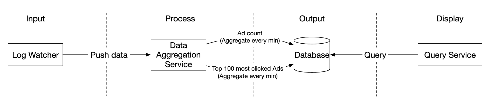

Luồng dữ liệu dưới dạng luồng dữ liệu không giới hạn trên cả đầu vào và đầu ra.

Để tránh xảy ra tình trạng bồn rửa đồng bộ, trong đó sự cố của người tiêu dùng có thể khiến toàn bộ hệ thống bị đình trệ,
chúng tôi sẽ tận dụng quá trình xử lý không đồng bộ bằng message queues (Kafka) để tách rời người tiêu dùng và nhà sản xuất.


message queue đầu tiên lưu trữ dữ liệu sự kiện nhấp vào quảng cáo:

| quảng cáo\_id | nhấp chuột\_dấu thời gian | người dùng\_id | ip | đất nước |
| --- | --- | --- | --- | --- |

message queue thứ hai chứa số lần nhấp vào quảng cáo, được tổng hợp mỗi phút:

| quảng cáo\_id | nhấp chuột\_phút | đếm |
| --- | --- | --- |

Cũng như N quảng cáo được nhấp chuột nhiều nhất được tổng hợp mỗi phút:

| cập nhật\_time\_phút | được nhấp nhiều nhất\_ads |
| --- | --- |

message queue thứ hai có mặt để đạt được ngữ nghĩa cam kết nguyên tử chính xác từ đầu đến cuối:

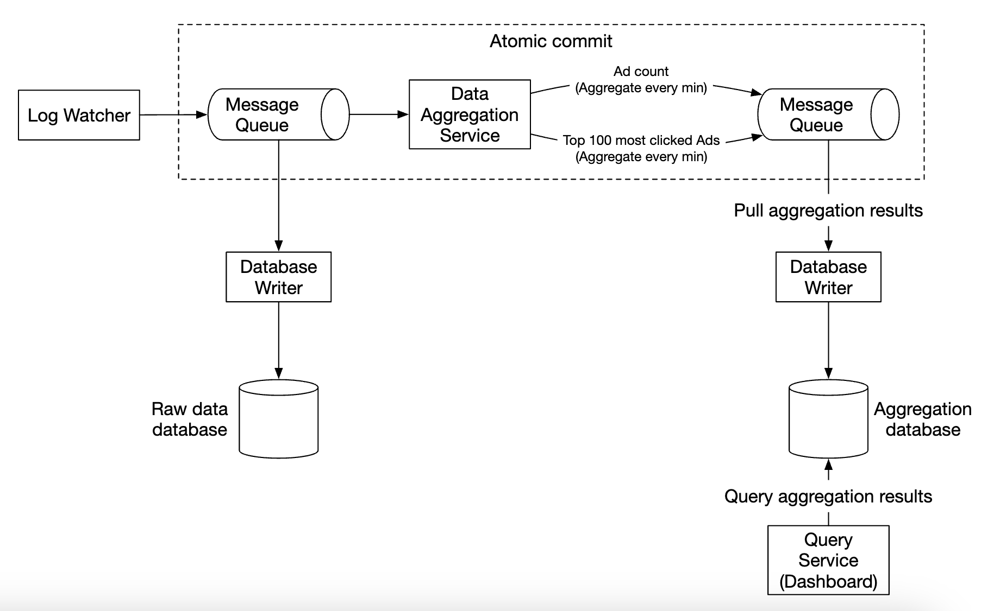

Đối với dịch vụ tổng hợp, sử dụng khung MapReduce là một lựa chọn tốt:

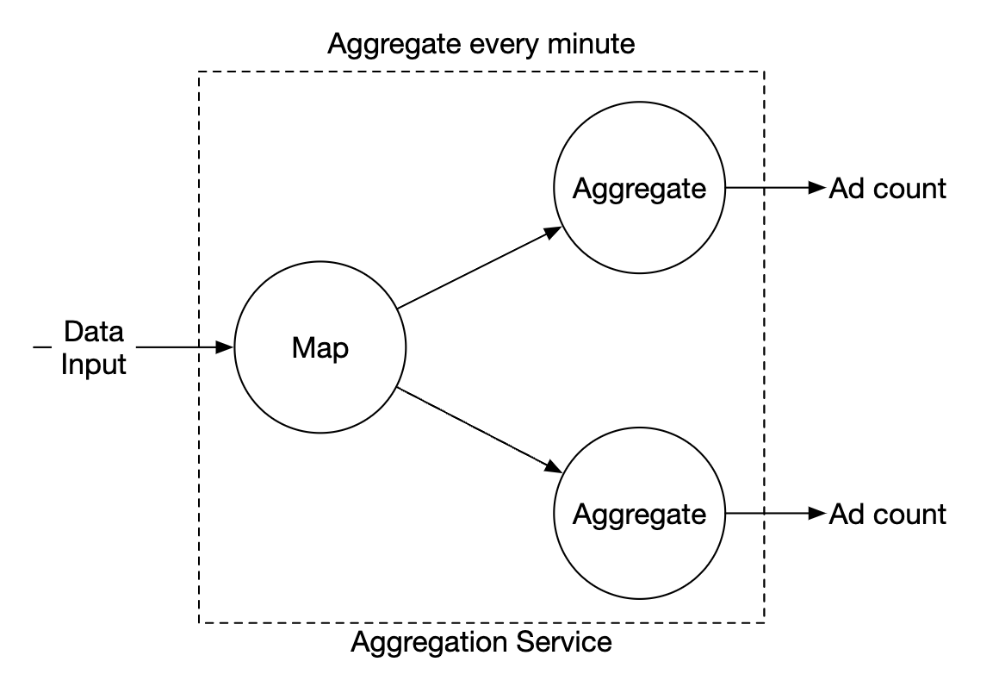


Mỗi node chịu trách nhiệm cho một nhiệm vụ duy nhất và nó sẽ gửi kết quả xử lý đến node xuôi dòng.

Bản đồ node chịu trách nhiệm đọc từ nguồn dữ liệu, sau đó lọc và chuyển đổi dữ liệu.

Ví dụ: bản đồ node có thể phân bổ dữ liệu trên nodes tổng hợp khác nhau dựa trên `ad_id`:

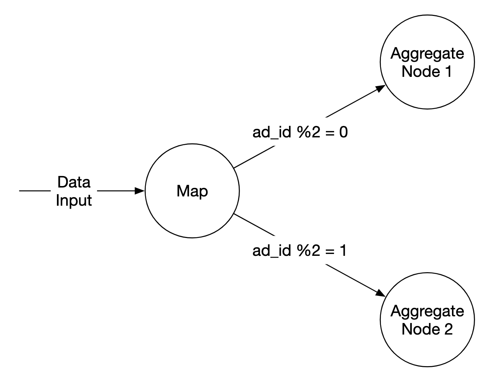

Ngoài ra, chúng tôi có thể phân phối quảng cáo trên Kafka partitions và cho phép tổng hợp nodes đăng ký trực tiếp trong consumer group.
Tuy nhiên, ánh xạ node cho phép chúng tôi vệ sinh hoặc chuyển đổi dữ liệu trước khi xử lý tiếp theo.

Một lý do khác có thể là chúng tôi không kiểm soát được cách dữ liệu được tạo ra,
vì vậy các sự kiện liên quan đến cùng một `ad_id` có thể diễn ra trên partitions khác nhau.

node tổng hợp tính các sự kiện nhấp vào quảng cáo theo `ad_id` trong bộ nhớ mỗi phút.

node rút gọn thu thập các kết quả tổng hợp từ node tổng hợp và tạo ra kết quả cuối cùng:

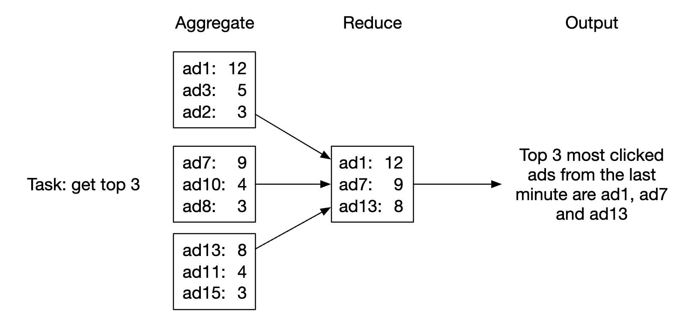

Mô hình DAG này sử dụng mô hình MapReduce. Cần có dữ liệu lớn và tận dụng tính toán phân tán song song để biến nó thành dữ liệu có kích thước thông thường.

Trong mô hình DAG, dữ liệu trung gian được lưu trữ trong bộ nhớ và các nodes khác nhau giao tiếp với nhau bằng TCP hoặc bộ nhớ dùng chung.

Hãy cùng khám phá xem mô hình này hiện có thể giúp chúng ta đạt được các trường hợp sử dụng khác nhau như thế nào.

**Trường hợp sử dụng 1 - tổng hợp số lần nhấp**:

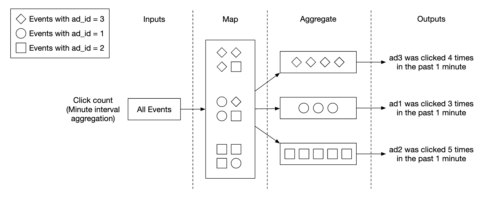

* Quảng cáo được phân vùng bằng `ad_id % 3`

**Trường hợp sử dụng 2 - trả về N quảng cáo được nhấp nhiều nhất**:


* Trong trường hợp này, chúng tôi đang tổng hợp 3 quảng cáo hàng đầu, nhưng điều này có thể scaling đến N quảng cáo hàng đầu một cách dễ dàng
* Mỗi node duy trì cấu trúc dữ liệu heap để truy xuất nhanh N quảng cáo hàng đầu

**Trường hợp sử dụng 3 - lọc dữ liệu**:
Để hỗ trợ lọc dữ liệu nhanh, chúng tôi có thể xác định trước tiêu chí lọc và tổng hợp trước dựa trên tiêu chí đó:

| quảng cáo\_id | nhấp chuột\_phút | đất nước | đếm |
| --- | --- | --- | --- |
| quảng cáo001 | 202101010001 | Mỹ | 100 |
| quảng cáo001 | 202101010001 | GPB | 200 |
| quảng cáo001 | 202101010001 | người khác | 3000 |
| quảng cáo002 | 202101010001 | Mỹ | 10 |
| quảng cáo002 | 202101010001 | GPB | 25 |
| quảng cáo002 | 202101010001 | người khác | 12 |

Kỹ thuật này được gọi là **lược đồ sao** và được sử dụng rộng rãi trong kho dữ liệu.
Các trường lọc được gọi là **thứ nguyên**.

Cách tiếp cận này có những lợi ích sau:

* Đơn giản để hiểu và xây dựng
* Dịch vụ tổng hợp hiện tại có thể được sử dụng lại để tạo thêm thứ nguyên trong lược đồ hình sao.
* Truy cập dữ liệu dựa trên tiêu chí lọc nhanh chóng do kết quả được tính toán trước

Hạn chế của phương pháp này là nó tạo ra nhiều nhóm và bản ghi hơn, đặc biệt khi chúng ta có nhiều tiêu chí lọc.

---

Bước 3: Thiết kế Deep Dive
---------------

Hãy cùng tìm hiểu sâu hơn về một số topics thú vị hơn.

### **Truyền phát so với hàng loạt**

Kiến trúc cấp cao mà chúng tôi đề xuất là một loại hệ thống xử lý luồng.
Dưới đây là so sánh giữa ba loại hệ thống:

|  | Dịch vụ (Hệ thống trực tuyến) | Hệ thống hàng loạt (hệ thống ngoại tuyến) | Hệ thống truyền phát (gần hệ thống thời gian thực) |
| --- | --- | --- | --- |
| Khả năng đáp ứng | Trả lời client nhanh chóng | Không cần phản hồi về client | Không cần phản hồi về client |
| Đầu vào | Yêu cầu của người dùng | Đầu vào bị chặn với kích thước hữu hạn. Một lượng lớn dữ liệu | Đầu vào không có ranh giới (luồng vô hạn) |
| Đầu ra | Phản hồi clients | Chế độ xem cụ thể hóa, số liệu tổng hợp, v.v. | Chế độ xem cụ thể hóa, số liệu tổng hợp, v.v. |
| Đo lường hiệu suất | Availability, latency | Throughput | Throughput, latency |
| Ví dụ | Mua sắm trực tuyến | MapReduce | Nhấp nháy [13] |

Trong thiết kế của chúng tôi, chúng tôi đã sử dụng kết hợp cả việc trộn và phát trực tuyến.

Chúng tôi đã sử dụng tính năng phát trực tuyến để xử lý dữ liệu khi dữ liệu đến và tạo ra kết quả tổng hợp gần như theo thời gian thực.
Mặt khác, chúng tôi đã sử dụng tính năng theo đợt để sao lưu dữ liệu lịch sử.

Một hệ thống chứa hai đường dẫn xử lý - hàng loạt và phát trực tuyến, đồng thời, kiến ​​trúc này được gọi là lambda.
Một điểm bất lợi là bạn có hai đường dẫn xử lý với hai cơ sở mã khác nhau cần duy trì.

Kappa là một kiến ​​trúc thay thế, kết hợp xử lý hàng loạt và xử lý luồng trong một đường dẫn xử lý.
Ý tưởng chính là sử dụng một công cụ xử lý luồng đơn.

Kiến trúc Lambda:

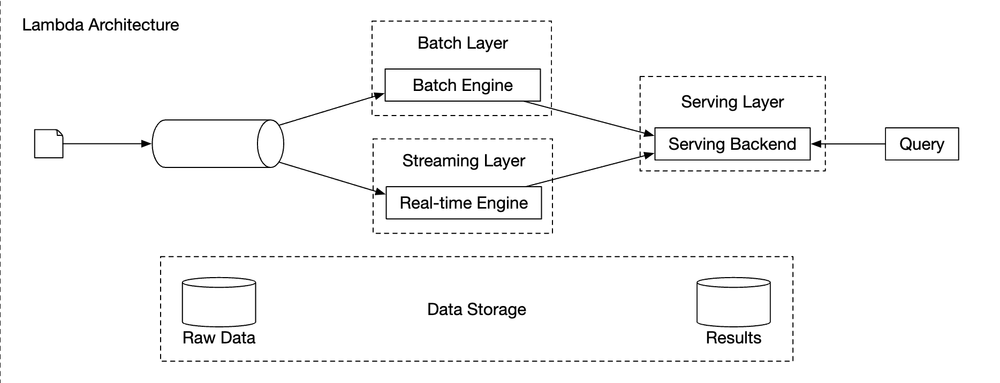

Kiến trúc Kappa:


Thiết kế cấp cao của chúng tôi sử dụng kiến trúc Kappa vì việc xử lý lại dữ liệu lịch sử cũng thông qua dịch vụ tổng hợp.

Bất cứ khi nào chúng tôi phải tính toán lại dữ liệu tổng hợp do một lỗi lớn trong logic tổng hợp, chúng tôi có thể tính toán lại dữ liệu tổng hợp từ dữ liệu thô mà chúng tôi lưu trữ.

* Dịch vụ tính toán lại lấy dữ liệu từ bộ lưu trữ thô. Đây là một công việc hàng loạt.
* Dữ liệu truy xuất được gửi đến dịch vụ tổng hợp chuyên dụng để dịch vụ tổng hợp xử lý theo thời gian thực không bị ảnh hưởng.
* Kết quả tổng hợp được gửi đến message queue thứ hai, sau đó chúng tôi cập nhật kết quả trong database tổng hợp.

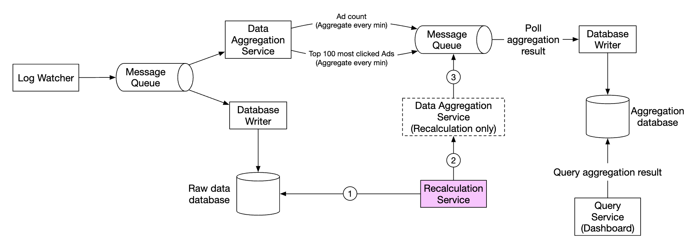

### **Thời gian**

Chúng tôi cần dấu thời gian để thực hiện tổng hợp. Nó có thể được tạo ra ở hai nơi:

* thời gian sự kiện - khi nhấp chuột vào quảng cáo xảy ra
* Thời gian xử lý - thời gian hệ thống khi server xử lý sự kiện

Do việc sử dụng xử lý không đồng bộ (message queues) và latency mạng, có thể có sự khác biệt đáng kể giữa thời gian sự kiện và thời gian xử lý.

* Nếu chúng tôi sử dụng thời gian xử lý, kết quả tổng hợp có thể không chính xác
* Nếu chúng ta sử dụng thời gian sự kiện, chúng ta phải xử lý các sự kiện bị trì hoãn

Không có giải pháp hoàn hảo, chúng ta cần cân nhắc sự đánh đổi:

|  | Ưu điểm | Nhược điểm |
| --- | --- | --- |
| Thời gian sự kiện | Kết quả tổng hợp chính xác hơn | Clients có thể sai thời gian hoặc dấu thời gian có thể được tạo bởi người dùng độc hại |
| Thời gian xử lý | Dấu thời gian Server đáng tin cậy hơn | Dấu thời gian không chính xác nếu sự kiện bị trễ |

Vì độ chính xác của dữ liệu rất quan trọng nên chúng tôi sẽ sử dụng thời gian sự kiện để tổng hợp.

Để giảm thiểu vấn đề sự kiện bị trì hoãn, một kỹ thuật gọi là "hình mờ" có thể được tận dụng.

Trong ví dụ bên dưới, sự kiện 2 bỏ lỡ khoảng thời gian cần tổng hợp:


Tuy nhiên, nếu chúng tôi cố tình scaling khoảng thời gian tổng hợp, chúng tôi có thể giảm khả năng xảy ra các sự kiện bị bỏ lỡ.
Phần scaling của cửa sổ được gọi là "hình mờ":


* Hình mờ ngắn làm tăng khả năng xảy ra sự kiện bị bỏ lỡ nhưng giảm latency
* Hình mờ dài hơn làm giảm khả năng xảy ra sự kiện bị bỏ lỡ nhưng tăng latency

Luôn có khả năng xảy ra các sự kiện bị bỏ lỡ, bất kể kích thước của hình mờ. Nhưng việc tối ưu hóa cho những sự kiện có xác suất thấp như vậy sẽ không có tác dụng gì.

Thay vào đó, chúng tôi có thể giải quyết những mâu thuẫn như vậy bằng cách thực hiện reconciliation vào cuối ngày.

### **Cửa sổ tổng hợp**

Có 4 loại chức năng của cửa sổ:

* Cửa sổ lật (cố định)
* Cửa sổ nhảy
* Cửa sổ trượt
* Cửa sổ phiên

Trong thiết kế của mình, chúng tôi tận dụng cửa sổ lộn xộn để tổng hợp lượt nhấp vào quảng cáo:


Cũng như một cửa sổ trượt cho N quảng cáo được nhấp nhiều nhất trong tổng hợp M phút:

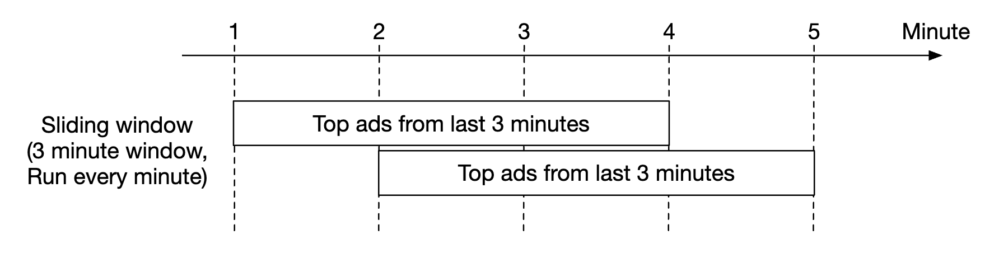

### **Đảm bảo giao hàng**

Vì dữ liệu chúng tôi tổng hợp sẽ được sử dụng để thanh toán nên độ chính xác của dữ liệu là ưu tiên hàng đầu.

Do đó, chúng ta cần thảo luận:

* Cách tránh xử lý các sự kiện trùng lặp
* Cách đảm bảo tất cả các sự kiện được xử lý

Có ba đảm bảo giao hàng mà chúng tôi có thể sử dụng - nhiều nhất một lần, ít nhất một lần và chính xác một lần.

Trong hầu hết các trường hợp, ít nhất một lần là đủ khi chấp nhận được một lượng nhỏ replica.
Tuy nhiên, đây không phải là trường hợp đối với hệ thống của chúng tôi vì sự khác biệt ở một tỷ lệ phần trăm nhỏ có thể dẫn đến sai lệch hàng triệu đô la.
Do đó, chúng ta sẽ cần sử dụng ngữ nghĩa phân phối chính xác một lần.

### **Trùng lặp dữ liệu**

Một trong những vấn đề phổ biến nhất về chất lượng dữ liệu là dữ liệu trùng lặp.

Nó có thể đến từ nhiều nguồn khác nhau:

* Phía Client - client có thể gửi lại cùng một sự kiện nhiều lần. Các sự kiện trùng lặp được gửi với mục đích xấu sẽ được xử lý tốt nhất bằng công cụ xử lý rủi ro.
* Server ngừng hoạt động - Dịch vụ tổng hợp node ngừng hoạt động trong quá trình tổng hợp và dịch vụ ngược tuyến chưa nhận được xác nhận nên sự kiện được gửi lại.

Dưới đây là ví dụ về sự trùng lặp dữ liệu xảy ra do không xác nhận được sự kiện ở bước nhảy cuối cùng:


Trong ví dụ này, offset 100 sẽ được xử lý và gửi xuôi dòng nhiều lần.

Một tùy chọn để thử và giảm thiểu điều này là lưu trữ phần bù được nhìn thấy lần cuối trong HDFS/S3, nhưng điều này có nguy cơ dẫn đến kết quả không bao giờ đạt đến hạ lưu:

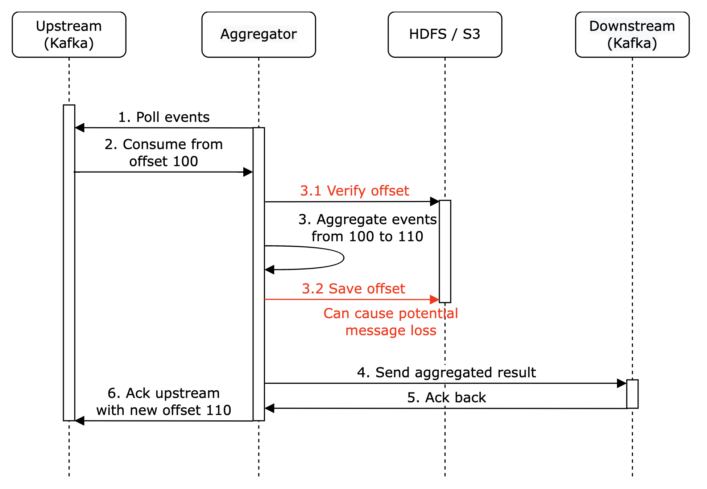

Cuối cùng, chúng ta có thể lưu trữ phần bù trong khi tương tác với hạ lưu một cách nguyên tử. Để đạt được điều này, chúng ta cần thực hiện một giao dịch phân tán:

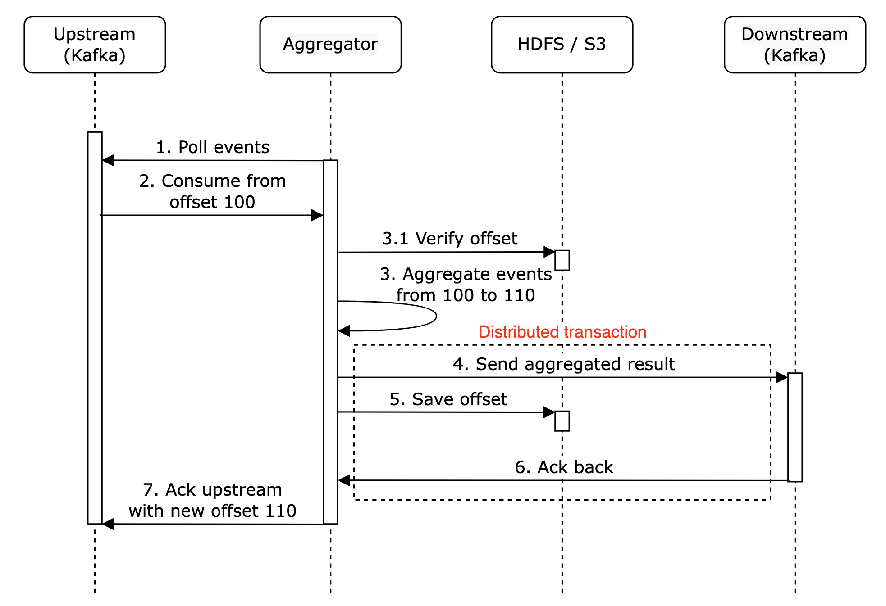

**Ghi chú bên lề cá nhân**: Ngoài ra, nếu hệ thống xuôi dòng xử lý kết quả tổng hợp một cách bình thường thì không cần thực hiện giao dịch phân tán.

### **Quy mô hệ thống**

Hãy thảo luận về cách chúng tôi scaling hệ thống khi nó phát triển.

Chúng tôi có ba thành phần độc lập - message queue, dịch vụ tổng hợp và database.
Vì chúng được tách rời nên chúng ta có thể scaling chúng một cách độc lập.

Làm cách nào để chúng tôi scaling message queue:

* Chúng tôi không đặt giới hạn cho nhà sản xuất nên họ có thể scaling dễ dàng
* Người tiêu dùng có thể được scaling bằng cách gán chúng cho consumer groups và tăng số lượng người tiêu dùng.
* Để tính năng này hoạt động, chúng tôi cũng cần đảm bảo có đủ partitions được tạo trước
* Ngoài ra, việc tái cân bằng người tiêu dùng có thể mất một thời gian khi có hàng nghìn người tiêu dùng, vì vậy nên thực hiện việc này ngoài giờ cao điểm
* Chúng tôi cũng có thể xem xét việc phân vùng topic theo địa lý, ví dụ `topic_na`, `topic_eu`, v.v.


Làm cách nào để chúng tôi scaling dịch vụ tổng hợp:


* nodes thu nhỏ bản đồ có thể dễ dàng thu nhỏ bằng cách thêm nodes
* throughput của dịch vụ tổng hợp có thể được scaling bằng cách sử dụng đa luồng
* Ngoài ra, chúng tôi có thể tận dụng các nhà cung cấp tài nguyên như Apache YARN để sử dụng đa xử lý
* Tùy chọn 1 dễ dàng hơn, nhưng tùy chọn 2 được sử dụng rộng rãi hơn trong thực tế vì nó có scalability hơn
* Đây là ví dụ đa luồng:


Làm cách nào để chúng tôi scaling database:

* Nếu chúng tôi sử dụng Cassandra, nó thực sự hỗ trợ horizontal scaling sử dụng consistent hashing
* Nếu node mới được thêm vào cluster, dữ liệu sẽ tự động được cân bằng lại trên tất cả nodes (ảo)
* Với phương pháp này, không cần sharding (tái) thủ công

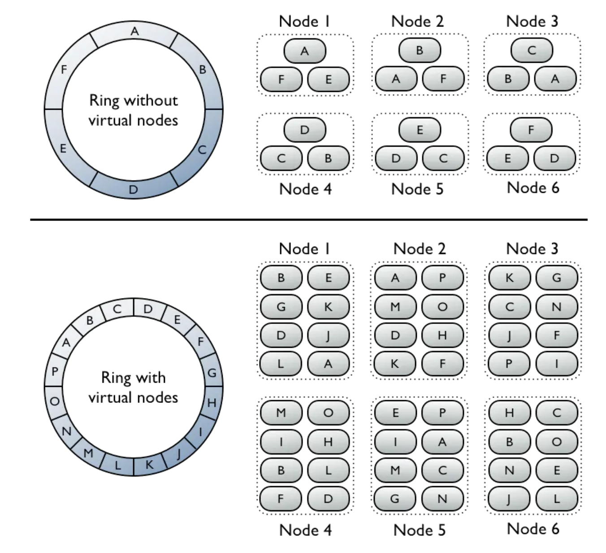

Một vấn đề khác về scalability cần xem xét là vấn đề hotspot - điều gì sẽ xảy ra nếu một quảng cáo phổ biến hơn và được chú ý nhiều hơn những quảng cáo khác?

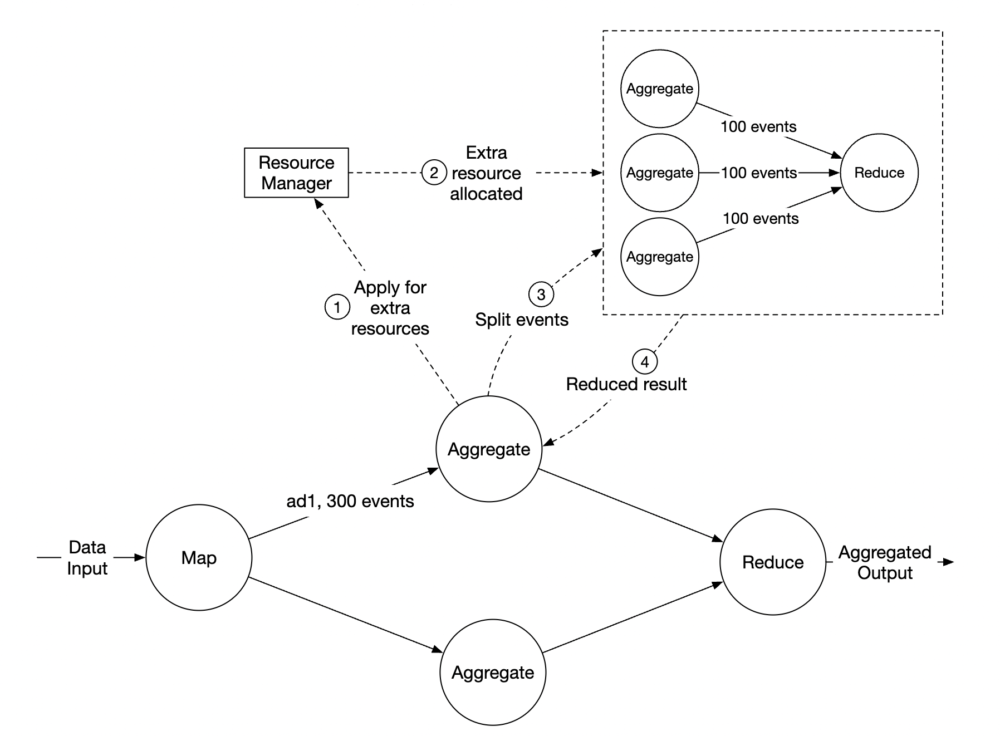

* Trong ví dụ trên, dịch vụ tổng hợp nodes có thể áp dụng cho các tài nguyên bổ sung thông qua trình quản lý tài nguyên
* Trình quản lý tài nguyên phân bổ nhiều tài nguyên hơn, do đó node ban đầu không bị quá tải
* node ban đầu chia các sự kiện thành 3 nhóm và mỗi nhóm nodes tổng hợp xử lý 100 sự kiện
* Kết quả được ghi lại vào tập hợp ban đầu node

Các cách khác, phức tạp hơn để xử lý sự cố hotspot:

* Tổng hợp toàn cầu-địa phương
* Chia tập hợp riêng biệt

### **Fault Tolerance**

Trong tập hợp nodes, chúng tôi đang xử lý dữ liệu trong bộ nhớ. Nếu node bị hỏng, dữ liệu đã xử lý sẽ bị mất.

Chúng tôi có thể tận dụng khoản bù đắp của người tiêu dùng trong kafka để tiếp tục từ nơi chúng tôi đã dừng lại sau khi một node khác giải quyết vấn đề.
Tuy nhiên, chúng tôi cần duy trì trạng thái trung gian bổ sung vì chúng tôi đang tổng hợp N quảng cáo hàng đầu trong M phút.

Chúng tôi có thể tạo ảnh chụp nhanh vào một phút cụ thể để tổng hợp đang diễn ra:


Nếu node gặp sự cố, node mới có thể đọc khoản bù đắp đã cam kết mới nhất của người tiêu dùng cũng như ảnh chụp nhanh mới nhất để tiếp tục công việc:

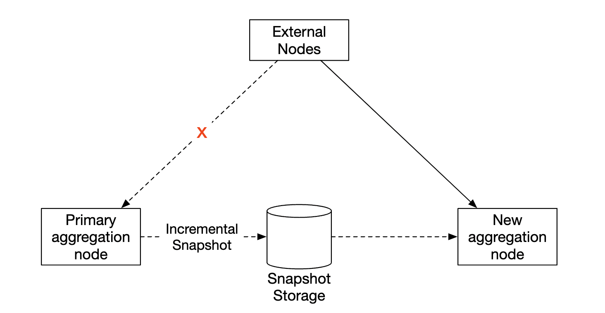

### **Giám sát và tính chính xác của dữ liệu**

Vì dữ liệu chúng tôi tổng hợp rất quan trọng vì nó được sử dụng để thanh toán nên điều quan trọng là phải có sự giám sát nghiêm ngặt tại chỗ để đảm bảo tính chính xác.

Một số số liệu chúng tôi có thể muốn theo dõi:

* **Latency**: Có thể theo dõi dấu thời gian của các sự kiện khác nhau để hiểu e2e latency của hệ thống
* **Kích thước Message queue**: Nếu kích thước hàng đợi tăng đột ngột, chúng tôi cần thêm tổng hợp nodes. Vì Kafka được triển khai thông qua commit log được phân phối nên thay vào đó, chúng tôi cần theo dõi các số liệu về latency của bản ghi.
* **Tài nguyên hệ thống được tổng hợp nodes**: CPU, disk, JVM, v.v.

Chúng tôi cũng cần triển khai luồng reconciliation, đây là một công việc hàng loạt, chạy vào cuối ngày.
Nó tính toán kết quả tổng hợp từ dữ liệu thô và so sánh chúng với dữ liệu thực tế được lưu trữ trong tập hợp database:

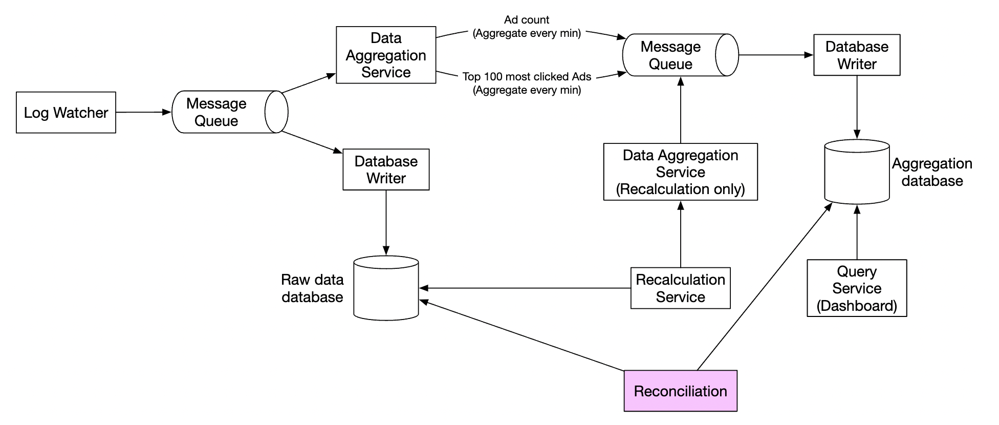

### **Thiết kế thay thế**

Trong một cuộc phỏng vấn thiết kế hệ thống tổng quát, bạn không cần phải biết phần bên trong của phần mềm chuyên dụng được sử dụng trong xử lý dữ liệu lớn.

Giải thích quá trình suy nghĩ và thảo luận về sự đánh đổi quan trọng hơn việc biết các công cụ cụ thể, đó là lý do tại sao chương này đề cập đến một giải pháp chung.

Một thiết kế thay thế, tận dụng công cụ có sẵn, là lưu trữ dữ liệu nhấp chuột vào quảng cáo trong Hive với lớp ElasticSearch được xây dựng trên cùng để truy vấn nhanh hơn.

Việc tổng hợp thường được thực hiện trong OLAP databases như ClickHouse hoặc Druid.

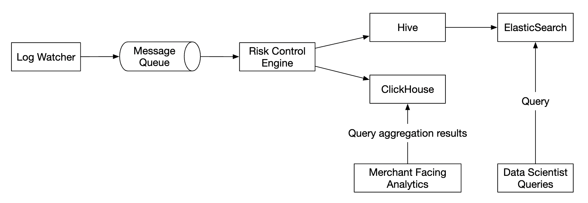


---

Bước 4: Kết thúc
---------------

Những điều chúng tôi đề cập:

* Mô hình dữ liệu và thiết kế API
* Sử dụng MapReduce để tổng hợp các sự kiện nhấp vào quảng cáo
* Scaling message queue, dịch vụ tổng hợp và database
* Giảm thiểu vấn đề hotspot
* Giám sát hệ thống liên tục
* Sử dụng reconciliation để đảm bảo tính chính xác
* Fault tolerance

Tổng hợp sự kiện nhấp chuột vào quảng cáo là một hệ thống xử lý dữ liệu lớn điển hình.

Sẽ dễ hiểu và thiết kế nó hơn nếu bạn có kiến thức trước về các công nghệ liên quan:

* Apache Kafka
* Apache Spark
* Liên kết Apache