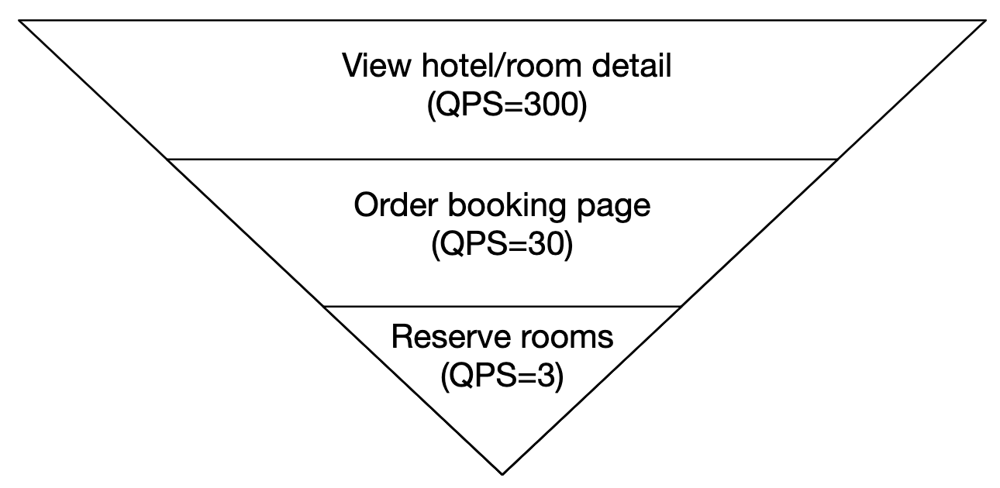
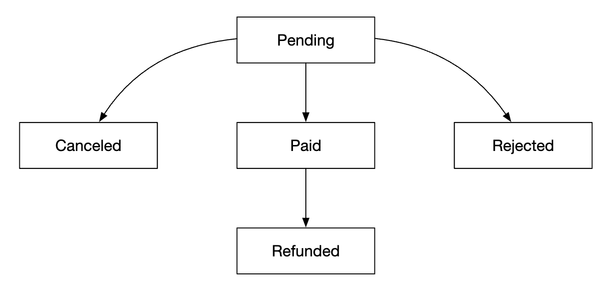
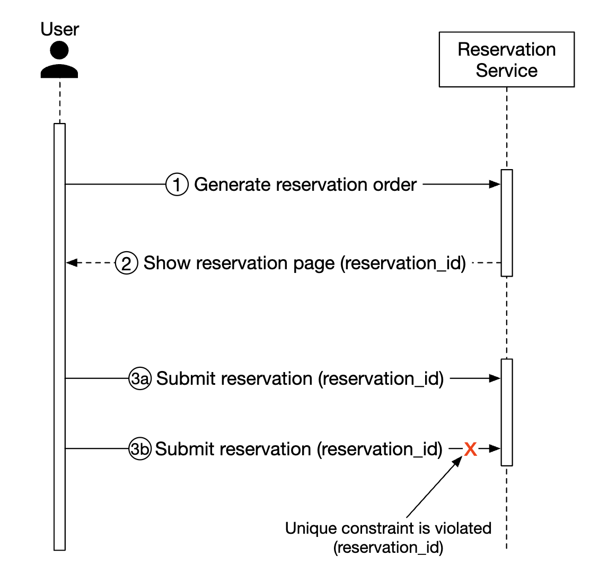
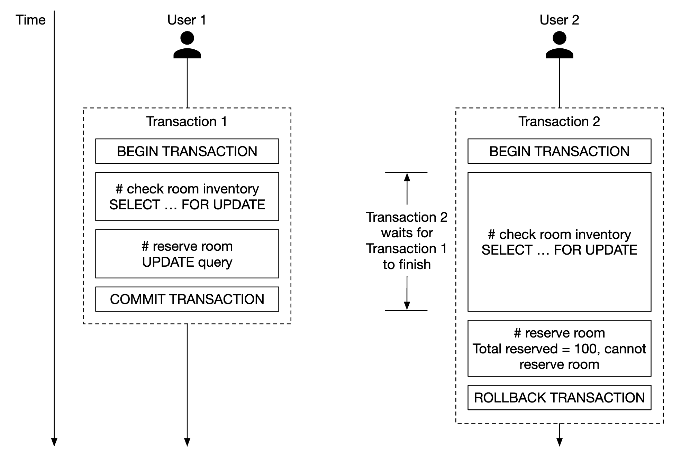
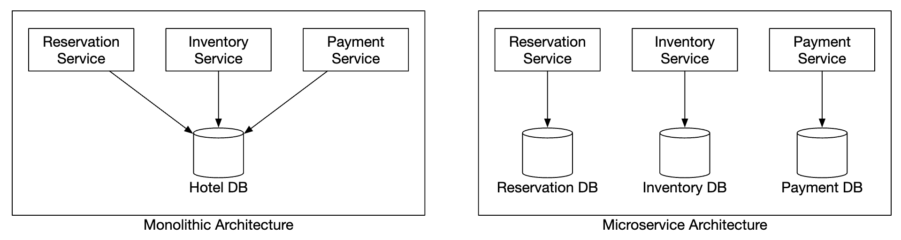
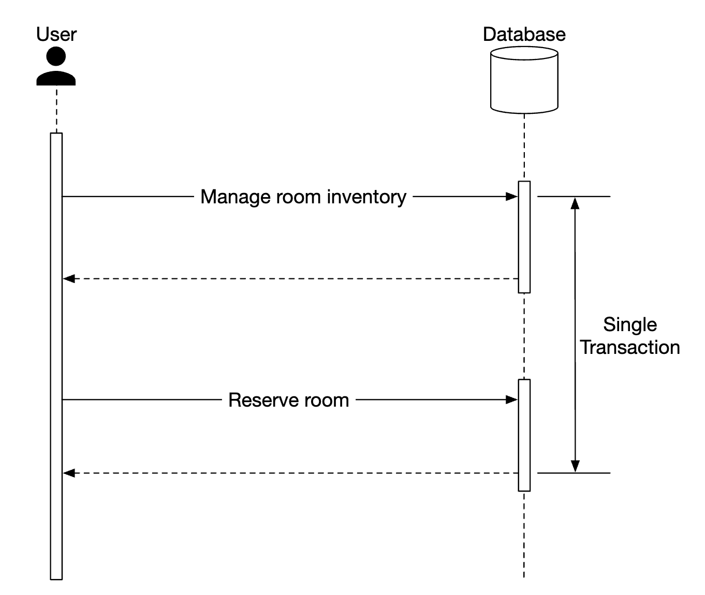
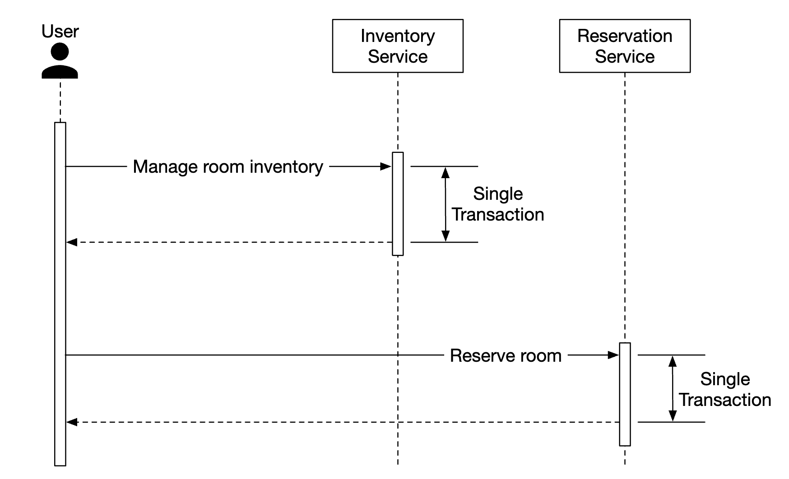

Chương 22: Hệ thống đặt phòng khách sạn
=======================================

Giới thiệu
------------

Trong chương này, chúng tôi đang thiết kế một **hệ thống đặt phòng khách sạn**, tương tự như Marriott International.

Áp dụng cho các loại hệ thống khác - Airbnb, đặt vé máy bay, đặt vé xem phim.

---

Bước 1: Hiểu vấn đề và thiết lập phạm vi thiết kế
---------------------------------------------------------

Trước khi đi sâu vào thiết kế hệ thống, chúng ta nên hỏi người phỏng vấn những câu hỏi để làm rõ phạm vi:

* C: Quy mô của hệ thống là gì?
* Tôi: Chúng tôi đang xây dựng một trang web cho chuỗi khách sạn \w 5000 khách sạn và 1 triệu phòng
* C: Khách hàng có thanh toán khi đặt phòng hay khi đến khách sạn không?
* Tôi: Họ thanh toán đầy đủ khi đặt chỗ.
* C: Khách hàng có đặt phòng khách sạn chỉ qua website không? Chúng tôi có phải hỗ trợ các tùy chọn đặt chỗ khác như gọi điện thoại không?
* Tôi: Họ chỉ đặt chỗ qua trang web hoặc ứng dụng.
* C: Khách hàng có thể hủy đặt chỗ được không?
* Tôi: Vâng
* C: Những điều khác cần xem xét?
* Tôi: Có, chúng tôi cho phép đặt trước quá 10%. Khách sạn sẽ bán được nhiều phòng hơn thực tế. Các khách sạn làm điều này với dự đoán rằng clients sẽ hủy đặt phòng.
* C: Vì không có nhiều thời gian nên chúng ta sẽ tập trung vào - hiển thị trang liên quan đến khách sạn, trang chi tiết phòng khách sạn, đặt phòng, bảng quản trị, hỗ trợ đặt phòng vượt mức.
* Tôi: Nghe hay đấy.
* Tôi: Còn một điều nữa - giá khách sạn luôn thay đổi. Giả sử giá phòng khách sạn thay đổi hàng ngày.
* C: Được rồi.

### **Yêu cầu phi chức năng**

* Hỗ trợ tính đồng thời cao - có thể có rất nhiều khách hàng cố gắng đặt cùng một khách sạn trong mùa cao điểm.
* latency vừa phải - lý tưởng là có latency thấp khi người dùng đặt chỗ trước, nhưng có thể chấp nhận được nếu hệ thống mất vài giây để xử lý.

### **Ước tính mặt sau**

* Tổng cộng 5000 khách sạn và 1 triệu phòng
* Giả sử 70% số phòng đã được lấp đầy và thời gian lưu trú trung bình là 3 ngày
* Số lượt đặt chỗ ước tính hàng ngày - 1 triệu \* 0,7 / 3 = ~240k lượt đặt chỗ mỗi ngày
* Đặt chỗ mỗi giây - 240k / 10^5 giây trong một ngày = ~3. TPS đặt phòng trung bình thấp.

Hãy ước tính QPS. Nếu chúng tôi giả định rằng có ba bước để đến trang đặt chỗ và có tỷ lệ chuyển đổi là 10% trên mỗi trang,
Chúng ta ước tính nếu có 3 lượt đặt phòng thì phải có 30 lượt xem trang đặt phòng và 300 lượt xem trang chi tiết phòng khách sạn.




---

Bước 2: Đề xuất thiết kế cấp cao và nhận được sự đồng ý
------------------------------------------------

Chúng ta sẽ khám phá - Thiết kế API, Mô hình dữ liệu, thiết kế cấp cao.

### **Thiết kế API**

Thiết kế API này tập trung vào các điểm cuối cốt lõi (sử dụng các phương pháp RESTful), chúng tôi sẽ cần để hỗ trợ hệ thống đặt phòng khách sạn.

Một hệ thống hoàn chỉnh sẽ yêu cầu API scaling hơn với khả năng hỗ trợ tìm kiếm phòng dựa trên nhiều tiêu chí, nhưng chúng tôi sẽ không tập trung vào điều đó trong phần này.
Lý do là chúng không có thách thức về mặt kỹ thuật nên nằm ngoài phạm vi.

**API liên quan đến khách sạn**

* `GET /v1/hotels/{id}` - nhận thông tin chi tiết về khách sạn
* `POST /v1/hotels` - thêm một khách sạn mới. Chỉ có sẵn cho ops
* `PUT /v1/hotels/{id}` - cập nhật thông tin khách sạn. Chỉ có sẵn cho ops
* `DELETE /v1/hotels/{id}` - xóa một khách sạn. API chỉ khả dụng cho ops

**API liên quan đến phòng**

* `GET /v1/hotels/{id}/rooms/{id}` - nhận thông tin chi tiết về phòng
* `POST /v1/hotels/{id}/rooms` - Thêm phòng. Chỉ có sẵn cho ops
* `PUT /v1/hotels/{id}/rooms/{id}` - Cập nhật thông tin phòng. Chỉ có sẵn cho ops
* `DELETE /v1/hotels/{id}/rooms/{id}` - Xóa phòng. Chỉ có sẵn cho ops

**API liên quan đến đặt chỗ**

* `GET /v1/reservations` - lấy lịch sử đặt phòng của người dùng hiện tại
* `GET /v1/reservations/{id}` - nhận thông tin chi tiết về đặt chỗ
* `POST /v1/reservations` - đặt chỗ mới
* `DELETE /v1/reservations/{id}` - hủy đặt chỗ

Dưới đây là một ví dụ về yêu cầu đặt chỗ:

```
{
  "startDate":"2021-04-28",
  "endDate":"2021-04-30",
  "hotelID":"245",
  "roomID":"U12354673389",
  "reservationID":"13422445"
}
```

Lưu ý rằng `reservationID` là khóa idempotency để tránh đặt trước hai lần. Chi tiết được giải thích trong [phần tương tranh](#concurrency-issues)

### **Mô hình dữ liệu**

Trước khi chọn database để sử dụng, hãy xem xét các kiểu truy cập của chúng tôi.

Chúng tôi cần hỗ trợ các truy vấn sau:

* Xem thông tin chi tiết về một khách sạn
* Tìm các loại phòng có sẵn trong phạm vi ngày
* Ghi lại đặt phòng
* Tra cứu đặt chỗ hoặc lịch sử đặt chỗ trong quá khứ

Từ ước tính của chúng tôi, chúng tôi biết quy mô của hệ thống không lớn, nhưng chúng tôi cần chuẩn bị cho sự gia tăng lưu lượng truy cập.

Với kiến ​​thức này, chúng tôi sẽ chọn database quan hệ vì:

* DBs quan hệ hoạt động tốt với các hệ thống đọc nhiều và ít ghi nhiều.
* NoSQL databases thường được tối ưu hóa cho việc ghi, nhưng chúng tôi biết rằng chúng tôi sẽ không có nhiều vì chỉ một phần nhỏ người dùng truy cập trang web đặt trước.
* DBs quan hệ cung cấp đảm bảo ACID. Những điều này rất quan trọng đối với một hệ thống vì nếu không có chúng, chúng ta sẽ không thể ngăn chặn các vấn đề như số dư âm, sạc kép, v.v.
* DBs quan hệ có thể dễ dàng mô hình hóa dữ liệu vì cấu trúc rất rõ ràng.

Đây là thiết kế lược đồ của chúng tôi:


Hầu hết các lĩnh vực đều tự giải thích. Trường duy nhất đáng được đề cập là trường `status` đại diện cho máy trạng thái của một phòng nhất định:



Mô hình dữ liệu này hoạt động tốt với hệ thống như Airbnb, nhưng không hoạt động tốt với các khách sạn nơi người dùng không đặt một phòng cụ thể mà chỉ đặt một loại phòng.
Họ đặt trước một loại phòng và số phòng được chọn tại thời điểm đặt phòng.

Thiếu sót này sẽ được giải quyết trong phần [Mô hình dữ liệu được cải tiến](#improved-data-model).

### **Thiết kế cao cấp**

Chúng tôi đã chọn kiến trúc microservice cho thiết kế này. Nó đã trở nên phổ biến trong những năm gần đây:


* **Người dùng**: đặt phòng khách sạn trên điện thoại hoặc máy tính của họ
* **Quản trị viên**: thực hiện các chức năng quản trị như hoàn tiền/hủy thanh toán, v.v.
* **CDN**: Tài nguyên tĩnh caches như gói JS, hình ảnh, video, v.v.
* **API Gateway công cộng**: dịch vụ được quản lý hoàn toàn hỗ trợ rate limiting, xác thực, v.v.
* **APIs nội bộ**: chỉ những người có thẩm quyền mới nhìn thấy được. Thường được bảo vệ bởi VPN.
* **Dịch vụ khách sạn**: cung cấp thông tin chi tiết về khách sạn và phòng nghỉ. Dữ liệu phòng và khách sạn là dữ liệu tĩnh nên có thể cached một cách linh hoạt.
* **Dịch vụ giá**: cung cấp giá phòng cho các ngày khác nhau trong tương lai. Một lưu ý thú vị về tên miền này là giá cả phụ thuộc vào mức độ kín chỗ của khách sạn vào một ngày nhất định.
* **Dịch vụ đặt phòng**: tiếp nhận yêu cầu đặt phòng và đặt phòng khách sạn. Đồng thời theo dõi tình trạng phòng trống khi đặt phòng được thực hiện/hủy bỏ.
* **Dịch vụ thanh toán**: xử lý thanh toán và cập nhật trạng thái đặt phòng thành công.
* **Dịch vụ quản lý khách sạn**: chỉ dành cho người có thẩm quyền. Cho phép một số chức năng quản trị nhất định để quản lý và xem đặt phòng, khách sạn, v.v.

Giao tiếp giữa các dịch vụ có thể được hỗ trợ thông qua khung RPC, chẳng hạn như gRPC.

---

Bước 3: Thiết kế Deep Dive
---------------

Hãy đi sâu hơn vào:

* Mô hình dữ liệu được cải tiến
* Vấn đề tương tranh
* Scalability
* Giải quyết sự không nhất quán dữ liệu trong microservices

### **Mô hình dữ liệu được cải thiện**

Như đã đề cập trong phần trước, chúng tôi cần sửa đổi lược đồ và API của mình để cho phép đặt một loại phòng so với một loại phòng cụ thể.

Đối với đặt trước API, chúng tôi không còn đặt trước `roomID` nữa mà thay vào đó chúng tôi đặt trước `roomTypeID`:

```
POST /v1/reservations
{
  "startDate":"2021-04-28",
  "endDate":"2021-04-30",
  "hotelID":"245",
  "roomTypeID":"12354673389",
  "roomCount":"3",
  "reservationID":"13422445"
}
```

Đây là lược đồ được cập nhật:


* **phòng**: chứa thông tin về phòng
* **room\_type\_rate**: chứa thông tin về giá của một loại phòng nhất định
* **đặt chỗ**: ghi lại dữ liệu đặt phòng của khách
* **room\_type\_inventory**: lưu trữ dữ liệu kiểm kê về phòng khách sạn.

Chúng ta hãy xem các cột `room_type_inventory` vì bảng đó thú vị hơn:

* **khách sạn\_id**: id của khách sạn
* **room\_type\_id**: id của loại phòng
* **ngày**: một ngày duy nhất
* **total\_inventory**: tổng số phòng trừ đi những phòng tạm thời bị lấy ra khỏi kho.
* **total\_reserved**: tổng số phòng đã đặt (khách sạn\_id, phòng\_type\_id, ngày)

Có nhiều cách khác để thiết kế bảng này, nhưng việc có một phòng cho mỗi (khách sạn\_id, phòng\_type\_id, ngày) sẽ dễ dàng hơn
quản lý đặt phòng và truy vấn dễ dàng hơn.

Các hàng trong bảng được điền trước bằng công việc CRON hàng ngày.

Dữ liệu mẫu:

| khách sạn\_id | phòng\_type\_id | ngày | tổng\_inventory | tổng\_reserved |
| --- | --- | --- | --- | --- |
| 211 | 1001 | 2021-06-01 | 100 | 80 |
| 211 | 1001 | 2021-06-02 | 100 | 82 |
| 211 | 1001 | 2021-06-03 | 100 | 86 |
| 211 | 1001 | ... | ... |  |
| 211 | 1001 | 2023-05-31 | 100 | 0 |
| 211 | 1002 | 2021-06-01 | 200 | 16 |
| 2210 | 101 | 2021-06-01 | 30 | 23 |
| 2210 | 101 | 2021-06-02 | 30 | 25 |

Truy vấn SQL mẫu để kiểm tra availability của một loại phòng:

```
SELECT date, total_inventory, total_reserved
FROM room_type_inventory
WHERE room_type_id = ${roomTypeId} AND hotel_id = ${hotelId}
AND date between ${startDate} and ${endDate}
```

Cách kiểm tra availability để biết số lượng phòng được chỉ định bằng dữ liệu đó (lưu ý rằng chúng tôi hỗ trợ đặt trước vượt mức):

```
if (total_reserved + ${numberOfRoomsToReserve}) <= 110% * total_inventory
```

Bây giờ hãy thực hiện một số ước tính về dung lượng lưu trữ.

* Chúng tôi có 5000 khách sạn.
* Mỗi khách sạn có 20 loại phòng.
* 5000 \* 20 \* 2 (năm) \* 365 (ngày) = 73 triệu hàng

73 triệu hàng không phải là nhiều dữ liệu và một database server có thể xử lý được nó.
Tuy nhiên, sẽ hợp lý hơn khi thiết lập đọc replication (có thể trên các vùng khác nhau) để kích hoạt availability cao.

Câu hỏi tiếp theo - nếu dữ liệu đặt trước quá lớn đối với một database, bạn sẽ làm gì?

* Chỉ lưu trữ dữ liệu đặt phòng hiện tại và tương lai. Lịch sử đặt chỗ có thể được chuyển vào kho lạnh.
* Database sharding - chúng tôi có thể shard dữ liệu của mình bằng `hash(hotel_id) % servers_cnt` vì chúng tôi luôn chọn `hotel_id` trong các truy vấn của mình.

### **Vấn đề tương tranh**

Một vấn đề quan trọng khác cần giải quyết là đặt phòng trùng lặp.

Có hai vấn đề cần giải quyết:

* Cùng một người dùng nhấp vào "sách" hai lần
* Nhiều người dùng cố gắng đặt phòng cùng một lúc

Đây là hình dung của vấn đề đầu tiên:


Có hai cách tiếp cận để giải quyết vấn đề này:

* Xử lý phía Client - giao diện người dùng có thể vô hiệu hóa node sách sau khi nhấp vào. Tuy nhiên, nếu người dùng tắt javascript, họ sẽ không thấy node chuyển sang màu xám.
* Idemptent API - Thêm khóa idempotency vào API, cho phép người dùng thực hiện một hành động một lần, bất kể điểm cuối được gọi bao nhiêu lần:



Đây là cách luồng này hoạt động:

* Lệnh đặt chỗ được tạo khi bạn đang trong quá trình điền thông tin chi tiết của mình và thực hiện đặt chỗ. Thứ tự đặt chỗ được tạo bằng cách sử dụng mã định danh duy nhất trên toàn cầu.
* Gửi đặt chỗ 1 bằng `reservation_id` được tạo ở bước trước.
* Nếu nhấp vào "hoàn tất đặt chỗ" lần thứ hai, `reservation_id` tương tự sẽ được gửi và phần phụ trợ sẽ phát hiện rằng đây là đặt chỗ trùng lặp.
* Tránh trùng lặp bằng cách làm cho cột `reservation_id` có một ràng buộc duy nhất, ngăn chặn nhiều bản ghi có id đó được lưu trữ trong DB.


Điều gì sẽ xảy ra nếu có nhiều người dùng thực hiện cùng một lượt đặt chỗ?


* Giả sử mức cô lập giao dịch không thể tuần tự hóa
* Người dùng 1 và 2 cố gắng đặt cùng một phòng cùng lúc.
* Giao dịch 1 kiểm tra xem có đủ phòng không - có
* Giao dịch 2 kiểm tra xem có đủ phòng không - có
* Giao dịch 2 giữ phòng và cập nhật tình trạng tồn phòng
* Giao dịch 1 cũng giữ phòng vì vẫn thấy có 99 phòng `total_reserved`/100.
* Cả hai giao dịch đều cam kết thay đổi thành công

Vấn đề này có thể được giải quyết bằng cách sử dụng một số dạng cơ chế khóa:

* Pessimistic locking
* Optimistic locking
* Ràng buộc Database

Đây là SQL chúng tôi sử dụng để đặt phòng:

```
# bước 1: kiểm tra tình trạng phòng
CHỌN ngày, tổng_hàng tồn kho, tổng_được đặt trước
TỪ phòng_type_inventory
Ở ĐÂU room_type_id = ${roomTypeId} VÀ hotel_id = ${hotelId}
VÀ ngày giữa ${startDate} và ${endDate}

# Với mỗi mục được trả về từ bước 1
if((total_reserved + ${numberOfRoomsToReserve}) > 110% * Total_inventory) {
  Khôi phục
}

# bước 2: đặt phòng
CẬP NHẬT phòng_type_inventory
BỘ Total_reserved = Total_reserved + ${numberOfRoomsToReserve}
Ở ĐÂU phòng_type_id = ${roomTypeId}
VÀ ngày giữa ${startDate} và ${endDate}

Cam kết
```

#### Tùy chọn 1: Pessimistic locking

Pessimistic locking ngăn chặn các bản cập nhật đồng thời bằng cách khóa bản ghi trong khi nó đang được cập nhật.

Điều này có thể được thực hiện trong MySQL bằng cách sử dụng truy vấn `SELECT... FOR UPDATE`, truy vấn này sẽ khóa các hàng được truy vấn chọn cho đến khi giao dịch được thực hiện.



Ưu điểm:

* Ngăn chặn các ứng dụng cập nhật dữ liệu đang bị thay đổi
* Dễ dàng thực hiện và tránh xung đột bằng cách tuần tự hóa các bản cập nhật. Hữu ích khi có sự tranh chấp dữ liệu nặng nề.

Nhược điểm:

* Bế tắc có thể xảy ra khi nhiều tài nguyên bị khóa.
* Cách tiếp cận này không thể scaling - nếu giao dịch bị khóa quá lâu, điều này sẽ ảnh hưởng đến tất cả các giao dịch khác đang cố gắng truy cập tài nguyên.
* Tác động rất nghiêm trọng khi truy vấn chọn nhiều tài nguyên và giao dịch kéo dài.

Tác giả không khuyến nghị phương pháp này do các vấn đề về scalability của nó.

#### Tùy chọn 2: Optimistic locking

Optimistic locking cho phép nhiều người dùng cố gắng cập nhật bản ghi cùng một lúc.

Có hai cách phổ biến để triển khai nó - số phiên bản và dấu thời gian. Số phiên bản được khuyến nghị vì đồng hồ server có thể không chính xác.


* Một cột `version` mới được thêm vào bảng database
* Trước khi người dùng sửa đổi hàng database, số phiên bản sẽ được đọc
* Khi người dùng cập nhật hàng, số phiên bản tăng thêm 1 và ghi lại vào database
* Xác thực Database sẽ ngăn việc chèn nếu số phiên bản mới không vượt quá số phiên bản trước

Optimistic locking thường nhanh hơn pessimistic locking vì chúng tôi không khóa database.
Tuy nhiên, hiệu suất của nó có xu hướng giảm khi tính đồng thời cao, vì điều đó dẫn đến nhiều nhược điểm.

Ưu điểm:

* Nó ngăn chặn các ứng dụng chỉnh sửa dữ liệu cũ
* Chúng tôi không cần có khóa trong database
* Tùy chọn ưa thích khi mức độ tranh chấp dữ liệu thấp, tức là hiếm khi xảy ra xung đột cập nhật

Nhược điểm:

* Hiệu suất kém khi xung đột dữ liệu cao

Optimistic locking là một lựa chọn tốt cho hệ thống của chúng tôi vì QPS đặt trước không quá cao.

#### Tùy chọn 3: Ràng buộc Database

Cách tiếp cận này rất giống với optimistic locking, nhưng các lan can được triển khai bằng cách sử dụng ràng buộc database:

```
CONSTRAINT `check_room_count` CHECK((`total_inventory - total_reserved` >= 0))
```


Ưu điểm:

* Dễ thực hiện
* Hoạt động tốt khi xung đột dữ liệu nhỏ

Nhược điểm:

* Tương tự như optimistic locking, hoạt động kém khi xung đột dữ liệu cao
* Các ràng buộc Database không thể dễ dàng kiểm soát phiên bản như mã ứng dụng
* Không phải tất cả các ràng buộc hỗ trợ databases

Đây là một lựa chọn tốt khác cho hệ thống đặt phòng khách sạn do tính dễ thực hiện của nó.

### **Scalability**

Thông thường, tải trọng của hệ thống đặt phòng khách sạn không cao.

Tuy nhiên, người phỏng vấn có thể hỏi bạn cách xử lý tình huống khi hệ thống được áp dụng cho một trang web du lịch phổ biến, lớn hơn như booking.com
Trong trường hợp đó, QPS có thể lớn hơn 1000 lần.

Khi xảy ra tình huống như vậy, điều quan trọng là phải hiểu bottlenecks của chúng ta ở đâu. Tất cả các dịch vụ đều là stateless, vì vậy chúng có thể dễ dàng scaling thông qua replication.

Tuy nhiên, database là stateful và không rõ làm thế nào nó có thể thu nhỏ được.

Một cách để scaling là triển khai database sharding - chúng tôi có thể chia dữ liệu thành nhiều databases, trong đó mỗi databases chứa một phần dữ liệu.

Chúng tôi có thể shard dựa trên `hotel_id` vì tất cả các truy vấn đều lọc dựa trên nó.
Giả sử, QPS là 30.000, sau sharding là database trong 16 shards, mỗi shard xử lý 1875 QPS, nằm trong khả năng tải của một MySQL cluster.


Chúng tôi cũng có thể sử dụng caching để kiểm kê phòng và đặt chỗ thông qua Redis. Chúng tôi có thể đặt TTL để dữ liệu cũ có thể hết hạn trong những ngày đã qua.


Cách chúng tôi lưu trữ hàng tồn kho dựa trên `hotel_id`, `room_type_id` và `date`:

```
key: hotelID_roomTypeID_{date}
value: the number of available rooms for the given hotel ID, room type ID and date.
```

Dữ liệu consistency diễn ra không đồng bộ và được quản lý bằng cách sử dụng cơ chế phát trực tuyến CDC - các thay đổi database được đọc và áp dụng cho một hệ thống riêng biệt.
Debezium là một tùy chọn phổ biến để đồng bộ hóa các thay đổi database với Redis.

Sử dụng cơ chế như vậy, có khả năng cache và database không nhất quán trong một thời gian.
Điều này không có vấn đề gì trong trường hợp của chúng tôi vì database sẽ ngăn chúng tôi thực hiện đặt chỗ không hợp lệ.

Điều này sẽ gây ra một số vấn đề trên giao diện người dùng vì người dùng sẽ phải làm mới trang để thấy rằng "không còn phòng nữa",
nhưng đó là điều có thể xảy ra bất kể vấn đề này là gì nếu một người do dự rất nhiều trước khi đặt chỗ.

Ưu điểm của Caching:

* Giảm tải database
* Hiệu suất cao, vì Redis quản lý dữ liệu trong bộ nhớ

Nhược điểm của Caching:

* Việc duy trì dữ liệu consistency giữa cache và DB thật khó khăn. Chúng ta cần xem xét sự không nhất quán ảnh hưởng như thế nào đến trải nghiệm người dùng.

### **Dữ liệu consistency giữa các dịch vụ**

Ứng dụng monolithic cho phép chúng tôi sử dụng database quan hệ được chia sẻ để đảm bảo dữ liệu consistency.

Trong thiết kế microservice của chúng tôi, chúng tôi đã chọn phương pháp kết hợp trong đó một số dịch vụ riêng biệt,
nhưng việc đặt trước và kiểm kê APIs được xử lý bởi cùng một dịch vụ dành cho việc đặt trước và kiểm kê APIs.

Điều này được thực hiện vì chúng tôi muốn tận dụng các đảm bảo ACID của database có quan hệ để đảm bảo consistency.

Tuy nhiên, người phỏng vấn có thể thách thức cách tiếp cận này vì đây không phải là kiến trúc microservice thuần túy, trong đó mỗi dịch vụ có một database chuyên dụng:



Điều này có thể dẫn đến sự cố consistency. Trong monolithic server, chúng ta có thể tận dụng khả năng giao dịch DBs quan hệ để thực hiện các hoạt động nguyên tử:



Tuy nhiên, sẽ khó khăn hơn để đảm bảo tính nguyên tử này khi hoạt động trải rộng trên nhiều dịch vụ:



Có một số kỹ thuật nổi tiếng để xử lý những dữ liệu không nhất quán này:

* **Cam kết hai pha**: giao thức database đảm bảo cam kết giao dịch nguyên tử trên nhiều nodes.
  Tuy nhiên, nó không hoạt động hiệu quả vì một latency node duy nhất sẽ dẫn đến việc tất cả nodes chặn hoạt động.
* **Saga**: một chuỗi các giao dịch cục bộ, trong đó các giao dịch bù được kích hoạt nếu bất kỳ bước nào trong quy trình làm việc không thành công. Đây là một cách tiếp cận nhất quán cuối cùng.

Cần lưu ý rằng việc giải quyết sự không nhất quán dữ liệu trên microservices là một vấn đề đầy thách thức, làm tăng độ phức tạp của hệ thống.
Thật tốt khi xem xét liệu chi phí đó có xứng đáng hay không, dựa trên cách tiếp cận thực tế hơn của chúng tôi về việc đóng gói các hoạt động phụ thuộc trong cùng một database quan hệ.

---

Bước 4: Kết thúc
---------------

Chúng tôi đã trình bày một thiết kế cho một hệ thống đặt phòng khách sạn.

Đây là những bước chúng tôi đã trải qua:

* Thu thập các yêu cầu và thực hiện các phép tính tổng thể để hiểu quy mô của hệ thống
* Chúng tôi đã trình bày Thiết kế API, Mô hình dữ liệu và kiến trúc hệ thống trong thiết kế cấp cao
* Khi tìm hiểu sâu hơn, chúng tôi đã khám phá các thiết kế lược đồ database thay thế khi các yêu cầu thay đổi
* Chúng tôi đã thảo luận về các điều kiện của cuộc đua và các giải pháp được đề xuất - các ràng buộc bi quan/optimistic locking, database
* Các cách scaling hệ thống thông qua database sharding và caching
* Cuối cùng, chúng tôi đã giải quyết cách xử lý các sự cố về dữ liệu consistency trên nhiều microservices