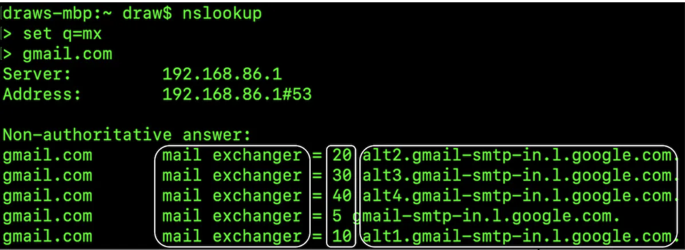
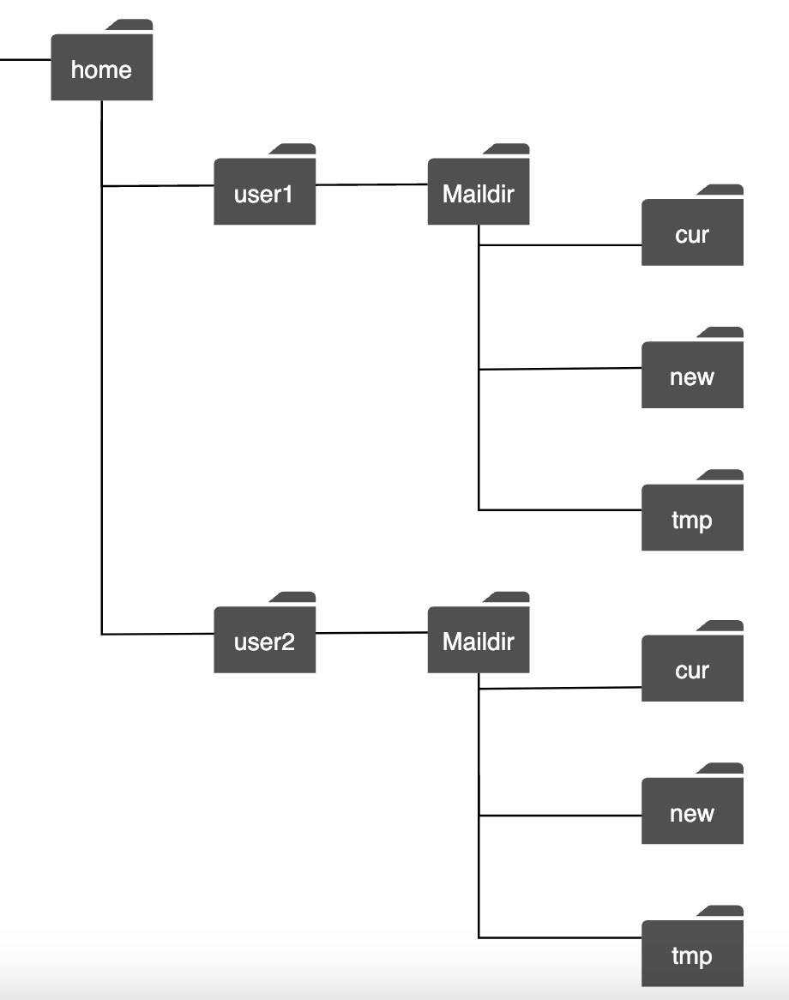
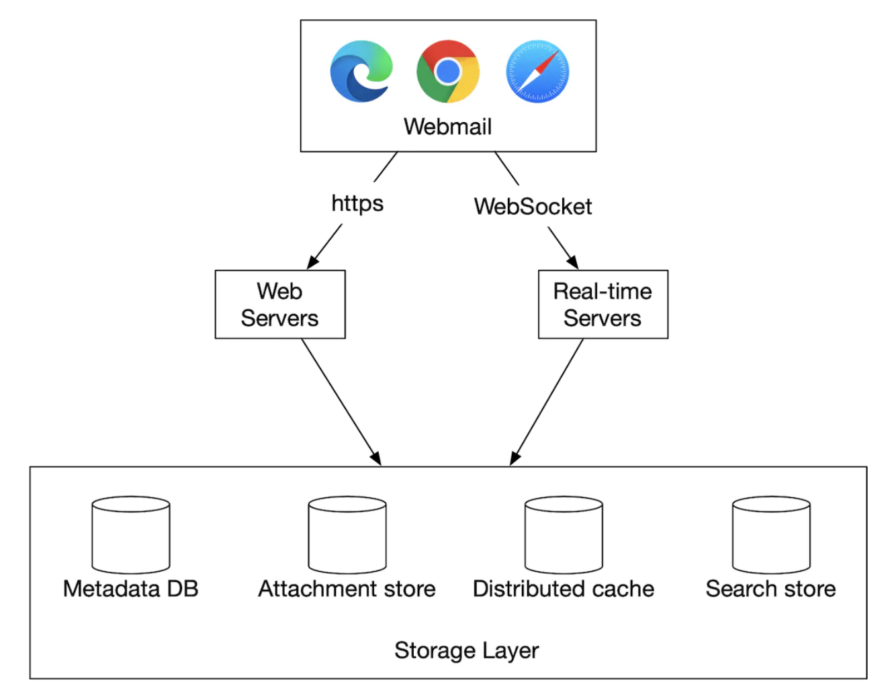
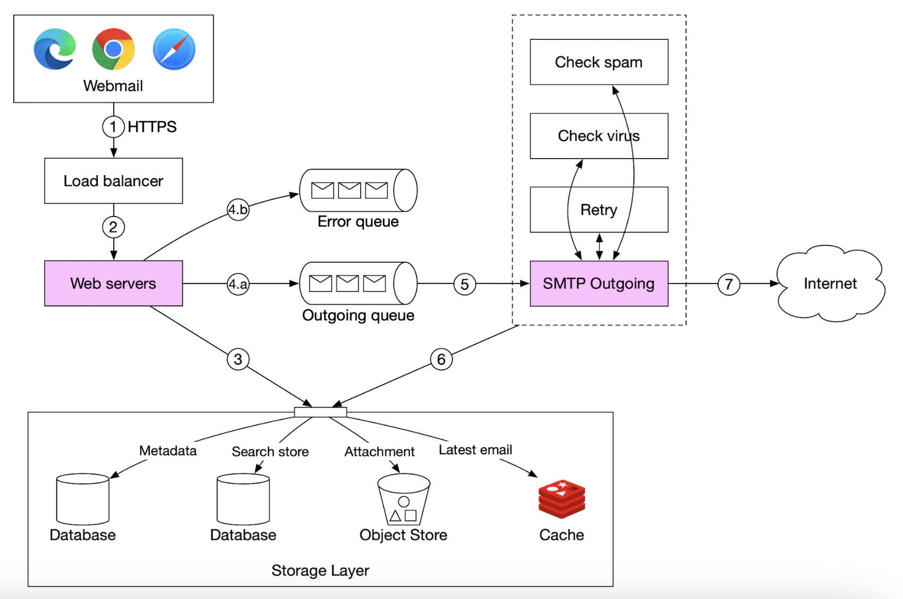
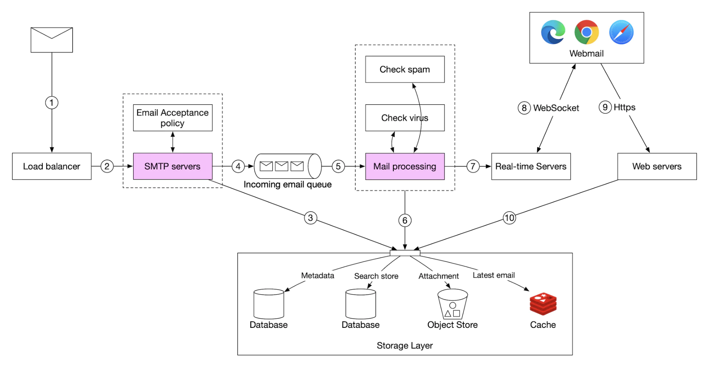
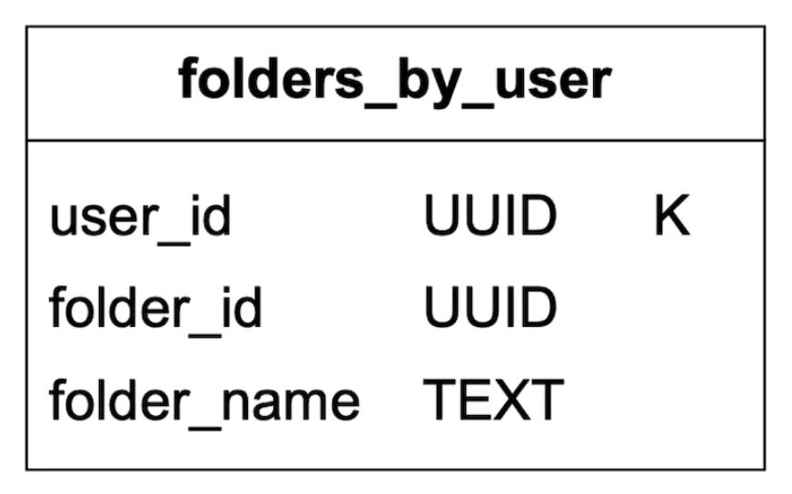
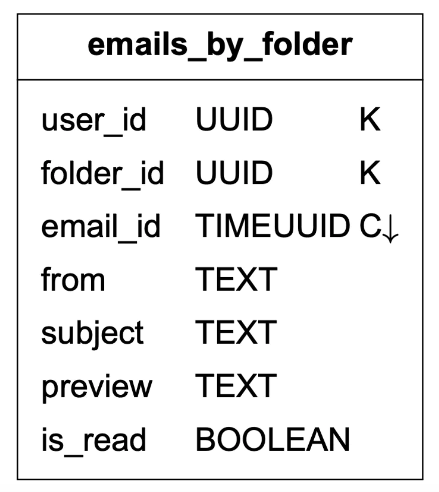
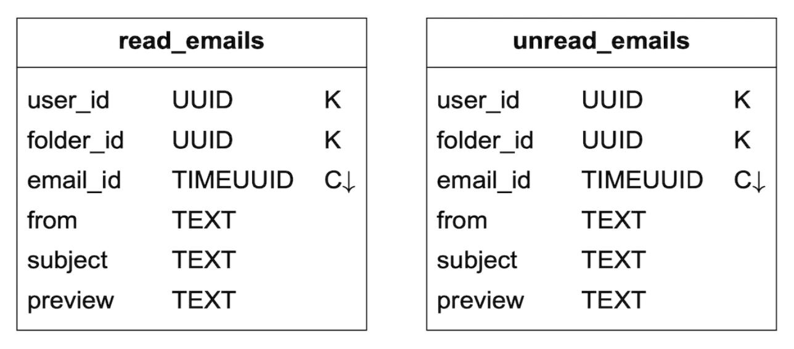
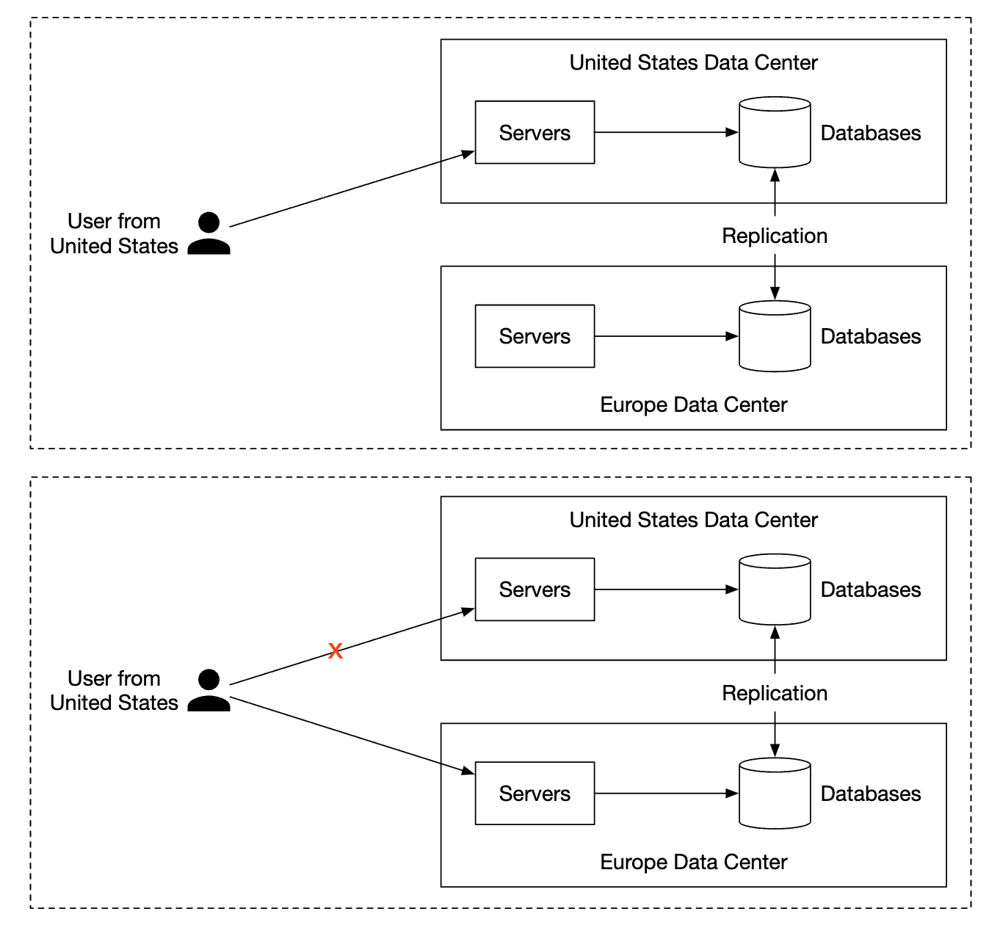

Chương 23: Dịch vụ email phân tán
========================================

Giới thiệu
------------

Chúng ta sẽ thiết kế một **dịch vụ email phân tán**, tương tự như **Gmail** trong chương này.

Vào năm 2020, **Gmail** có 1,8 tỷ người dùng active, trong khi **Outlook** có 400 triệu người dùng trên toàn thế giới.

---

Bước 1: Hiểu vấn đề và thiết lập phạm vi thiết kế
---------------------------------------------------------

* C: Có bao nhiêu người sử dụng hệ thống?
* Tôi: 1 tỷ người dùng
* C: Tôi nghĩ các tính năng sau rất quan trọng - xác thực, gửi/nhận email, tìm nạp email, lọc email, tìm kiếm email, bảo vệ chống thư rác.
* Tôi: Danh sách tốt. Đừng lo lắng về auth bây giờ.
* C: Người dùng kết nối \w email servers như thế nào?
* I: Thông thường, email clients kết nối qua SMTP, POP, IMAP, nhưng chúng tôi sẽ sử dụng HTTP cho vấn đề này.
* C: Email có thể có tệp đính kèm không?
* Tôi: Vâng

### **Yêu cầu phi chức năng**

* **Độ tin cậy** - chúng tôi sẽ không mất dữ liệu
* **Availability** - Chúng ta nên sử dụng replication để ngăn chặn các điểm lỗi duy nhất. Chúng ta cũng nên chấp nhận những lỗi hệ thống một phần.
* **Scalability** - Khi cơ sở người dùng tăng lên, hệ thống của chúng tôi sẽ có thể xử lý chúng.
* **Tính linh hoạt và scalability** - hệ thống phải linh hoạt và dễ dàng scaling với các tính năng mới. Một trong những lý do chúng tôi chọn HTTP thay vì SMTP/các giao thức thư khác.

### **Ước tính mặt sau**

* **1 tỷ người dùng**
* Giả sử một người gửi 10 email mỗi ngày -> **100k email mỗi giây**.
* Giả sử một người nhận được 40 email mỗi ngày và trung bình mỗi email có siêu dữ liệu 50kb -> **dung lượng lưu trữ 730pb mỗi năm**.
* Giả sử 20% email có tệp đính kèm lưu trữ và kích thước trung bình là 500kb -> **1.460pb mỗi năm**.

---

Bước 2: Đề xuất thiết kế cấp cao và nhận được sự đồng ý
------------------------------------------------

### **Kiến thức email 101**

Có nhiều giao thức khác nhau được sử dụng để gửi và nhận email:

* **SMTP** - giao thức chuẩn để gửi email từ server này sang server khác.
* **POP** - giao thức chuẩn để nhận và tải email từ thư từ xa server xuống client cục bộ. Sau khi được truy xuất, các email sẽ bị xóa khỏi server từ xa.
* **IMAP** - tương tự như POP, nó được sử dụng để nhận và tải xuống email từ server từ xa, nhưng nó giữ các email ở phía server.
* **HTTPS** - về mặt kỹ thuật không phải là giao thức email nhưng nó có thể được sử dụng cho email clients trên web.

Ngoài giao thức gửi thư, còn có một số bản ghi DNS mà chúng ta cần định cấu hình cho email server - bản ghi MX:



Tệp đính kèm email được gửi được mã hóa base64 và thường có giới hạn kích thước là 25mb trên hầu hết các dịch vụ thư.
Đây là cấu hình và thay đổi từ tài khoản cá nhân đến tài khoản công ty.

### **Thư truyền thống servers**

Thư truyền thống servers hoạt động tốt khi có số lượng người dùng hạn chế, được kết nối với single server.


* Alice đăng nhập vào email Outlook của mình và nhấn "gửi". Email được gửi tới thư Outlook server. Giao tiếp thông qua SMTP.
* Outlook server truy vấn DNS để tìm bản ghi MX cho gmail.com và chuyển email đến servers của họ. Giao tiếp thông qua SMTP.
* Bob tìm nạp email từ gmail server của mình qua IMAP/POP.

Trong thư truyền thống servers, email được lưu trữ trên hệ thống tệp cục bộ. Mỗi email là một tập tin riêng biệt.



Khi quy mô ngày càng tăng, I/O đĩa trở thành bottleneck. Ngoài ra, nó không đáp ứng các yêu cầu về độ tin cậy và availability cao của chúng tôi.
Đĩa có thể bị hỏng và server có thể bị hỏng.

### **Thư đã phân phối servers**

Thư phân phối servers được thiết kế để hỗ trợ các trường hợp sử dụng hiện đại và giải quyết các vấn đề scalability hiện đại.

Các servers này vẫn có thể hỗ trợ IMAP/POP cho email gốc clients và SMTP để trao đổi thư trên servers.

Nhưng đối với thư clients dựa trên web phong phú, API RESTful trên HTTP thường được sử dụng.

Ví dụ APIs:

* `POST /v1/messages` - gửi tin nhắn đến người nhận ở tiêu đề To, Cc, Bcc.
* `GET /v1/folders` - trả về tất cả các thư mục của tài khoản email

Phản hồi ví dụ:

```
[{id: string        Unique folder identifier.
  name: string      Name of the folder.
                    According to RFC6154 [9], the default folders can be one of
                    the following: All, Archive, Drafts, Flagged, Junk, Sent,
                    and Trash.
  user_id: string   Reference to the account owner
}]
```

* `GET /v1/folders/{:folder_id}/messages` - trả về tất cả thư trong một thư mục \w phân trang
* `GET /v1/messages/{:message_id}` - nhận tất cả thông tin về một tin nhắn cụ thể

Phản hồi ví dụ:

```
{
  user_id: string                      // Reference to the account owner.
  from: {name: string, email: string}  // <name, email> pair of the sender.
  to: [{name: string, email: string}]  // A list of <name, email> paris
  subject: string                      // Subject of an email
  body: string                         //  Message body
  is_read: boolean                     //  Indicate if a message is read or not.
}
```

Đây là thiết kế cấp cao của thư phân phối server:



* **Webmail** - người dùng sử dụng trình duyệt web để gửi/nhận email
* **Web servers** - dịch vụ yêu cầu/phản hồi công khai được sử dụng để quản lý thông tin đăng nhập, đăng ký, hồ sơ người dùng, v.v.
* **servers thời gian thực** - Được sử dụng để đẩy các bản cập nhật email mới lên clients trong thời gian thực. Chúng tôi sử dụng websockets để liên lạc theo thời gian thực nhưng dự phòng bỏ phiếu dài cho các trình duyệt cũ hơn không hỗ trợ chúng.
* **Siêu dữ liệu db** - lưu trữ siêu dữ liệu email như chủ đề, nội dung, từ, đến, v.v.
* **Attachment store** - Kho đối tượng (ví dụ Amazon S3), thích hợp để lưu trữ các tệp lớn.
* **Đã phân phối cache** - Chúng tôi có thể gửi cache email gần đây trong Redis để cải thiện UX.
* **Cửa hàng tìm kiếm** - document store được phân phối, được sử dụng để hỗ trợ tìm kiếm toàn văn bản.

Đây là quy trình gửi email trông như thế nào:



* Người dùng viết email và nhấn "gửi". Email được gửi đến load balancer.
* Tốc độ Load balancer giới hạn số lần gửi thư quá mức và routing đến một trong các trang web servers.
* Web servers thực hiện xác thực email cơ bản (ví dụ: kích thước email) và đoản mạch luồng gửi đi nếu miền giống với người gửi. Nhưng trước tiên hãy kiểm tra thư rác.
* Nếu xác thực cơ bản vượt qua, email sẽ được gửi đến message queue (tệp đính kèm được tham chiếu từ kho đối tượng)
* Nếu xác thực cơ bản không thành công, email sẽ được gửi đến hàng đợi lỗi
* Nhân viên gửi đi của SMTP lấy thư từ hàng đợi gửi đi, kiểm tra thư rác/vi rút và routing đến thư đích server.
* Email được lưu trong thư mục "Email đã gửi"

Chúng tôi cũng cần theo dõi kích thước của message queue gửi đi. Phát triển quá lớn có thể chỉ ra một vấn đề:

* Thư của người nhận server không có sẵn. Chúng tôi có thể thử gửi lại email sau bằng cách sử dụng thời gian chờ theo cấp số nhân.
* Không có đủ người tiêu dùng để xử lý tải, chúng tôi có thể phải scaling người tiêu dùng.

Đây là quy trình nhận email:



* Các email đến sẽ đến SMTP load balancer. Thư được phân phối tới SMTP servers, nơi thực hiện chính sách chấp nhận thư (ví dụ: các email không hợp lệ sẽ bị loại bỏ trực tiếp).
* Nếu tệp đính kèm email quá lớn, chúng tôi có thể lưu nó vào kho đối tượng (s3).
* Nhân viên xử lý thư thực hiện kiểm tra sơ bộ, sau đó thư được chuyển tiếp đến bộ lưu trữ, cache, kho đối tượng và servers thời gian thực.
* Người dùng ngoại tuyến sẽ nhận được email mới sau khi họ trực tuyến trở lại thông qua HTTP API.

---

Bước 3: Thiết kế Deep Dive
---------------

Bây giờ chúng ta hãy đi sâu hơn vào một số thành phần.

### **Siêu dữ liệu database**

Dưới đây là một số đặc điểm của siêu dữ liệu email:

* tiêu đề thường nhỏ và được truy cập thường xuyên
* Kích thước cơ thể dao động từ nhỏ đến lớn, nhưng thường được đọc một lần
* Hầu hết các hoạt động thư được tách biệt với một người dùng - ví dụ: tìm nạp email, đánh dấu là đã đọc, tìm kiếm.
* Dữ liệu gần đây ảnh hưởng đến việc sử dụng dữ liệu. Người dùng thường chỉ đọc những email gần đây
* Dữ liệu có yêu cầu về độ tin cậy cao. Mất dữ liệu là không thể chấp nhận được.

Ở quy mô gmail/outlook, database thường được tùy chỉnh để giảm các hoạt động đầu vào/đầu ra mỗi giây (IOPS).

Hãy xem xét những tùy chọn database mà chúng tôi có:

* **database quan hệ** - chúng tôi có thể xây dựng chỉ mục cho tiêu đề và nội dung, nhưng những DBs này thường được tối ưu hóa cho các khối dữ liệu nhỏ.
* **Kho lưu trữ đối tượng phân tán** - đây có thể là một lựa chọn tốt để lưu trữ backup, nhưng không thể hỗ trợ hiệu quả việc tìm kiếm/đánh dấu là đã đọc/v.v.
* **NoSQL** - Google BigTable được Gmail sử dụng nhưng không có nguồn mở.

Dựa trên phân tích trên, rất ít giải pháp hiện tại có vẻ phù hợp hoàn hảo với nhu cầu của chúng tôi.
Trong bối cảnh phỏng vấn, việc thiết kế giải pháp database phân tán mới là không khả thi, nhưng điều quan trọng cần đề cập đến là các đặc điểm:

* Một cột có thể là MB một chữ số
* Dữ liệu mạnh consistency
* Được thiết kế để giảm I/O đĩa
* Tính sẵn sàng cao và khả năng chịu lỗi cao
* Nên dễ dàng tạo backup gia tăng

Để partition dữ liệu, chúng tôi có thể sử dụng consistency làm khóa partition để dữ liệu của một người dùng được lưu trữ trên một shard duy nhất.
Điều này cấm chúng tôi chia sẻ email với nhiều người dùng, nhưng đây không phải là yêu cầu bắt buộc đối với cuộc phỏng vấn này.

Hãy xác định các bảng:

* Khóa chính gồm khóa partition (phân phối dữ liệu) và khóa phân cluster (sắp xếp dữ liệu)
* Truy vấn chúng tôi cần hỗ trợ - lấy tất cả thư mục cho người dùng, hiển thị tất cả email cho một thư mục, tạo/nhận/xóa email, tìm nạp email đã đọc/chưa đọc, nhận chuỗi hội thoại (phần thưởng)

Chú giải cho các bảng theo sau:


Đây là bảng thư mục:



bảng email:



* email\_id là timeuuid cho phép sắp xếp dựa trên dấu thời gian khi email được tạo

Các tệp đính kèm được lưu trữ trong một bảng riêng biệt, được xác định theo tên tệp:


Việc hỗ trợ tìm nạp email đã đọc/chưa đọc là điều dễ dàng trong database quan hệ truyền thống, nhưng không dễ dàng trong Cassandra, vì việc lọc trên khóa phân cluster/không phải partition bị cấm.
Một cách giải quyết khác là tìm nạp tất cả email trong một thư mục và lọc trong bộ nhớ, nhưng cách đó không hiệu quả đối với một ứng dụng đủ lớn.

Những gì chúng ta có thể làm là không chuẩn hóa bảng email thành các bảng email đã đọc/chưa đọc:



Để hỗ trợ các chuỗi hội thoại, chúng tôi có thể bao gồm một số tiêu đề mà thư clients diễn giải và sử dụng để xây dựng lại chuỗi hội thoại:

```
{
  "headers" {
     "Message-Id": "<7BA04B2A-430C-4D12-8B57-862103C34501@gmail.com>",
     "In-Reply-To": "<CAEWTXuPfN=LzECjDJtgY9Vu03kgFvJnJUSHTt6TW@gmail.com>",
     "References": ["<7BA04B2A-430C-4D12-8B57-862103C34501@gmail.com>"]
  }
}
```

Cuối cùng, chúng tôi sẽ trao đổi availability lấy consistency lấy database được phân phối của chúng tôi, vì đây là một yêu cầu khó đối với vấn đề này.

Do đó, trong trường hợp xảy ra failover hoặc phân vùng mạng, các hành động đồng bộ hóa/cập nhật sẽ không khả dụng trong thời gian ngắn đối với người dùng bị ảnh hưởng.

### **Khả năng gửi email**

Thật dễ dàng để thiết lập server để gửi email nhưng việc gửi email đến hộp thư đến của người nhận rất khó do thuật toán chống thư rác.

Nếu chúng tôi chỉ thiết lập một thư mới server và bắt đầu gửi thư qua đó, email của chúng tôi có thể sẽ nằm trong thư mục thư rác.

Đây là những gì chúng ta có thể làm để ngăn chặn điều đó:

* **IPs chuyên dụng** - sử dụng IPs chuyên dụng để gửi email, nếu không, người nhận servers sẽ không tin tưởng bạn.
* **Phân loại email** - tránh gửi email tiếp thị từ cùng một servers để ngăn các email quan trọng hơn bị phân loại là thư rác
* **Hãy khởi động IP address** của bạn một cách từ từ để tạo dựng danh tiếng tốt với các nhà cung cấp email lớn. Phải mất từ 2 đến 6 tuần để làm nóng IP mới
* **Cấm những người gửi thư rác** nhanh chóng để không làm tổn hại đến danh tiếng của bạn
* **Xử lý phản hồi** - thiết lập vòng phản hồi với ISP để theo dõi tỷ lệ khiếu nại và cấm tài khoản spam một cách nhanh chóng.
* **Xác thực email** - sử dụng các kỹ thuật phổ biến để chống lừa đảo như Khung chính sách người gửi, Thư được xác định bằng khóa miền, v.v.

Bạn không cần phải nhớ tất cả những điều này. Chỉ biết rằng việc xây dựng một mail server tốt đòi hỏi rất nhiều kiến ​​thức về domain.

### **Tìm kiếm**

Tìm kiếm bao gồm thực hiện tìm kiếm toàn văn bản dựa trên nội dung email hoặc các truy vấn nâng cao hơn dựa trên các bộ lọc từ, đến, chủ đề, chưa đọc, v.v.

Một đặc điểm của tìm kiếm email là nó mang tính cục bộ đối với người dùng và nó có nhiều lần ghi hơn là đọc, bởi vì chúng tôi cần phải chạy lại index trong mỗi thao tác nhưng người dùng hiếm khi sử dụng tab tìm kiếm.

Hãy so sánh tìm kiếm google với tìm kiếm email:

|  | Phạm vi | Sắp xếp | Độ chính xác |
| --- | --- | --- | --- |
| Tìm kiếm trên Google | Toàn bộ internet | Sắp xếp theo mức độ liên quan | Lập chỉ mục mất một thời gian, do đó không có kết quả ngay lập tức. |
| Tìm kiếm email | Hộp thư điện tử riêng của người dùng | Sắp xếp theo thuộc tính, ví dụ: thời gian, ngày tháng, v.v. | Lập chỉ mục phải nhanh chóng và kết quả chính xác. |

Để đạt được chức năng tìm kiếm này, một tùy chọn là sử dụng Elaticsearch cluster. Chúng ta có thể sử dụng `user_id` làm khóa partition để nhóm dữ liệu trong cùng một node:


Các hoạt động đột biến không đồng bộ thông qua Kafka để tách các dịch vụ khỏi luồng lập chỉ mục lại.
Trên thực tế việc tìm kiếm dữ liệu diễn ra đồng bộ.

Elaticsearch là một trong những công cụ tìm kiếm databases phổ biến nhất và hỗ trợ tìm kiếm toàn văn cho email rất tốt.

Ngoài ra, chúng tôi có thể cố gắng phát triển giải pháp tìm kiếm tùy chỉnh của riêng mình để đáp ứng các yêu cầu cụ thể của chúng tôi.

Việc thiết kế một hệ thống như vậy nằm ngoài phạm vi. Một trong những thách thức cốt lõi khi xây dựng nó là tối ưu hóa nó cho khối lượng công việc ghi nhiều.

Để đạt được điều đó, chúng ta có thể sử dụng Cây hợp nhất có cấu trúc nhật ký (LSM) để cấu trúc dữ liệu index trên đĩa. Write path chỉ được tối ưu hóa cho việc ghi tuần tự.
Kỹ thuật này được sử dụng trong Cassandra, BigTable và RocksDB.

Ý tưởng cốt lõi của nó là lưu trữ dữ liệu trong bộ nhớ cho đến khi đạt đến ngưỡng xác định trước, sau đó nó được hợp nhất vào lớp (đĩa) tiếp theo:


Sự đánh đổi chính giữa hai phương pháp:

* Elaticsearch scaling ở một mức độ nào đó, trong khi công cụ tìm kiếm tùy chỉnh có thể được tinh chỉnh cho trường hợp sử dụng email, cho phép nó scaling hơn nữa.
* Elaticsearch là một dịch vụ riêng biệt mà chúng tôi cần duy trì cùng với kho siêu dữ liệu. Một giải pháp tùy chỉnh có thể là chính kho dữ liệu.
* Elaticsearch là một giải pháp sẵn có, trong khi công cụ tìm kiếm tùy chỉnh sẽ cần nỗ lực kỹ thuật đáng kể để xây dựng.

### **Scalability và availability**

Vì hoạt động của từng người dùng không xung đột với những người dùng khác nên hầu hết các thành phần đều có thể được điều chỉnh tỷ lệ một cách độc lập.

Để đảm bảo availability ở mức cao, chúng tôi cũng có thể sử dụng thiết lập nhiều DC với failover dẫn đầu trong trường hợp xảy ra lỗi:




---

Bước 4: Kết thúc
---------------

Điểm nói chuyện bổ sung:

* **Fault tolerance** - Nhiều phần của hệ thống có thể bị lỗi. Thật đáng giá khi chúng tôi xử lý các lỗi node.
* **Tuân thủ** - PII cần được lưu trữ theo cách hợp lý theo luật GDPR của Châu Âu.
* **Bảo mật** - mã hóa email, chống lừa đảo, duyệt web an toàn, v.v.
* **Tối ưu hóa** - ví dụ: ngăn chặn sự trùng lặp của cùng một tệp đính kèm, được gửi nhiều lần bởi những người dùng khác nhau.