Chương 24: Object Storage giống S3
=====================================

Giới thiệu
------------

Trong chương này, chúng ta sẽ thiết kế dịch vụ **object storage**, tương tự như **Amazon S3**.

Hệ thống lưu trữ được chia thành ba loại lớn:

* **Lưu trữ khối**
* **Lưu trữ tệp**
* **Object storage**

**Bộ lưu trữ khối** là thiết bị xuất hiện vào những năm 1960. Ổ cứng HDD và SSD là những ví dụ như vậy.
Các thiết bị này thường được gắn vật lý vào server, mặc dù chúng cũng có thể được gắn vào mạng thông qua các giao thức mạng tốc độ cao.
Servers có thể định dạng các khối thô và sử dụng chúng làm hệ thống tệp hoặc có thể trực tiếp điều khiển chúng cho servers.

**Bộ nhớ tệp** được xây dựng dựa trên bộ nhớ khối. Nó cung cấp mức độ trừu tượng cao hơn, giúp quản lý các thư mục và tệp dễ dàng hơn.

**Object storage** hy sinh hiệu suất để có độ bền cao, quy mô rộng lớn và chi phí thấp.
Nó nhắm mục tiêu dữ liệu "lạnh" và chủ yếu được sử dụng để lưu trữ và sao lưu.
Không có cấu trúc thư mục phân cấp, tất cả dữ liệu được lưu trữ dưới dạng đối tượng trong cấu trúc phẳng.
Nó tương đối chậm so với các loại lưu trữ khác. Hầu hết các nhà cung cấp đám mây đều có ưu đãi object storage - Amazon S3, Google GCS, v.v.


|  | Khối lưu trữ | Lưu trữ tệp | Object Storage |
| --- | --- | --- | --- |
| Nội dung có thể thay đổi | Y | Y | N (có phiên bản đối tượng) |
| Chi phí | Cao | Trung bình đến cao | Thấp |
| Hiệu suất | Trung bình đến cao, rất cao | Trung bình đến cao | Thấp đến trung bình |
| Consistency | Strong consistency | Strong consistency | Strong consistency [5] |
| Truy cập dữ liệu | SAS/iSCSI/FC | Truy cập tệp tiêu chuẩn, CIFS/SMB và NFS | API yên tĩnh |
| Scalability | Trung bình scalability | scalability Cao | scalability rộng lớn |
| Tốt cho | Máy ảo (VM), databases | Truy cập hệ thống tệp có mục đích chung | Dữ liệu nhị phân, dữ liệu phi cấu trúc |

Một số thuật ngữ liên quan đến object storage:

* **Nhóm** - vùng chứa logic cho các đối tượng. Tên là duy nhất trên toàn cầu.
* **Đối tượng** - Một phần dữ liệu riêng lẻ, được lưu trữ trong một nhóm. Chứa dữ liệu đối tượng và siêu dữ liệu.
* **Tạo phiên bản** - Tính năng giữ nhiều biến thể của một đối tượng trong cùng một nhóm.
* **Mã định danh tài nguyên thống nhất (URI)** - mỗi tài nguyên được xác định duy nhất bởi một URI.
* **Thỏa thuận cấp độ dịch vụ (SLA)** - hợp đồng giữa nhà cung cấp dịch vụ và client.

Lớp lưu trữ Truy cập tiêu chuẩn-không thường xuyên của Amazon S3 SLAs:

* Độ bền 99,999999999% trên nhiều Vùng Availability
* Dữ liệu có khả năng phục hồi trong trường hợp toàn bộ Vùng Availability bị phá hủy
* Được thiết kế cho 99,9% availability

---

Bước 1: Hiểu vấn đề và thiết lập phạm vi thiết kế
---------------------------------------------------------

* C: Những tính năng nào nên được đưa vào?
* I: Tạo nhóm, Tải lên/tải xuống đối tượng, lập phiên bản, Liệt kê các đối tượng trong một nhóm
* C: Kích thước dữ liệu thông thường là bao nhiêu?
* I: Chúng ta cần lưu trữ cả đồ vật lớn và đồ vật nhỏ một cách hiệu quả
* C: Chúng ta lưu trữ bao nhiêu dữ liệu trong một năm?
* Tôi: 100 petabyte
* C: Chúng ta có thể giả sử độ bền dữ liệu là 6 số chín (99,9999%) và dịch vụ availability là 4 số chín (99,99%) không?
* Tôi: Ừ, nghe có lý đấy

### **Yêu cầu phi chức năng**

* **100 PB dữ liệu**
* **Độ bền dữ liệu 69**
* **4 số chín của dịch vụ availability**
* Hiệu quả lưu trữ. Giảm chi phí lưu trữ trong khi vẫn duy trì độ tin cậy và hiệu suất cao

### **Ước tính mặt sau**

Object storage có thể có bottlenecks về dung lượng ổ đĩa hoặc IO mỗi giây (IOPS).

Giả định:

* chúng tôi có 20% đối tượng nhỏ (dưới 1mb), 60% đối tượng cỡ trung bình (1-64mb) và 20% đối tượng lớn (lớn hơn 64mb),
* Một đĩa cứng (SATA, 7200rpm) có khả năng thực hiện 100-150 tìm kiếm ngẫu nhiên mỗi giây (100-150 IOPS)

Với các giả định đã đưa ra, chúng ta có thể ước tính tổng số đối tượng mà hệ thống có thể tồn tại.

* Hãy sử dụng kích thước trung bình cho mỗi loại đối tượng để đơn giản hóa việc tính toán - 0,5mb cho nhỏ, 32mb cho trung bình, 200mb cho lớn.
* Với 100PB dung lượng lưu trữ (10^11 MB) và 40% mức sử dụng dung lượng lưu trữ sẽ tạo ra các đối tượng 0,68 tỷ
* Nếu chúng tôi giả sử siêu dữ liệu là 1kb thì chúng tôi cần dung lượng 0,68tb để lưu trữ thông tin siêu dữ liệu

---

Bước 2: Đề xuất thiết kế cấp cao và nhận được sự đồng ý
------------------------------------------------

Hãy cùng khám phá một số tính chất thú vị của object storage trước khi đi sâu vào thiết kế:

* **Tính bất biến của đối tượng** - các đối tượng trong object storage là bất biến (không phải trường hợp này trong các hệ thống lưu trữ khác). Chúng tôi có thể xóa chúng hoặc thay thế chúng, nhưng không cập nhật.
* **Key-value store** - URI đối tượng là khóa của nó và chúng ta có thể lấy nội dung của nó bằng cách thực hiện lệnh gọi HTTP
* **Viết một lần, đọc nhiều lần** - kiểu truy cập dữ liệu là viết một lần và đọc nhiều lần. Theo một số nghiên cứu của Linkedin, 95% hoạt động được đọc
* Hỗ trợ cả vật thể nhỏ và lớn

Triết lý thiết kế của object storage tương tự như UNIX - khi chúng ta lưu một tệp, nó sẽ tạo tên tệp trong cấu trúc dữ liệu, được gọi là inode và dữ liệu tệp được lưu trữ ở các vị trí đĩa khác nhau.
Inode chứa danh sách các con trỏ khối tệp, trỏ đến các vị trí khác nhau trên đĩa.

Khi truy cập một tệp, trước tiên chúng tôi tìm nạp siêu dữ liệu của nó từ inode, trước khi tìm nạp nội dung tệp.

Object storage hoạt động tương tự - kho siêu dữ liệu được sử dụng cho thông tin tệp nhưng nội dung được lưu trữ trên đĩa:

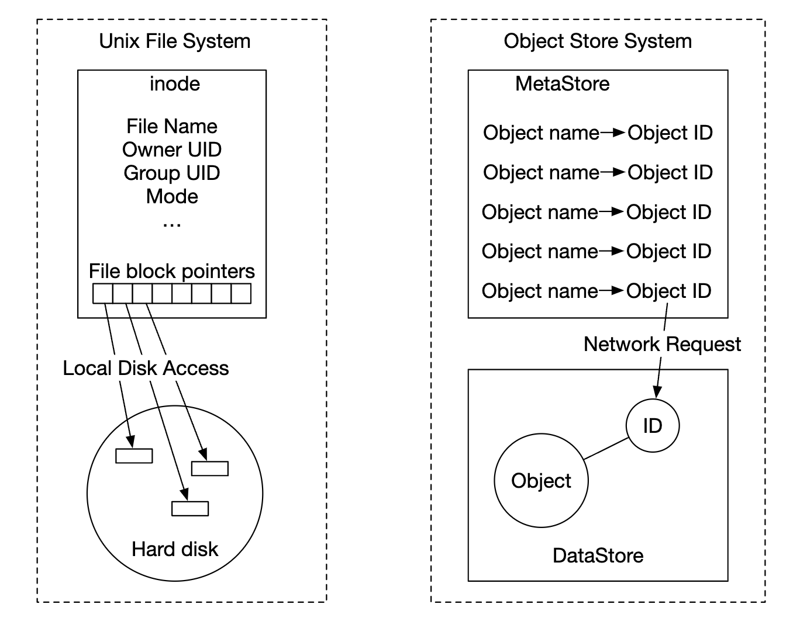

Bằng cách tách siêu dữ liệu khỏi nội dung tệp, chúng tôi có thể scaling các cửa hàng khác nhau một cách độc lập:


### **Thiết kế cao cấp**


* **Load balancer** - phân phối các yêu cầu API trên các replica dịch vụ
* **Dịch vụ API** - Stateless server, điều phối các cuộc gọi đến siêu dữ liệu và kho đối tượng cũng như dịch vụ IAM.
* **Quản lý danh tính và quyền truy cập (IAM)** - vị trí trung tâm dành cho xác thực, xác thực, kiểm soát quyền truy cập.
* **Lưu trữ dữ liệu** - lưu trữ và truy xuất dữ liệu thực tế. Hoạt động dựa trên ID đối tượng (UUID).
* **Lưu trữ siêu dữ liệu** - lưu trữ siêu dữ liệu đối tượng

### **Đang tải lên một đối tượng**

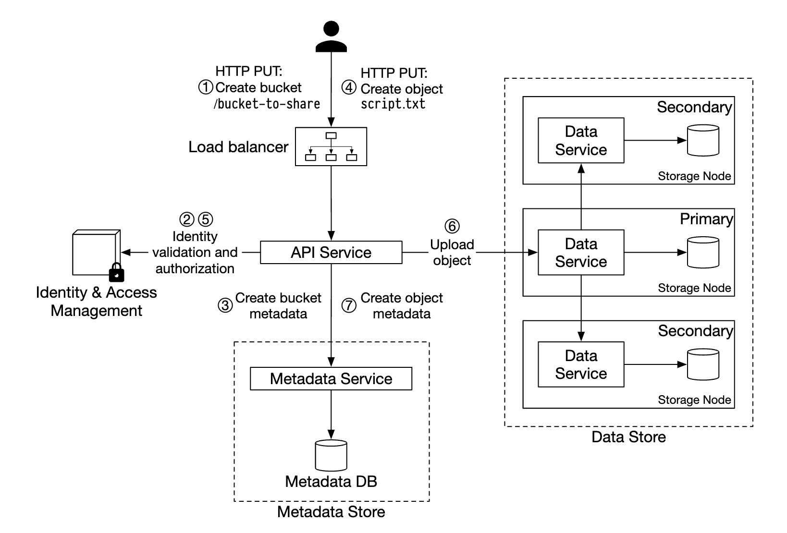

* Tạo nhóm có tên "nhóm để chia sẻ" thông qua yêu cầu HTTP PUT
* Dịch vụ API gọi IAM để đảm bảo người dùng được ủy quyền và có quyền ghi
* Dịch vụ API gọi kho lưu trữ siêu dữ liệu để tạo mục nhập nhóm. Sau khi tạo, phản hồi thành công sẽ được trả về.
* Sau khi nhóm được tạo, HTTP PUT được gửi để tạo đối tượng có tên "script.txt"
* Dịch vụ API xác minh danh tính người dùng và đảm bảo người dùng có quyền ghi
* Sau khi xác thực thành công, tải trọng đối tượng sẽ được gửi qua HTTP PUT tới kho lưu trữ dữ liệu. Kho dữ liệu vẫn tồn tại và trả về UUID.
* Dịch vụ API gọi kho lưu trữ siêu dữ liệu để tạo một mục nhập mới với object\_id, Bucket\_id và Bucket\_name, cùng với các siêu dữ liệu khác.

Yêu cầu tải lên đối tượng ví dụ:

```
PUT /bucket-to-share/script.txt HTTP/1.1
Host: foo.s3example.org
Date: Sun, 12 Sept 2021 17:51:00 GMT
Authorization: authorization string
Content-Type: text/plain
Content-Length: 4567
x-amz-meta-author: Alex

[4567 bytes of object data]
```

### **Đang tải xuống một đối tượng**

Nhóm không có hệ thống phân cấp thư mục, nhưng chúng ta có thể tạo hệ thống phân cấp logic bằng cách ghép tên nhóm và tên đối tượng để mô phỏng cấu trúc thư mục.

Ví dụ NHẬN yêu cầu tìm nạp một đối tượng:

```
GET /bucket-to-share/script.txt HTTP/1.1
Host: foo.s3example.org
Date: Sun, 12 Sept 2021 18:30:01 GMT
Authorization: authorization string
```


* Client gửi yêu cầu HTTP GET tới load balancer, tức là `GET /bucket-to-share/script.txt`
* Dịch vụ API truy vấn IAM để xác minh người dùng có quyền chính xác để đọc nhóm
* Sau khi được xác thực, UUID của đối tượng sẽ được truy xuất từ kho siêu dữ liệu
* Tải trọng đối tượng được lấy từ kho dữ liệu dựa trên UUID và được trả về client

---

// chạy nước rút 1

Bước 3: Thiết kế Deep Dive
---------------

### **Kho dữ liệu**

Đây là cách dịch vụ API tương tác với kho dữ liệu:


Các thành phần chính của kho dữ liệu:

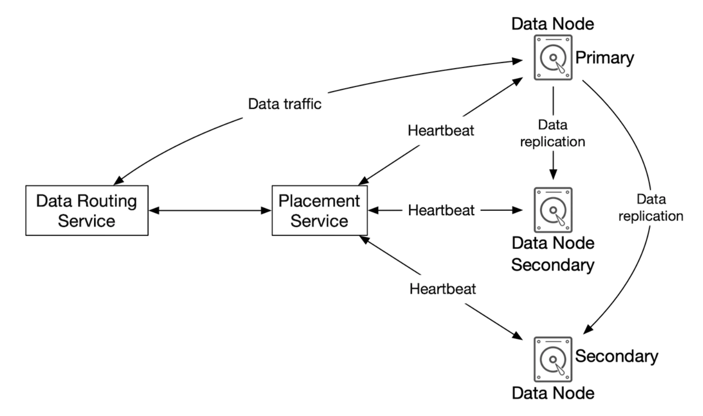

Dịch vụ routing dữ liệu cung cấp RESTful hoặc gRPC API để truy cập dữ liệu node cluster.
Đây là dịch vụ stateless, scaling bằng cách bổ sung thêm servers.

Trách nhiệm chính của nó là:

* truy vấn dịch vụ vị trí để lấy dữ liệu node tốt nhất để lưu trữ dữ liệu
* đọc dữ liệu từ dữ liệu nodes và gửi lại cho dịch vụ API
* Ghi dữ liệu vào dữ liệu nodes

Dịch vụ vị trí xác định dữ liệu nào nodes sẽ lưu trữ một đối tượng.
Nó duy trì một bản đồ cluster ảo, bản đồ này xác định cấu trúc liên kết vật lý của cluster.

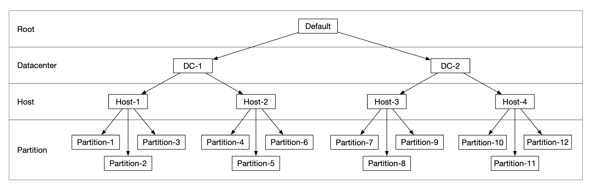

Dịch vụ này cũng gửi heartbeats tới tất cả dữ liệu nodes để xác định xem có nên xóa chúng khỏi cluster ảo hay không.

Vì đây là một dịch vụ quan trọng nên nên duy trì cluster gồm 5 hoặc 7 replica, được đồng bộ hóa thông qua thuật toán consensus Paxos hoặc Raft.
Ví dụ: 7 node cluster có thể chịu được 3 nodes bị lỗi.

Dữ liệu nodes lưu trữ dữ liệu đối tượng thực tế.
Độ tin cậy và độ bền được đảm bảo bằng cách sao chép dữ liệu sang nhiều dữ liệu nodes.

Mỗi dữ liệu node có một daemon đang chạy, gửi heartbeats đến dịch vụ vị trí.

heartbeat bao gồm:

* Dữ liệu node quản lý bao nhiêu ổ đĩa (HDD hoặc SSD)?
* Bao nhiêu dữ liệu được lưu trữ trên mỗi ổ đĩa?

#### Luồng lưu trữ dữ liệu


* Dịch vụ API chuyển tiếp dữ liệu đối tượng đến kho lưu trữ dữ liệu
* Dịch vụ routing dữ liệu gửi dữ liệu đến dữ liệu chính node
* Dữ liệu chính node lưu dữ liệu cục bộ và sao chép nó thành hai dữ liệu thứ cấp nodes. Phản hồi được gửi sau khi replication thành công.
* UUID của đối tượng được trả về dịch vụ API.

Hãy cẩn thận:

* Với một đối tượng UUID, nhóm replication được chọn một cách xác định bằng cách sử dụng consistent hashing
* Ở bước 4, dữ liệu chính node sao chép dữ liệu đối tượng trước khi trả về phản hồi. Điều này ủng hộ strong consistency hơn latency cao hơn.


#### Cách tổ chức dữ liệu

Một cách tiếp cận đơn giản để quản lý dữ liệu là lưu trữ từng đối tượng trong một tệp riêng biệt.

Tính năng này hoạt động nhưng không hiệu quả với nhiều tệp nhỏ trong hệ thống tệp:

* Khối dữ liệu trên HDD bị lãng phí vì mọi tệp đều sử dụng toàn bộ kích thước khối. Kích thước khối điển hình là 4kb.
* Nhiều tập tin có nghĩa là nhiều node. Hệ điều hành không xử lý tốt việc có quá nhiều inode và cũng có giới hạn inode tối đa.

Những vấn đề này có thể được giải quyết bằng cách hợp nhất nhiều tệp nhỏ thành tệp lớn hơn thông qua nhật ký ghi trước (WAL). Khi tệp đạt đến dung lượng (thường là vài GB), một tệp mới sẽ được tạo:


Nhược điểm của phương pháp này là quyền truy cập ghi vào tệp cần phải được tuần tự hóa. Nhiều lõi truy cập vào cùng một tệp phải chờ lẫn nhau.
Để khắc phục điều này, chúng tôi có thể giới hạn tệp ở các lõi cụ thể để tránh xung đột khóa.

#### Tra cứu đối tượng

Để hỗ trợ lưu trữ nhiều đối tượng trong cùng một tệp, chúng ta cần duy trì một bảng cho biết dữ liệu node:

* `object_id`
* `filename` nơi lưu trữ đối tượng
* `file_offset` nơi đối tượng bắt đầu
* `object_size`

Chúng ta có thể triển khai bảng này trong db dựa trên tệp như RocksDB hoặc database quan hệ truyền thống.
Vì mẫu truy cập có tốc độ ghi thấp + đọc cao nên database quan hệ hoạt động tốt hơn.

Chúng ta nên triển khai nó như thế nào?
Chúng tôi có thể triển khai db và scaling riêng biệt trong cluster, được truy cập bởi tất cả dữ liệu nodes.

Nhược điểm:

* chúng tôi cần scaling cluster một cách mạnh mẽ để phục vụ mọi yêu cầu
* có thêm network latency giữa dữ liệu node và db cluster

Một cách khác là tận dụng thực tế là dữ liệu nodes chỉ quan tâm đến dữ liệu liên quan đến chúng,
vì vậy chúng tôi có thể triển khai db quan hệ trong chính dữ liệu node.

SQLite là một lựa chọn tốt vì nó là database quan hệ dựa trên tệp nhẹ.

#### Luồng lưu trữ dữ liệu được cập nhật


* Dịch vụ API gửi yêu cầu lưu đối tượng mới
* Dịch vụ Data node nối thêm đối tượng mới vào cuối tệp, có tên là "/data/c"
* Một bản ghi mới cho đối tượng được chèn vào bảng ánh xạ đối tượng

#### Độ bền

Độ bền của dữ liệu là một yêu cầu quan trọng trong thiết kế của chúng tôi. Để đạt được độ bền 6 số 9, mọi trường hợp hỏng hóc cần được kiểm tra kỹ lưỡng.

Vấn đề đầu tiên cần giải quyết là lỗi phần cứng. Chúng tôi có thể đạt được điều đó bằng cách sao chép dữ liệu nodes để giảm thiểu khả năng xảy ra lỗi.
Nhưng ngoài ra, chúng tôi cũng phải nhân rộng trên các miền lỗi khác nhau (cross-rack, cross-dc, mạng riêng biệt, v.v.).
Một sự kiện quan trọng có thể gây ra nhiều lỗi phần cứng trong cùng một miền:


Giả sử tỷ lệ hỏng hóc hàng năm của một ổ cứng HDD thông thường là 0,81% thì việc tạo ra ba replica mang lại cho chúng ta độ bền 6 giây.

Việc sao chép dữ liệu nodes như vậy mang lại cho chúng tôi độ bền mà chúng tôi mong muốn, nhưng chúng tôi cũng có thể tận dụng mã hóa xóa để giảm chi phí lưu trữ.

Mã hóa xóa cho phép chúng ta sử dụng các bit chẵn lẻ, cho phép chúng ta xây dựng lại các bit bị mất trong trường hợp xảy ra lỗi:

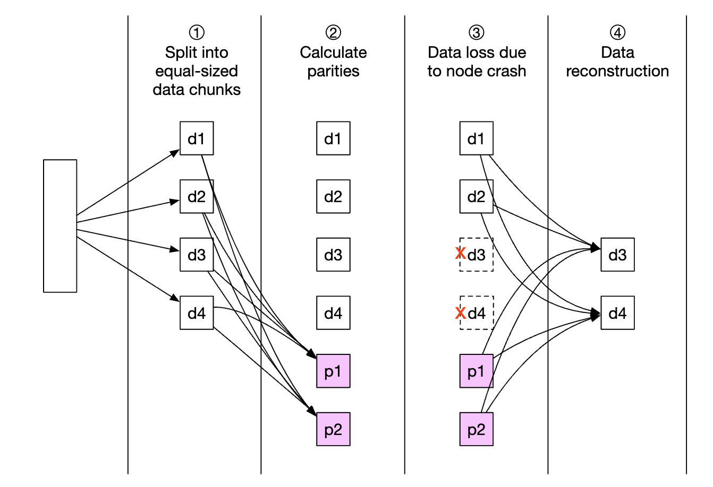

Hãy tưởng tượng những bit đó là dữ liệu nodes. Nếu hai trong số chúng bị hỏng, chúng có thể được phục hồi bằng cách sử dụng bốn cái còn lại.

Có các sơ đồ mã hóa xóa khác nhau. Trong trường hợp của chúng tôi, chúng tôi có thể sử dụng mã hóa xóa 8 + 4, phân chia thành các miền lỗi khác nhau để tối đa hóa độ tin cậy:

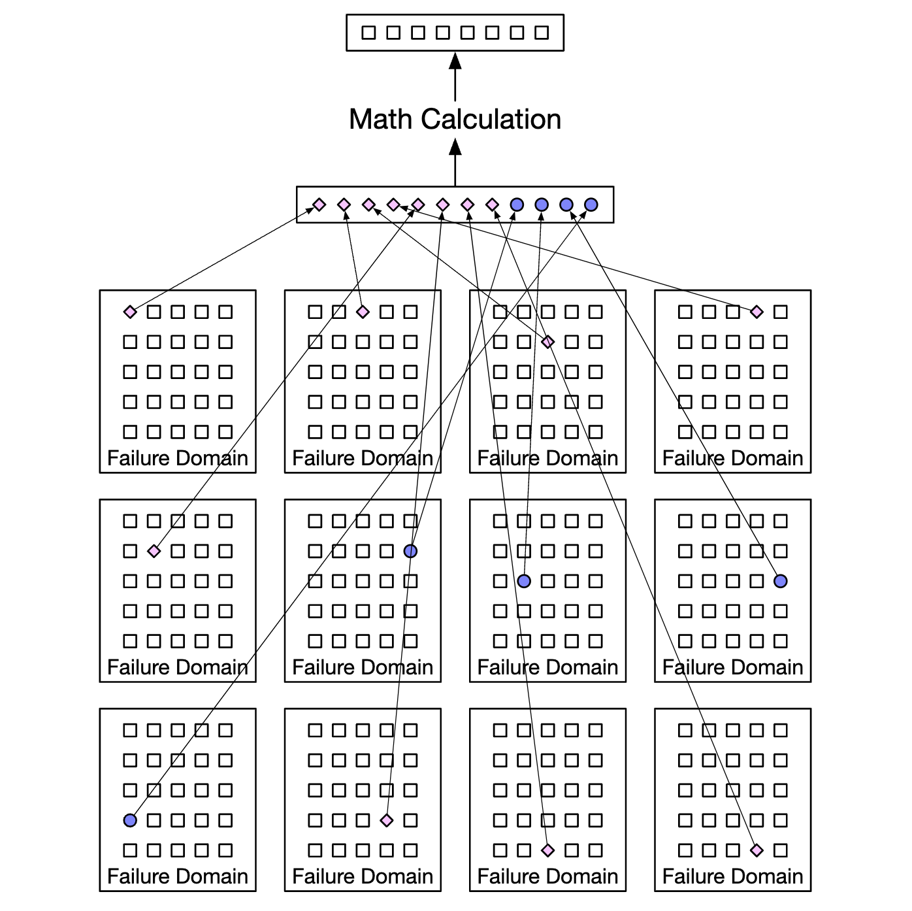

Mã hóa xóa cho phép chúng tôi đạt được chi phí lưu trữ thấp hơn nhiều (cải thiện 50%) nhưng phải trả giá bằng tốc độ truy cập do dịch vụ routing dữ liệu phải thu thập dữ liệu từ nhiều vị trí:

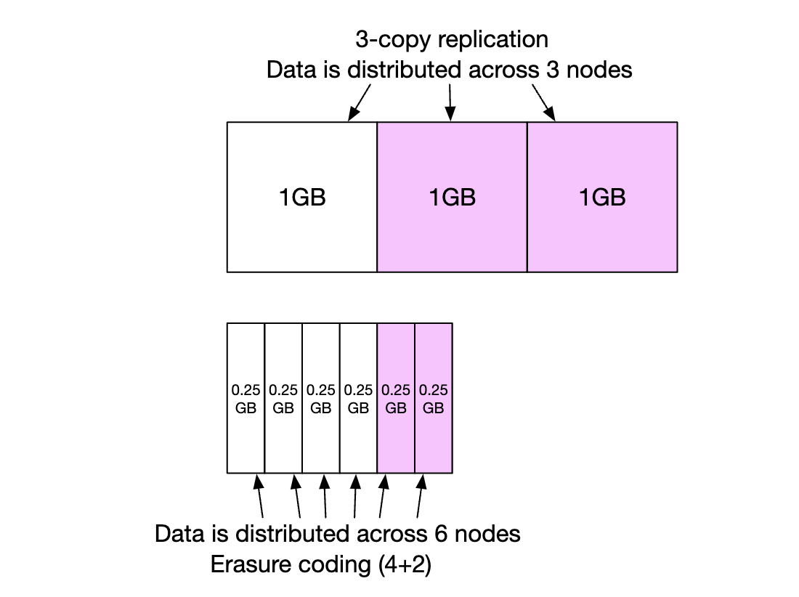

Những lưu ý khác:

* Replication yêu cầu 200% chi phí lưu trữ (trong trường hợp có 3 replica) so với 50% thông qua mã hóa xóa
* Mã hóa xóa [mang lại cho chúng tôi độ bền 11 số chín](https://github.com/Backblaze/erasure-coding-durability) so với 6 số chín thông qua replication
* Mã hóa xóa yêu cầu tính toán nhiều hơn để tính toán và lưu trữ các số chẵn lẻ

Tóm lại, replication hữu ích hơn cho các ứng dụng nhạy cảm với latency, trong khi mã hóa xóa lại hấp dẫn vì hiệu quả chi phí lưu trữ và độ bền.
Việc xóa mã hóa cũng khó thực hiện hơn nhiều.

#### Xác minh tính đúng đắn

Nếu một đĩa bị lỗi hoàn toàn thì lỗi đó rất dễ được phát hiện. Điều này ít đơn giản hơn trong trường hợp một phần bộ nhớ đĩa bị hỏng.

Để phát hiện điều này, chúng tôi có thể sử dụng tổng kiểm tra - hàm băm của nội dung tệp, có thể được sử dụng để xác minh tính toàn vẹn của tệp.

Trong trường hợp của chúng tôi, chúng tôi sẽ lưu trữ tổng kiểm tra cho từng tệp và từng đối tượng:

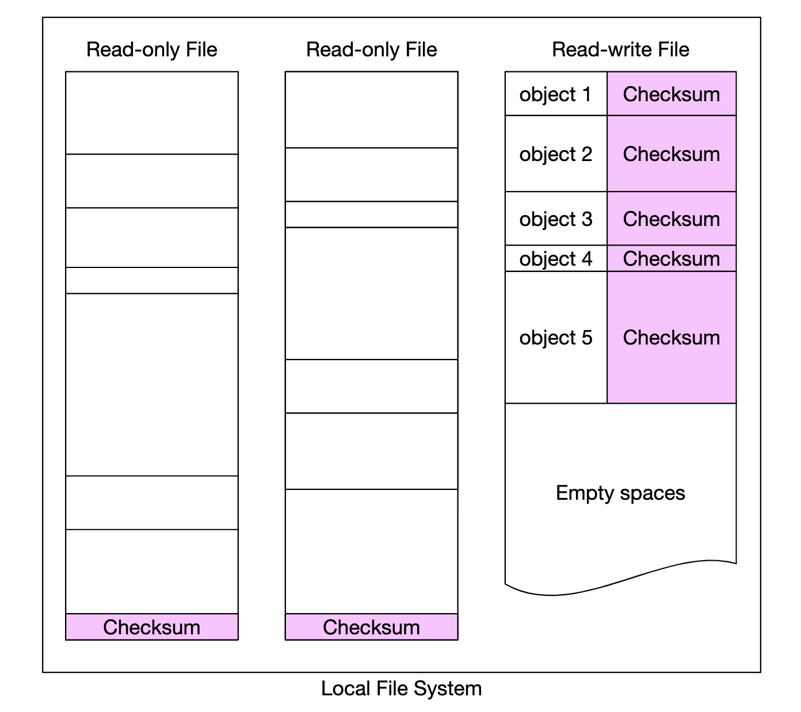

Trong trường hợp mã hóa xóa (8 + 4), chúng tôi sẽ cần tìm nạp riêng từng phần trong số 8 phần dữ liệu và xác minh từng tổng kiểm tra của chúng.

// chạy nước rút 2

### **Mô hình dữ liệu siêu dữ liệu**

Lược đồ bảng:


Các truy vấn chúng tôi cần hỗ trợ:

* Tìm ID đối tượng theo tên
* Chèn/xóa đối tượng theo tên
* Liệt kê các đối tượng trong một nhóm có chung tiền tố

Thường có giới hạn về số lượng nhóm mà người dùng có thể tạo, do đó, kích thước của bảng nhóm nhỏ và có thể vừa với một db server duy nhất.
Nhưng chúng ta vẫn cần chia tỷ lệ server để đọc throughput.

Tuy nhiên, bảng đối tượng có thể sẽ không vừa với một database server. Do đó, chúng ta có thể chia tỷ lệ bảng thông qua sharding:

* Sharding theo nhóm\_id sẽ dẫn đến sự cố hotspot vì một nhóm có thể có hàng tỷ đối tượng
* Sharding theo nhóm\_id giúp tải được phân bổ đều hơn, nhưng các truy vấn của chúng tôi sẽ chậm
* Chúng tôi chọn sharding theo `hash(bucket_name, object_name)` vì hầu hết các truy vấn đều dựa trên tên đối tượng/nhóm.

Tuy nhiên, ngay cả với sơ đồ sharding này, việc liệt kê các đối tượng trong một nhóm sẽ chậm.

### **Liệt kê các đối tượng trong một nhóm**

Trong một database, việc liệt kê một đối tượng dựa trên tiền tố của nó (trông giống như một thư mục) hoạt động như sau:

```
SELECT * FROM object WHERE bucket_id = "123" AND object_name LIKE `abc/%`
```

Đây là một thách thức khó thực hiện khi database bị sharding. Để đạt được điều đó, chúng tôi có thể chạy truy vấn trên mọi shard và tổng hợp kết quả trong bộ nhớ.
Tuy nhiên, điều này làm cho việc phân trang trở nên khó khăn vì shards khác nhau chứa kích thước kết quả khác nhau và chúng tôi cần duy trì giới hạn/độ lệch riêng cho từng loại.

Chúng ta có thể tận dụng thực tế là các cửa hàng đối tượng thông thường không được tối ưu hóa để liệt kê các đối tượng, vì vậy chúng ta có thể hy sinh hiệu suất niêm yết.
Chúng ta cũng có thể tạo một bảng không chuẩn hóa để liệt kê các đối tượng, được phân chia theo ID nhóm.
Điều đó sẽ làm cho truy vấn danh sách của chúng tôi đủ nhanh vì nó được tách biệt với một phiên bản database duy nhất.

### **Phiên bản đối tượng**

Việc lập phiên bản hoạt động bằng cách có một cột `object_version` khác thuộc loại TIMEUUID, cho phép chúng tôi sắp xếp các bản ghi dựa trên nó.

Mỗi phiên bản mới tạo ra `object_id` mới:

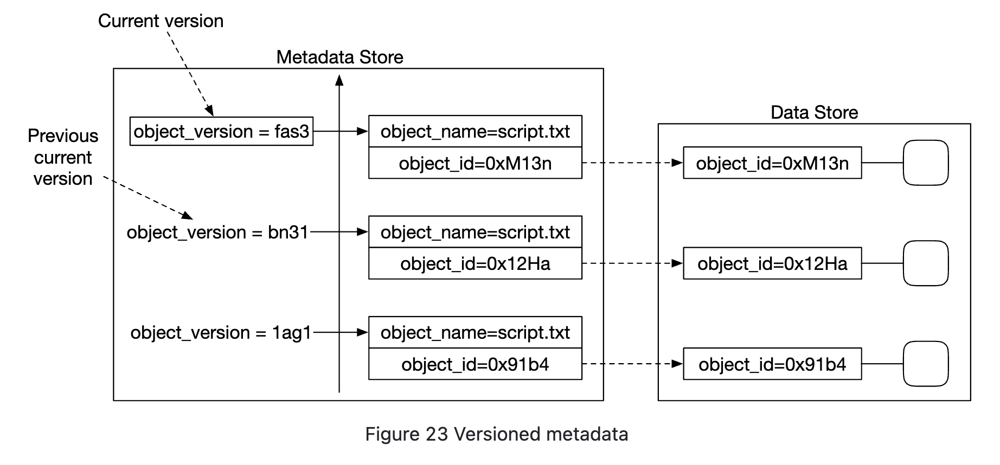

Xóa một đối tượng sẽ tạo một phiên bản mới với `object_id` đặc biệt cho biết đối tượng đã bị xóa. Các truy vấn cho nó trả về 404:

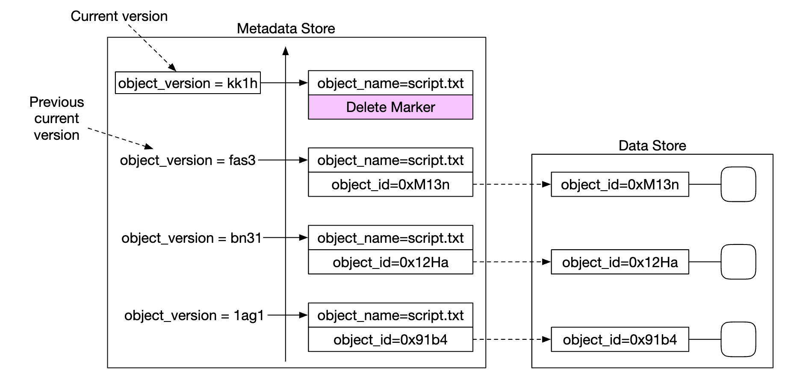

### **Tối ưu hóa tải lên các tệp lớn**

Việc tải lên các tệp lớn có thể được tối ưu hóa bằng cách sử dụng tính năng tải lên nhiều phần - chia một tệp lớn thành nhiều phần, được tải lên độc lập:

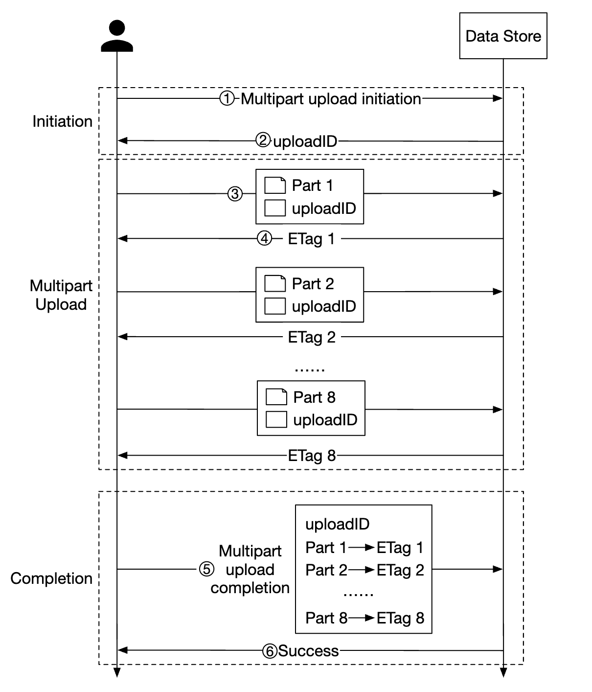

* Client gọi dịch vụ để bắt đầu tải lên nhiều phần
* Kho dữ liệu trả về ID tải lên xác định duy nhất nội dung tải lên
* Client chia tệp lớn thành nhiều phần, được tải lên độc lập bằng id tải lên
* Khi một đoạn được tải lên, kho dữ liệu trả về một etag, là tổng kiểm tra md5, xác định đoạn tải lên đó
* Sau khi tất cả các phần được tải lên, client gửi yêu cầu tải lên nhiều phần hoàn chỉnh, bao gồm upload\_id, số phần và tất cả các thẻ etags
* Kho dữ liệu tập hợp lại đối tượng từ các bộ phận của nó. Quá trình này có thể mất một vài phút. Sau đó, phản hồi thành công sẽ được trả về client.

Những phần cũ không còn hữu ích có thể được loại bỏ vào thời điểm này. Chúng tôi có thể giới thiệu một trình thu gom rác để giải quyết vấn đề đó.

### **Thu gom rác**

Thu gom rác là quá trình lấy lại không gian lưu trữ không còn được sử dụng. Có một số cách khiến dữ liệu trở thành rác:

* **xóa đối tượng lười biếng** - đối tượng được đánh dấu là đã xóa mà không thực sự bị xóa
* **dữ liệu mồ côi** - ví dụ: tải lên không thành công giữa chừng và các phần cũ cần phải xóa
* **dữ liệu bị hỏng** - dữ liệu không thể xác minh tổng kiểm tra

Trình thu gom rác cũng chịu trách nhiệm thu hồi không gian chưa sử dụng trong các replica.
Với replication, dữ liệu sẽ bị xóa khỏi cả bản gốc và replica. Với mã hóa xóa (8 + 4), dữ liệu sẽ bị xóa khỏi tất cả 12 nodes.

Để thuận tiện cho việc xóa, chúng tôi sẽ sử dụng một quy trình gọi là nén:

* Trình thu gom rác sao chép các đối tượng không bị xóa khỏi "data/b" sang "data/d"
* Bảng `object_mapping` được cập nhật sau khi sao chép hoàn tất bằng giao dịch database
* Để tránh tạo quá nhiều tệp nhỏ, việc nén được thực hiện trên các tệp vượt quá một ngưỡng nhất định

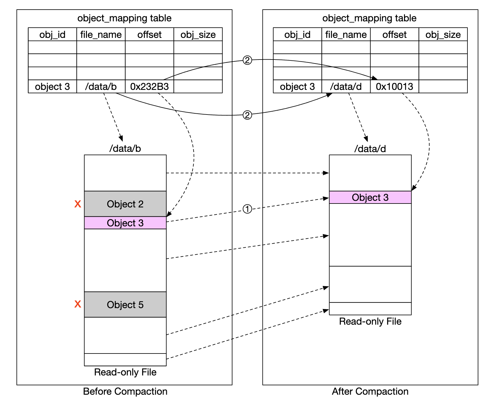


---

Bước 4: Kết thúc
---------------

Những điều chúng tôi đề cập:

* Thiết kế object storage giống S3
* So sánh sự khác biệt giữa kho lưu trữ đối tượng, khối và tệp
* Bao gồm việc tải lên, tải xuống, liệt kê, lập phiên bản các đối tượng trong một nhóm
* Đi sâu vào thiết kế - kho dữ liệu và kho siêu dữ liệu, replication và mã hóa xóa, tải lên nhiều phần, sharding