Chương 25: Bảng xếp hạng trò chơi thời gian thực
============================================

Giới thiệu
------------

Chúng tôi sẽ thiết kế **bảng xếp hạng** cho một trò chơi trực tuyến trên thiết bị di động:

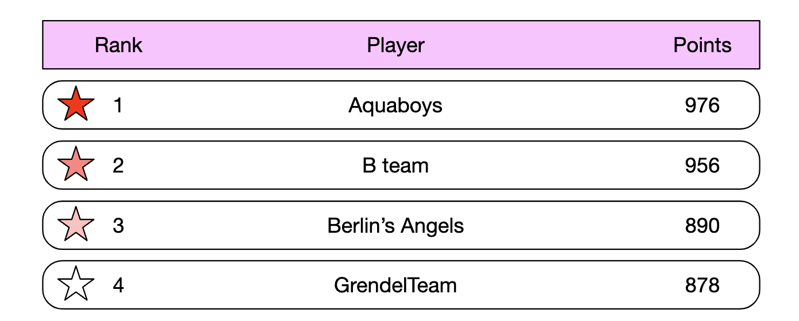


---

Bước 1: Hiểu vấn đề và thiết lập phạm vi thiết kế
---------------------------------------------------------

* C: Điểm được tính cho bảng xếp hạng như thế nào?
* I: Người dùng nhận được điểm bất cứ khi nào họ thắng một trận đấu.
* C: Có phải tất cả người chơi đều có tên trong bảng xếp hạng không?
* Tôi: Vâng
* C: Có phân đoạn thời gian nào được liên kết với bảng xếp hạng không?
* I: Mỗi tháng, một giải đấu mới bắt đầu và bảng xếp hạng mới sẽ bắt đầu.
* C: Chúng ta có thể cho rằng chúng ta chỉ quan tâm đến 10 người dùng hàng đầu không?
* I: Chúng tôi muốn hiển thị 10 người dùng hàng đầu, cùng với vị trí của người dùng cụ thể. Nếu thời gian cho phép, chúng ta có thể thảo luận về việc hiển thị người dùng xung quanh người dùng cụ thể trong bảng xếp hạng.
* C: Có bao nhiêu người chơi trong một giải đấu?
* I: 5 triệu DAU và 25 triệu MAU
* C: Trung bình có bao nhiêu trận đấu được diễn ra trong một giải đấu?
* I: Trung bình mỗi cầu thủ chơi 10 trận/ngày
* C: Làm thế nào để xác định thứ hạng nếu hai người chơi có cùng số điểm?
* Tôi: Cấp bậc của họ trong trường hợp đó là như nhau. Nếu thời gian cho phép, chúng ta có thể thảo luận về việc cắt đứt quan hệ.
* C: Bảng xếp hạng có cần phải theo thời gian thực không?
* Tôi: Có, chúng tôi muốn trình bày kết quả theo thời gian thực hoặc càng gần với thời gian thực càng tốt. Không được phép trình bày lịch sử kết quả theo đợt.

### **Yêu cầu về chức năng**

* Hiển thị 10 người chơi hàng đầu trên bảng xếp hạng
* Hiển thị thứ hạng cụ thể của người dùng
* Hiển thị người dùng ở bốn vị trí trên và dưới người dùng nhất định (phần thưởng)

### **Yêu cầu phi chức năng**

* Cập nhật theo thời gian thực về điểm số
* Cập nhật điểm số được phản ánh trên bảng xếp hạng theo thời gian thực
* Chung scalability, availability, độ tin cậy

### **Ước tính mặt sau**

Với 50 triệu DAU, nếu trò chơi có sự phân bổ người chơi đồng đều trong khoảng thời gian 24 giờ, chúng tôi sẽ có trung bình 50 người dùng mỗi giây.
Tuy nhiên, do mức phân bổ thường không đồng đều nên chúng tôi có thể ước tính rằng lượng người dùng trực tuyến cao nhất sẽ là 250 người dùng mỗi giây.

QPS dành cho người dùng ghi điểm - trung bình chơi 10 trò chơi mỗi ngày, 50 người dùng/giây \* 10 = 500 QPS. QPS đỉnh = 2500.

QPS để tìm nạp 10 bảng xếp hạng hàng đầu - giả sử người dùng mở trung bình mỗi ngày một lần, QPS là 50.

---

Bước 2: Đề xuất thiết kế cấp cao và nhận được sự đồng ý
------------------------------------------------

### **Thiết kế API**

API đầu tiên chúng tôi cần là API để cập nhật điểm của người dùng:

```
POST /v1/scores
```

API này có hai thông số - `user_id` và `points` được ghi khi thắng một trò chơi.

API này chỉ có thể truy cập được đối với trò chơi servers chứ không phải clients.

Tiếp theo là để có được 10 người chơi hàng đầu của bảng xếp hạng:

```
GET /v1/scores
```

Phản hồi ví dụ:

```
{
  "data": [
    {
      "user_id": "user_id1",
      "user_name": "alice",
      "rank": 1,
      "score": 12543
    },
    {
      "user_id": "user_id2",
      "user_name": "bob",
      "rank": 2,
      "score": 11500
    }
  ],
  ...
  "total": 10
}
```

Bạn cũng có thể lấy điểm của một người dùng cụ thể:

```
GET /v1/scores/{:user_id}
```

Phản hồi ví dụ:

```
{
    "user_info": {
        "user_id": "user5",
        "score": 1000,
        "rank": 6,
    }
}
```

### **Kiến trúc cấp cao**

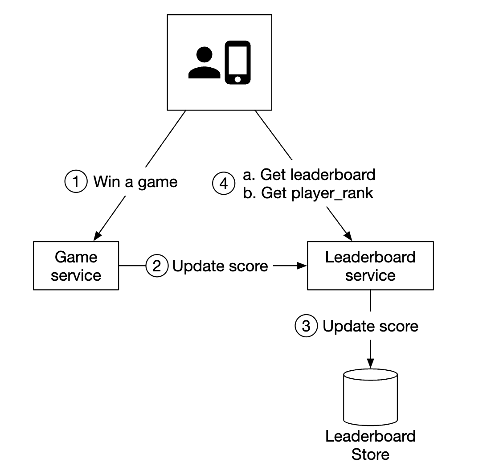

* Khi người chơi thắng trò chơi, client sẽ gửi yêu cầu đến dịch vụ trò chơi
* Dịch vụ trò chơi xác thực xem chiến thắng có hợp lệ hay không và gọi dịch vụ bảng xếp hạng để cập nhật điểm của người chơi
* Dịch vụ bảng xếp hạng cập nhật điểm số của người dùng trong kho bảng xếp hạng
* Người chơi thực hiện cuộc gọi đến dịch vụ bảng xếp hạng để lấy dữ liệu bảng xếp hạng, ví dụ: 10 người chơi hàng đầu và xếp hạng của người chơi nhất định

Một thiết kế thay thế đã được xem xét là client cập nhật điểm số của họ trực tiếp trong dịch vụ bảng xếp hạng:

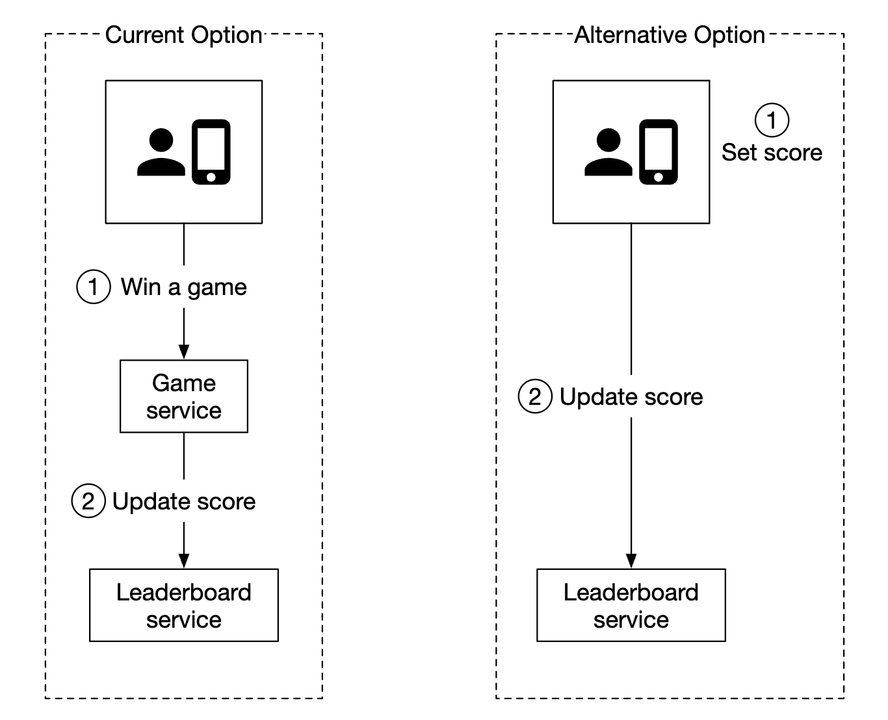

Tùy chọn này không an toàn vì nó dễ bị tấn công bởi kẻ trung gian. Người chơi có thể đặt proxy và thay đổi điểm số của mình theo ý muốn.

Một lưu ý nữa là đối với các trò chơi mà logic trò chơi được quản lý bởi server, người chơi không cần gọi server một cách rõ ràng để ghi lại chiến thắng của họ.
Servers tự động làm điều đó cho họ dựa trên logic trò chơi.

Một điều cần cân nhắc nữa là liệu chúng ta có nên đặt message queue giữa trò chơi server và dịch vụ bảng xếp hạng hay không. Điều này sẽ hữu ích nếu các dịch vụ khác quan tâm đến kết quả trò chơi, nhưng đó không phải là một yêu cầu rõ ràng trong cuộc phỏng vấn cho đến nay, do đó nó không được đưa vào thiết kế:

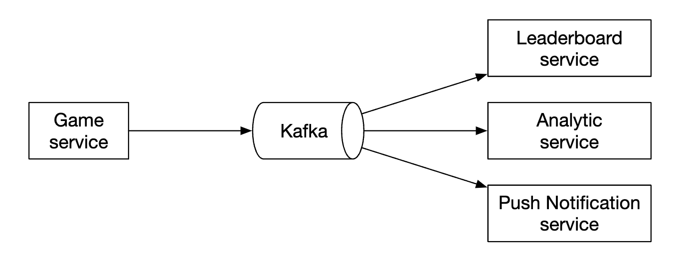

### **Mô hình dữ liệu**

Hãy thảo luận về các tùy chọn mà chúng tôi có để lưu trữ dữ liệu bảng xếp hạng - DBs, Redis, NoSQL quan hệ.

Giải pháp NoSQL được thảo luận trong phần tìm hiểu sâu.

#### Giải pháp database quan hệ

Nếu quy mô không thành vấn đề và chúng tôi không có nhiều người dùng như vậy thì DB quan hệ sẽ phục vụ chúng tôi khá tốt.

Chúng ta có thể bắt đầu từ một bảng xếp hạng đơn giản, một bảng cho mỗi tháng (lưu ý cá nhân - điều này không có ý nghĩa gì. Bạn chỉ cần thêm cột `month` và tránh phải đau đầu khi duy trì các bảng mới mỗi tháng):

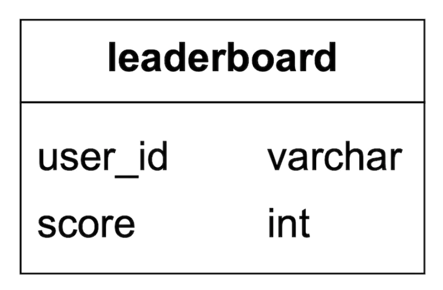

Có dữ liệu bổ sung cần đưa vào đó, nhưng dữ liệu đó không liên quan đến các truy vấn mà chúng tôi sẽ chạy nên đã bị bỏ qua.

Điều gì xảy ra khi người dùng giành được một điểm?

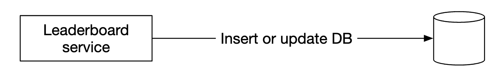

Nếu người dùng chưa tồn tại trong bảng, trước tiên chúng ta cần chèn họ:

```
INSERT INTO leaderboard (user_id, score) VALUES ('mary1934', 1);
```

Trong các cuộc gọi tiếp theo, chúng tôi chỉ cập nhật điểm của họ:

```
UPDATE leaderboard set score=score + 1 where user_id='mary1934';
```

Làm cách nào để chúng tôi tìm thấy những người chơi hàng đầu trên bảng xếp hạng?

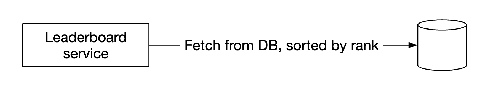

Chúng ta có thể chạy truy vấn sau:

```
SELECT (@rownum := @rownum + 1) AS rank, user_id, score
FROM leaderboard
ORDER BY score DESC;
```

Tuy nhiên, điều này không hiệu quả vì nó thực hiện quét bảng để sắp xếp tất cả các bản ghi trong bảng database.

Chúng tôi có thể tối ưu hóa nó bằng cách thêm index trên `score` và sử dụng thao tác `LIMIT` để tránh quét mọi thứ:

```
SELECT (@rownum := @rownum + 1) AS rank, user_id, score
FROM leaderboard
ORDER BY score DESC
LIMIT 10;
```

Tuy nhiên, cách tiếp cận này không có quy mô tốt nếu người dùng không đứng đầu bảng xếp hạng và bạn muốn xác định thứ hạng của họ.

#### Giải pháp Redis

Chúng tôi muốn tìm một giải pháp hoạt động tốt ngay cả với hàng triệu người chơi mà không cần phải thực hiện các truy vấn database phức tạp.

Redis là kho lưu trữ dữ liệu trong bộ nhớ, hoạt động nhanh trong bộ nhớ và có cấu trúc dữ liệu phù hợp để phục vụ nhu cầu của chúng ta - sorted set.

sorted set là cấu trúc dữ liệu tương tự như các bộ trong ngôn ngữ lập trình, cho phép bạn giữ cấu trúc dữ liệu được sắp xếp theo tiêu chí nhất định.
Trong nội bộ, nó được triển khai bằng cách sử dụng bản đồ băm để duy trì ánh xạ giữa khóa (user\_id) và giá trị (điểm) và danh sách bỏ qua ánh xạ điểm tới người dùng theo thứ tự được sắp xếp:

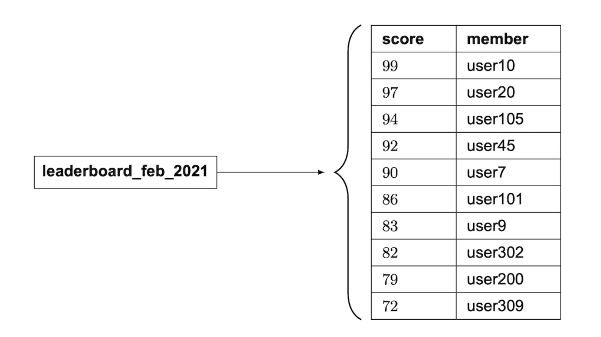

Danh sách bỏ qua hoạt động như thế nào?

* Đây là danh sách liên kết cho phép tìm kiếm nhanh
* Nó bao gồm một danh sách liên kết được sắp xếp và các chỉ mục đa cấp

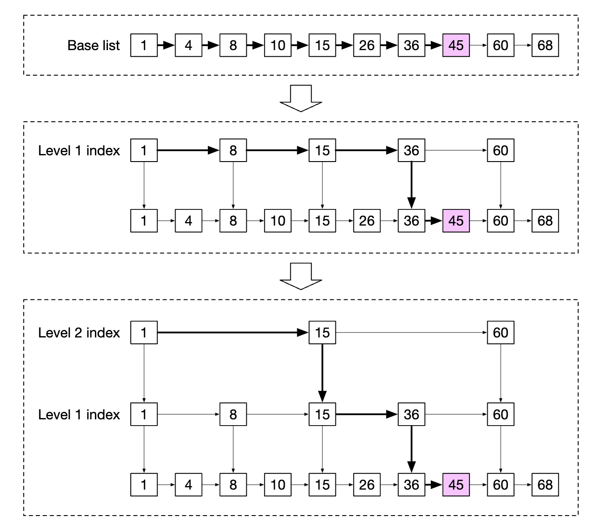

Cấu trúc này cho phép chúng ta nhanh chóng tìm kiếm các giá trị cụ thể khi tập dữ liệu đủ lớn.
Trong ví dụ bên dưới (64 nodes), nó yêu cầu duyệt qua 62 nodes trong danh sách liên kết base để tìm giá trị đã cho và 11 nodes trong trường hợp danh sách bỏ qua:

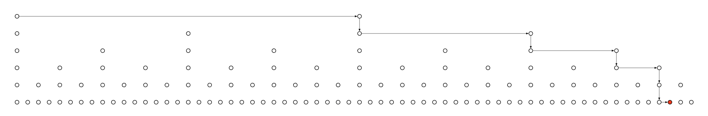

Sorted sets có hiệu suất cao hơn databases quan hệ vì dữ liệu luôn được sắp xếp với mức giá của thao tác thêm và tìm O(logN).

Trong hợp đồng, đây là một ví dụ về truy vấn lồng nhau mà chúng ta cần chạy để tìm thứ hạng của một người dùng nhất định trong DB quan hệ:

```
SELECT *,(SELECT COUNT(*) FROM leaderboard lb2
WHERE lb2.score >= lb1.score) RANK
FROM leaderboard lb1
WHERE lb1.user_id = {:user_id};
```

Chúng tôi cần những thao tác nào để vận hành bảng xếp hạng của mình trong Redis?

* **ZADD** - chèn người dùng vào nhóm nếu họ không tồn tại. Nếu không, hãy cập nhật điểm số. Độ phức tạp thời gian O(logN).
* **ZINCRBY** - tăng điểm của người dùng theo số tiền nhất định. Nếu người dùng không tồn tại, điểm bắt đầu từ 0. Độ phức tạp thời gian O(logN).
* **ZRANGE/ZREVRANGE** - tìm nạp một loạt người dùng, được sắp xếp theo điểm số của họ. Chúng ta có thể chỉ định thứ tự (ASC/DESC), offset và kích thước kết quả. Độ phức tạp thời gian O(logN+M) trong đó M là kích thước kết quả.
* **ZRANK/ZREVRANK** - Tìm nạp vị trí (thứ hạng) của người dùng nhất định theo thứ tự ASC/DESC. Độ phức tạp thời gian O(logN).

Điều gì xảy ra khi người dùng ghi được một điểm?

```
ZINCRBY leaderboard_feb_2021 1 'mary1934'
```

Có một bảng xếp hạng mới được tạo hàng tháng trong khi những bảng xếp hạng cũ được chuyển vào bộ nhớ lịch sử.

Điều gì xảy ra khi người dùng tìm nạp 10 người chơi hàng đầu?

```
ZREVRANGE leaderboard_feb_2021 0 9 WITHSCORES
```

Kết quả ví dụ:

```
[(user2,score2),(user1,score1),(user5,score5)...]
```

Còn việc người dùng tìm nạp vị trí trên bảng xếp hạng của họ thì sao?

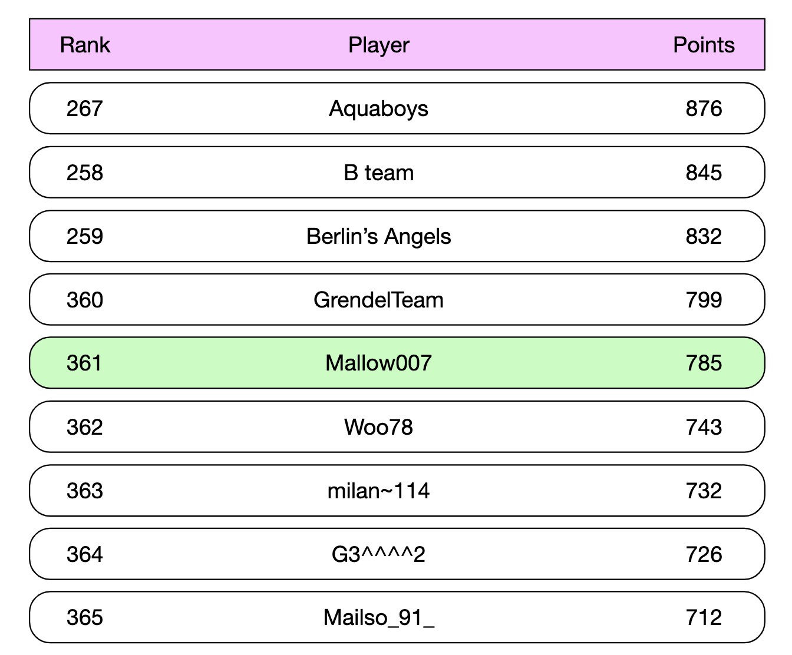

Bạn có thể dễ dàng đạt được điều này bằng truy vấn sau, vì chúng tôi biết vị trí trên bảng xếp hạng của người dùng:

```
ZREVRANGE leaderboard_feb_2021 357 365
```

Vị trí của người dùng có thể được tìm nạp bằng `ZREVRANK <user-id>`.

Hãy cùng khám phá yêu cầu lưu trữ của chúng tôi là gì:

* Giả sử trường hợp xấu nhất là tất cả 25 triệu MAU tham gia trò chơi trong một tháng nhất định
* ID là chuỗi 24 ký tự và điểm là số nguyên 16 bit, chúng tôi cần 26 byte \* 25mil = ~650 MB dung lượng lưu trữ
* Ngay cả khi chúng tôi tăng gấp đôi chi phí lưu trữ do chi phí của danh sách bỏ qua, điều này vẫn dễ dàng phù hợp với redis cluster hiện đại

Một yêu cầu phi chức năng khác cần xem xét là hỗ trợ 2500 bản cập nhật mỗi giây. Điều này nằm trong khả năng của một Redis server.

Lưu ý bổ sung:

* Chúng tôi có thể tạo replica Redis để tránh mất dữ liệu khi redis server gặp sự cố
* Chúng tôi vẫn có thể tận dụng tính bền bỉ của Redis để không bị mất dữ liệu trong trường hợp xảy ra sự cố
* Chúng tôi sẽ cần hai bảng hỗ trợ trong MySQL để tìm nạp thông tin chi tiết về người dùng như tên người dùng, tên hiển thị, v.v. cũng như lưu trữ khi ví dụ: người dùng thắng trò chơi
* Bảng thứ hai trong MySQL có thể được sử dụng để xây dựng lại bảng xếp hạng khi có lỗi cơ sở hạ tầng
* Là một sự tối ưu hóa hiệu suất nhỏ, chúng tôi có thể cache chi tiết người dùng của 10 người chơi hàng đầu vì họ thường xuyên được truy cập

---

Bước 3: Thiết kế Deep Dive
---------------

### **Có sử dụng nhà cung cấp dịch vụ đám mây hay không**

Chúng tôi có thể chọn triển khai và quản lý các dịch vụ của riêng mình hoặc sử dụng nhà cung cấp đám mây để quản lý chúng cho chúng tôi.

Nếu chúng tôi chọn tự quản lý các dịch vụ, chúng tôi sẽ sử dụng redis cho dữ liệu bảng xếp hạng, mysql cho hồ sơ người dùng và có thể là cache cho hồ sơ người dùng nếu chúng tôi muốn scaling database:

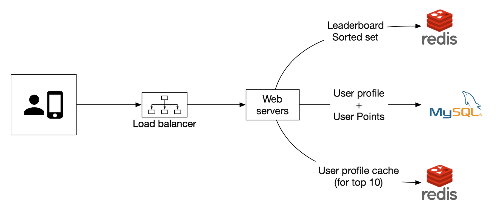

Ngoài ra, chúng tôi có thể sử dụng các dịch vụ đám mây để quản lý nhiều dịch vụ cho mình. Ví dụ: chúng ta có thể sử dụng AWS API Gateway để routing các lệnh gọi API đến các hàm AWS Lambda:

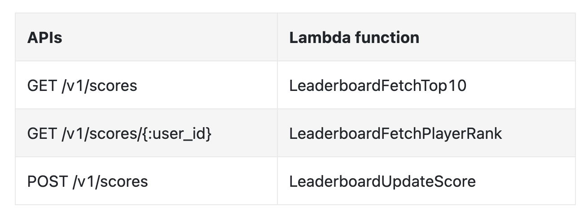

AWS Lambda cho phép chúng tôi chạy mã mà không cần tự quản lý hoặc cung cấp servers. Nó chỉ chạy khi cần thiết và tự động chia tỷ lệ.

Ví dụ người dùng ghi điểm:

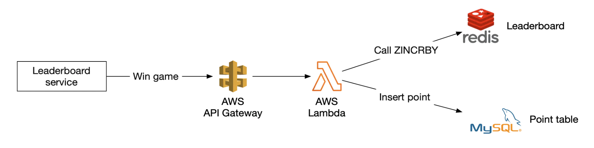

Ví dụ người dùng truy xuất bảng xếp hạng:

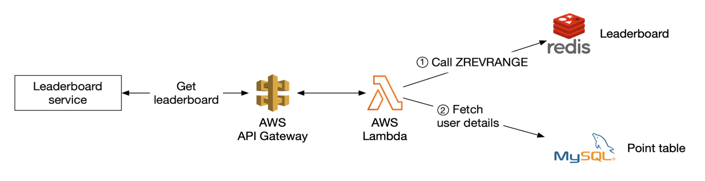

Lambdas là một triển khai của kiến trúc không có server. Chúng tôi không cần quản lý scaling và thiết lập môi trường.

Tác giả khuyên bạn nên áp dụng cách tiếp cận này nếu chúng ta xây dựng trò chơi từ đầu.

### **Scaling Redis**

Với 5 triệu DAU, chúng ta có thể sử dụng một phiên bản Redis duy nhất từ ​​cả góc độ lưu trữ và QPS.

Tuy nhiên, nếu chúng ta tưởng tượng cơ sở người dùng tăng gấp 10 lần lên 500 triệu DAU thì chúng ta sẽ cần 65gb để lưu trữ và QPS lên tới 250k.

Quy mô như vậy sẽ yêu cầu sharding.

Một cách để đạt được điều đó là phân vùng dữ liệu theo phạm vi:

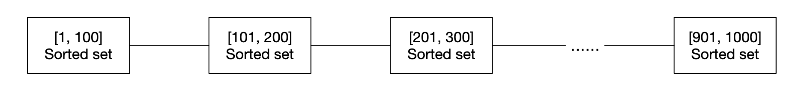

Trong ví dụ này, chúng tôi sẽ shard dựa trên điểm của người dùng. Chúng tôi sẽ duy trì ánh xạ giữa user\_id và shard trong mã ứng dụng.
Chúng tôi có thể thực hiện điều đó thông qua MySQL hoặc cache khác để lập bản đồ.

Để tìm nạp 10 người chơi hàng đầu, chúng tôi truy vấn shard có điểm cao nhất (`[900-1000]`).

Để lấy thứ hạng của người dùng, chúng tôi cần tính thứ hạng trong shard của người dùng và cộng tất cả người dùng có điểm cao hơn trong shards khác.
Hoạt động sau là thao tác O(1) vì tổng số bản ghi trên mỗi shard có thể được truy cập nhanh chóng thông qua lệnh info keyspace.

Ngoài ra, chúng ta có thể sử dụng phân vùng băm thông qua Redis Cluster. Đó là proxy phân phối dữ liệu trên redis nodes dựa trên phân vùng tương tự consistent hashing, nhưng không hoàn toàn giống nhau:

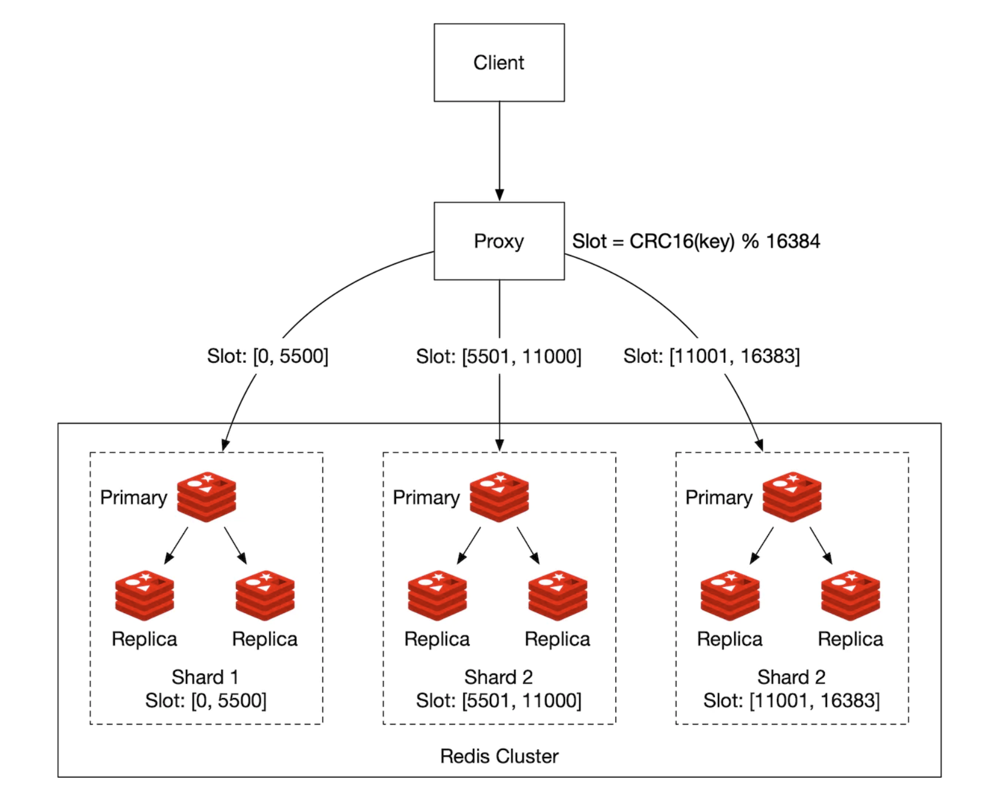

Việc tính toán 10 người chơi hàng đầu là một thách thức với thiết lập này. Chúng tôi sẽ cần lấy 10 người chơi hàng đầu của mỗi shard và hợp nhất các kết quả trong ứng dụng:

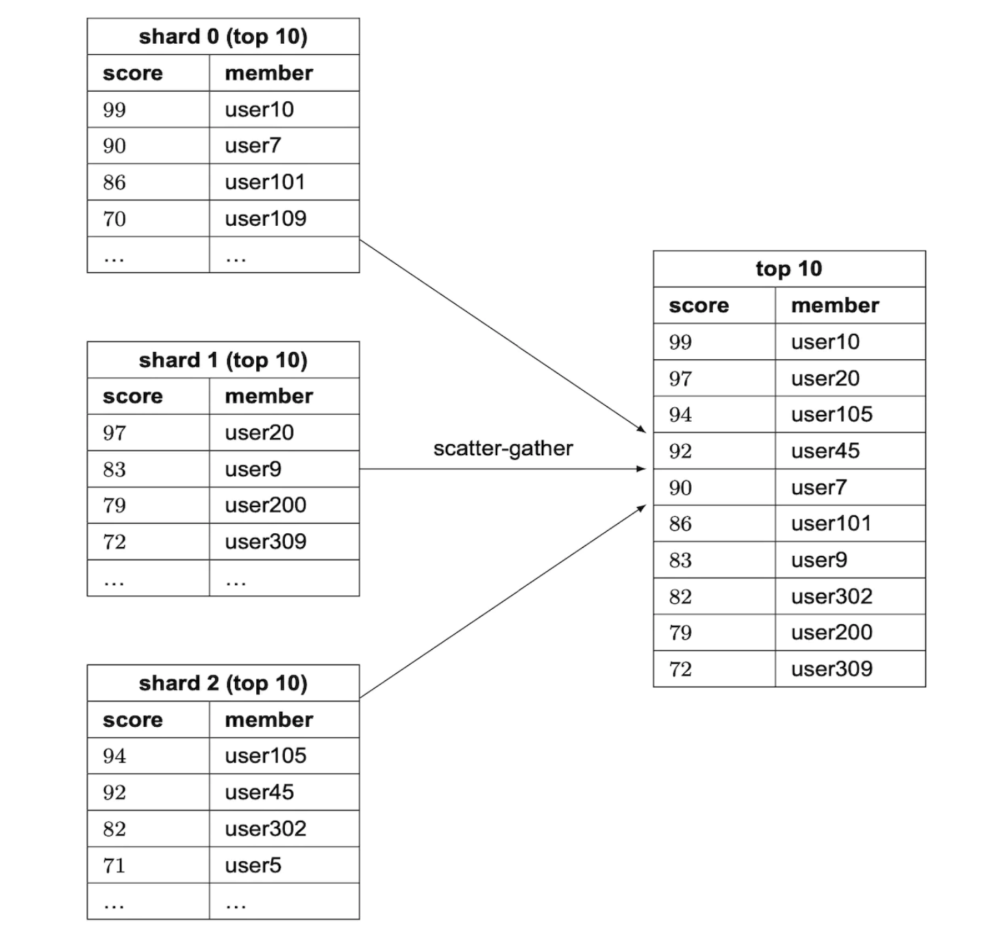

Có một số hạn chế với phân vùng băm:

* Nếu chúng tôi cần tìm nạp K người dùng hàng đầu, trong đó K cao, latency có thể tăng vì chúng tôi cần tìm nạp nhiều dữ liệu từ tất cả shards
* Latency tăng khi số lượng partitions tăng lên
* Không có cách tiếp cận đơn giản nào để xác định thứ hạng của người dùng

Do tất cả những điều này, tác giả nghiêng về việc sử dụng partitions cố định cho vấn đề này.

Những lưu ý khác:

* Cách tốt nhất là phân bổ gấp đôi bộ nhớ cần thiết cho redis nodes ghi nhiều để chứa ảnh chụp nhanh nếu cần
* Chúng tôi có thể sử dụng công cụ có tên Redis-benchmark để theo dõi hiệu suất của thiết lập redis và đưa ra quyết định dựa trên dữ liệu

### **Giải pháp thay thế: NoSQL**

Một giải pháp thay thế cần cân nhắc là sử dụng NoSQL database thích hợp được tối ưu hóa cho:

* viết nặng
* sắp xếp các mục một cách hiệu quả trong cùng một partition theo điểm

DynamoDB, Cassandra hoặc MongoDB đều phù hợp.

Trong chương này, tác giả đã quyết định sử dụng DynamoDB. Nó là NoSQL database được quản lý hoàn toàn, mang lại hiệu suất đáng tin cậy và scalability tuyệt vời.
Nó cũng cho phép sử dụng các chỉ mục phụ chung khi chúng ta cần truy vấn các trường không thuộc khóa chính.

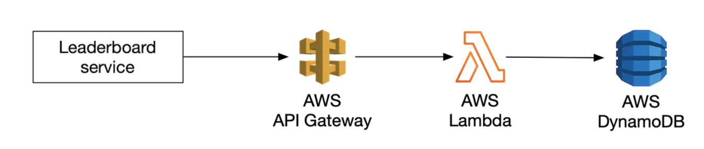

Hãy bắt đầu từ bảng lưu trữ bảng xếp hạng cho một ván cờ:

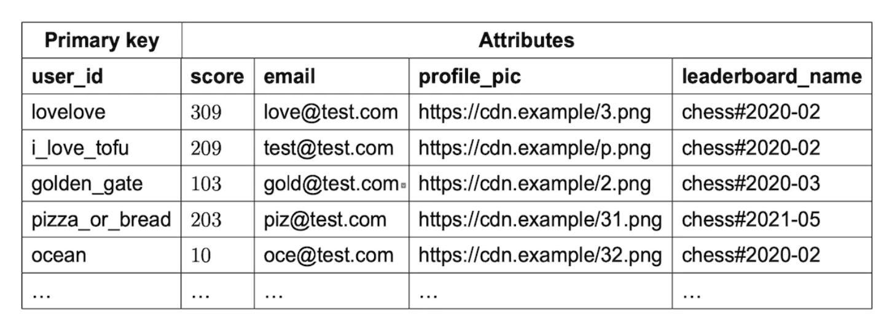

Điều này hoạt động tốt nhưng không scaling tốt nếu chúng ta cần truy vấn bất cứ điều gì theo điểm số. Do đó, chúng ta có thể đặt điểm làm khóa sắp xếp:

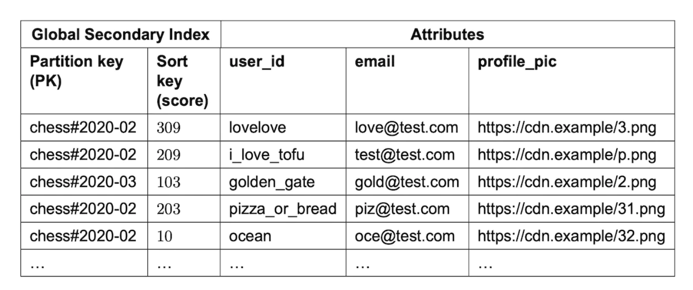

Một vấn đề khác với thiết kế này là chúng ta phân vùng theo tháng. Điều này dẫn đến hotspot partition vì tháng gần nhất sẽ được truy cập không đồng đều so với các tháng khác.

Chúng ta có thể sử dụng một kỹ thuật gọi là ghi sharding, trong đó chúng ta thêm số partition cho mỗi khóa, được tính thông qua DynamoDB:

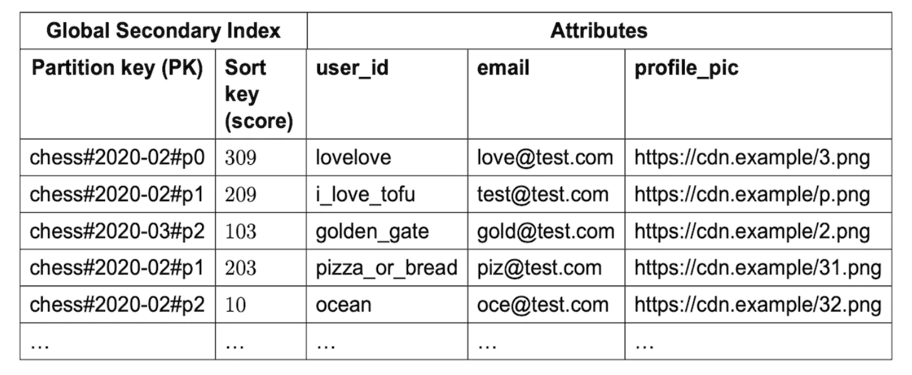

Một sự đánh đổi quan trọng cần xem xét là chúng ta nên sử dụng bao nhiêu partitions:

* Càng có nhiều partitions thì scalability ghi càng cao
* Tuy nhiên, việc đọc scalability gặp khó khăn vì chúng tôi cần truy vấn thêm partitions để thu thập kết quả tổng hợp

Việc sử dụng phương pháp này yêu cầu chúng tôi sử dụng kỹ thuật "tập hợp phân tán" mà chúng tôi đã thấy trước đó, kỹ thuật này sẽ tăng độ phức tạp về thời gian khi chúng tôi thêm nhiều partitions hơn:

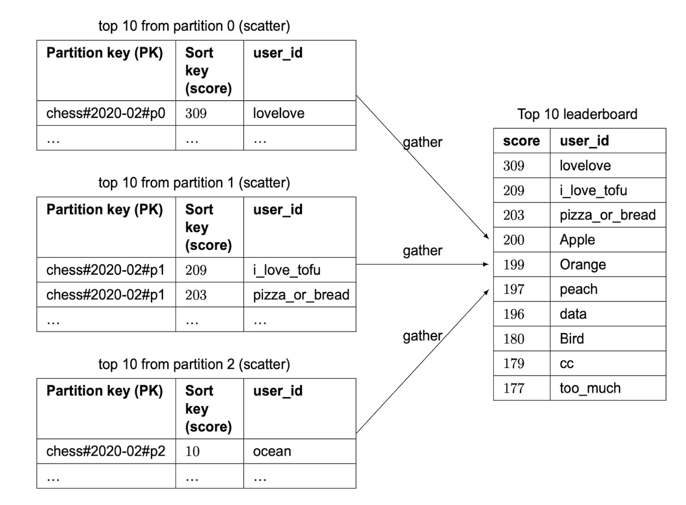

Để đánh giá tốt về số lượng partitions, chúng tôi cần thực hiện một số điểm chuẩn.

Cách tiếp cận NoSQL này vẫn có một nhược điểm lớn - rất khó để tính thứ hạng cụ thể của người dùng.

Nếu chúng tôi có đủ quy mô để yêu cầu chúng tôi sử dụng shard thì có lẽ chúng tôi có thể cho người dùng biết họ đang ở "phần trăm" điểm nào.

Một công việc định kỳ có thể chạy định kỳ để phân tích phân phối điểm, dựa vào đó xác định phần trăm của người dùng, ví dụ:

```
10th percentile = score < 100
20th percentile = score < 500
...
90th percentile = score < 6500
```

---

Bước 4: Kết thúc
---------------

Những vấn đề khác cần thảo luận nếu thời gian cho phép:

* **Truy xuất nhanh hơn** - Chúng tôi có thể cache đối tượng người dùng thông qua hàm băm Redis với ánh xạ `user_id -> user object`. Điều này cho phép truy xuất nhanh hơn so với truy vấn database.
* **Phá vỡ mối quan hệ** - Khi hai người chơi có cùng số điểm, chúng ta có thể phá vỡ thế hòa bằng cách sắp xếp họ dựa trên trận đấu đã chơi gần đây nhất.
* **Khôi phục lỗi hệ thống** - Trong trường hợp ngừng hoạt động Redis trên quy mô lớn, chúng tôi có thể tạo lại bảng xếp hạng bằng cách xem qua các mục MySQL WAL và tạo lại bảng đó thông qua tập lệnh đặc biệt