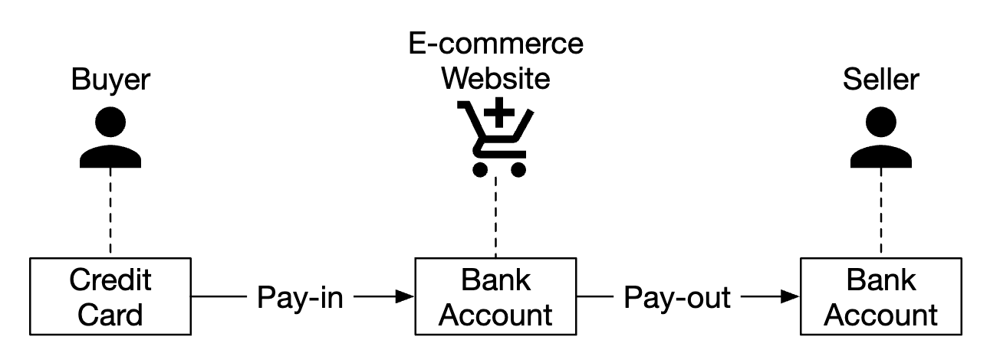
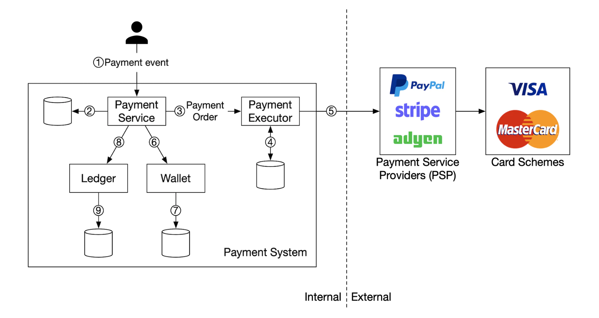
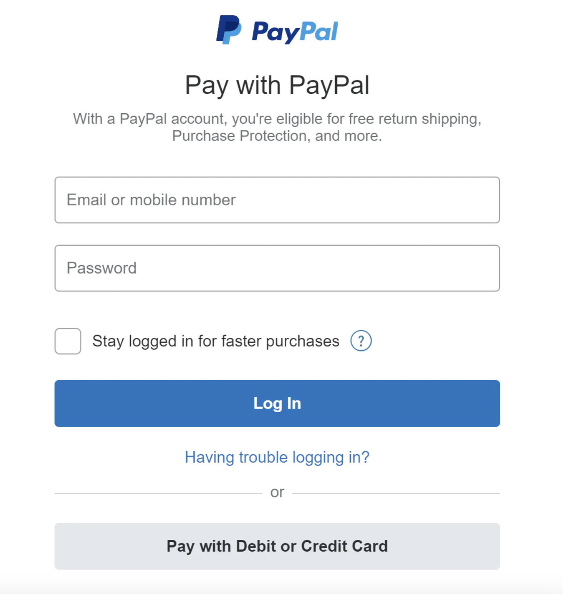
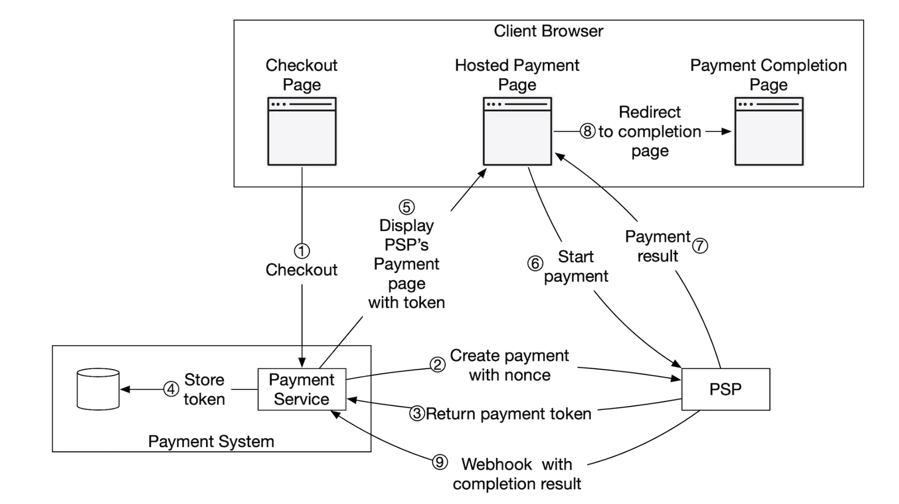
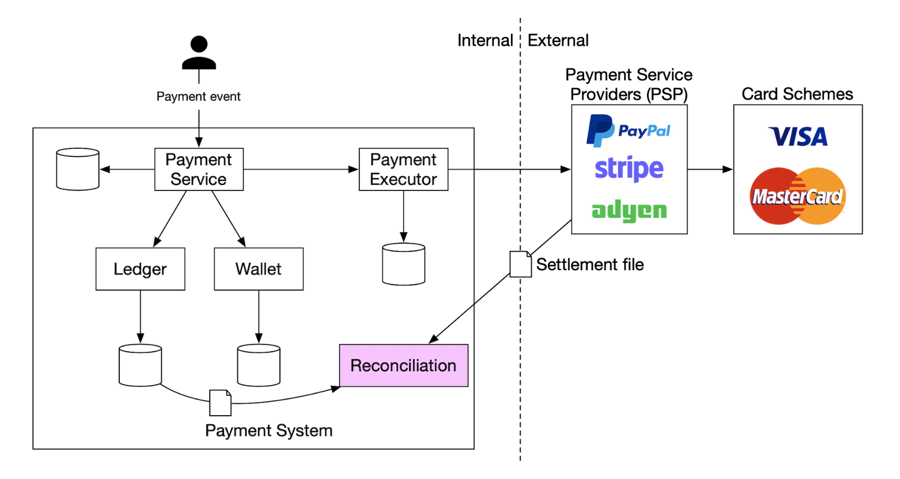
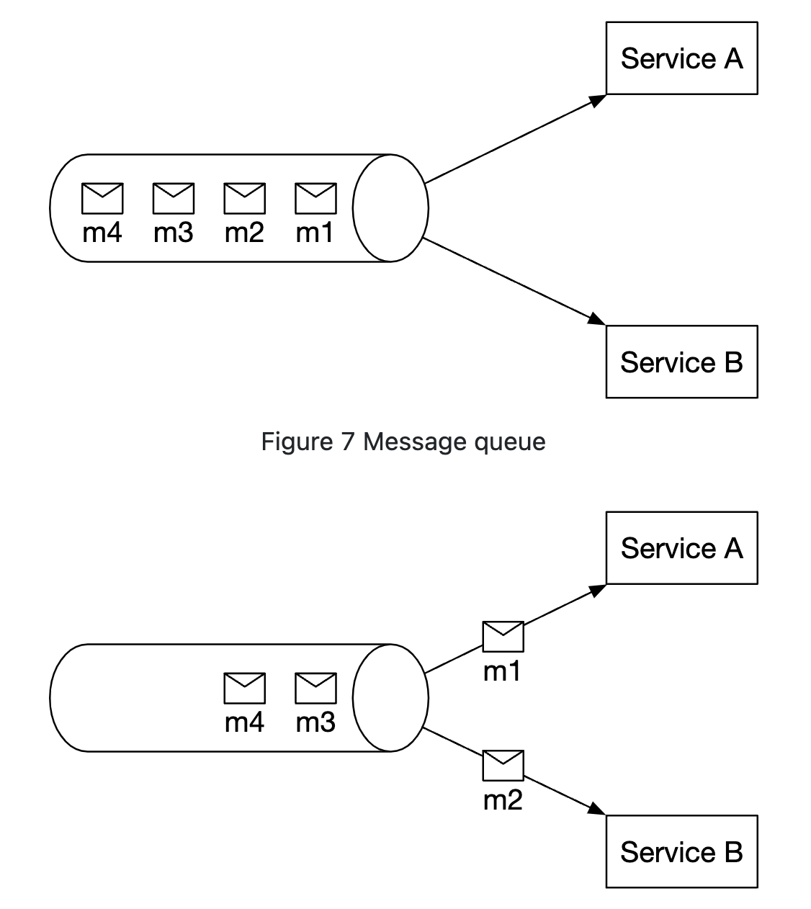
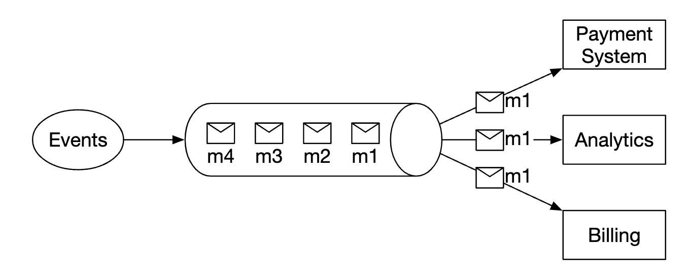
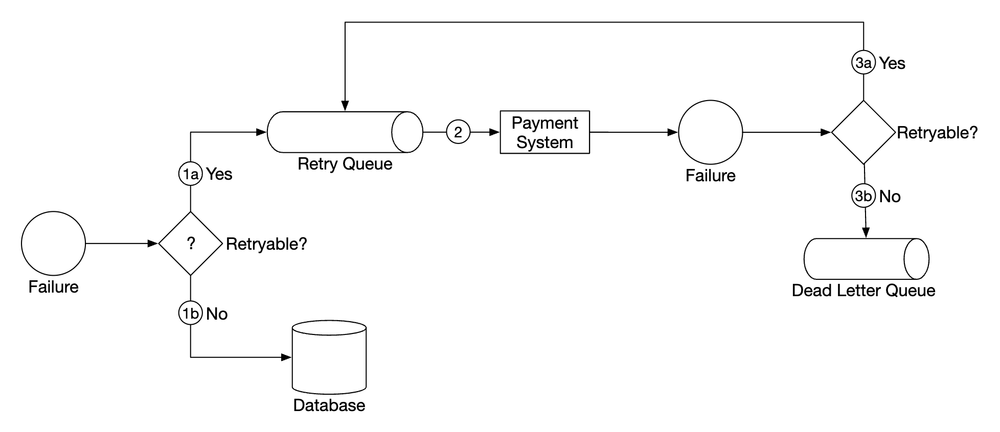
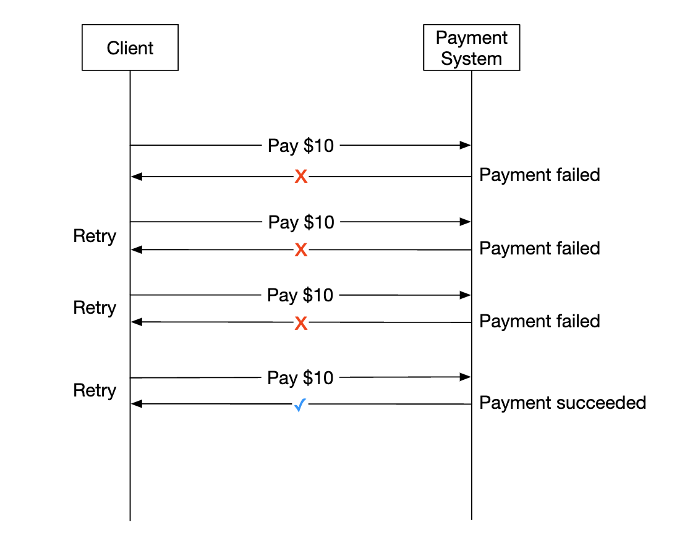
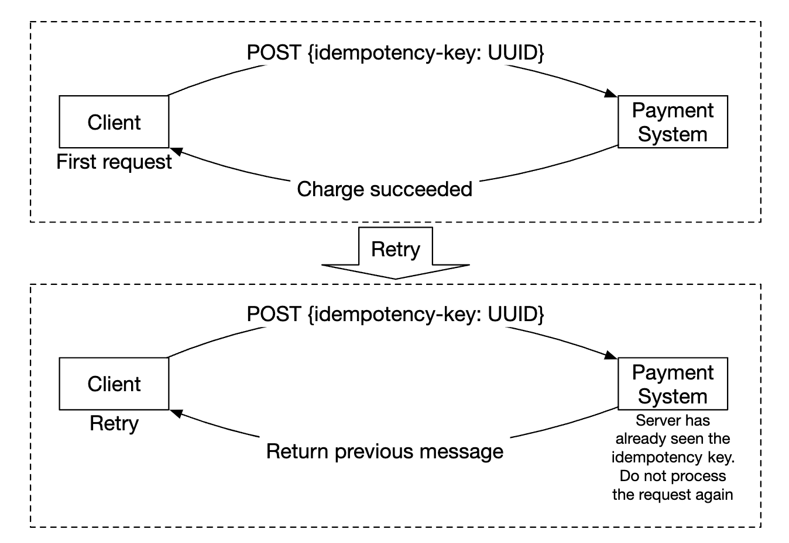

Chương 26: Hệ thống thanh toán
=============================

Giới thiệu
------------

Chúng ta sẽ thiết kế một **hệ thống thanh toán** trong chương này, hệ thống này làm nền tảng cho tất cả **thương mại điện tử** hiện đại.

**hệ thống thanh toán** được sử dụng để giải quyết các giao dịch tài chính, chuyển giá trị tiền tệ.

---

Bước 1: Hiểu vấn đề và thiết lập phạm vi thiết kế
---------------------------------------------------------

* C: Chúng ta đang xây dựng loại hệ thống thanh toán nào?
* I: Phần phụ trợ thanh toán cho hệ thống thương mại điện tử, tương tự như Amazon.com. Nó xử lý mọi thứ liên quan đến chuyển động tiền.
* C: Những tùy chọn thanh toán nào được hỗ trợ - Thẻ tín dụng, PayPal, thẻ ngân hàng, v.v.?
* I: Hệ thống sẽ hỗ trợ tất cả các tùy chọn này trong đời thực. Với mục đích của cuộc phỏng vấn, chúng tôi có thể sử dụng thanh toán bằng thẻ tín dụng.
* C: Chúng tôi có tự xử lý việc xử lý thẻ tín dụng không?
* Tôi: Không, chúng tôi sử dụng nhà cung cấp bên thứ ba như Stripe, Braintree, Square, v.v.
* C: Chúng tôi có lưu trữ dữ liệu thẻ tín dụng trong hệ thống của mình không?
* Tôi: Vì lý do tuân thủ, chúng tôi không lưu trữ dữ liệu thẻ tín dụng trực tiếp trong hệ thống của mình. Chúng tôi dựa vào bộ xử lý thanh toán của bên thứ ba.
* C: Ứng dụng có mang tính toàn cầu không? Chúng tôi có cần hỗ trợ các loại tiền tệ và thanh toán quốc tế khác nhau không?
* I: Ứng dụng này mang tính toàn cầu, nhưng chúng tôi giả định chỉ có một loại tiền tệ được sử dụng cho mục đích phỏng vấn.
* C: Chúng tôi hỗ trợ bao nhiêu giao dịch thanh toán mỗi ngày?
* I: 1 triệu giao dịch mỗi ngày.
* C: Chúng tôi có cần hỗ trợ luồng thanh toán như thanh toán cho người trả tiền mỗi tháng không?
* Tôi: Vâng, chúng tôi cần hỗ trợ điều đó
* C: Tôi còn cần chú ý đến điều gì nữa không?
* Tôi: Chúng tôi cần hỗ trợ reconciliations để khắc phục mọi sự thiếu nhất quán trong giao tiếp với hệ thống bên trong và bên ngoài.

### **Yêu cầu về chức năng**

* Luồng thanh toán - hệ thống thanh toán nhận tiền từ khách hàng thay mặt cho người bán
* Luồng thanh toán - hệ thống thanh toán gửi tiền cho người bán trên toàn thế giới

### **Yêu cầu phi chức năng**

* Độ tin cậy và khả năng chịu lỗi. Thanh toán không thành công cần được xử lý cẩn thận
* Cần thiết lập reconciliation giữa hệ thống bên trong và bên ngoài.

### **Ước tính mặt sau**

Hệ thống cần xử lý 1 triệu giao dịch mỗi ngày, tức là 10 giao dịch mỗi giây.

Đây không phải là throughput cao đối với bất kỳ hệ thống database nào, vì vậy đây không phải là trọng tâm của cuộc phỏng vấn này.

---

Bước 2: Đề xuất thiết kế cấp cao và nhận được sự đồng ý
------------------------------------------------

Ở cấp độ cao, chúng ta có ba tác nhân tham gia vào phong trào tiền bạc:



### **Luồng thanh toán**

Dưới đây là tổng quan cấp cao về luồng thanh toán:



* Dịch vụ thanh toán - chấp nhận các sự kiện thanh toán và điều phối quá trình thanh toán. Nó thường thực hiện kiểm tra rủi ro bằng cách sử dụng nhà cung cấp bên thứ ba để phát hiện các vi phạm AML hoặc hoạt động tội phạm.
* Người thực hiện thanh toán - thực hiện một lệnh thanh toán duy nhất thông qua Nhà cung cấp dịch vụ thanh toán (PSP). Sự kiện thanh toán có thể chứa nhiều lệnh thanh toán.
* Nhà cung cấp dịch vụ thanh toán (PSP) - chuyển tiền từ tài khoản này sang tài khoản khác, ví dụ từ tài khoản thẻ tín dụng của người mua sang tài khoản ngân hàng của trang thương mại điện tử.
* Đề án thẻ - các tổ chức xử lý hoạt động thẻ tín dụng, ví dụ Visa MasterCard, v.v.
* Ledger - lưu giữ hồ sơ tài chính của tất cả các giao dịch thanh toán.
* Ví - giữ số dư tài khoản cho tất cả người bán.

Dưới đây là một ví dụ về luồng thanh toán:

* người dùng nhấp vào "đặt hàng" và sự kiện thanh toán được gửi đến dịch vụ thanh toán
* dịch vụ thanh toán lưu trữ sự kiện trong database của nó
* dịch vụ thanh toán gọi cho người thực hiện thanh toán cho tất cả các lệnh thanh toán, một phần của sự kiện thanh toán đó
* người thực hiện thanh toán lưu trữ lệnh thanh toán trong database của nó
* người thực hiện thanh toán gọi PSP bên ngoài để xử lý thanh toán bằng thẻ tín dụng
* Sau khi người thực hiện thanh toán xử lý thanh toán, dịch vụ thanh toán sẽ cập nhật ví để ghi lại số tiền người bán có
* dịch vụ ví lưu trữ thông tin số dư được cập nhật trong database của nó
* dịch vụ thanh toán gọi ledger để ghi lại tất cả các chuyển động tiền

### **APIs cho dịch vụ thanh toán**

```
POST /v1/payments
{
  "buyer_info": {...},
  "checkout_id": "some_id",
  "credit_card_info": {...},
  "payment_orders": [{...}, {...}, {...}]
}
```

Ví dụ `payment_order`:

```
{
  "seller_account": "SELLER_IBAN",
  "amount": "3.15",
  "currency": "USD",
  "payment_order_id": "globally_unique_payment_id"
}
```

Hãy cẩn thận:

* `payment_order_id` được chuyển tiếp đến PSP để loại bỏ các khoản thanh toán trùng lặp, tức là đó là khóa idempotency.
* Trường số tiền là `string` vì `double` không thích hợp để biểu thị các giá trị tiền tệ.

```
GET /v1/payments/{:id}
```

Điểm cuối này trả về trạng thái thực hiện của một khoản thanh toán, dựa trên `payment_order_id`.

### **Mô hình dữ liệu dịch vụ thanh toán**

Chúng ta cần duy trì hai bảng - `payment_events` và `payment_orders`.

Đối với thanh toán, hiệu suất thường không phải là yếu tố quan trọng. Tuy nhiên, Strong consistency thì có.

Những cân nhắc khác khi chọn database:

* Thị trường mạnh mẽ về các DBA cần thuê để quản lý databaseS
* Thành tích đã được chứng minh trong đó database đã được các tổ chức tài chính lớn khác sử dụng
* Công cụ hỗ trợ phong phú
* SQL truyền thống trên NoSQL/NewSQL để đảm bảo ACID

Đây là những gì bảng `payment_events` chứa:

* `checkout_id` - chuỗi, khóa chính
* `buyer_info` - chuỗi (ghi chú cá nhân - thăm dò khóa ngoại sang bảng khác phù hợp hơn)
* `seller_info` - chuỗi (ghi chú cá nhân - nhận xét tương tự như trên)
* `credit_card_info` - tùy thuộc vào nhà cung cấp thẻ
* `is_payment_done` - boolean

Đây là những gì bảng `payment_orders` chứa:

* `payment_order_id` - chuỗi, khóa chính
* `buyer_account` - chuỗi
* `amount` - chuỗi
* `currency` - chuỗi
* `checkout_id` - chuỗi, khóa ngoại
* `payment_order_status` - enum (`NOT_STARTED`, `EXECUTING`, `SUCCESS`, `FAILED`)
* `ledger_updated` - boolean
* `wallet_updated` - boolean

Hãy cẩn thận:

* có nhiều lệnh thanh toán, liên kết với một sự kiện thanh toán nhất định
* chúng tôi không cần `seller_info` cho luồng thanh toán. Điều đó chỉ được yêu cầu khi thanh toán
* `ledger_updated` và `wallet_updated` được cập nhật khi dịch vụ tương ứng được gọi để ghi lại kết quả thanh toán
* quá trình chuyển đổi thanh toán được quản lý bởi một công việc nền, kiểm tra các cập nhật của các khoản thanh toán đang diễn ra và kích hoạt cảnh báo nếu khoản thanh toán không được xử lý trong khung thời gian hợp lý

### **Hệ thống ledger nhập kép**

Cơ chế kế toán kép là chìa khóa cho bất kỳ hệ thống thanh toán nào. Đó là một cơ chế theo dõi chuyển động của tiền bằng cách luôn áp dụng các hoạt động tiền cho hai tài khoản, trong đó số dư tài khoản của một người tăng (tín dụng) và tài khoản kia giảm (ghi nợ):

| Tài khoản | Ghi nợ | Tín dụng |
| --- | --- | --- |
| người mua | $1 |  |
| người bán |  | $1 |

Tổng của tất cả các mục giao dịch luôn bằng không. Cơ chế này cung cấp khả năng truy xuất nguồn gốc từ đầu đến cuối của tất cả các chuyển động tiền trong hệ thống.

### **Trang thanh toán được lưu trữ**

Để tránh lưu trữ thông tin thẻ tín dụng và phải tuân thủ nhiều quy định nặng nề khác nhau, hầu hết các công ty thích sử dụng một tiện ích do PSPs cung cấp để lưu trữ và xử lý các khoản thanh toán bằng thẻ tín dụng cho bạn:



### **Luồng thanh toán**

Các thành phần của luồng thanh toán rất giống với luồng thanh toán.

Sự khác biệt chính:

* tiền được chuyển từ tài khoản ngân hàng của trang thương mại điện tử sang tài khoản ngân hàng của người bán
* chúng tôi có thể sử dụng nhà cung cấp dịch vụ thanh toán tài khoản bên thứ ba như Tipalti
* Có rất nhiều yêu cầu về kế toán và quy định cần xử lý liên quan đến các khoản thanh toán

---

Bước 3: Thiết kế Deep Dive
---------------

Phần này tập trung vào việc làm cho hệ thống nhanh hơn, mạnh mẽ hơn và an toàn hơn.

### **Tích hợp PSP**

Nếu hệ thống của chúng tôi có thể kết nối trực tiếp với ngân hàng hoặc chương trình thẻ, thì việc thanh toán có thể được thực hiện mà không cần PSP.
Những kiểu kết nối này rất hiếm và không phổ biến, thường được thực hiện ở các công ty lớn để có thể biện minh cho khoản đầu tư.

Nếu chúng ta đi theo con network path thống, PSP có thể được tích hợp theo một trong hai cách:

* Thông qua API, nếu hệ thống thanh toán của chúng tôi có thể thu thập thông tin thanh toán
* Thông qua trang thanh toán được lưu trữ để tránh phải xử lý các quy định về thông tin thanh toán

Dưới đây là cách hoạt động của quy trình làm việc của trang thanh toán được lưu trữ:



* Người dùng nhấp vào node "thanh toán" trên trình duyệt
* Client gọi dịch vụ thanh toán kèm theo thông tin lệnh thanh toán
* Sau khi nhận được thông tin lệnh thanh toán, dịch vụ thanh toán sẽ gửi yêu cầu đăng ký thanh toán đến PSP.
* PSP nhận thông tin thanh toán như tiền tệ, số tiền, ngày hết hạn, v.v. cũng như UUID cho mục đích idempotency. Điển hình là UUID của lệnh thanh toán.
* PSP trả lại mã thông báo xác định duy nhất việc đăng ký thanh toán. Mã thông báo được lưu trữ trong dịch vụ thanh toán database.
* Sau khi mã thông báo được lưu trữ, người dùng sẽ được cung cấp trang thanh toán được lưu trữ trên server PSP. Nó được khởi tạo bằng cách sử dụng mã thông báo cũng như URL chuyển hướng thành công/thất bại.
* Người dùng điền chi tiết thanh toán trên trang PSP, PSP xử lý thanh toán và trả về trạng thái thanh toán
* Người dùng hiện được chuyển hướng trở lại redirectURL. Url chuyển hướng ví dụ - `https://your-company.com/?tokenID=JIOUIQ123NSF&payResult=X324FSa`
* Không đồng bộ, PSP gọi dịch vụ thanh toán của chúng tôi qua webhook để thông báo cho phần phụ trợ của chúng tôi về kết quả thanh toán
* Dịch vụ thanh toán ghi lại kết quả thanh toán dựa trên webhook nhận được

### **Reconciliation**

Phần trước giải thích lộ trình thanh toán thuận lợi. Các đường dẫn không hài lòng được phát hiện và điều chỉnh bằng quy trình reconciliation nền.

Hàng đêm, PSP gửi một tệp giải quyết mà hệ thống của chúng tôi sử dụng để so sánh trạng thái của hệ thống bên ngoài với trạng thái của hệ thống nội bộ của chúng tôi.



Quá trình này cũng có thể được sử dụng để phát hiện sự mâu thuẫn nội bộ giữa ledger và các dịch vụ ví.

Sự không phù hợp được xử lý thủ công bởi đội ngũ tài chính. Sự không phù hợp được xử lý như sau:

* có thể phân loại được, do đó, đây là sự không phù hợp đã biết và có thể được điều chỉnh bằng quy trình chuẩn
* có thể phân loại được nhưng không thể tự động hóa được. Được đội ngũ tài chính điều chỉnh thủ công
* không thể phân loại được. Được đội ngũ tài chính điều tra và điều chỉnh thủ công

### **Xử lý sự chậm trễ trong quá trình xử lý thanh toán**

Có những trường hợp, việc thanh toán có thể mất hàng giờ để hoàn tất, mặc dù thông thường chỉ mất vài giây.

Điều này có thể xảy ra do:

* một khoản thanh toán bị gắn cờ là có rủi ro cao và ai đó phải xem xét nó theo cách thủ công
* thẻ tín dụng yêu cầu bảo vệ bổ sung, ví dụ: Xác thực an toàn 3D, yêu cầu thêm chi tiết từ chủ thẻ để hoàn thành

Những tình huống này được xử lý bởi:

* chờ PSP gửi cho chúng tôi webhook khi thanh toán hoàn tất hoặc thăm dò API của nó nếu PSP không cung cấp webhooks
* hiển thị trạng thái "đang chờ xử lý" cho người dùng và cung cấp cho họ một trang nơi họ có thể đăng ký để cập nhật thanh toán. Chúng tôi cũng có thể gửi email cho họ sau khi thanh toán của họ hoàn tất

### **Giao tiếp giữa các dịch vụ nội bộ**

Có hai loại mô hình giao tiếp mà các dịch vụ sử dụng để liên lạc với nhau - đồng bộ và không đồng bộ.

Giao tiếp đồng bộ (tức là HTTP) hoạt động tốt cho các hệ thống quy mô nhỏ, nhưng bị ảnh hưởng khi quy mô tăng lên:

* hiệu suất thấp - chu kỳ yêu cầu-phản hồi kéo dài khi có nhiều dịch vụ tham gia vào chuỗi cuộc gọi
* khả năng cách ly lỗi kém - nếu PSPs hoặc bất kỳ dịch vụ nào khác bị lỗi, người dùng sẽ không nhận được phản hồi
* khớp nối chặt chẽ - người gửi cần biết người nhận
* khó scaling - không dễ hỗ trợ lưu lượng truy cập tăng đột ngột do không có bộ đệm

Truyền thông không đồng bộ có thể được chia thành hai loại.

Một người nhận - nhiều người nhận đăng ký cùng một topic và tin nhắn chỉ được xử lý một lần:



Nhiều người nhận - nhiều người nhận đăng ký cùng một topic, nhưng tin nhắn được chuyển tiếp đến tất cả chúng:



Mô hình sau hoạt động tốt cho hệ thống thanh toán của chúng tôi vì khoản thanh toán có thể gây ra nhiều tác dụng phụ, được xử lý bởi các dịch vụ khác nhau.

Tóm lại, giao tiếp đồng bộ đơn giản hơn nhưng không cho phép các dịch vụ được tự chủ.
Giao tiếp không đồng bộ đánh đổi sự đơn giản và consistency lấy scalability và khả năng phục hồi.

### **Xử lý các khoản thanh toán không thành công**

Mọi hệ thống thanh toán đều cần giải quyết các khoản thanh toán không thành công. Dưới đây là một số cơ chế chúng tôi sẽ sử dụng để đạt được điều đó:

* Theo dõi trạng thái thanh toán - bất cứ khi nào thanh toán không thành công, chúng tôi có thể xác định xem có thử lại/hoàn tiền hay không dựa trên trạng thái thanh toán.
* Hàng đợi thử lại - các khoản thanh toán mà chúng tôi sẽ thử lại sẽ được xuất bản vào hàng đợi thử lại
* Hàng đợi thư chết - các khoản thanh toán không thành công về mặt thời gian sẽ được đẩy vào hàng đợi thư chết, nơi khoản thanh toán không thành công có thể được gỡ lỗi và kiểm tra.



### **Giao hàng đúng một lần**

Chúng tôi cần đảm bảo khoản thanh toán được xử lý chính xác một lần để tránh tính phí hai lần cho khách hàng.

Một thao tác được thực hiện chính xác một lần nếu nó được thực hiện ít nhất một lần và nhiều nhất một lần cùng một lúc.

Để đạt được sự đảm bảo ít nhất một lần, chúng tôi sẽ sử dụng cơ chế thử lại:



Dưới đây là một số chiến lược phổ biến để quyết định khoảng thời gian thử lại:

* thử lại ngay lập tức - client ngay lập tức gửi một yêu cầu khác sau khi thất bại
* khoảng thời gian cố định - đợi một khoảng thời gian cố định trước khi thử thanh toán lại
* khoảng thời gian tăng dần - tăng dần khoảng thời gian thử lại giữa mỗi lần thử lại
* lùi theo cấp số nhân - khoảng thời gian thử lại gấp đôi giữa các lần thử tiếp theo
* hủy - client hủy yêu cầu. Điều này xảy ra khi lỗi ở đầu cuối hoặc đạt đến ngưỡng thử lại

Theo nguyên tắc chung, hãy mặc định chiến lược thử lại theo cấp số nhân. Một cách thực hành tốt là server chỉ định khoảng thời gian thử lại bằng tiêu đề `Retry-After`.

Vấn đề khi thử lại là server có thể xử lý khoản thanh toán hai lần:

* client nhấp vào "node thanh toán" hai lần, do đó, chúng sẽ bị tính phí hai lần
* thanh toán được xử lý thành công bởi PSP, nhưng không phải bởi các dịch vụ hạ nguồn (ledger, ví). Việc thử lại khiến PSP xử lý lại khoản thanh toán

Để giải quyết vấn đề thanh toán hai lần, chúng ta cần sử dụng cơ chế idempotency - một thuộc tính mà một thao tác được áp dụng nhiều lần chỉ được xử lý một lần.

Từ góc độ API, clients có thể thực hiện nhiều lệnh gọi mang lại cùng một kết quả.
Idempotency được quản lý bởi một tiêu đề đặc biệt trong yêu cầu (ví dụ `idempotency-key`), thường là UUID.



Idempotency có thể đạt được bằng cách sử dụng cơ chế thêm các ràng buộc khóa duy nhất của database:

* server cố gắng chèn một hàng mới vào database
* việc chèn không thành công do vi phạm ràng buộc khóa duy nhất
* server phát hiện lỗi đó và thay vào đó trả lại đối tượng hiện có về client

Idempotency cũng được áp dụng ở phía PSP, sử dụng nonce đã được thảo luận trước đó. PSPs sẽ cẩn thận để không xử lý các khoản thanh toán có cùng một lần sử dụng hai lần.

### **Consistency**

Có một số dịch vụ stateful được gọi trong suốt vòng đời thanh toán - PSP, ledger, ví, dịch vụ thanh toán.

Giao tiếp giữa hai dịch vụ bất kỳ có thể không thành công.
Chúng tôi có thể đảm bảo dữ liệu cuối cùng consistency giữa tất cả các dịch vụ bằng cách triển khai xử lý chính xác một lần và reconciliation.

Nếu chúng tôi sử dụng replication, chúng tôi sẽ phải xử lý replication lag, điều này có thể dẫn đến việc người dùng quan sát thấy dữ liệu không nhất quán giữa databases chính và replica.

Để giảm thiểu điều đó, chúng tôi có thể phân phối tất cả các lần đọc và ghi từ database chính và chỉ sử dụng các replica cho redundancy và failover.
Ngoài ra, chúng tôi có thể đảm bảo các replica luôn không đồng bộ bằng cách sử dụng thuật toán consensus như Paxos hoặc Raft.
Chúng tôi cũng có thể sử dụng database phân tán dựa trên sự consensus như YugabyteDB hoặc CockroachDB.

### **Bảo mật thanh toán**

Dưới đây là một số cơ chế chúng tôi có thể sử dụng để đảm bảo an ninh thanh toán:

* Nghe lén yêu cầu/phản hồi - chúng tôi có thể sử dụng HTTPS để bảo mật mọi liên lạc
* Giả mạo dữ liệu - thực thi mã hóa và giám sát tính toàn vẹn
* Tấn công trung gian - sử dụng ghim chứng chỉ SSL \w
* Mất dữ liệu - sao chép dữ liệu trên nhiều regions và chụp ảnh nhanh dữ liệu
* Tấn công DDoS - triển khai rate limiting và tường lửa
* Trộm thẻ - sử dụng token thay vì lưu trữ thông tin thẻ thật trong hệ thống của chúng tôi
* Tuân thủ PCI - tiêu chuẩn bảo mật dành cho các tổ chức xử lý thẻ tín dụng có thương hiệu
* Lừa đảo - xác minh địa chỉ, giá trị xác minh thẻ (CVV), phân tích hành vi người dùng, v.v.

---

Bước 4: Kết thúc
---------------

Các điểm nói chuyện khác:

* Giám sát và cảnh báo
* Công cụ gỡ lỗi - chúng tôi cần các công cụ giúp bạn dễ hiểu lý do thanh toán không thành công
* Trao đổi tiền tệ - quan trọng khi thiết kế hệ thống thanh toán sử dụng quốc tế
* Địa lý - regions khác nhau có thể có các phương thức thanh toán khác nhau
* Thanh toán bằng tiền mặt - rất phổ biến ở những nơi như Ấn Độ và Brazil
* Tích hợp Google/Apple Pay