Chương 27: Ví kỹ thuật số
=============================

Giới thiệu
------------

**Nền tảng thanh toán** thường có **dịch vụ ví**, nơi họ cho phép clients lưu trữ tiền trong ứng dụng và họ có thể rút tiền sau.

Bạn cũng có thể sử dụng nó để thanh toán hàng hóa và dịch vụ hoặc chuyển tiền cho những người dùng khác sử dụng dịch vụ **ví kỹ thuật số**. Điều đó có thể nhanh hơn và rẻ hơn so với thực hiện thông qua các kênh thanh toán thông thường.

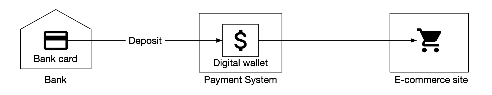


---

Bước 1: Hiểu vấn đề và thiết lập phạm vi thiết kế
---------------------------------------------------------

* C: Chúng ta có nên chỉ tập trung vào việc chuyển tiền giữa các ví kỹ thuật số không? Chúng ta có nên hỗ trợ bất kỳ hoạt động nào khác không?
* Tôi: Bây giờ hãy tập trung vào việc chuyển tiền giữa các ví kỹ thuật số.
* C: Hệ thống cần hỗ trợ bao nhiêu giao dịch mỗi giây?
* I: Giả sử 1 triệu TPS
* C: Ví kỹ thuật số có yêu cầu nghiêm ngặt về tính chính xác. Chúng ta có thể cho rằng đảm bảo giao dịch là đủ không?
*Tôi: Nghe hay đấy
* C: Có cần chứng minh tính đúng không?
* Tôi: Chúng tôi có thể thực hiện điều đó thông qua reconciliation, nhưng điều đó chỉ phát hiện sự khác biệt thay vì chỉ cho chúng tôi nguyên nhân cốt lõi của chúng. Thay vào đó, chúng tôi muốn có thể phát lại dữ liệu từ đầu để xây dựng lại lịch sử.
* C: Chúng ta có thể giả sử yêu cầu availability là 99,99% không?
* Tôi: Vâng
* C: Chúng ta có cần tính đến ngoại hối không?
* Tôi: Không, nó nằm ngoài phạm vi

Tóm lại đây là những gì chúng tôi phải hỗ trợ:

* Hỗ trợ chuyển số dư giữa hai tài khoản
* Hỗ trợ 1 triệu TPS
* Độ tin cậy là 99,99%
* Hỗ trợ giao dịch
* Hỗ trợ khả năng tái tạo

### **Ước tính mặt sau**

database quan hệ truyền thống, được cung cấp trên đám mây có thể hỗ trợ ~ 1000 TPS.

Để đạt 1 triệu TPS, chúng tôi cần 1000 database nodes. Nhưng nếu mỗi lần chuyển có hai chặng thì chúng tôi thực sự cần hỗ trợ 2 triệu TPS.

Một trong những mục tiêu thiết kế của chúng tôi là tăng TPS mà một node có thể xử lý để chúng tôi có thể có ít database nodes hơn.

| Per-node TPS | Số Node |
| --- | --- |
| 100 | 20.000 |
| 1.000 | 2.000 |
| 10.000 | 200 |

---

Bước 2: Đề xuất thiết kế cấp cao và nhận được sự đồng ý
------------------------------------------------

### **Thiết kế API**

Chúng tôi chỉ cần hỗ trợ một điểm cuối cho cuộc phỏng vấn này:

```
POST /v1/wallet/balance_transfer - transfers balance from one wallet to another
```

Tham số yêu cầu - từ\_account, đến\_account, số tiền (chuỗi để không mất độ chính xác), tiền tệ, giao dịch\_id (khóa idempotency).

Phản hồi mẫu:

```
{
    "status": "success"
    "transaction_id": "01589980-2664-11ec-9621-0242ac130002"
}
```

### **Giải pháp sharding trong bộ nhớ**

Ứng dụng ví của chúng tôi duy trì số dư tài khoản cho mọi tài khoản người dùng.

Một cấu trúc dữ liệu tốt để thể hiện điều này là `map<user_id, balance>`, có thể được triển khai bằng cách sử dụng kho lưu trữ Redis trong bộ nhớ.

Vì một redis node không thể chịu được 1mil TPS nên chúng tôi cần partition redis cluster của chúng tôi thành nhiều nodes.

Ví dụ thuật toán phân vùng:

```
String accountID = "A";
Int partitionNumber = 7;
Int myPartition = accountID.hashCode() % partitionNumber;
```

Zookeeper có thể được sử dụng để lưu trữ số lượng partitions và địa chỉ của redis nodes vì đây là bộ lưu trữ cấu hình có tính khả dụng cao.

Cuối cùng, dịch vụ ví là dịch vụ stateless chịu trách nhiệm thực hiện các hoạt động chuyển tiền. Nó có thể dễ dàng horizontal scaling:

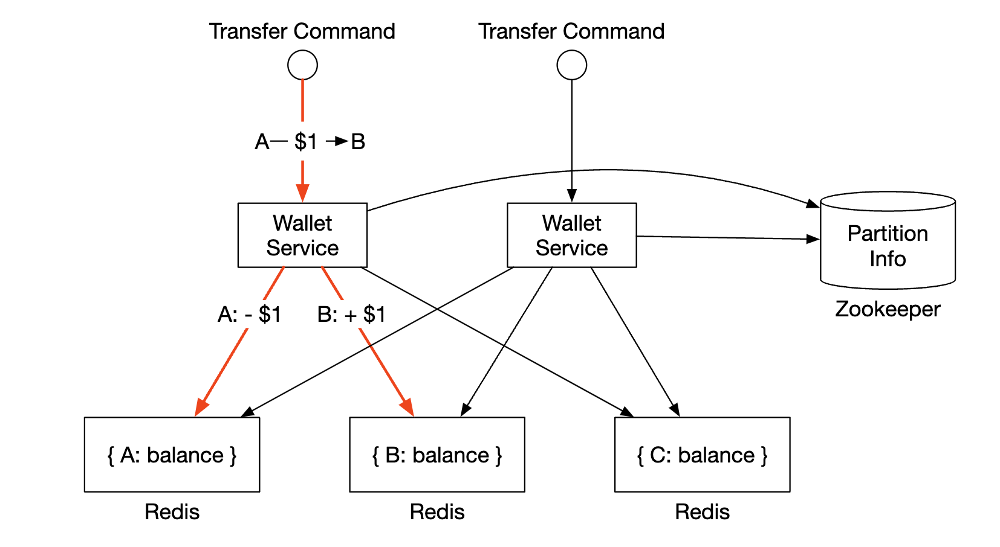

Mặc dù giải pháp này giải quyết được mối lo ngại về scalability nhưng nó không cho phép chúng tôi thực hiện chuyển số dư một cách nguyên tử.

### **Giao dịch phân phối**

Một cách tiếp cận để xử lý các giao dịch là sử dụng giao thức cam kết hai giai đoạn trên databases quan hệ tiêu chuẩn, được phân chia:

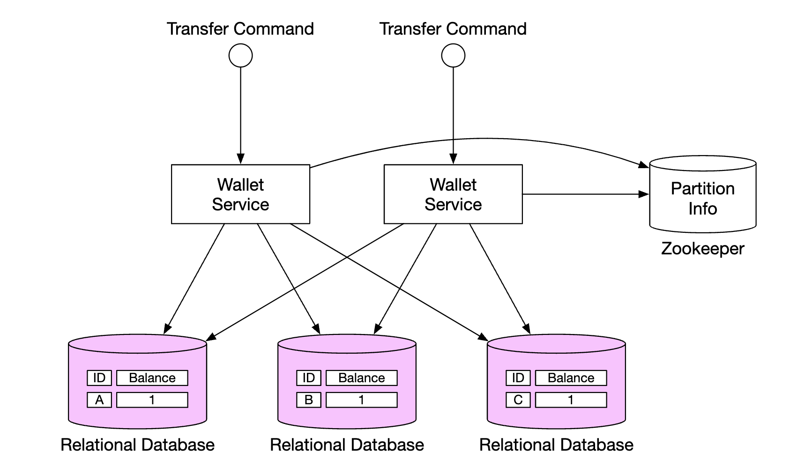

Đây là cách hoạt động của giao thức cam kết hai pha (2PC):

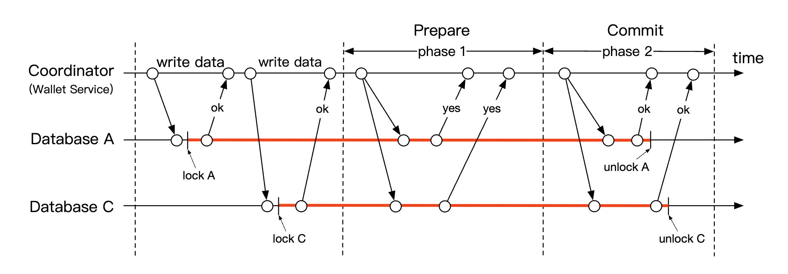

* Điều phối viên (dịch vụ ví) thực hiện thao tác đọc và ghi trên nhiều databases như bình thường
* Khi ứng dụng đã sẵn sàng thực hiện giao dịch, điều phối viên sẽ yêu cầu tất cả databases chuẩn bị giao dịch đó
* Nếu tất cả databases trả lời là "có", thì điều phối viên sẽ yêu cầu databases thực hiện giao dịch.
* Nếu không, tất cả databases sẽ được yêu cầu hủy giao dịch

Nhược điểm của phương pháp 2PC:

* Không hoạt động do tranh chấp khóa
* Điều phối viên là single point of failure

### **Giao dịch phân phối sử dụng Try-Confirm/Cancel (TC/C)**

TC/C là một biến thể của giao thức 2PC, hoạt động với các giao dịch bù:

* Điều phối viên yêu cầu tất cả databases dự trữ tài nguyên cho giao dịch
* Điều phối viên thu thập các câu trả lời từ DBs - nếu có, DBs được yêu cầu thử xác nhận. Nếu không, DBs được yêu cầu thử hủy.

Một điểm khác biệt quan trọng giữa TC/C và 2PC là 2PC thực hiện một giao dịch duy nhất, trong khi ở TC/C, có hai giao dịch độc lập.

Đây là cách TC/C hoạt động theo từng giai đoạn:

| Giai đoạn | Hoạt động | A | C |
| --- | --- | --- | --- |
| 1 | Hãy thử | Thay đổi số dư: -$1 | Không làm gì |
| 2 | Xác nhận | Không làm gì | Thay đổi số dư: +$1 |
|  | Hủy bỏ | Thay đổi số dư: +$1 | Không làm gì |

Giai đoạn 1 - thử:

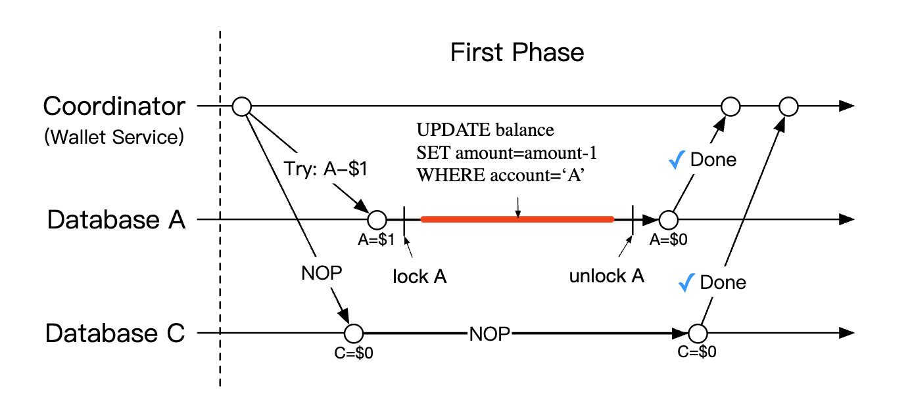

* điều phối viên bắt đầu giao dịch cục bộ trong DB của A để giảm số dư của A đi 1$
* DB của C được cung cấp lệnh NOP, lệnh này không có tác dụng gì

Giai đoạn 2a - xác nhận:

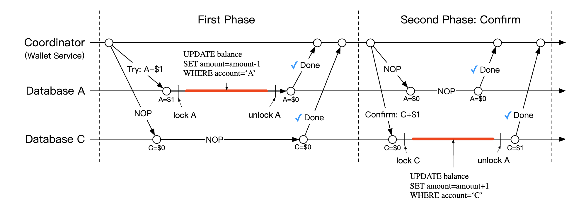

* nếu cả hai DBs đều trả lời "có", giai đoạn xác nhận sẽ bắt đầu.
* DB của A nhận được NOP, trong khi DB của C được hướng dẫn tăng số dư của C thêm 1$ (giao dịch địa phương)

Giai đoạn 2b - hủy bỏ:

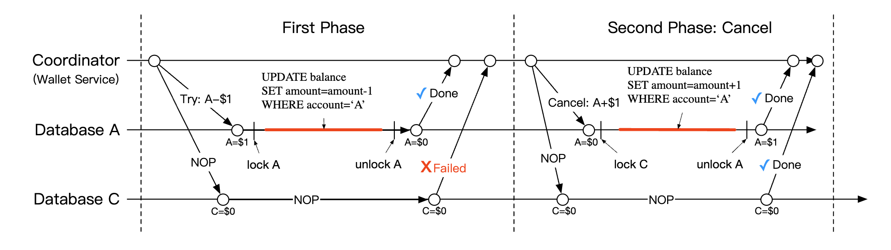

* Nếu bất kỳ thao tác nào trong giai đoạn 1 không thành công, giai đoạn hủy sẽ bắt đầu.
* DB của A được hướng dẫn tăng số dư của A thêm 1$, DB của C nhận được NOP

Đây là so sánh giữa 2PC và TC/C:

|  | Giai đoạn đầu tiên | Giai đoạn thứ hai: thành công | Giai đoạn thứ hai: thất bại |
| --- | --- | --- | --- |
| 2PC | giao dịch chưa được thực hiện | Cam kết/Hủy tất cả các giao dịch | Hủy tất cả giao dịch |
| TC/C | Tất cả các giao dịch đã hoàn tất - cam kết hoặc hủy bỏ | Thực hiện các giao dịch mới nếu cần | Đảo ngược giao dịch đã cam kết |

TC/C còn được gọi là giao dịch phân phối bằng bồi thường. Hoạt động cấp cao được xử lý trong logic nghiệp vụ.

Các tính chất khác của TC/C:

* database bất khả tri, miễn là database hỗ trợ giao dịch
* Chi tiết và độ phức tạp của các giao dịch phân tán cần được xử lý trong logic nghiệp vụ

### **Các chế độ lỗi TC/C**

Nếu điều phối viên chết giữa chuyến bay, nó cần khôi phục trạng thái trung gian.
Điều đó có thể được thực hiện bằng cách duy trì các bảng trạng thái pha, được cập nhật nguyên tử trong database shards:

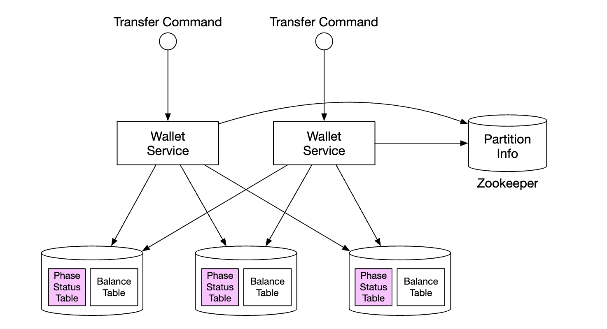

Bảng đó chứa gì:

* ID và nội dung của giao dịch phân phối
* trạng thái của giai đoạn thử - chưa gửi, đã gửi, đã nhận phản hồi
* tên giai đoạn thứ hai - xác nhận hoặc hủy bỏ
* tình trạng của giai đoạn thứ hai
* cờ không theo thứ tự (sẽ giải thích sau)

Một lưu ý khi sử dụng TC/C là có một thời điểm ngắn trong đó các trạng thái tài khoản không nhất quán với nhau trong khi giao dịch phân tán đang diễn ra:

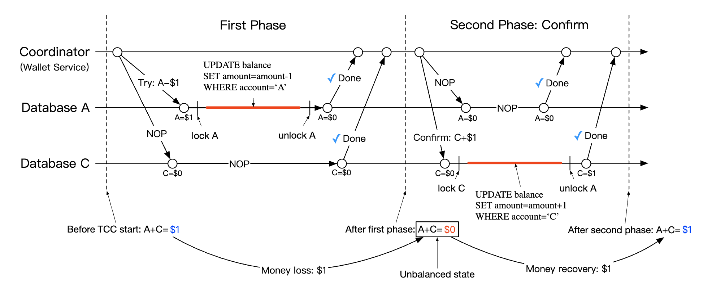

Điều này ổn miễn là chúng tôi luôn phục hồi từ trạng thái này và người dùng không thể sử dụng trạng thái trung gian để ví dụ như chi tiêu.
Điều này được đảm bảo bằng cách luôn thực hiện các khoản khấu trừ trước khi bổ sung.

| Hãy thử lựa chọn giai đoạn | Tài khoản A | Tài khoản C |
| --- | --- | --- |
| Lựa chọn 1 | -$1 | KHÔNG |
| Lựa chọn 2 (không hợp lệ) | KHÔNG | +$1 |
| Lựa chọn 3 (không hợp lệ) | -$1 | +$1 |

Lưu ý rằng lựa chọn 3 từ bảng trên không hợp lệ vì chúng tôi không thể đảm bảo thực hiện nguyên tử các giao dịch trên các databases khác nhau mà không dựa vào 2PC.

Một trường hợp cần xử lý không đúng thứ tự thực thi:

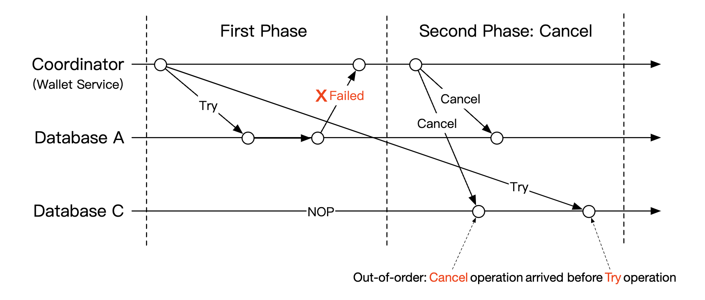

Có thể database nhận được thao tác hủy trước khi nhận được lần thử. Trường hợp cạnh này có thể được xử lý bằng cách thêm cờ không đúng thứ tự vào bảng trạng thái pha của chúng tôi.
Khi chúng tôi nhận được thao tác thử, trước tiên chúng tôi kiểm tra xem cờ không theo thứ tự có được đặt hay không và nếu có thì sẽ trả về lỗi.

### **Giao dịch phân phối sử dụng Saga**

Một cách tiếp cận phổ biến khác là sử dụng Sagas - một tiêu chuẩn để thực hiện các giao dịch phân tán với kiến trúc microservice.

Đây là cách nó hoạt động:

* tất cả các hoạt động được sắp xếp theo một trình tự. Tất cả các hoạt động đều độc lập trong databases của riêng chúng.
* các thao tác được thực hiện từ đầu đến cuối
* khi một thao tác thất bại, toàn bộ quá trình bắt đầu quay trở lại từ đầu với các thao tác bù

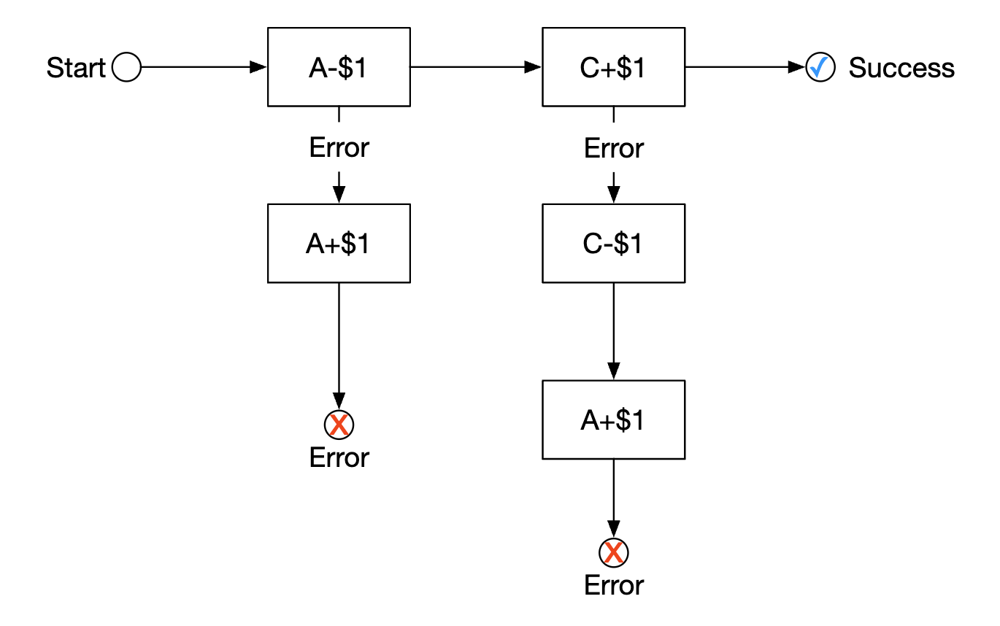

Làm thế nào để chúng ta phối hợp quy trình làm việc? Có hai cách tiếp cận chúng ta có thể thực hiện:

* Biên đạo - tất cả các dịch vụ liên quan đến câu chuyện đều đăng ký các sự kiện liên quan và tham gia vào câu chuyện
* Điều phối - một điều phối viên duy nhất hướng dẫn tất cả các dịch vụ thực hiện công việc của họ theo đúng thứ tự

Thách thức của việc sử dụng vũ đạo là logic nghiệp vụ được chia thành nhiều dịch vụ, giao tiếp không đồng bộ.
Phương pháp điều phối xử lý tốt sự phức tạp, vì vậy đây thường là phương pháp được ưa thích trong hệ thống ví kỹ thuật số.

Đây là so sánh giữa TC/C và Saga:

|  | TC/C | Saga |
| --- | --- | --- |
| Hành động bồi thường | Trong giai đoạn Hủy bỏ | Đang trong giai đoạn khôi phục |
| Phối hợp trung tâm | Có | Có (chế độ điều phối) |
| Lệnh thực hiện thao tác | bất kỳ | tuyến tính |
| Khả năng thực hiện song song | Có | Không (thực thi tuyến tính) |
| Có thể thấy trạng thái không nhất quán một phần | Có | Có |
| Ứng dụng hoặc logic database | Ứng dụng | Ứng dụng |

Sự khác biệt chính là TC/C có thể song song hóa, vì vậy quyết định của chúng tôi dựa trên yêu cầu latency - nếu chúng tôi cần đạt được latency thấp, chúng tôi nên sử dụng phương pháp TC/C.

Bất kể cách tiếp cận nào chúng tôi thực hiện, chúng tôi vẫn cần hỗ trợ kiểm tra và phát lại lịch sử để khôi phục từ trạng thái không thành công.

### **Event sourcing**

Trong thực tế, ứng dụng ví kỹ thuật số có thể được kiểm tra và chúng tôi phải trả lời một số câu hỏi nhất định:

* Chúng tôi có biết số dư tài khoản tại bất kỳ thời điểm nào không?
* Làm sao chúng ta biết số dư lịch sử và số dư hiện tại là chính xác?
* Làm cách nào để chứng minh logic hệ thống là chính xác sau khi thay đổi mã?

Event sourcing là một kỹ thuật giúp chúng tôi trả lời những câu hỏi này.

Nó bao gồm bốn khái niệm:

* lệnh - hành động dự định từ thế giới thực, ví dụ: chuyển 1$ từ tài khoản A sang B. Cần phải có đơn hàng toàn cầu, do đó chúng được đưa vào hàng đợi FIFO.
  + lệnh, không giống như các sự kiện, có thể thất bại và có một số ngẫu nhiên do IO hoặc trạng thái không hợp lệ.
  + lệnh có thể tạo ra 0 hoặc nhiều sự kiện
  + việc tạo sự kiện có thể chứa tính ngẫu nhiên như IO bên ngoài. Điều này sẽ được xem xét lại sau
* sự kiện - sự kiện lịch sử về các sự kiện xảy ra trong hệ thống, ví dụ: "đã chuyển 1$ từ A sang B".
  + không giống như các lệnh, sự kiện là những sự kiện đã xảy ra trong hệ thống của chúng ta
  + Tương tự như các lệnh, chúng cần được sắp xếp theo thứ tự nên chúng được xếp vào hàng đợi FIFO
* trạng thái - những gì đã thay đổi do một sự kiện. Ví dụ: key-value store giữa tài khoản và số dư của họ.
* máy trạng thái - điều khiển quá trình event sourcing. Nó chủ yếu xác nhận các lệnh và áp dụng các sự kiện để cập nhật trạng thái hệ thống.
  + máy trạng thái phải mang tính xác định, do đó, nó không nên đọc IO bên ngoài hoặc dựa vào tính ngẫu nhiên.

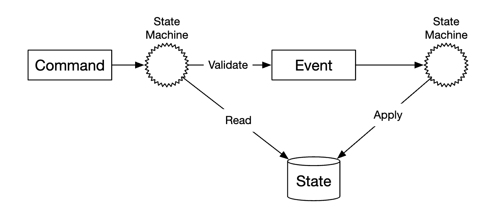

Đây là chế độ xem động của event sourcing:

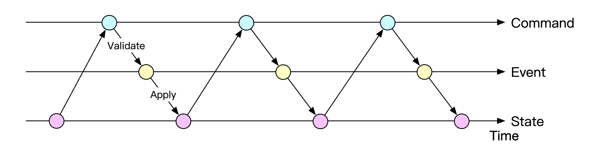

Đối với dịch vụ ví của chúng tôi, các lệnh là yêu cầu chuyển số dư. Chúng ta có thể đặt chúng vào hàng đợi FIFO, chẳng hạn như Kafka:

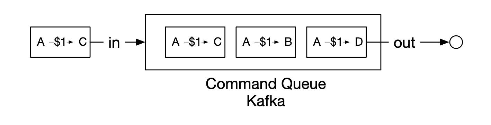

Đây là hình ảnh đầy đủ:

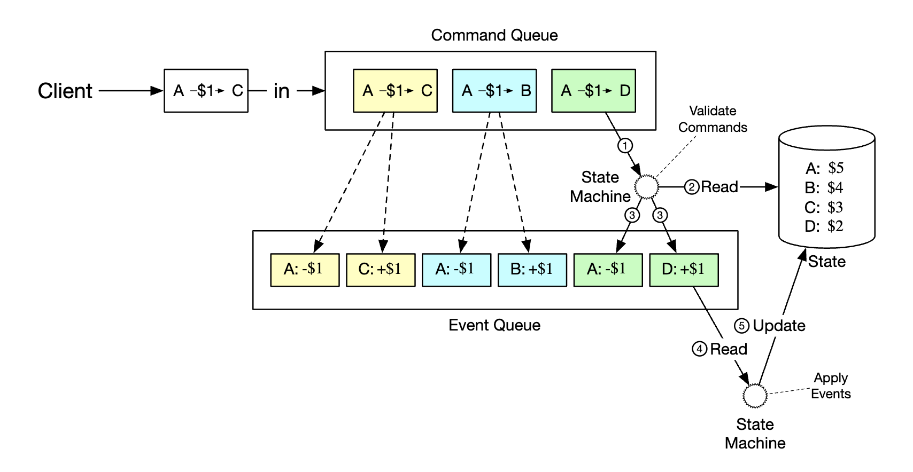

* máy trạng thái đọc lệnh từ hàng đợi lệnh
* trạng thái cân bằng được đọc từ database
* Lệnh được xác thực. Nếu hợp lệ, hai sự kiện cho mỗi tài khoản sẽ được tạo
* sự kiện tiếp theo được đọc và áp dụng bằng cách cập nhật số dư (trạng thái) trong database

Ưu điểm chính của việc sử dụng event sourcing là khả năng tái tạo của nó. Trong thiết kế này, tất cả các hoạt động cập nhật trạng thái được lưu dưới dạng lịch sử bất biến của tất cả các thay đổi về số dư.

Sự cân bằng lịch sử luôn có thể được xây dựng lại bằng cách phát lại các sự kiện từ đầu.
Vì danh sách sự kiện là bất biến và máy trạng thái có tính xác định nên chúng tôi đảm bảo sẽ thành công trong việc phát lại bất kỳ trạng thái trung gian nào.

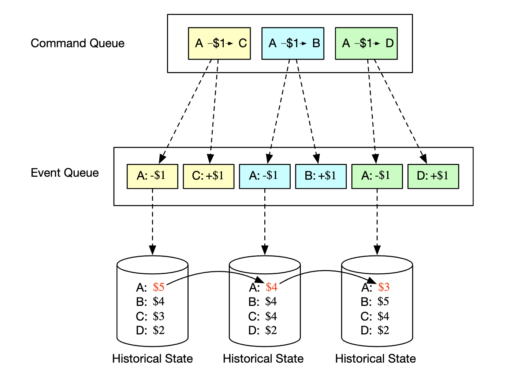

Tất cả các câu hỏi liên quan đến kiểm tra được hỏi ở đầu phần này có thể được giải quyết bằng cách dựa vào event sourcing:

* Chúng tôi có biết số dư tài khoản tại bất kỳ thời điểm nào không? - các sự kiện có thể được phát lại từ đầu cho đến thời điểm mà chúng ta quan tâm
* Làm sao chúng ta biết số dư lịch sử và số dư hiện tại là chính xác? - tính đúng đắn có thể được xác minh bằng cách tính toán lại tất cả các sự kiện ngay từ đầu
* Làm cách nào để chứng minh logic hệ thống là chính xác sau khi thay đổi mã? - chúng tôi có thể chạy các phiên bản mã khác nhau đối với các sự kiện và xác minh kết quả của chúng giống hệt nhau

Việc trả lời các truy vấn client về số dư của chúng có thể được giải quyết bằng kiến trúc CQRS - có thể có nhiều máy trạng thái chỉ đọc chịu trách nhiệm truy vấn trạng thái lịch sử, dựa trên danh sách sự kiện bất biến:

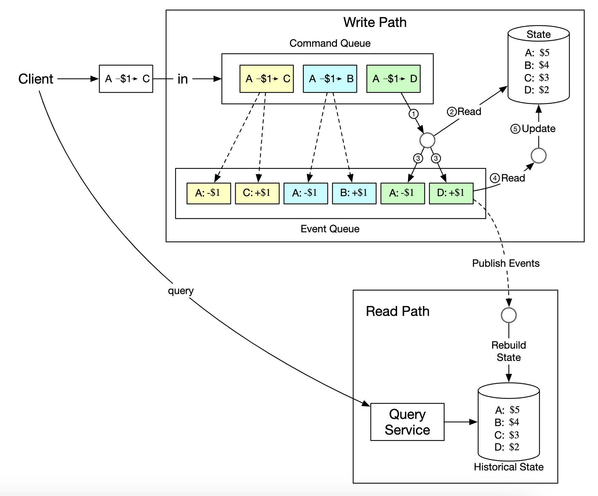


---

Bước 3: Thiết kế Deep Dive
---------------

Trong phần này, chúng ta sẽ khám phá một số cách tối ưu hóa hiệu suất vì chúng tôi vẫn phải scaling lên 1 triệu TPS.

### **event sourcing hiệu suất cao**

Tối ưu hóa đầu tiên chúng ta sẽ khám phá là lưu các lệnh và sự kiện vào kho lưu trữ đĩa cục bộ thay vì lưu trữ bên ngoài như Kafka.

Điều này tránh được network latency và hơn nữa, vì chúng tôi chỉ thực hiện các phần bổ sung nên thao tác đó thường nhanh đối với ổ cứng.

Tối ưu hóa tiếp theo là cache các lệnh và sự kiện gần đây trong bộ nhớ để tiết kiệm thời gian tải lại chúng từ đĩa.

Ở mức độ thấp, chúng ta có thể đạt được những tối ưu hóa nói trên bằng cách tận dụng lệnh có tên mmap, lệnh này lưu trữ dữ liệu trên đĩa cục bộ cũng như cache trong bộ nhớ:

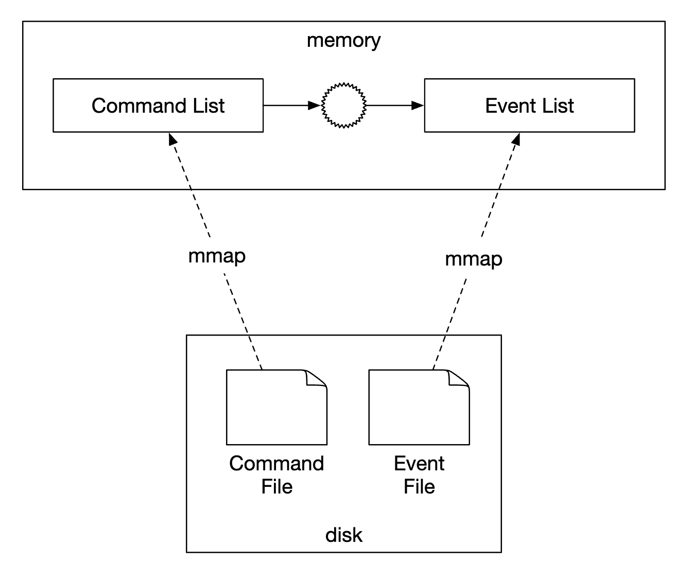

Tối ưu hóa tiếp theo mà chúng ta có thể thực hiện là lưu trữ trạng thái trong hệ thống tệp cục bộ bằng cách sử dụng SQLite - database quan hệ cục bộ dựa trên tệp. RocksDB cũng là một lựa chọn tốt khác.

Vì mục đích của chúng tôi, chúng tôi sẽ chọn RocksDB vì nó sử dụng cây hợp nhất có cấu trúc nhật ký (LSM), được tối ưu hóa cho các hoạt động ghi.
Hiệu suất đọc được tối ưu hóa thông qua caching.

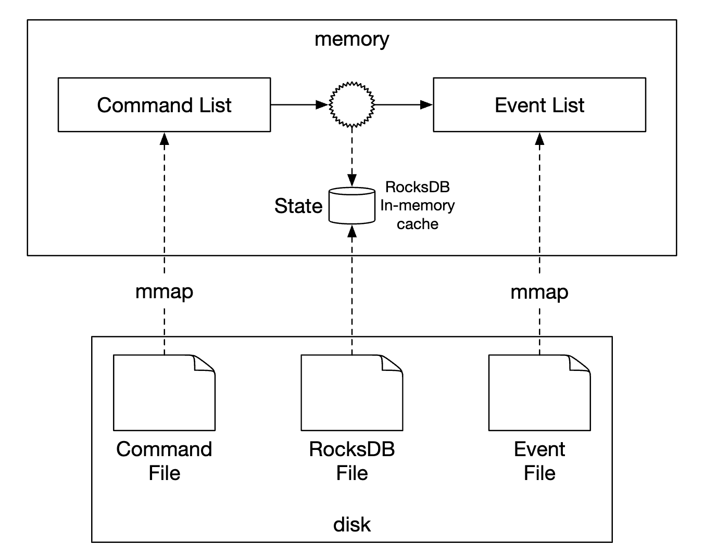

Để tối ưu hóa khả năng tái tạo, chúng tôi có thể lưu ảnh chụp nhanh vào đĩa theo định kỳ để không phải tái tạo lại một trạng thái nhất định ngay từ đầu mỗi lần. Chúng tôi có thể lưu trữ ảnh chụp nhanh dưới dạng tệp nhị phân lớn trong bộ lưu trữ tệp phân tán, ví dụ HDFS:

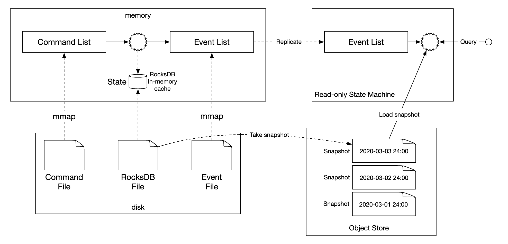

### **event sourcing hiệu suất cao đáng tin cậy**

Tất cả những tối ưu hóa được thực hiện cho đến nay đều rất tuyệt vời, nhưng chúng khiến dịch vụ của chúng tôi trở thành stateful. Chúng tôi cần giới thiệu một số dạng replication để đảm bảo độ tin cậy.

Trước khi làm điều đó, chúng ta nên phân tích loại dữ liệu nào cần độ tin cậy cao trong hệ thống của mình:

* trạng thái và ảnh chụp nhanh luôn có thể được tạo lại bằng cách sao chép chúng từ danh sách sự kiện. Do đó, chúng ta chỉ cần đảm bảo độ tin cậy của danh sách sự kiện.
* người ta có thể nghĩ rằng chúng ta luôn có thể tạo lại danh sách sự kiện từ danh sách lệnh, nhưng điều đó không đúng vì các lệnh không mang tính quyết định.
* kết luận là chúng ta chỉ cần đảm bảo độ tin cậy cao cho danh sách sự kiện

Để đạt được độ tin cậy cao cho các sự kiện, chúng tôi cần sao chép danh sách trên nhiều nodes. Chúng tôi cần đảm bảo:

* rằng không có mất dữ liệu
* thứ tự tương đối của dữ liệu trong tệp nhật ký vẫn giữ nguyên trên các replica

Để đạt được điều này, chúng tôi có thể sử dụng thuật toán consensus, chẳng hạn như Raft.

Với Raft thì có người dẫn đầu là active và có người theo sau là passive. Nếu người lãnh đạo chết, một trong những người theo sau sẽ đứng lên.
Miễn là hơn một nửa nodes hoạt động, hệ thống sẽ tiếp tục chạy.

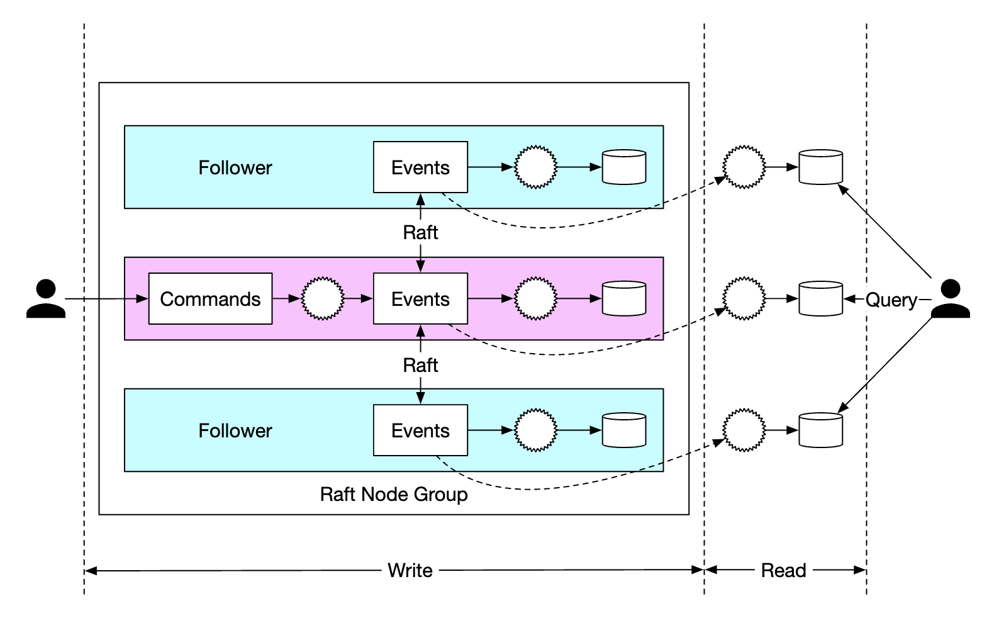

Với phương pháp này, tất cả nodes đều cập nhật trạng thái dựa trên danh sách sự kiện. Raft đảm bảo người lãnh đạo và người theo dõi có cùng danh sách sự kiện.

### **Đã phân phối event sourcing**

Cho đến nay, chúng tôi đã thiết kế được một hệ thống có hiệu suất node đơn cao và đáng tin cậy.

Một số hạn chế chúng ta phải khắc phục:

* Dung lượng của một nhóm raft bị hạn chế. Tại một số thời điểm, chúng ta cần shard dữ liệu và thực hiện các giao dịch phân tán
* Trong kiến trúc CQRS, luồng yêu cầu/phản hồi chậm. client sẽ cần thăm dò ý kiến ​​định kỳ của hệ thống để biết khi nào ví của họ được cập nhật

Việc bỏ phiếu không diễn ra theo thời gian thực, do đó, người dùng có thể mất một chút thời gian để tìm hiểu về bản cập nhật trong số dư của họ. Ngoài ra, nó có thể làm quá tải các dịch vụ truy vấn nếu tần suất bỏ phiếu quá cao:

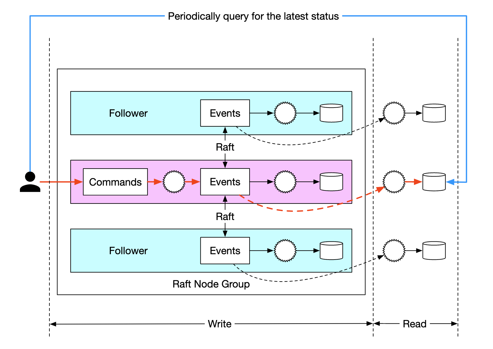

Để giảm thiểu tải hệ thống, chúng tôi có thể giới thiệu reverse proxy, gửi lệnh thay mặt người dùng và thăm dò ý kiến ​​để phản hồi thay mặt họ:

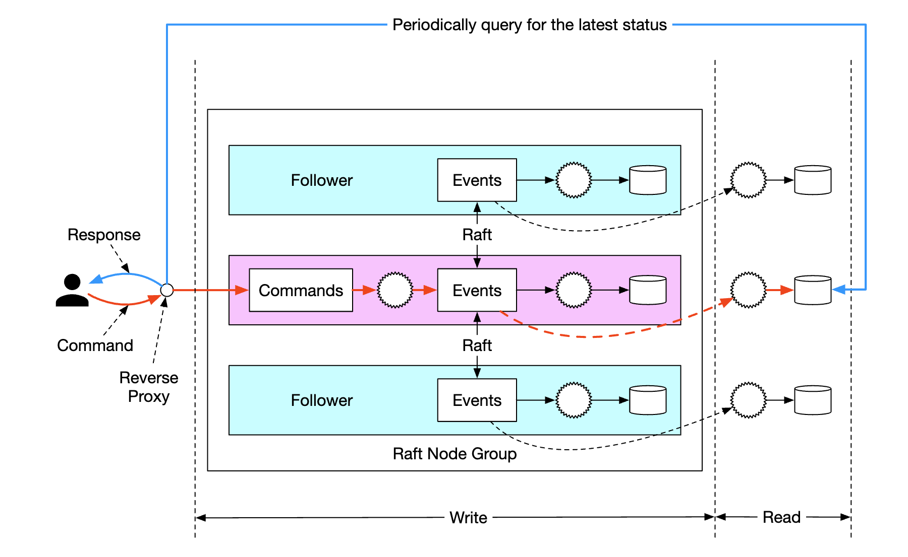

Điều này giúp giảm tải hệ thống vì chúng tôi có thể tìm nạp dữ liệu cho nhiều người dùng bằng một yêu cầu duy nhất nhưng vẫn không giải quyết được yêu cầu nhận theo thời gian thực.

Một thay đổi cuối cùng mà chúng tôi có thể thực hiện là làm cho các máy ở trạng thái chỉ đọc đẩy các phản hồi trở lại reverse proxy khi nó có sẵn. Điều này có thể mang lại cho người dùng cảm giác rằng các cập nhật diễn ra theo thời gian thực:

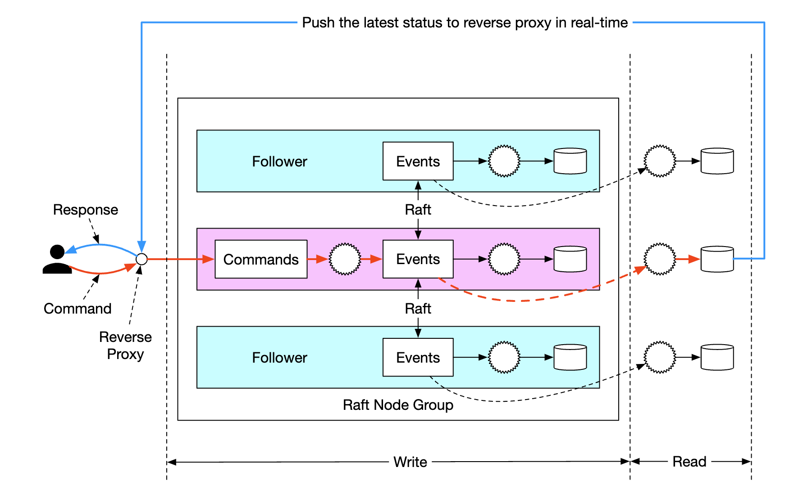

Cuối cùng, để scaling hệ thống hơn nữa, chúng tôi có thể shard hệ thống thành nhiều nhóm raft, trong đó chúng tôi triển khai các giao dịch phân tán trên chúng bằng cách sử dụng bộ điều phối thông qua TC/C hoặc Sagas:

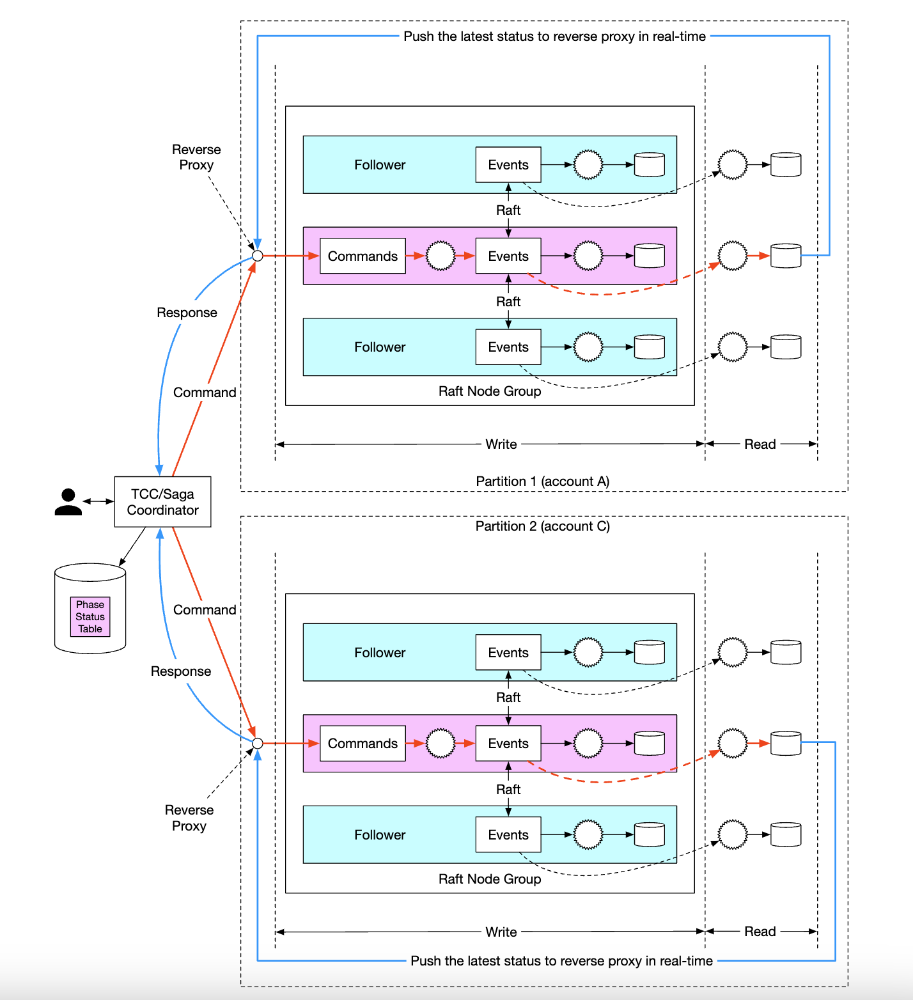

Dưới đây là ví dụ về vòng đời của yêu cầu chuyển số dư trong hệ thống cuối cùng của chúng tôi:

* Người dùng A gửi giao dịch phân tán đến điều phối viên Saga bằng hai thao tác - `A-1` và `C+1`.
* Điều phối viên Saga tạo một bản ghi trong bảng trạng thái giai đoạn để theo dõi trạng thái giao dịch
* Điều phối viên xác định partitions nào cần gửi lệnh tới.
* Người lãnh đạo raft của Partition 1 nhận lệnh `A-1`, xác thực nó, chuyển đổi nó thành một sự kiện và sao chép nó trên nodes khác trong nhóm raft
* Kết quả sự kiện được đồng bộ hóa với máy trạng thái đọc, máy này sẽ gửi phản hồi trở lại điều phối viên
* Điều phối viên tạo một bản ghi cho biết thao tác đã thành công và tiến hành thao tác tiếp theo - `C+1`
* Thao tác tiếp theo được thực hiện tương tự như thao tác đầu tiên - partition được xác định, lệnh được gửi, thực thi, máy đọc trạng thái sẽ gửi lại phản hồi
* Điều phối viên tạo một bản ghi cho biết thao tác 2 cũng thành công và cuối cùng thông báo kết quả cho client

---

Bước 4: Kết thúc
---------------

Đây là sự phát triển trong thiết kế của chúng tôi:

* Chúng tôi bắt đầu từ giải pháp sử dụng Redis trong bộ nhớ. Vấn đề với cách tiếp cận này là nó không có khả năng lưu trữ lâu bền.
* Chúng tôi đã chuyển sang sử dụng databases quan hệ, trên hết chúng tôi thực hiện các giao dịch phân tán bằng cách sử dụng 2PC, TC/C hoặc saga phân tán.
* Tiếp theo, chúng tôi đã giới thiệu event sourcing để có thể kiểm tra được tất cả các hoạt động
* Chúng tôi đã bắt đầu bằng cách lưu trữ dữ liệu vào bộ nhớ ngoài bằng database bên ngoài và hàng đợi, nhưng cách đó không hiệu quả
* Chúng tôi đã tiến hành lưu trữ dữ liệu trong bộ lưu trữ tệp cục bộ, tận dụng hiệu suất của các hoạt động chỉ gắn thêm. Chúng tôi cũng đã sử dụng caching để tối ưu hóa read path
* Cách tiếp cận trước đó, mặc dù có hiệu quả nhưng không bền vững. Do đó, chúng tôi đã giới thiệu sự consensus Raft với replication để tránh các điểm lỗi duy nhất
* Chúng tôi cũng đã áp dụng CQRS với reverse proxy để thay mặt người dùng quản lý vòng đời của giao dịch
* Cuối cùng, chúng tôi đã phân vùng dữ liệu của mình trên nhiều nhóm raft, được sắp xếp bằng cơ chế giao dịch phân tán - TC/C hoặc saga phân tán