Chương 28: Sở giao dịch chứng khoán
=============================

Giới thiệu
------------

Chúng ta sẽ thiết kế **sàn giao dịch chứng khoán điện tử** trong chương này.

Chức năng cơ bản của nó là kết nối người mua và người bán một cách hiệu quả.

Các sàn giao dịch chứng khoán lớn là **NYSE**, **NASDAQ**, cùng nhiều sàn giao dịch khác.


---

Bước 1: Tìm hiểu vấn đề và thiết lập phạm vi thiết kế
---------------------------------------------------------

* C: Chúng ta sẽ giao dịch chứng khoán nào? Cổ phiếu, quyền chọn hay tương lai?
* I: Chỉ có cổ phiếu cho đơn giản
* C: Những loại lệnh nào được hỗ trợ - đặt, hủy, thay thế? Còn lệnh giới hạn, thị trường, lệnh có điều kiện thì sao?
* Tôi: Chúng tôi cần hỗ trợ việc đặt và hủy đơn hàng. Chúng ta chỉ cần xem xét các lệnh giới hạn cho loại lệnh đó.
* C: Hệ thống có cần hỗ trợ giao dịch ngoài giờ không?
* Tôi: Không, chỉ là giờ giao dịch bình thường thôi
* C: Bạn có thể mô tả các chức năng cơ bản của sàn giao dịch được không?
* I: Clients có thể đặt hoặc hủy các lệnh giới hạn và nhận các giao dịch khớp trong thời gian thực. Họ sẽ có thể nhìn thấy order book trong thời gian thực.
* C: Quy mô trao đổi là bao nhiêu?
* I: Hàng chục nghìn người dùng giao dịch cùng lúc và ~100 ký hiệu. Hàng tỷ đơn đặt hàng mỗi ngày. Chúng tôi cũng cần hỗ trợ kiểm tra rủi ro để tuân thủ.
* C: Loại kiểm tra rủi ro nào?
* I: Hãy thực hiện các kiểm tra rủi ro đơn giản - ví dụ: giới hạn người dùng chỉ giao dịch 1 triệu cổ phiếu táo trong một ngày
* C: Còn việc tương tác với ví của người dùng thì sao?
* Tôi: Chúng tôi cần đảm bảo clients có đủ tiền trước khi đặt hàng. Số tiền dành cho các lệnh đang chờ xử lý cần phải được giữ lại cho đến khi lệnh được hoàn tất.

### **Yêu cầu phi chức năng**

Quy mô được người phỏng vấn đề cập gợi ý rằng chúng tôi sẽ thiết kế một cuộc trao đổi quy mô vừa và nhỏ.
Chúng tôi cũng cần đảm bảo tính linh hoạt để hỗ trợ nhiều biểu tượng và người dùng hơn trong tương lai.

Các yêu cầu phi chức năng khác:

* Availability - Ít nhất 99,99%. Thời gian ngừng hoạt động có thể gây tổn hại đến danh tiếng
* Cần có Fault tolerance - fault tolerance và cơ chế phục hồi nhanh để hạn chế ảnh hưởng của sự cố sản xuất
* Latency - latency khứ hồi phải ở mức ms với trọng tâm là phân vị thứ 99. latency 99p cao liên tục gây ra trải nghiệm không tốt cho một số ít hoặc người dùng.
* Bảo mật - Chúng ta nên có hệ thống quản lý tài khoản. Để tuân thủ pháp luật, chúng tôi cần hỗ trợ KYC để xác minh danh tính người dùng. Chúng ta cũng nên bảo vệ khỏi DDoS đối với các tài nguyên công cộng.

### **Ước tính mặt sau**

* 100 ký hiệu, 1 tỷ đơn hàng mỗi ngày
* Giờ giao dịch thông thường là từ 09:30 đến 16:00 (6.5h)
* QPS = 1 tỷ / 6,5 / 3600 = 43000
* QPS đỉnh = 5\*QPS = 215000
* Khối lượng giao dịch cao hơn đáng kể khi thị trường mở cửa

---

Bước 2: Đề xuất thiết kế cấp cao và nhận được sự đồng ý
------------------------------------------------

### **Kiến thức kinh doanh 101**

Hãy cùng thảo luận về một số khái niệm cơ bản liên quan đến trao đổi.

broker làm trung gian cho các tương tác giữa sàn giao dịch và người dùng cuối - Robinhood, Fidelity, v.v.

Tổ chức clients giao dịch với số lượng lớn bằng phần mềm giao dịch chuyên dụng. Họ cần điều trị đặc biệt.
Ví dụ: tách lệnh khi giao dịch với khối lượng lớn để tránh ảnh hưởng đến thị trường.

Các loại lệnh:

* Giới hạn - mua hoặc bán ở mức giá cố định. Nó có thể không tìm thấy kết quả phù hợp ngay lập tức hoặc có thể được kết hợp một phần.
* Thị trường - không chỉ định giá. Thực hiện theo giá thị trường hiện tại ngay lập tức.

Giá:

* Giá thầu - giá cao nhất mà người mua sẵn sàng mua một cổ phiếu
* Hỏi - giá thấp nhất mà người bán sẵn sàng bán một cổ phiếu

Thị trường Hoa Kỳ có ba mức báo giá - L1, L2, L3.

L1 market data chứa giá và số lượng chào bán tốt nhất:

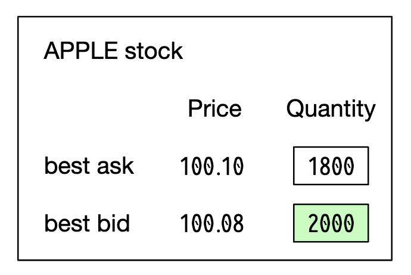

L2 bao gồm nhiều mức giá hơn:


L3 hiển thị các cấp độ và số lượng xếp hàng đợi ở mỗi cấp độ:


Một nến hiển thị giá mở và đóng của thị trường, cũng như giá cao nhất và thấp nhất trong khoảng thời gian nhất định:

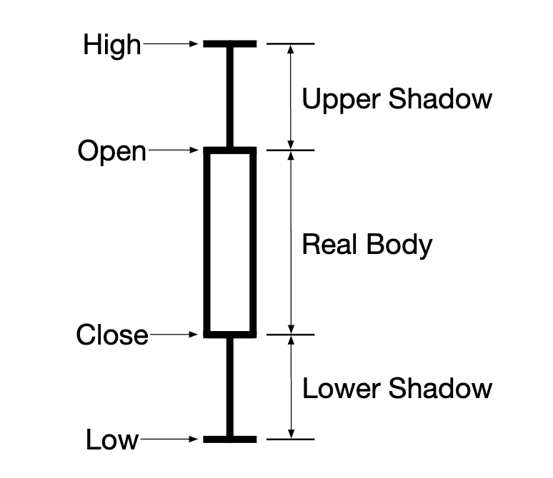

FIX là một giao thức trao đổi thông tin giao dịch chứng khoán được hầu hết các nhà cung cấp sử dụng. Ví dụ giao dịch chứng khoán:

```
8=FIX.4.2 | 9=176 | 35=8 | 49=PHLX | 56=PERS | 52=20071123-05:30:00.000 | 11=ATOMNOCCC9990900 | 20=3 | 150=E | 39=E | 55=MSFT | 167=CS | 54=1 | 38=15 | 40=2 | 44=15 | 58=PHLX EQUITY TESTING | 59=0 | 47=C | 32=0 | 31=0 | 151=15 | 14=0 | 6=0 | 10=128 |
```

### **Thiết kế cao cấp**

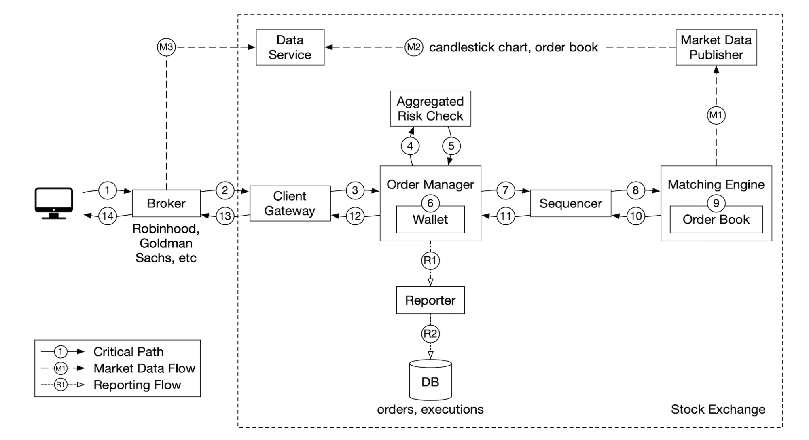

Dòng chảy thương mại:

* Client đặt lệnh qua giao diện giao dịch
* Broker gửi lệnh lên sàn
* Đơn hàng tham gia trao đổi thông qua client gateway, xác nhận, giới hạn tỷ lệ, xác thực, v.v. Đơn hàng được chuyển tiếp đến người quản lý đơn hàng.
* Người quản lý đơn hàng thực hiện kiểm tra rủi ro dựa trên các quy tắc do người quản lý rủi ro đặt ra
* Sau khi vượt qua kiểm tra rủi ro, người quản lý đơn hàng xác minh có đủ tiền trong ví cho đơn hàng
* Đơn hàng được gửi đến matching engine. Khi tìm thấy kết quả khớp, matching engine đưa ra hai lần thực thi (được gọi là điền) để mua và bán. Cả hai đơn hàng đều được sắp xếp theo thứ tự sao cho chúng mang tính quyết định.
* Các lệnh thực thi được trả về client.

Luồng Market data (M1-M3):

* matching engine tạo ra một luồng thực thi, được gửi đến market data publisher
* Market data publisher xây dựng biểu đồ hình nến và gửi chúng đến dịch vụ dữ liệu
* Market data được lưu trữ trong bộ lưu trữ chuyên dụng để phân tích theo thời gian thực. Brokers kết nối với dịch vụ dữ liệu để có market data kịp thời.

Luồng trình báo cáo (R1-R2):

* người báo cáo thu thập tất cả các trường báo cáo cần thiết từ các lệnh và lệnh thực thi và ghi chúng vào DB
* trường báo cáo - client\_id, giá, số lượng, đơn hàng\_loại, đã điền\_quantity, còn lại\_quantity

Luồng giao dịch đang trên đường quan trọng, trong khi rest của các luồng thì không, do đó, các yêu cầu về latency khác nhau giữa chúng.

#### Luồng giao dịch

Luồng giao dịch đang trên đường quan trọng, do đó, nó phải được tối ưu hóa cao độ cho latency thấp.

matching engine là trái tim của nó, còn được gọi là động cơ chéo. Trách nhiệm chính:

* Duy trì order book cho mỗi biểu tượng - danh sách các lệnh mua/bán cho một biểu tượng.
* Khớp lệnh mua và bán - khớp lệnh dẫn đến hai lần thực hiện (điền), mỗi lần thực hiện một lần cho bên mua và bên bán. Chức năng này phải nhanh và chính xác
* Phân phối luồng thực thi dưới dạng market data
* Các trận đấu phải được thực hiện theo thứ tự xác định. Nền tảng cho availability cao

Tiếp theo là trình sắp xếp thứ tự - đây là thành phần chính giúp xác định matching engine bằng cách đóng dấu từng đơn hàng gửi đến và điền vào đơn hàng gửi đi bằng ID trình tự.

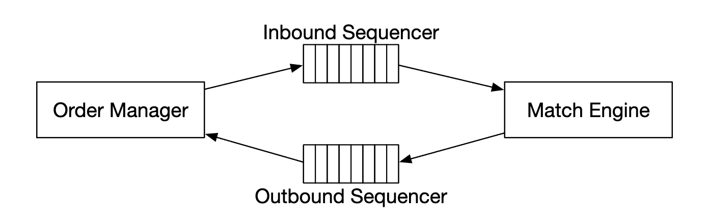

Chúng tôi đóng dấu các đơn hàng gửi đến và điền vào các đơn hàng gửi đi vì nhiều lý do:

* kịp thời và công bằng
* phục hồi / phát lại nhanh
* đảm bảo chính xác một lần

Về mặt khái niệm, chúng tôi có thể sử dụng Kafka làm trình sắp xếp chuỗi vì nó thực sự là message queue gửi đến và gửi đi. Tuy nhiên, chúng tôi sẽ tự triển khai nó để đạt được latency thấp hơn.

Người quản lý đơn hàng quản lý trạng thái đơn hàng. Nó cũng tương tác với matching engine - gửi đơn đặt hàng và nhận đơn hàng.

Trách nhiệm của người quản lý đơn hàng:

* Gửi lệnh để kiểm tra rủi ro - ví dụ: xác minh khối lượng giao dịch của người dùng nhỏ hơn 1 triệu
* Kiểm tra lệnh so với ví của người dùng và xác minh có đủ tiền để thực hiện lệnh đó
* Nó gửi thứ tự đến bộ sắp xếp thứ tự và tới matching engine. Để giảm bandwidth, chỉ thông tin đặt hàng cần thiết mới được chuyển đến matching engine
* Các lệnh thực thi (điền) được nhận lại từ trình sắp xếp chuỗi, sau đó chúng được gửi đến brokers thông qua client gateway

Thách thức chính khi triển khai trình quản lý đơn hàng là quản lý chuyển đổi trạng thái. Event sourcing là một giải pháp khả thi (được thảo luận sâu hơn).

Cuối cùng, client gateway nhận đơn đặt hàng từ người dùng và gửi đến người quản lý đơn hàng. Trách nhiệm của nó:

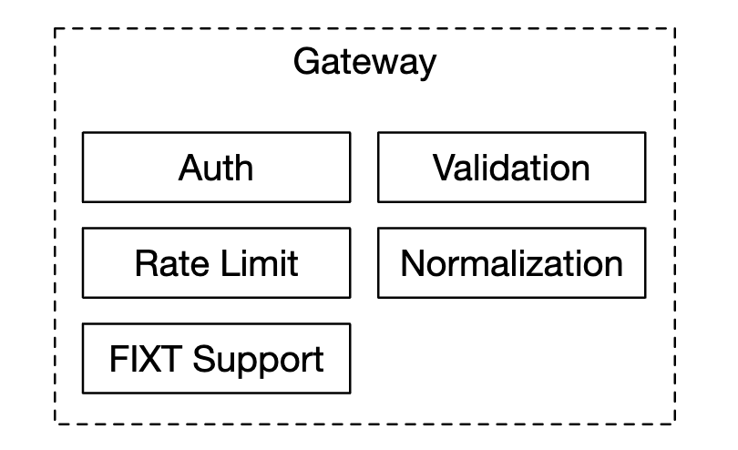

Vì client gateway đang trong giai đoạn quan trọng nên nó sẽ luôn nhẹ.

Có thể có nhiều client gateways cho các clients khác nhau. Ví dụ: công cụ colo là công cụ giao dịch server, được broker thuê trong data center của sàn giao dịch:


#### Luồng Market data

market data publisher nhận các lệnh thực thi từ matching engine và xây dựng biểu đồ order book/hình nến từ luồng thực thi.

Dữ liệu đó được gửi đến dịch vụ dữ liệu, dịch vụ này chịu trách nhiệm hiển thị dữ liệu tổng hợp cho subscribers:


#### Luồng báo cáo

Người báo cáo không nằm trên con đường quan trọng, tuy nhiên nó vẫn là một thành phần quan trọng.


Nó chịu trách nhiệm về lịch sử giao dịch, báo cáo thuế, báo cáo tuân thủ, thanh toán, v.v.
Latency không phải là yêu cầu quan trọng đối với luồng báo cáo. Độ chính xác và tuân thủ là quan trọng hơn.

### **Thiết kế API**

Clients tương tác với sàn giao dịch chứng khoán thông qua brokers để đặt lệnh, xem các lệnh thực thi, market data, tải xuống dữ liệu lịch sử để phân tích, v.v.

Chúng tôi sử dụng RESTful API để liên lạc giữa client gateway và brokers.

Đối với clients của tổ chức, một giao thức độc quyền được sử dụng để đáp ứng các yêu cầu latency thấp của họ.

Tạo đơn hàng:

```
POST /v1/order
```

Thông số:

* biểu tượng - biểu tượng chứng khoán. chuỗi
* bên - mua hoặc bán. chuỗi
* giá - giá của lệnh giới hạn. dài
* orderType - giới hạn hoặc thị trường (chúng tôi chỉ hỗ trợ các đơn đặt hàng giới hạn trong thiết kế của chúng tôi). chuỗi
* số lượng - số lượng của đơn đặt hàng. dài

Phản hồi:

* id - ID của đơn hàng. dài
* CreationTime - thời gian tạo hệ thống của đơn hàng. dài
* Số lượng đã điền - số lượng đã được thực hiện thành công. dài
* Số lượng còn lại - số lượng vẫn được thực hiện. dài
* trạng thái - mới/đã hủy/đã điền. chuỗi
* rest của các thuộc tính giống với tham số đầu vào

Nhận thực thi:

```
GET /execution?symbol={:symbol}&orderId={:orderId}&startTime={:startTime}&endTime={:endTime}
```

Thông số:

* biểu tượng - biểu tượng chứng khoán. chuỗi
* orderId - ID của đơn hàng. Không bắt buộc. chuỗi
* startTime - thời gian bắt đầu truy vấn trong kỷ nguyên [11]. dài
* endTime - thời gian kết thúc truy vấn trong kỷ nguyên. dài

Phản hồi:

* thực thi - mảng với mỗi lần thực thi trong phạm vi (xem các thuộc tính bên dưới). Mảng
* id - ID của việc thực thi. dài
* orderId - ID của đơn hàng. dài
* biểu tượng - biểu tượng chứng khoán. chuỗi
* bên - mua hoặc bán. chuỗi
* giá - giá thực hiện. dài
* orderType - giới hạn hoặc thị trường. chuỗi
* số lượng - số lượng đầy đủ. dài

Nhận order book:

```
GET /marketdata/orderBook/L2?symbol={:symbol}&depth={:depth}
```

Thông số:

* biểu tượng - biểu tượng chứng khoán. chuỗi
* độ sâu - Độ sâu order book mỗi bên. Int

Phản hồi:

* giá thầu - mảng với giá cả và kích thước. Mảng
* hỏi - mảng có giá và kích thước. Mảng

lấy chân nến:

```
GET /marketdata/candles?symbol={:symbol}&resolution={:resolution}&startTime={:startTime}&endTime={:endTime}
```

Thông số:

* biểu tượng - biểu tượng chứng khoán. chuỗi
* độ phân giải - độ dài cửa sổ của biểu đồ nến tính bằng giây. dài
* startTime - thời gian bắt đầu của cửa sổ trong kỷ nguyên. dài
* endTime - thời gian kết thúc của cửa sổ theo kỷ nguyên. dài

Phản hồi:

* nến - mảng chứa từng dữ liệu nến (các thuộc tính được liệt kê bên dưới). Mảng
* giá mở - giá mở của mỗi nến. Đôi
*giá đóng - giá đóng của từng nến. Đôi
* high - giá cao của mỗi nến. Đôi
* giá thấp - giá thấp của mỗi nến. Đôi

### **Mô hình dữ liệu**

Có ba loại dữ liệu chính trong trao đổi của chúng tôi:

* Sản phẩm, đơn hàng, thực hiện
* order book
* biểu đồ nến

#### Sản phẩm, đơn hàng, thực hiện

Sản phẩm mô tả các thuộc tính của biểu tượng được giao dịch - loại sản phẩm, biểu tượng giao dịch, biểu tượng hiển thị giao diện người dùng, v.v.

Dữ liệu này không thay đổi thường xuyên, nó chủ yếu được sử dụng để hiển thị trong giao diện người dùng.

Một lệnh đại diện cho một hướng dẫn cho một lệnh mua/bán. Các lần thực thi là kết quả khớp ra.

Đây là mô hình dữ liệu:

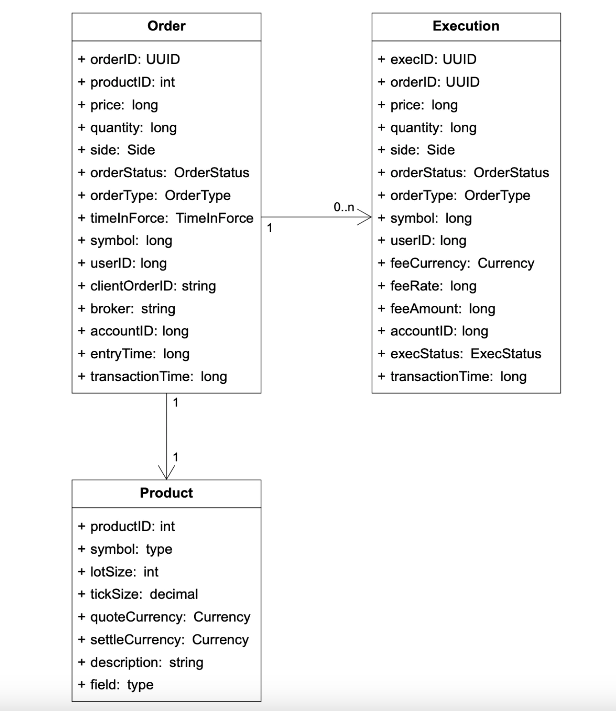

Chúng tôi gặp các lệnh và lệnh thực thi trong cả ba luồng của mình:

* trong đường dẫn quan trọng, chúng được xử lý trong bộ nhớ để có hiệu suất cao. Chúng được lưu trữ và phục hồi từ trình sắp xếp chuỗi.
* Người báo cáo viết lệnh và thực thi vào database để báo cáo các trường hợp sử dụng
* Các lệnh thực thi được chuyển tiếp đến market data để xây dựng lại biểu đồ order book và biểu đồ nến

#### Order book

order book là danh sách các lệnh mua/bán một công cụ, được sắp xếp theo mức giá.

Một cấu trúc dữ liệu hiệu quả cho mô hình này cần phải thỏa mãn:

* thời gian tra cứu liên tục - nhận khối lượng ở mức giá hoặc giữa các mức giá
* thao tác thêm/thực hiện/hủy nhanh
* truy vấn giá chào mua/giá chào bán tốt nhất
* lặp qua các mức giá

Ví dụ thực thi order book:


Sau khi hoàn thành đơn đặt hàng lớn này, giá sẽ tăng khi chênh lệch giá mua/bán scaling.

Ví dụ triển khai order book bằng mã giả:

```
hạng Mức giá{
    riêng Giá giới hạnGiá;
    tổng khối lượng dài riêng tư;
    đơn đặt hàng List<Order> riêng tư;
}

lớp Book<Side> {
    bên riêng tư;
    Bản đồ giới hạn Map<Price, PriceLevel> riêng tư;
}

lớp Sổ đặt hàng {
    Sách riêng<Buy> muaSách;
    Sách riêng<Sell> bánSách;
    giá riêngMức giá tốt nhấtGiá thầu;
    mức giá riêngƯu đãi tốt nhất;
    Bản đồ đặt hàng Map<OrderID, Order> riêng tư;
}
```

For a more efficient implementation, we can use a doubly-linked list instead of a standard list:

* Placing a new order is O(1), because we're adding an order to the tail of the list.
* Matching an order is O(1), because we are deleting an order from the head
* Canceling an order means deleting an order from the order book. We utilize `orderMap` for O(1) lookup and O(1) delete (due to the `Order` having a reference to the previous element in the list).

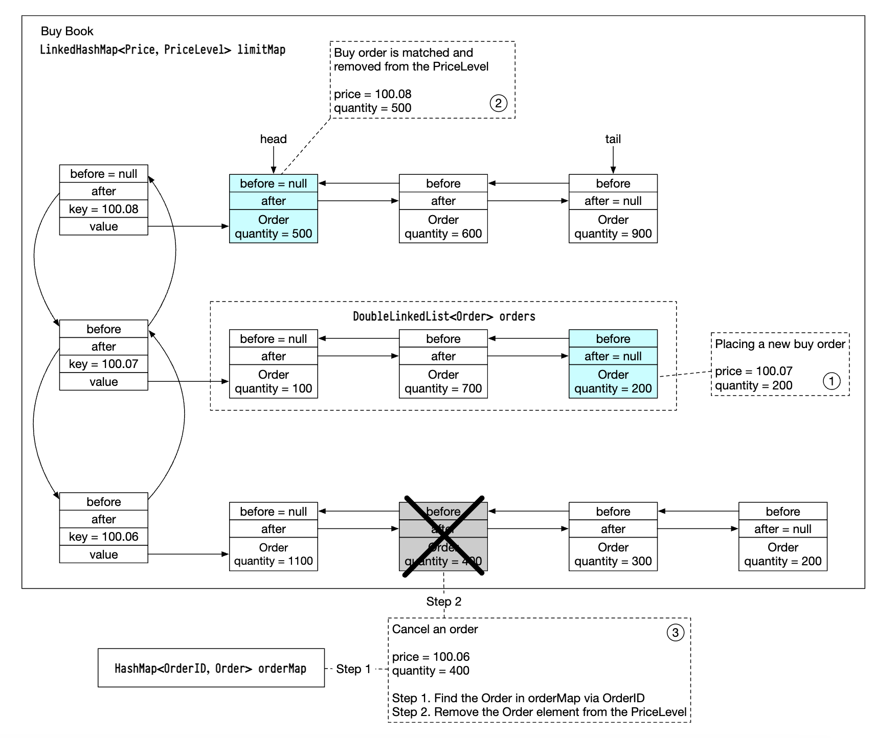

This data structure is also used in the market data services to reconstruct the order book.

#### Candlestick chart

The candlestick data is calcualated within the market data services based on processing orders in a time interval:

```
lớp nến {
    riêng tư giá mở dài;
    riêng tư đóng giá dài;
    tư dài giá cao;
    riêng dài giá thấp;
    khối lượng dài riêng tư;
    dấu thời gian dài riêng tư;
    khoảng int riêng tư;
}

lớp CandlestickChart {
    gậy LinkedList<Candlestick> riêng tư;
}
```

Một số tối ưu hóa để tránh tiêu tốn quá nhiều bộ nhớ:

* Sử dụng bộ đệm vòng được phân bổ trước để giữ gậy nhằm giảm số lượng phân bổ
* Giới hạn số lượng thanh trong bộ nhớ và duy trì rest vào đĩa

Chúng tôi sẽ sử dụng cột database trong bộ nhớ (ví dụ: KDB) để phân tích thời gian thực. Sau khi thị trường đóng cửa, dữ liệu vẫn được lưu giữ trong database lịch sử.

---

Bước 3: Thiết kế Deep Dive
---------------

Một điều thú vị cần lưu ý về các sàn giao dịch hiện đại là không giống như hầu hết các phần mềm khác, chúng thường chạy mọi thứ trên một server khổng lồ.

Hãy cùng khám phá chi tiết.

### **Hiệu suất**

Để trao đổi, điều rất quan trọng là phải có latency tổng thể tốt cho tất cả các phần trăm.

Làm cách nào chúng ta có thể giảm latency?

* Giảm số lượng nhiệm vụ trên đường quan trọng
* Rút ngắn thời gian dành cho mỗi tác vụ bằng cách giảm mức sử dụng mạng/đĩa và/hoặc giảm thời gian thực hiện tác vụ

Để đạt được mục tiêu đầu tiên, chúng tôi đã loại bỏ đường dẫn quan trọng khỏi mọi trách nhiệm không liên quan, thậm chí việc ghi nhật ký cũng bị xóa để đạt được latency tối ưu.

Nếu chúng ta làm theo thiết kế ban đầu, sẽ có một số bottlenecks - network latency giữa các dịch vụ và việc sử dụng đĩa của trình sắp xếp chuỗi.

Với thiết kế như vậy, chúng tôi có thể đạt được hàng chục mili giây từ đầu đến cuối latency. Thay vào đó, chúng tôi muốn đạt được hàng chục micro giây.

Do đó, chúng tôi sẽ đặt mọi thứ trên một server và các quy trình sẽ giao tiếp qua mmap dưới dạng cửa hàng sự kiện:


Một cách tối ưu hóa khác là sử dụng vòng lặp ứng dụng (trong khi vòng lặp thực hiện các tác vụ quan trọng), được ghim vào cùng CPU để tránh chuyển đổi ngữ cảnh:


Một tác dụng phụ khác của việc sử dụng vòng lặp ứng dụng là không có tranh chấp khóa - nhiều luồng tranh giành cùng một tài nguyên.

Bây giờ chúng ta hãy khám phá cách mmap hoạt động - đó là một tòa nhà UNIX, ánh xạ một tệp trên đĩa tới bộ nhớ của ứng dụng.

Một thủ thuật mà chúng ta có thể sử dụng là tạo tệp trong `/dev/shm`, viết tắt của "bộ nhớ dùng chung". Do đó, chúng tôi không có quyền truy cập đĩa nào cả.

### **Event sourcing**

Event sourcing được thảo luận sâu hơn trong [chương ví kỹ thuật số](../chapter28). Tham khảo nó để biết tất cả các chi tiết.

Tóm lại, thay vì lưu trữ các trạng thái hiện tại, chúng tôi lưu trữ các chuyển đổi trạng thái bất biến:

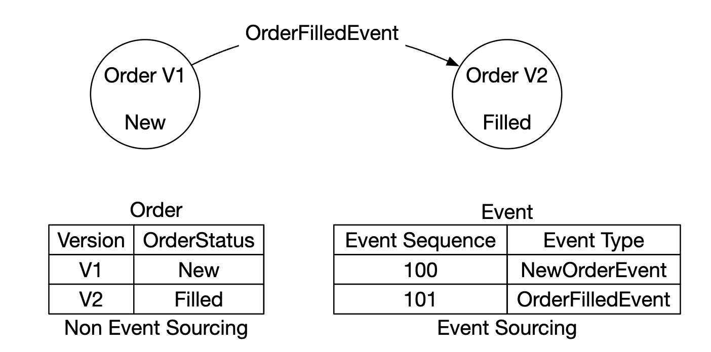

* Bên trái - lược đồ truyền thống
* Ở bên phải - lược đồ nguồn sự kiện

Đây là cách thiết kế của chúng tôi trông như thế nào cho đến nay:

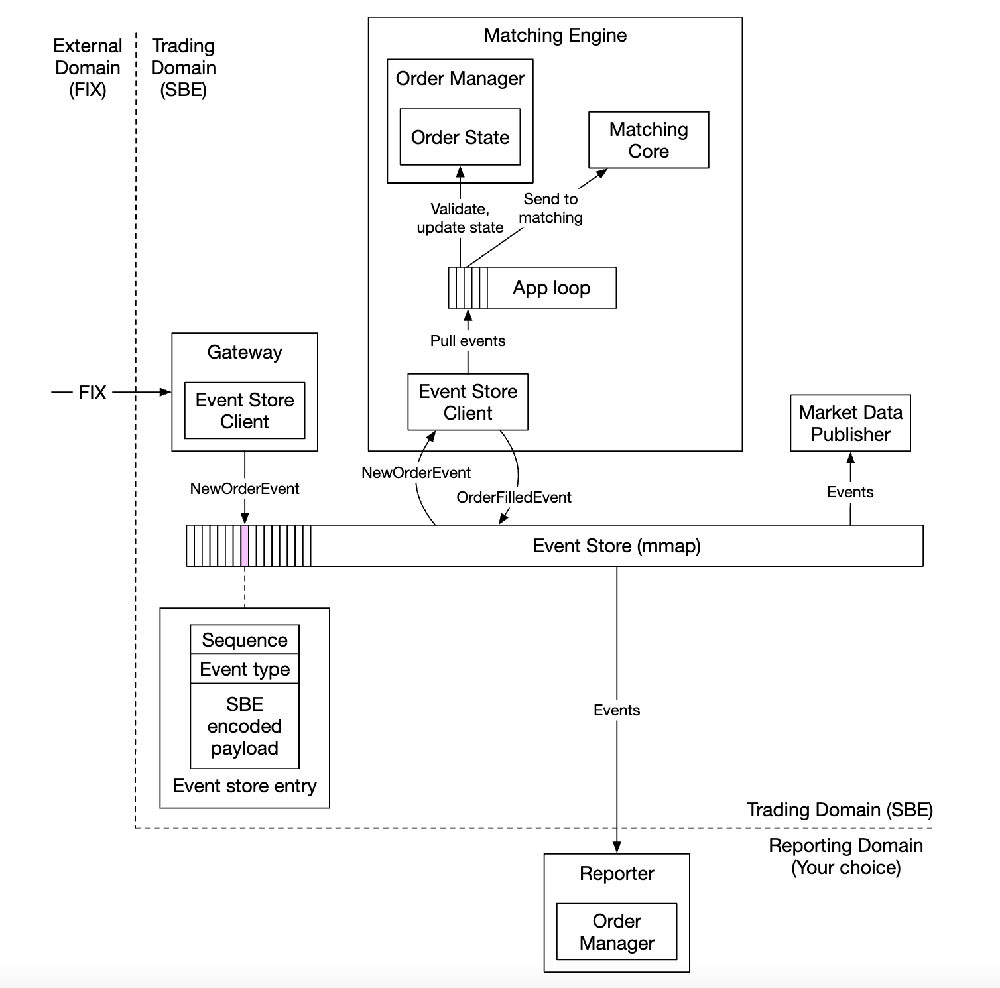

* miền bên ngoài tương tác với client gateway của chúng tôi bằng FIX protocol
* Người quản lý đơn hàng nhận sự kiện đơn hàng mới, xác thực nó và thêm nó vào trạng thái nội bộ của nó. Đơn hàng sau đó được gửi đến lõi phù hợp
* Nếu đơn hàng khớp, `OrderFilledEvent` sẽ được tạo và gửi qua mmap
* Các thành phần khác đăng ký vào kho sự kiện và thực hiện phần xử lý của chúng

Một tối ưu hóa bổ sung - tất cả các thành phần đều giữ một replica của trình quản lý đơn hàng, được đóng gói dưới dạng thư viện để tránh các cuộc gọi bổ sung để quản lý đơn hàng

Trình sắp xếp chuỗi trong thiết kế này thay đổi thành không phải là một cửa hàng sự kiện mà là một người viết duy nhất, sắp xếp các sự kiện trước khi chuyển tiếp chúng đến cửa hàng sự kiện:

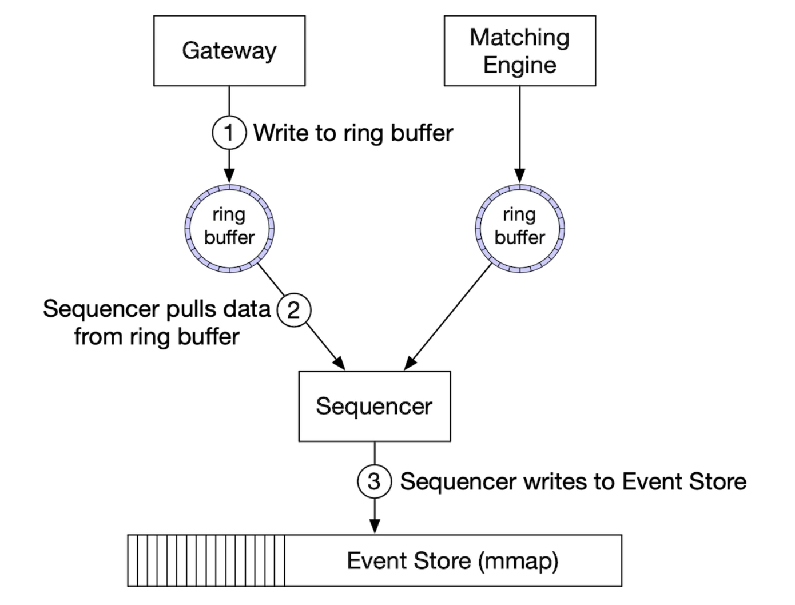

### **availability cao**

Chúng tôi hướng tới 99,99% availability - chỉ 8,64 giây thời gian ngừng hoạt động mỗi ngày.

Để đạt được điều đó, chúng ta phải xác định các điểm lỗi duy nhất trong kiến trúc sàn giao dịch:

* thiết lập các phiên backup của các dịch vụ quan trọng (ví dụ matching engine) ở chế độ chờ
* tự động hóa mạnh mẽ việc phát hiện lỗi và failover cho phiên backup

Các dịch vụ Stateless như client gateway có thể dễ dàng horizontal scaling bằng cách bổ sung thêm servers.

Đối với các thành phần stateful, chúng tôi có thể xử lý các sự kiện gửi đến nhưng không xuất bản các sự kiện gửi đi nếu chúng tôi không phải là người dẫn đầu:


Để phát hiện replica chính bị hỏng, chúng tôi có thể gửi heartbeats để phát hiện rằng nó không hoạt động.

Cơ chế này chỉ hoạt động trong ranh giới của single server.
Nếu muốn scaling nó, chúng tôi có thể thiết lập toàn bộ server dưới dạng replica nóng/ấm và failover trong trường hợp bị lỗi.

Để sao chép kho sự kiện trên các replica, chúng tôi có thể sử dụng reliable UDP để liên lạc nhanh hơn.

### **Fault tolerance**

Điều gì sẽ xảy ra nếu ngay cả thời điểm ấm áp cũng giảm? Đó là một sự kiện có xác suất thấp nhưng chúng ta nên sẵn sàng cho nó.

Các công ty công nghệ lớn giải quyết vấn đề này bằng cách sao chép dữ liệu cốt lõi sang data centers ở nhiều thành phố để giảm thiểu thiên tai.

Các câu hỏi cần xem xét:

* Nếu phiên bản chính không hoạt động, chúng tôi chuyển failover sang phiên bản dự phòng bằng cách nào và khi nào?
* Làm thế nào để chúng tôi chọn người dẫn đầu trong số các trường hợp dự phòng?
* Thời gian phục hồi cần thiết (RTO - mục tiêu thời gian phục hồi) là bao nhiêu?
* Những chức năng nào cần được phục hồi? Hệ thống của chúng tôi có thể hoạt động trong điều kiện xuống cấp không?

Làm thế nào để giải quyết những điều này:

* Hệ thống có thể ngừng hoạt động do lỗi (ảnh hưởng đến bản chính và replica), chúng ta có thể sử dụng kỹ thuật hỗn loạn để xử lý các trường hợp khó khăn và kết quả tai hại như thế này
* Tuy nhiên, ban đầu, chúng tôi có thể thực hiện failovers theo cách thủ công cho đến khi thu thập đủ kiến thức về các chế độ lỗi của hệ thống
* bầu cử lãnh đạo có thể được sử dụng (ví dụ Raft) để xác định replica nào trở thành người lãnh đạo trong trường hợp chính bị hỏng

Ví dụ về cách replication hoạt động trên các servers khác nhau:


Ví dụ về các điều khoản bầu cử lãnh đạo:

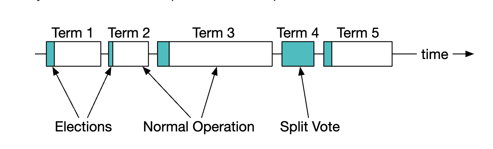

Để biết chi tiết về cách hoạt động của Raft, [hãy xem phần này](https://thesecretlivesofdata.com/raft/)

Cuối cùng, chúng ta cũng cần xem xét khả năng chịu mất mát - chúng ta có thể mất bao nhiêu dữ liệu trước khi mọi thứ trở nên nghiêm trọng?
Điều này sẽ xác định tần suất chúng tôi sao lưu dữ liệu của mình.

Đối với sàn giao dịch chứng khoán, việc mất dữ liệu là không thể chấp nhận được, vì vậy chúng tôi phải sao lưu dữ liệu thường xuyên và dựa vào replication của raft để giảm khả năng mất dữ liệu.

### **Thuật toán so khớp**

Đi vòng một chút về cách hoạt động của kết hợp thông qua mã giả:

```
Xử lý bối cảnhOrder(OrderBook orderBook, OrderEvent orderEvent) {
    if (orderEvent.getSequenceId() != nextSequence) {
        lỗi trả về(OUT_OF_ORDER, nextSequence);
    }

    if (!validateOrder(ký hiệu, giá, số lượng)) {
        trả về LỖI(INVALID_ORDER, orderEvent);
    }

    Thứ tự đặt hàng = createOrderFromEvent(orderEvent);
    chuyển đổi (msgType):
        trường hợp MỚI:
            return handNew(orderBook, order);
        trường hợp HỦY:
            return handlerCancel(orderBook, order);
        mặc định:
            trả về LỖI(INVALID_MSG_TYPE, msgType);

}

Xử lý bối cảnhNew(Sổ đặt hàng, Sổ đặt hàng) {
    if (BUY.equals(order.side)) {
        kết quả trả về(orderBook.sellBook, order);
    } khác {
        kết quả trả về(orderBook.buyBook, order);
    }
}

Xử lý bối cảnh Hủy(Sổ đặt hàng, Sổ đặt hàng) {
    if (!orderBook.orderMap.contains(order.orderId)) {
        trả về LỖI(CANNOT_CANCEL_ALREADY_MATCHED, đơn hàng);
    }

    RemoveOrder(thứ tự);
    setOrderStatus(thứ tự, HỦY);
    trả về THÀNH CÔNG(CANCEL_SUCCESS, đơn hàng);
}

Khớp ngữ cảnh(Sách đặt hàng, Thứ tự đặt hàng) {
    Số lượng láSố lượng = order.quantity - order.matchedQuantity;
    Iterator<Order> limitIter = book.limitMap.get(order.price).orders;
    while (limitIter.hasNext() && LeavesQuantity > 0) {
        Số lượng khớp = min(limitIter.next.quantity, order.quantity);
        order.matchedQuantity += khớp;
        LeavesQuantity = order.quantity - order.matchedQuantity;
        xóa(limitIter.next);
        generateMatchedFill();
    }
    trả về THÀNH CÔNG(MATCH_SUCCESS, đơn hàng);
}
```

Thuật toán khớp lệnh này sử dụng thuật toán FIFO để xác định đơn hàng nào ở mức giá phù hợp.

### **Thuyết quyết định**

Tính xác định chức năng được đảm bảo thông qua kỹ thuật trình tự sắp xếp mà chúng tôi đã sử dụng.

Thời gian thực tế khi sự kiện xảy ra không thành vấn đề:


Tính xác định của Latency là thứ chúng ta phải theo dõi. Chúng tôi có thể tính toán nó dựa trên việc theo dõi latency phân vị 99 hoặc 99,99.

Những thứ có thể gây ra đột biến latency là các sự kiện thu gom rác trong Java.

### **Tối ưu hóa Market data publisher**

market data publisher nhận kết quả trùng khớp từ matching engine và xây dựng lại biểu đồ order book và biểu đồ nến dựa trên chúng.

Chúng tôi chỉ giữ lại một phần chân nến vì chúng tôi không có bộ nhớ vô hạn. Clients có thể chọn lượng thông tin chi tiết mà họ muốn. Thông tin chi tiết hơn có thể yêu cầu mức giá cao hơn:

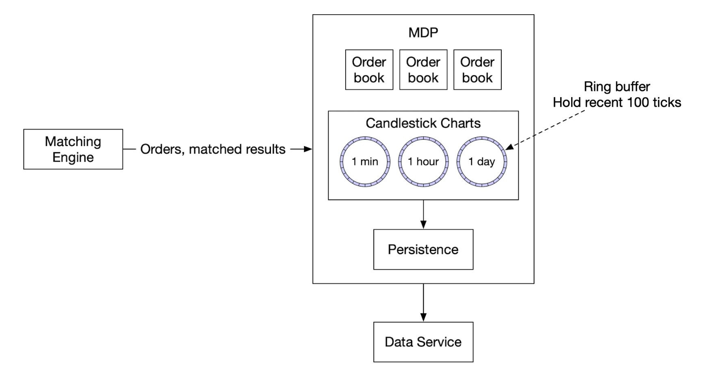

Bộ đệm vòng (còn gọi là bộ đệm tròn) là một hàng đợi có kích thước cố định với phần đầu được kết nối với phần đuôi. Không gian được phân bổ trước để tránh phân bổ. Cấu trúc dữ liệu cũng không bị khóa.

Một kỹ thuật khác để tối ưu hóa bộ đệm vòng là đệm, đảm bảo số thứ tự không bao giờ nằm ​​trong dòng cache với bất kỳ thứ gì khác.

### **Sự công bằng trong phân phối của market data và multicast**

Chúng tôi cần đảm bảo subscribers nhận được dữ liệu cùng lúc vì nếu một người nhận được dữ liệu trước người khác, điều đó sẽ mang lại cho họ thông tin chi tiết quan trọng về thị trường mà họ có thể sử dụng để thao túng thị trường.

Để đạt được điều này, chúng ta có thể sử dụng multicast bằng reliable UDP khi xuất bản dữ liệu lên subscribers.

Dữ liệu có thể được vận chuyển qua internet theo ba cách:

* Unicast - một nguồn, một đích
* Broadcast - một nguồn cho toàn bộ mạng con
* Multicast - một nguồn cho một bộ hosts trên các mạng con khác nhau

Về lý thuyết, bằng cách sử dụng multicast, tất cả subscribers sẽ nhận được dữ liệu cùng một lúc.

Tuy nhiên, UDP không đáng tin cậy và dữ liệu có thể không đến được với tất cả mọi người. Tuy nhiên, nó có thể được tăng cường bằng cách truyền lại.

### **Colocation**

Các sàn giao dịch cung cấp cho brokers khả năng sắp xếp servers của họ trong cùng data center với sàn giao dịch.

Điều này làm giảm đáng kể latency và có thể được coi là dịch vụ VIP.

### **An ninh mạng**

DDoS là một thách thức đối với các sàn giao dịch vì có một số dịch vụ sử dụng internet. Đây là lựa chọn của chúng tôi:

* Cô lập các dịch vụ và dữ liệu công cộng khỏi các dịch vụ riêng tư, để các cuộc tấn công DDoS không ảnh hưởng đến clients quan trọng nhất
* Sử dụng lớp caching để lưu trữ dữ liệu không được cập nhật thường xuyên
* Làm cứng các URL dựa trên DDoS, ví dụ: thích `https://my.website.com/data/recent` hơn `https://my.website.com/data?from=123&to=456`, vì DDoS có khả năng cache cao hơn
* Cần có cơ chế danh sách cho phép/danh sách chặn hiệu quả.
* Rate limiting có thể được sử dụng để giảm nhẹ DDoS

---

Bước 4: Kết thúc
---------------

Những lưu ý thú vị khác:

* không phải tất cả các sàn giao dịch đều dựa vào việc đưa mọi thứ vào một server lớn, nhưng một số vẫn làm như vậy
* các sàn giao dịch hiện đại phụ thuộc nhiều hơn vào cơ sở hạ tầng đám mây và cả các nhà tạo lập thị trường tự động (AMM) để tránh duy trì order book