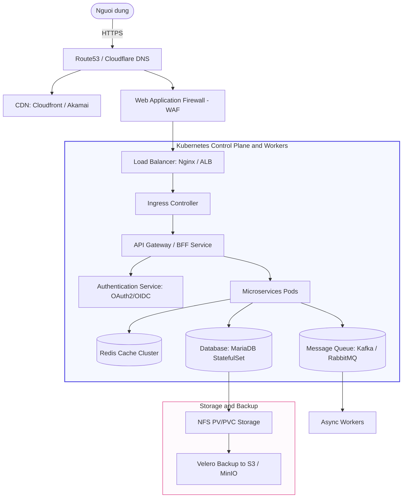

# Thiet Ke He Thong (System Design for System Architect)

Chao mung ban den voi chuyen muc Thiet Ke He Thong (System Design). Thu muc nay duoc thiet ke dac biet danh rieng cho lo trinh hoc tap va lam viec huong toi vi tri System Architect (Kien truc su he thong).

Trong System Architecture, co so ha tang (Kubernetes, Docker, Cloud, CI/CD) dong vai tro la phan vat ly thuc thi (Physical Implementation), con System Design dong vai tro la ban ve kien truc (Blueprint). Thu muc nay se giup ban ket noi hai manh ghep do lai voi nhau.

---

## Ban Do Kien Thuc System Design

Duoi day la so do luong di tieu chuan cua mot he thong quy mo lon (High-Level Architecture) the hien moi lien quan giua Thiet ke va Trien khai:

---

## Cau Truc Cac Chuyen De

| Chuyen De | Noi Dung Mo Ta | Tai Nguyen Hien Thuc Hoa (DevOps) |
| :--- | :--- | :--- |
| [1. High-Availability](./1.%20High-Availability/README.md) | Thiet ke tinh san sang cao, chiu loi (Fault-Tolerance), thiet ke cum Active-Active, Active-Passive. | [Kubernetes Deployment/StatefulSet](../on-premise/kubernetes/deployment/), [Load Balancer Nginx](../on-premise/kubernetes/load-balancer/nginx/k8s-loadbalancer.conf) |
| [2. Scaling](./2.%20Scaling/README.md) | Chien luoc co gian he thong, Load Balancing, Caching, CDN, thiet ke Rate Limiter phong chong DDOS. | [HPA Manifest](../on-premise/kubernetes/hpa/), [Redis Sentinel](../on-premise/kubernetes/redis/) |
| [3. Disaster-Recovery](./3.%20Disaster-Recovery/README.md) | Chien luoc sao luu va khoi phuc tham hoa, do luong cac chi so RTO va RPO, mo hinh Multi-region. | [Velero va MinIO Backup setup](../on-premise/setup/kubernetes/setup-velero-minio-backup.md) |
| [4. Security-Architecture](./4.%20Security-Architecture/README.md) | Kien truc mang bao mat bao ve tai nguyen ha tang, phan vung mang (VPC Subnets), IAM, Secret Management. | [AWS IAM Configuration Guides](../cloud/aws/services/2.%20IAM/), [Secret Management](../on-premise/kubernetes/secret/) |
| [5. Database-Architecture](./5.%20Database-Architecture/README.md) | Thiet ke luu tru du lieu, replication (Master-Slave, Multi-Master), CSDL SQL vs NoSQL, Sharding va Partitioning. | [MariaDB StatefulSet](../on-premise/kubernetes/statefulset/), [Persistent Volume va NFS Storage](../on-premise/kubernetes/storage/) |
| [6. Case-Studies](./6.%20Case-Studies/README.md) | Phan tich thiet ke chi tiet cho cac bai toan thuc te (He thong E-commerce, Chat thoi gian thuc, He thong thong bao). | [Du an mau Fullstack](../on-premise/kubernetes/full-stack/) |

---

## Cach Hoc va Ap Dung Cho System Architect

1. **Doc hieu Blueprint (Thiet ke khai niem)**: Bat dau tu moi chuyen de trong `system-design/` de nam vung nguyen ly hoat dong, uu nhuoc diem va cac diem trade-off (su danh doi) cua tung giai phap.
2. **Doi chieu hien thuc (Physical Implementation)**: Click vao cac lien ket sang phan `on-premise/` hoac `cloud/` de xem cach trien khai thuc te bang cac file cau hinh YAML, shell script hoac Terraform.
3. **Thuc hanh ve so do va viet tai lieu**: Tu ve lai so do kien truc he thong ban dang lam viec bang cong cu Mermaid hoac Draw.io roi luu tru truc tiep vao thu muc `6. Case-Studies`.
